# Long Horizon Context: Domain Design

Last verified against code: 2026-08-09. Precedence when facts disagree: code, then README, then [03-decisions-brief](03-decisions-brief.md), then this doc; see also the [decision registry](../decision-registry.md).

This document describes each domain in more depth: what it stores, the operations it provides, and the other domains it calls. It builds on the vocabulary in 01-core-concepts.md.

## Domain surfaces

A domain is both a vocabulary area and a service surface. The operations a domain exposes are the same operations everywhere they are reached: the host calls them as SDK functions in-process, a future app server can serve them as endpoints, and other domains call them in-process when they need work the domain owns. When one domain needs something from another, it calls that domain's surface; it does not reach into the other domain's storage or internal modules. (Thread-view still has direct reads against message and turn tables for live-tail assembly and visibility-boundary decisions; these are known cleanup debt, not a design choice.) One domain can coordinate a flow that spans several, the way `intake-stream` records a batch and calls `messages` and `turns` along the way, but the called domains keep ownership of their own work.

## Shared-tech utils

Beneath the domains sit a small number of **shared-tech utils**: shared machinery that domains use but that owns no part of the conversation model. A tech util is not a domain. It has no domain surface and no vocabulary of its own in the product; it is internal plumbing (the logging surface is the one util exposed externally, but it owns no part of the conversation model). The dependency runs one way: domains use tech utils, and a util never calls a domain or contains domain logic. Shared-tech can carry domain-shaped identifiers and work-kind names as mechanism data, but the meaning of a turn, a chunk, or a summary stays the owning domain's business.

The **durable work queue** records background work as durable items in the thread's SQLite file. An item commits in the same transaction as the change that caused it, so queued work survives crashes. Items are processed one at a time per thread: the drain loop claims an item under BEGIN IMMEDIATE, runs the owning domain's handler with no open transaction, and completes in a second short transaction that writes the derivation and deletes the item. The handler may call inference or assemble deterministically depending on the derivation type. Claims are fenced by a monotonic epoch so a stale completion can never stamp a derivation that has moved on. Two properties carry the design: pending work is recorded durably, not held in memory, so a restart loses nothing; and a thread's queued work is ordered, so work queued by an edit lands after work already in flight on the old content. Failed handlers are retried up to a configured budget with exponential backoff; a handler that exhausts retries or fails non-retryably lands its derivation as `failed` with the final reason, and the work item is deleted.

Each kind of queued work has exactly one owning domain. A domain queues its own work; it never queues work into another domain, and no domain watches for another domain's items. When a flow crosses domains, the crossing is a surface call, and the called domain queues whatever work its part needs. The queue owns the mechanics of an item: recorded, claimed, retried, finished. What the work means belongs entirely to the owning domain.

Derivations carry state. The four states are one shared vocabulary across domains: `pending`, `ready`, `failed`, `blocked`. What a state means for a particular derivation stays the owning domain's call. State belongs to the derivation itself, never to its subject. Whether a failed attempt will be retried is the work queue's business, not a property the derivation duplicates; a domain's derivation report joins the two, so a caller asking "is this still coming?" gets the answer without reading queue mechanics.

The **inference adapter** bridges the host's model access into LHC's derivation handlers. Each derivation type that needs inference has a model assignment (provider, model, prompt template name). The adapter renders the prompt from the registry, calls the host's function, classifies failures as retryable or terminal, and returns shaped text with config-known provenance. Large inputs are bounded before rendering. Empty model output is rejected. Host exceptions and timeouts are contained. Derivation types whose handlers assemble deterministically never reach the adapter.

The **prompt registry** is the name-keyed set of prompt templates. Model assignments select templates by name; versioning is in the name (e.g. `smoothing-v1`, `tool-result-v1`). Adding or replacing a template for an existing derivation type is a module addition; no handler or adapter changes are needed. A new derivation type would require handler, config, and adapter work.

The **scheduler** manages per-thread drain scheduling in background mode. Post-commit pokes trigger drains; first-touch catch-up drains process leftover work from previous process lifetimes. Per-thread single-flight with pending-flag coalescing: at most one drain runs per thread, with at most one pending pass queued behind it. Wake timers handle retry backoff eligibility and claim expiry. In manual mode the scheduler is inert — the host must call `work.drain` explicitly to process queued work.

The **instance seam** isolates multiple SDK instances in the same process. Every SDK operation runs inside its instance's async-context scope, so enqueue pokes and thread-file touches reach that instance's scheduler, not another's. A manual SDK's operations deliver to a no-op seam, so a background SDK in the same process can never auto-drain the manual SDK's work.

Local **token counting** stamps estimates on messages when they are created and on derivations when they land, using a shared local tokenizer (`o200k_base` encoding). The count is stored once and is stable and reproducible: the same text always yields the same number.

**Logging** is a cross-cutting technical surface that, unlike the other utils, is exposed externally from LHC. Both LHC and the host write info/warning/error logs through it, stored in the thread's SQLite file. Writes are fail-soft — a failure never propagates and never shares the caller's transaction. The record stays what is usable; the log says what went wrong.

## Threads

A thread is the durable container for one ongoing conversation. The `threads` domain creates threads, tracks where they live, and gives the rest of the system a way to find a thread by id. Two SQLite databases sit behind it:

- A listing of all threads is stored in a **thread registry** database, with one row per thread holding its id, file path, optional title, optional cwd, and creation timestamp.
- Each thread's own database holds that thread's full record: its events, messages, turns, chunks, and views. Reading or changing a thread's contents means opening its file.

The thread file is authoritative for its own identity. It stores its thread id once, as identity metadata. The records inside it (events, messages, turns) do not each carry the thread id, because the file is the thread. The thread registry is a convenience lookup over the thread files, not the authority.

Thread files are schema-versioned and migrate forward on open, so a file written by an older build is brought current the first time a newer build touches it. An old thread file is not stranded when the schema moves.

### Creating a thread

`newThread` creates a thread at a given file path, sets up the empty thread inside it (including seeding one open turn), and adds a row to the thread registry. It generates a thread id and records the id-to-path mapping. If a file already exists at the path, the operation fails instead of touching it. Creation spans two databases that cannot share a transaction; the order is file-then-row so the invariant "no registry row without its file" is absolute. An orphan file from a crash between the writes is harmless.

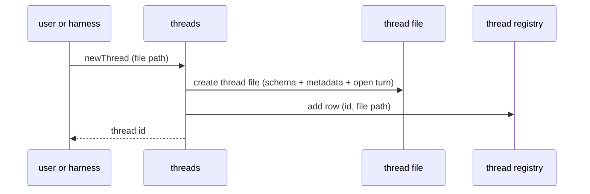

### Finding a thread by id

A thread id is the primary, stable key a caller holds. It survives the thread file moving, which a file path does not. Other domains work with thread references (`ThreadRef`), which can be `{ threadId }` or `{ filePath }`. When a domain needs to act on a thread, it asks the threads domain to resolve the reference to a file path, then opens it. Resolution from a thread id accepts a full or partial (prefix) id: an exact match wins outright; a unique prefix resolves; an ambiguous prefix fails naming the collision.

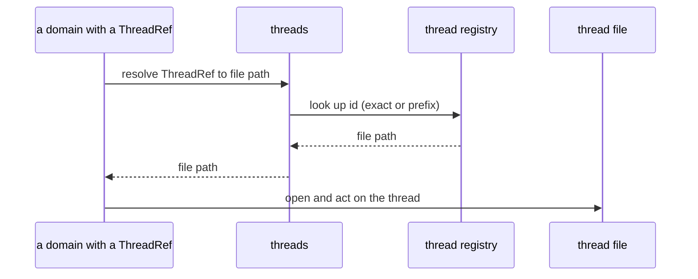

### Browsing threads

A user who wants to see their threads starts at the threads domain. `listThreads` lists threads from the registry, optionally filtered by cwd. `resolve` looks up a thread by id. `info` reads the thread file's own identity metadata (thread id and creation timestamp). From a list, a user picks a thread and drills into its messages, turns, or views through the other domains.

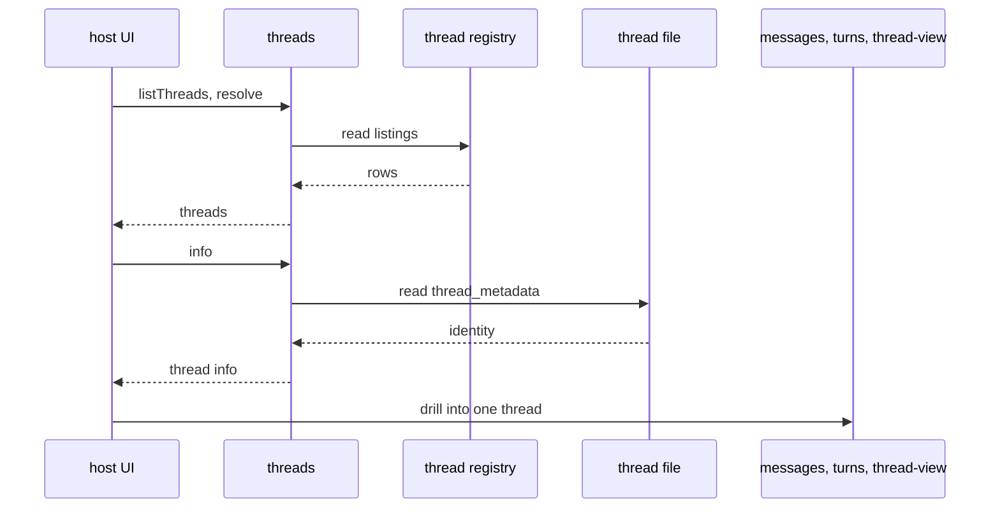

## Intake stream

As a harness runs it produces a stream of events. An event is one recorded thing that happened in the thread:

- `user_prompt`: a prompt from the user, or an automated prompt that stands in for one
- `assistant_text`: assistant output text
- `assistant_thinking`: assistant reasoning
- `tool_call`: a tool invocation
- `tool_result`: the result of a tool invocation
- `model_change`: a switch from one model to another
- `thinking_level_change`: a change in the thinking level
- `runtime_note`: a note from the harness or runtime
- `turn_end`: a marker that the current turn is complete

The `intake-stream` domain takes these events in and writes them into the thread in the order they happened. It is the only way thread content enters the system from a harness.

These flows are about how data moves, not about a user interface. The operations exist to record incoming events and coordinate the synchronous domain work that follows from those events. As it records the stream, `intake-stream` calls `messages` to create the readable message-and-block view and calls `turns` to apply the turn state machine. Those calls are in-process calls to the domain surfaces, not separate service hops.

A thread is single-threaded by definition: one conversation, one stream. The design model is one ordered time series per thread, which lets boundary decisions be made from position in that stream.

### The stream contract

The harness owns sending a coherent stream. The domain does not reconstruct order or membership from a malformed stream; it records what it is given, in the order given, and fails loudly when the stream implies an impossible state.

The contract:

- send events in the order they happened
- send a `turn_end` when a turn is complete
- there is always exactly one open turn at any time

### Taking in events

A harness sends a batch of one or more events for a thread. The thread reference rides outside the batch, since every event in a batch belongs to the same thread. The host calls the SDK operation with typed event objects directly (`intakeStream.messageEvents(threadRef, events)`).

The domain resolves the thread reference to its file through the threads domain, then writes the batch to the thread's database in one coherent write flow. For each event it assigns the next position in the thread's order and records the source event. For events that produce readable conversation activity, it calls the `messages` surface to create messages and blocks. For events that affect turn state, it calls the `turns` surface to apply the turn state machine. It returns a result describing what happened to each event.

Two capture-fidelity details ride the event payloads. `assistant_thinking` carries an optional opaque provider **signature** alongside its text — captured verbatim, never interpreted; empty-but-signed thinking is a real event and is recorded. Assistant events carry the **model identity** (provider, model, API) that produced them, supplied by the host from the request it actually prepared — never re-derived from mutable session state — so signed reasoning can later be replayed on resume strictly under an exact identity match.

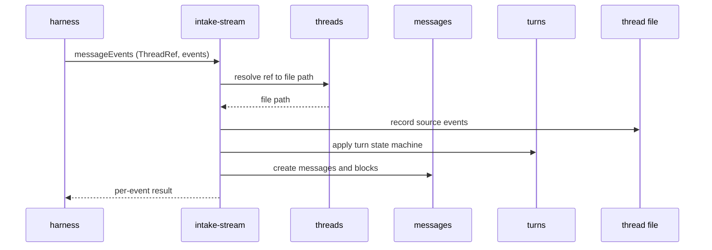

Events carry an idempotency key from the harness. If an event with the same key was already recorded for the thread, it is skipped rather than written twice, so a harness that resends a batch after a failure does not produce duplicates.

### Turn boundaries are decided here, synchronously

Turn boundaries are decided in the hot path, as events land, while intake is the thing watching the ordered stream. `intake-stream` calls the `turns` surface to apply the turn state machine and get the turn membership for message-producing events. This keeps membership correct: a message is attached to its turn when it is recorded, not inferred later against a stream that has moved on.

The deterministic work is synchronous: recording events, calling `messages` to create messages and blocks, calling `turns` to apply the state machine, attaching messages to the current turn, and assigning token estimates. Smoothed prompts and tool-result summaries are queued as durable work when each message lands; turn compression and chunk summaries are queued when the turn closes (turn derivation work is queued at close; `detailed_turn_compression` is enqueued in the turn-derivation handler's completion transaction; chunk summaries are enqueued when chunk placement closes a chunk in that same transaction). Closing a turn settles its membership immediately; the derivation work that follows operates on a turn whose contents are already frozen.

There is always exactly one open turn. Thread creation seeds the first open turn. A `turn_end` with members closes the current turn, queues its derivation work, and immediately opens a new empty turn. A `user_prompt` arriving when the current open turn already has members does the same: closes the current turn, opens a new one, and the prompt becomes the new turn's first member. A `turn_end` with no members is a no-op — the empty open turn stays open. A `user_prompt` arriving into an empty open turn simply becomes its first member; no close happens.

| Event | Current open turn | Action |
| --- | --- | --- |
| `user_prompt` | has no members | prompt becomes first member of current turn |
| `user_prompt` | has members | close current turn (+ queue work), open new turn, prompt is first member |
| `turn_end` | has members | close current turn (+ queue work), open new empty turn |
| `turn_end` | has no members | no-op |
| any other event | — | add to current turn |

More than one open turn is a hard error during this phase — an invalid thread is caught and triaged instead of producing quietly wrong turns later.

### What the result reports

The result reports, per event, whether it was recorded or skipped as a duplicate. An invalid batch returns an `OpResult` error and rolls back the entire transaction, so a batch either lands cleanly or not at all. The result also reports turn transitions that the batch opened or closed, and queued work items.

## Messages

A message is the readable form of activity in a thread. The `messages` domain owns the message-and-block view of the conversation. It creates that view from source events, lets callers read it, and provides the place where later message-level edits and deletes happen.

Events and messages are different records. Events are the ordered source stream received from a harness. Messages are the normalized view created from those events so the rest of the system can read, list, edit, group, and assemble thread history. A `turn_end` changes turn state but does not produce a message.

### Creating messages

`intake-stream` calls the `messages` surface as it records incoming events. The message operation creates a message for events that should appear in the readable conversation and creates the blocks that belong to that message. It also stores the token estimate for the message's original content. Message ids are deterministic: `m` followed by the event's order number.

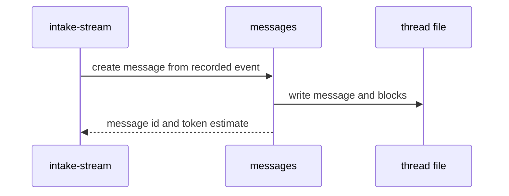

### Messages and blocks

A message represents one meaningful piece of conversation activity: a user prompt, assistant text, assistant thinking, a tool call, a tool result, a model change, a thinking level change, or a runtime note. Each message contains one or more typed blocks. The five block types are `text`, `tool_call`, `tool_result`, `model_change`, and `thinking_level_change`. Most message kinds — user prompts, assistant text, assistant thinking, runtime notes — project to a `text` block. Tool calls, tool results, model changes, and thinking level changes each project to their own block type.

### Message-level derivations

Some derivations belong to a single message and need nothing beyond it, so `messages` owns them and queues their work the moment the message lands, without waiting for a turn to close.

A user prompt gets a `smoothed_prompt` derivation: cleaned and attenuated with its content preserved, queued when the prompt lands. If the cleaned text exceeds a configured token threshold, the cleaned text itself becomes the derivation without calling inference. Smoothing also carries a safety floor: if the inference output shrinks below a configured ratio of the cleaned input (`suspiciousOutputRatio`, default 0.15), the model output is discarded and the deterministic cleaned text is stored instead (warning-logged). Smoothing can attenuate a prompt but never eat it.

A tool result gets a `tool_result_summary` derivation. The full output is stored when its message is created and is never discarded. The summary is inference-backed and carries derivation state, but inference summarization is currently forced off — every tool result gets deterministic 500-char truncation instead (interim; see DERIV-12 in the decision registry). When inference is enabled the path is tiered by size: a result at or below the `smallTierTokens` threshold (default 1000) is stored verbatim with no summary pass, and a larger result is classified (operation class, response shape, prompt mode) and queued for inference. Every tool-result summary states its outcome mechanically — succeeded, failed, or unknown — stamped from the record, never authored by model text.

Tool calls are kept as-is, not summarized: call arguments are usually short, so no separate derivation pass is needed.

### Token estimates

Each message is stamped with a token estimate of its original content when it is created, in the same synchronous step that writes the message. Stamping on creation means every message carries a size the moment it lands, with no later counting pass, and a turn's size is the sum of its messages' estimates as soon as the turn closes.

The estimate comes from a local tokenizer (`o200k_base` encoding). The same text always yields the same number, with no provider call and no failure mode.

### Reading messages

The messages domain lists and shows messages for a thread. It is the lowest-level human-readable view of the conversation.

- `list` returns messages in record order, with optional bounds (from/to event order), limit, and an opt-in to include deleted records.
- `show` returns a single message with its complete blocks, full content, and its derivation report entries with queue-joined state.

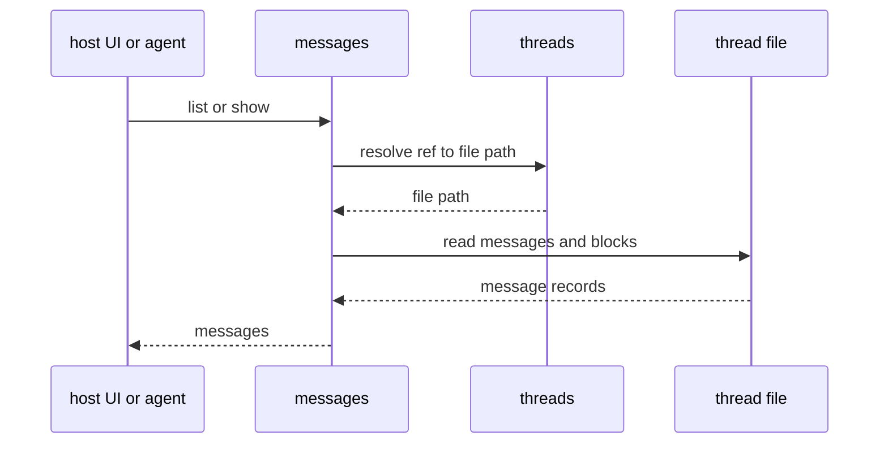

### Editing and deleting messages

Manual cleanup goes through messages, not `intake-stream`. Intake-stream records new activity from a harness; messages is where a person or agent can later correct or prune the readable conversation record. Two operations do this: `edit` changes a message's content, and `remove` removes a message from the readable record. Both target closed turns only; the open turn is the live exchange and stays out of reach.

`remove` is a soft delete: the message drops from reads and from its turn's membership, but the source events it was created from stay in the event log; the record underneath is never destroyed. Removing a message that initiates a turn (the prompt) is refused; the `remove` surface handles individual non-initiating messages only.

An edit runs the same way creation does. The deterministic work happens synchronously: the message and its blocks are updated and the token estimate is re-stamped. Derivations built from the old content are cleared and their work is queued again by the domains that own them, each at the next source version so a late-finishing pre-edit derivation is discarded as stale. An edit never leaves an old derivation in place to be judged against new content later.

A remove cascades the same way, with one difference: the removed message's own derivations drop rather than re-queue — their source is gone — while everything composed above it rebuilds. The cascade is bounded by structure: a message affects its turn's composed rendering, and that turn's containing chunk re-derives its detailed and brief summaries. Neighboring chunks never re-derive, and chunk boundaries never move; a chunk shrinks in place, never re-cut.

### Synchronous derivation

In addition to the background queue path, the messages surface exposes `derive` — a synchronous operation that runs derivation work inline for a list of message ids. It claims a work item, runs the handler, and writes the result, or returns immediately if equivalent work is already in flight. This is available for callers that need a derivation now rather than waiting for the background drain.

## Turns

A turn is one exchange in a thread. In the normal harness stream it starts with a `user_prompt`, or an automated prompt that stands in for one, and includes the assistant text, assistant thinking, tool calls, tool results, model changes, thinking level changes, and runtime notes that follow. A turn closes when a `turn_end` arrives with members, or when the next `user_prompt` arrives and the current turn has members.

The `turns` domain owns turn state, turn records, and turn-based containers such as chunks. It exposes the operations that apply the turn state machine during intake, and it derives closed turns into the representations that later feed bands and thread views.

### The turn state machine

`intake-stream` calls the `turns` surface as it processes incoming events. The turn state machine maintains the invariant that exactly one open turn exists at all times. The result tells intake which turn a message-producing event belongs to.

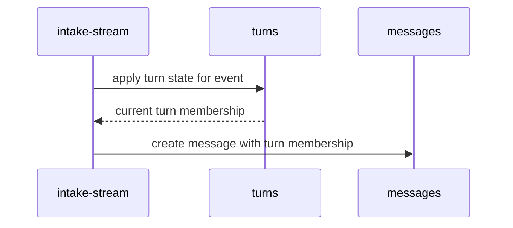

### Deriving closed turns

Closing a turn makes its membership stable. The work that follows runs after the close and is queued durably in the same transaction:

- **`turn_derivation`** (one work item) — deterministically produces **`turn_rendering`** and **`pre_detailed_assembly`** in one completion transaction. `turn_rendering` composes the turn's activity from its message-level derivations: smoothed prompts and tool-result summaries where ready, deterministic floors where they are not. Tool calls and results that form a consecutive stretch are composed into a single run-level account that names the tools, counts the calls, and tallies the mechanical outcomes. The rendering wraps the turn in its stable `<tN>` label with `<mN>` labels on each message, and truncated members carry their full stored token count in the truncation marker — the addresses and sizes the retrieval domain resolves. `pre_detailed_assembly` strips the same turn to dialogue only (`user_prompt` and `assistant_text`) for compression input; labels are stripped from compression input.

- **`detailed_turn_compression`** (a separate work item, enqueued in that same completion transaction) — inference-backed compression of the `pre_detailed_assembly`, not the turn rendering. This is the slow work; the rendering and assembly above are deterministic and fast. The smooth band serves `turn_rendering` at full texture; `detailed_turn_compression` is only a degraded fallback when rendering is missing.

The `turns` surface exposes operations to check derivation state, re-queue failed work, and run derivation synchronously (`deriveTurn`).

### Chunks

A chunk is a container of turns. Chunks let the system group multiple closed turns into larger units that can be summarized and placed into lower-fidelity bands. Turns are the base unit; chunks are the next container above them.

The `turns` domain owns chunk formation because chunking depends on turn order, turn size, and projected pre-compression token counts. Turn derivation, composition, and chunk recovery live in `turns/internal/derive.ts`, `turns/internal/compose.ts`, and `turns/internal/chunk-recovery.ts`. Closed turns accumulate into the current open chunk. The chunk close policy is a deterministic arithmetic check against configured thresholds (`targetProjectedTokens` / `maxProjectedTokens`) over stored projected token counts — identical streams produce identical chunk boundaries across restarts. Chunk placement — assigning a turn to a chunk — happens inside the turn derivation handler's completion transaction, so a crash leaves either a placed turn with its enqueued summaries or nothing, never a derived-but-unplaced turn.

A closed chunk gets two derivations, queued in the completion transaction:

- **`chunk_summary_detailed`** — a deterministic assembly from member `detailed_turn_compression` content (dialogue-derived). Keeps the texture of what happened: what was changed and whether it succeeded.

- **`chunk_summary_brief`** — an inference-backed summary that keeps outcomes only. What ages out first is the activity's texture, never its result.

Both carry derivation state and can be checked through the `turns` surface. Chunk summaries wait on their member turn compressions: if a member's `detailed_turn_compression` is not ready, the chunk summary handler requeues; if it is blocked, the chunk summary lands blocked.

### Reading turns and chunks

The turns domain lists turns and chunks for a thread. These operations are used by agents and users who want to inspect the conversation at a higher level than individual messages, and by thread-view when it needs turn and chunk material for context assembly. Each record carries its derivation states alongside it.

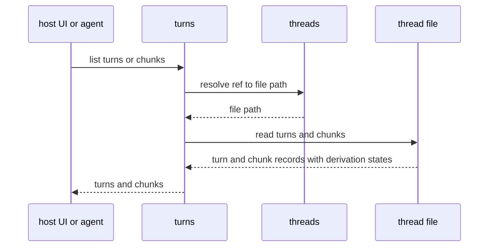

## Thread view

A thread view is a summarized, harness-ready rendering of a thread. It holds enough of the conversation for an agent to resume work without the full history: recent activity at high fidelity, older activity compressed into shorter representations. The `thread-view` domain stores compact snapshots and serves them with the live tail. Its operations are `getLlmRequestContext`, `getSessionThreadView`, `status`, `describe`, `prune`, `previewCompact`, `compact`, and `materialize`. Internally the domain spreads across `thread-view/index.ts`, `internal/select.ts`, `internal/compact-compute.ts`, `internal/assemble.ts`, `internal/boundary.ts`, `internal/session-view.ts`, `internal/render.ts`, `internal/snapshot.ts`, `internal/materialize.ts`, and `internal/profiles.ts` (the built-in compact configs). A harness either loads a view that LHC has written to a file or asks LHC for the current `LlmRequestContext` directly.

A view is a rendering, not a second copy of the conversation. It is assembled from records the other domains already own: messages, turns, chunks, and the derivations derived from them. Producing a view never changes the canonical history; it selects and arranges what already exists.

### Bands

A thread view is arranged in bands of decreasing fidelity, from the most recent activity down to the oldest:

- **full**: recent turns and messages served live from the record (the tail)
- **smooth**: turn renderings at full texture (`detailed_turn_compression` is a degraded fallback when rendering is missing)
- **detailed**: detailed chunk summaries
- **brief**: brief chunk summaries — the compressed floor of the view

The bands are a gradient, not a cliff. As a turn ages it moves down a band, losing fidelity in steps instead of dropping out of the view all at once. The recent end stays sharp for the work in progress; the old end stays cheap while still carrying the shape of what came before.

Of the four tiers, three — brief, detailed, and smooth — are rendered and stored as snapshot text by a compact. The full tier is not stored; compact uses its percentage to determine where the compact point falls, and everything after that point is served live.

### Generating a view

Generating a view — the operation a user or host invokes as a **smart compact** — sets the band arrangement for the whole thread: which turns and chunks fall into which band, rendered into a current view. It takes a compact configuration (a target size in tokens and percentages per band) and works by selecting artifacts the other domains have already derived, not by recomputing them. Compact never calls a model; it is assembly, not summarization.

Compact is an explicit operation, invoked by the host or caller. It does not run on a timer or automatically after turns close. The `threadView.status` operation reports whether a compact is recommended based on the tail's token count against a configured threshold, but nothing triggers compact automatically.

Before assembly, compact reads record and derivation state as it stands. It does not call providers, schedule repair work, or re-queue failed derivations. If canonical record damage is detected — such as a turn referencing a missing chunk member — compact refuses before writing, leaving the prior view intact.

When a band entry depends on a derivation that is not ready, compact does not stop. It walks a fallback ladder: the smooth band tries `turn_rendering`, then `detailed_turn_compression` (marked degraded), then a deterministic excerpt of the turn's messages, then a gap. The detailed and brief bands try their primary chunk summary, then a concatenation of stored member material, then a gap. A gap is always the last resort, never the first response to a missing derivation. Chunk stored-member fallbacks are warning-logged; all degraded entries and gaps are recorded in the compact receipt and the stored view metadata.

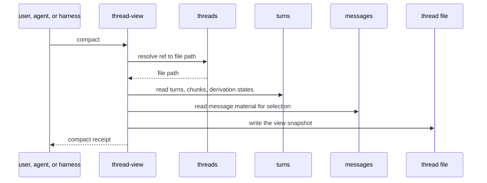

### Assembling the active model context

The context a harness consumes is assembled from the stored view snapshot (brief, detailed, and smooth bands) plus the current tail of recent messages. Assembling it is deterministic local work — reads and rendering — with no inference calls. An extensible harness can load `LlmRequestContext` without paying to re-derive anything.

Assembly selects already-derived artifacts; it does not create missing ones. If a band depends on a derivation that has not been derived yet, or that failed, the stored snapshot carries whatever the last compact wrote — degraded entries or gaps — and serves that.

Degrading is visible by obligation. A gap in band material renders as a marked gap in the view, so the agent reading it knows a stretch of history is thinner than it should be. The view never silently drops a span of the thread.

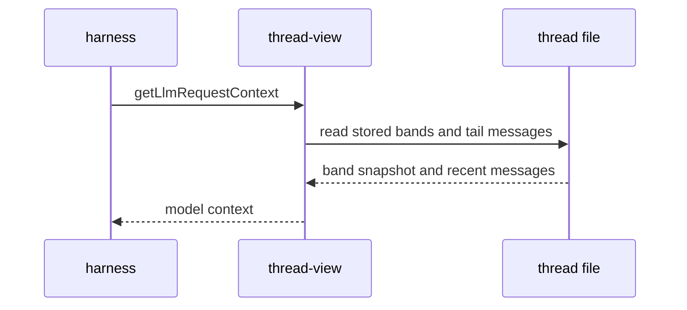

### Tool results in the model context

Before an explicit smart compact, tail tool results render in full so resume and session-view stay faithful to the record. Smart compact is the planned reduction point for older material (via bands).

The **visibility boundary** controls at-or-behind shortening when it is set: tool results at or behind it render as a short truncation (~500 characters plus a truncation marker), tool results ahead of it render full. Three things move the boundary: compact resets it to the compact point; **prune** (`threadView.prune`) advances it independently; intake never moves it.

Prune walks live tool results newest-first from the current boundary, keeps results full until the target token budget is met, and sets the boundary behind the last full result. It never moves the boundary backward or behind the compact point. The typical use is reclaiming context space from old tool outputs between compacts without the cost of a full compact cycle.

### Rendering for a harness

The same assembled view renders in more than one form. An extensible harness that can take its context from LHC asks for `LlmRequestContext` as an in-memory message array. A closed harness that reads only its own session file gets the view written into a host-specific file format via `threadView.materialize` (today PI session JSONL); a host can also build its own format from the served view, as cc-lhc does when it rebuilds Claude Code rollout files. Both come from the same serving assembly; only the output shape differs. A written file is a materialized rendering of the view, not a second source of truth: the thread file remains authoritative.

## Retrieval

Retrieval resolves stable ids back to content, on demand, under explicit budgets. It is the read-side complement of compression: bands make history small; retrieval makes any part of it exact again. The domain owns two operations and one table.

### The operations

`retrieval.getTurns(threadRef, ids)` serves turn renderings — the same labeled composition the smooth band serves, read from the stored derivation or freshly composed when the stored rendering predates labels. `retrieval.getMessages(threadRef, ids)` serves verbatim message content from the record. Both take ids in the caller's order and walk them under a token budget: items that fit are served whole; the item that crosses the budget is served as an exact token slice with a receipt naming the window (`[fromToken, toToken)` of the total) and the offset to continue from; items after the budget is spent get a refusal receipt naming their size, so the caller can re-request them alone. A `fromToken` option slices every requested item from that offset — the single-id continuation contract. An optional `byteBudget` additionally bounds served bytes, for hosts whose machinery truncates tool output by bytes; byte-bound slices are exempt from the minimum-slice floor, and no slice ever splits a multi-byte character. Requests are capped at 32 ids per call; over-cap requests refuse whole with a receipt naming the cap.

Validation is strict and cheap: id shape is checked before any read, and invalid requests refuse before the SDK touches storage.

### Impressions

Every id requested through a retrieval operation writes one **impression** row in the thread file (schema v6): the id, the requesting surface, whether it was served, at what size, under which call. An impression means the SDK served the content into a result — it is an upper bound on model exposure, not a delivery receipt; downstream signals (restatement, follow-up pulls) are the delivery-weighted evidence. Impressions are written in the retrieval transaction and nothing on the serving path reads them — they are the durable evidence base for later analysis.

### What hosts add

The domain returns content and receipts; hosts own the tool surface. A host registers `get_turns` / `get_messages` as model-callable tools, passes its own output limits through the budget options, wraps served content in an explicit historical envelope (so a recalled prompt reads as a record, never a live instruction), and keeps receipts and continuation guidance outside the envelope as live text. Tool calls and their results enter the record through normal capture like any other tool activity — retrieval never appends conversation events of its own.

## Inspect

Inspect answers questions about a thread without changing it. The `inspect` domain produces three reports:

- **overview** — thread identity, event/message/turn/chunk counts, derivation state counts across both owners, the active view summary (or null if never compacted), and visibility boundary state. Deleted messages count separately; they are excluded from visible counts and token sums.

- **health** — derivation counts by owner, kind, and operational state; actionable failure detail (reason, attempts, last error) for failed and blocked derivations; a repair preview of currently failed (non-blocked) derivations that a requeue would target; and live queue visibility (queued vs claimed items).

- **view** — the stored view snapshot from `threadView.describe` (arrangement, gaps, config, per-band stored token counts, source-state provenance) plus the serving cost measured by running `threadView.getLlmRequestContext` and counting its output with the shared estimator. This makes the reported cost structurally identical to what an agent would receive.

Inspect is read-only and reads through the other domains' surfaces. It never writes, repairs, derives, or schedules work. It reports on whatever a person or agent asks and changes nothing.

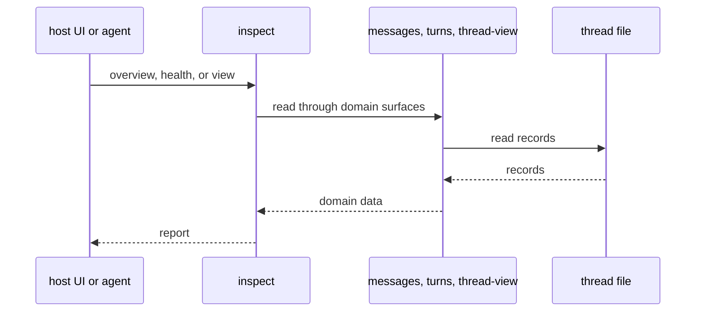
