# Long Horizon Context: Domain Design

This document describes each domain in more depth: what it stores, the operations it provides, and the other domains it calls. It builds on the vocabulary in 01-core-concepts.md.

## Domain surfaces

A domain is both a vocabulary area and a service surface. The operations a domain exposes are the same operations everywhere they are reached: the host calls them as SDK functions in-process, a future app server can serve them as endpoints, and other domains call them in-process when they need work the domain owns. When one domain needs something from another, it calls that domain's surface; it does not reach into the other domain's storage or internal modules. One domain can coordinate a flow that spans several, the way `intake-stream` records a batch and calls `messages` and `turns` along the way, but the called domains keep ownership of their own work.

## Tech utils

Beneath the domains sit a small number of **tech utils**: shared machinery that domains use but that owns no part of the conversation model. A tech util is not a domain. It has no domain surface and no vocabulary of its own in the product; it is internal plumbing (the logging surface is the one util exposed externally, but it owns no part of the conversation model). The dependency runs one way: domains use tech utils, and a util never calls a domain or contains domain logic. The working test is the name: if a function inside a util mentions a turn, a chunk, or a summary, it belongs in a domain instead.

The first util is the **durable work queue**. Some of what a domain owns cannot run in the hot path: smoothing a closed turn, summarizing a chunk, rebuilding derivations after an edit. The owning domain records that work as a durable work item and moves on; a worker picks it up later and runs the domain's handler for it. Running one item at a time per thread means a chunk's two summaries derive sequentially, not in parallel. Two properties carry the design. Pending work is recorded durably, not held in memory, so a restart loses nothing. And a thread's queued work is ordered: work queued by an edit lands after work already in flight on the old content, so a rebuilt derivation is never overwritten by a straggler finishing late. Running one item at a time per thread is the current policy that provides this, and the simplest. Independent items could run in parallel later, but only in a way that preserves the ordering edits lean on.

Each kind of queued work has exactly one owning domain. A domain queues its own work; it never queues work into another domain, and no domain watches for another domain's items. When a flow crosses domains, the crossing is a surface call, and the called domain queues whatever work its part needs. Asking a domain to repair its own derivations works the same way: the ask is a surface call, and the owning domain decides what to queue. The queue owns the mechanics of an item: recorded, picked up, retried, finished. What the work means belongs entirely to the owning domain.

Derivations carry state. The four states are one shared vocabulary across domains: `pending` (exists, not yet usable — covers never-attempted and retrying), `ready` (usable), `failed` (terminal), `blocked` (source damaged, retry won't help). What a state means for a particular derivation, such as what usable means for a smoothed prompt, stays the owning domain's call. State belongs to the derivation itself, never to its subject — a chunk does not carry "a state"; its detailed derivation and its brief derivation each carry their own. Whether a failed attempt will be retried is the work queue's business, not a property the derivation duplicates; a domain's derivation report joins the two, so a caller asking "is this still coming?" gets the answer without reading queue mechanics. Blocked-on-source is not a failure of the derivation; it points at the source problem, and no amount of retrying fixes it. Separate from all of these is what a derivation's absence means for a consumer. That is its own axis on purpose: the same missing summary that one consumer degrades around might matter more to another, and the consequence is the consumer's call, not a property of the derivation. A missing or failed derivation is a gap the consumer degrades around — the fallback goes into the view, the failure goes to the log — while only damage to the source record itself stops a thread.

Local token counting is another util already in the system: the tokenizer that stamps estimates is shared machinery with no surface of its own, reached through the domains that use it.

Logging is a cross-cutting technical surface that, unlike the other utils, is exposed externally from LHC. Both LHC and the host write info/warning/error logs through it, stored in the thread's SQLite file. It carries diagnostics — such as a derivation falling back to a floor — collected for troubleshooting, not control flow. The record stays what is usable; the log says what went wrong.

## Threads

A thread is the durable container for one ongoing conversation. The `threads` domain creates threads, tracks where they live, and gives the rest of the system a way to find a thread by id. Two SQLite databases sit behind it:

- A listing of all threads is stored in a **thread catalog** database, with one row per thread holding its id, file path, title, and cached info such as message and turn counts, status, and timestamps.
- Each thread's own database holds that thread's full record: its events, messages, turns, chunks, and views. Reading or changing a thread's contents means opening its file.

The thread file is authoritative for its own identity. It stores its thread id once, as identity metadata. The records inside it (events, messages, turns) do not each carry the thread id, because the file is the thread. The thread catalog is a convenience lookup over the thread files, not the authority; it can fall out of step with where files actually live and be refreshed from them. Its cached counts and status follow the same rule: convenience copies that can lag behind the thread files and be refreshed, never the authority.

### Creating a thread

`new-thread` creates a thread at a given file path, sets up the empty thread inside it, and adds a row to the thread catalog. It generates a thread id and records the id-to-path mapping. If a file already exists at the path, the operation fails instead of touching it. The host calls it as an SDK function (`threads.newThread({ filePath })`).

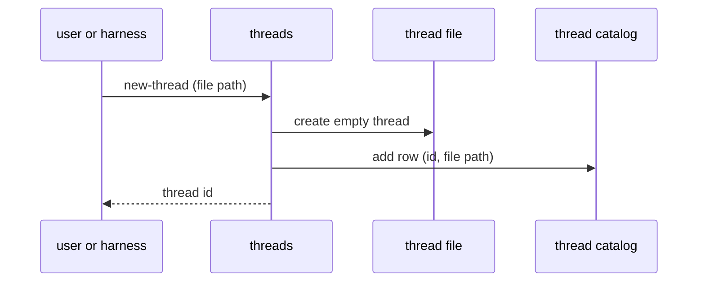

### Finding a thread by id

A thread id is the primary, stable key a caller holds. It survives the thread file moving, which a file path does not. Other domains work with thread ids, and when one needs to act on a thread, it asks the threads domain to resolve the id to its file, then opens it. This resolution is the threads domain's main service to the rest of the system.

How the threads domain resolves an id is its own concern and can change with the environment. In a single-thread host it reads the thread catalog database; in a long-lived service it can hold the mapping in memory; in other deployments it can resolve through a different store. Callers above it pass a thread id and do not change. A caller that already holds a file path can pass the path directly and skip resolution.

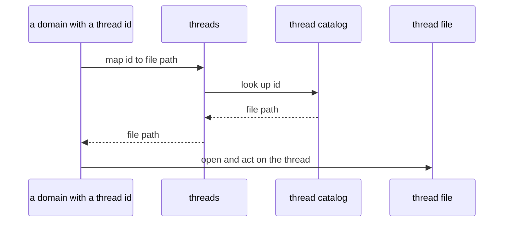

### Browsing threads

A user who wants to see their threads starts at the threads domain. It lists threads from the thread catalog, searches across titles and metadata, and shows the high-level info for one thread without opening its file. From a list, a user picks a thread and drills into its messages, turns, or views through the other domains. A host wires these list, search, and show operations into its own UI or agent tools.

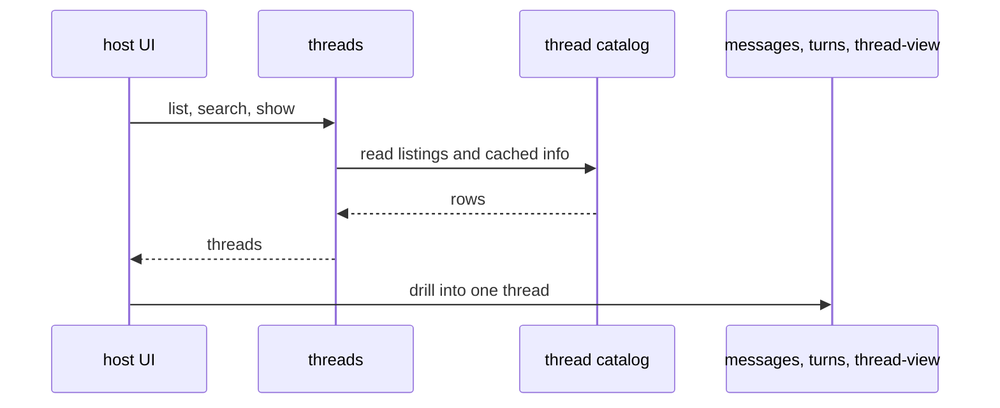

## Intake stream

As a harness runs it produces a stream of events. An event is one recorded thing that happened in the thread:

- `user_prompt`: a prompt from the user, or an automated prompt that stands in for one
- `assistant_text`: assistant output text
- `assistant_thinking`: assistant reasoning
- `tool_call`: a tool invocation
- `tool_result`: the result of a tool invocation
- `runtime_note`: a note from the harness or runtime
- `turn_end`: a marker that the current turn is complete

The `intake-stream` domain takes these events in and writes them into the thread in the order they happened. It is the only way thread content enters the system from a harness.

These flows are about how data moves, not about a user interface. The operations exist to record incoming events and coordinate the synchronous domain work that follows from those events. As it records the stream, `intake-stream` calls `messages` to create the readable message-and-block view and calls `turns` to open or close turn state. Those calls are in-process calls to the domain surfaces, not separate service hops.

A thread is single-threaded by definition: one conversation, one stream, no concurrent writers. That lets the domain treat the incoming stream as an ordered time series and make boundary decisions from position in that stream.

### The stream contract

The harness owns sending a coherent stream. The domain does not reconstruct order or membership from a malformed stream; it records what it is given, in the order given, and fails loudly when the stream implies an impossible state.

The contract:

- send events in the order they happened
- send a `turn_end` when a turn is complete
- a thread has zero or one open turns at any time

### Taking in events

A harness sends a batch of one or more events for a thread. The thread id rides outside the batch, since every event in a batch belongs to the same thread. The host calls the SDK operation with typed event objects directly (`intakeStream.messageEvents(threadId, events)`).

The domain maps the thread id to its file through the threads domain, then writes the batch to the thread's database in one coherent write flow. For each event it assigns the next position in the thread's order and records the source event. For events that produce readable conversation activity, it calls the `messages` surface to create messages and blocks. For events that affect turn state, it calls the `turns` surface to apply the open or close rule. It returns a result describing what happened to each event.

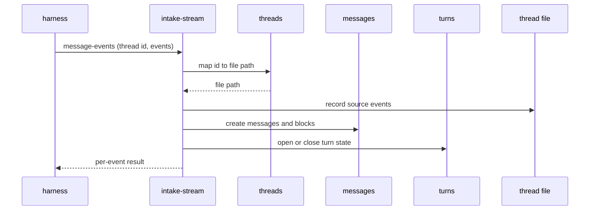

Events carry an idempotency key from the harness. If an event with the same key was already recorded for the thread, it is skipped rather than written twice, so a harness that resends a batch after a failure does not produce duplicates.

### Turn boundaries are decided here, synchronously

Turn boundaries are decided in the hot path, as events land, while intake is the thing watching the ordered stream. `intake-stream` calls the `turns` surface to apply the turn state machine and get the turn membership for message-producing events. This keeps membership correct: a message is attached to its turn when it is recorded, not inferred later against a stream that has moved on.

The deterministic work is synchronous: recording events, calling `messages` to create messages and blocks, calling `turns` to open and close turns, attaching messages to the current turn, and assigning token estimates. The slow, non-deterministic work that a closed turn needs, such as smoothing, lower-band projection, and compression, is queued as deferred work by the domains that own it. Closing a turn settles its membership immediately; the derivation that trails behind operates on a turn whose contents are already frozen.

Two events move turn boundaries. A `user_prompt` opens a turn. A `turn_end` closes one. The asymmetry is deliberate: a prompt opens, an end only closes. After a `turn_end`, no turn is open and waiting, so the database does not hold a phantom empty turn between exchanges. Events that arrive after a `turn_end` and before the next prompt belong to no turn; they appear in the live message view but not in any turn.

Most turns in normal operation close because the next prompt arrived, not because of an explicit `turn_end`. The `turn_end` is the additional closer that lets the final turn close without waiting for a prompt that may never come. An open turn with no following prompt is simply not done yet, and nothing downstream needs it until more has accumulated, so it can sit open with no consequence.

The state machine, per event:

| Event | Open turns | Action |
| --- | --- | --- |
| `user_prompt` | 0 | open a new turn, stamp the prompt with it |
| `user_prompt` | 1 | close the open turn, open a new turn, stamp the prompt with it |
| `user_prompt` | more than 1 | hard error: the thread is in an invalid state |
| `turn_end` | 1 | close the open turn |
| `turn_end` | 0 | disregard |

Closing a turn, by either trigger, fires its asynchronous derivation. The more-than-one-open case is a hard error during this phase rather than something swept under the rug, so an invalid thread is caught and triaged instead of producing quietly wrong turns later. A `turn_end` with nothing open is inert and is disregarded, since it changes no membership and corrupts no state.

### What the result reports

The result reports, per event, whether it was recorded, skipped as a duplicate, or rejected. A rejected event stops the batch, and events already written in the same transaction are rolled back, so a batch either lands cleanly or not at all. The result also reports turn boundaries that the batch opened or closed.

## Messages

A message is the readable form of activity in a thread. The `messages` domain owns the message-and-block view of the conversation. It creates that view from source events, lets users and agents read it, and provides the place where later message-level edits happen.

Events and messages are different records. Events are the ordered source stream received from a harness. Messages are the normalized view created from those events so the rest of the system can read, search, edit, group, and assemble thread history. A `turn_end` changes turn state but does not need to appear as a visible message in the conversation.

### Creating messages

`intake-stream` calls the `messages` surface as it records incoming events. The message operation creates a message for events that should appear in the readable conversation and creates the blocks that belong to that message. It also stores the token estimate for the message's original content.

The same surface can be used directly by other callers when they need a message operation outside the harness intake path. The difference is the caller, not the domain ownership: `messages` still owns message creation, and `intake-stream` uses that operation in-process while coordinating an event batch.

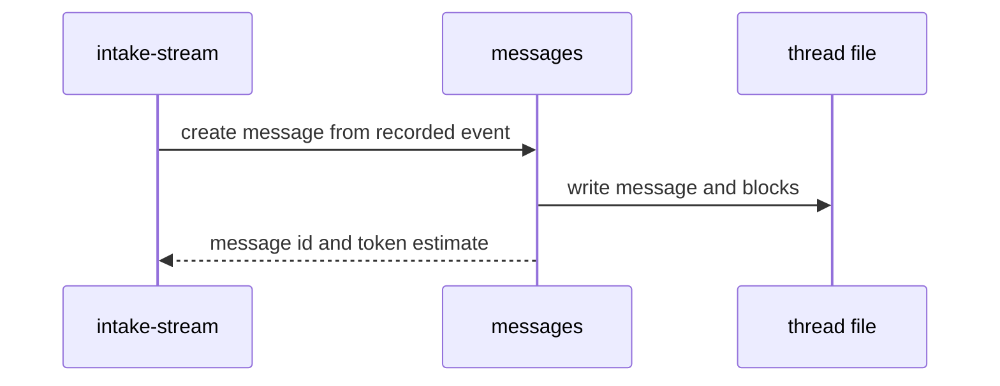

### Messages and blocks

A message represents one meaningful piece of conversation activity, such as a user prompt, assistant text, assistant thinking, a tool call, a tool result, or a runtime note. Some messages are simple text. Others need more structure, so a message can contain one or more blocks.

Blocks keep the parts of a message separate when they need separate handling. Text, thinking, tool-call metadata, tool results, runtime notes, images, and files can each be represented as blocks instead of being flattened into one string. This lets the system preserve provider activity in a readable form while still keeping structured parts available to turns, thread views, and inspection.

### Message-level derivations

Some derivations belong to a single message and need nothing beyond it, so `messages` owns them and queues their work the moment the message lands, without waiting for a turn to close.

A tool result's full output is stored when its message is created. The full output is the record and is never discarded. A tool result also gets an abbreviated derivation: a summary produced by inference, carrying derivation state and able to fail. When a consumer needs the abbreviated form and the summary is not ready, the fallback is a deterministic truncation of the full output — a tool result is never shown in full as a fallback; there is always at least a truncation. Which form a given view shows, and when a result switches from one to the other, is thread-view's policy, not messages' concern; messages owns the derivations themselves.

Tool calls are kept as-is, not summarized: call arguments are usually short and front-loaded, so the case for a separate inference pass on them does not hold. Where a tool result's summary needs to say how a call ended, it draws on the call and its paired result, found by the call id. Every summarized tool result states its outcome: succeeded, failed, or unknown — unknown covering a call whose result never arrived. A summary that describes what was attempted without saying how it ended invites a later reader to fill the gap with the most plausible ending, which is exactly the failure these derivations exist to prevent.

A user prompt gets a smoothed derivation the same way: cleaned and attenuated with its content preserved, derived from the message alone and queued when the prompt lands. Turn-level renderings later compose these message-level derivations rather than re-deriving them.

### Token estimates

Each message is stamped with a token estimate of its original content when it is created, in the same synchronous step that writes the message. Stamping on creation means every message carries a size the moment it lands, with no later counting pass and no API round trip, and a turn's size is the sum of its messages' estimates as soon as the turn closes.

The estimate starts with a local tokenizer (tiktoken with the `o200k_base` encoding), and that count is stored as the base. The base is stable and reproducible: the same text always yields the same number, with no provider call and no failure mode.

A local base count is an estimate, not an exact count for any given target model, since each model tokenizes a little differently. To get closer for a specific model, a per-model weight scales the base count, for example separate multipliers for code and prose per provider and model. The weights come from offline calibration that runs representative content through the base tokenizer and through a target model's tokenizer and takes the ratio. The base count stays stored as the source of truth; a model-specific estimate is the base scaled by a weight at read time. This keeps the stored number stable while letting estimates retarget to whatever model matters, including letting a later smart compact re-band a thread for a target model from stored base counts without recounting. Building the weight tables is a later concern; the base count is assigned when the message is created.

### Reading messages

The messages domain lists, views, and searches messages for a thread. It is the lowest-level human-readable view of the conversation. A user or agent starts here when they need to inspect what happened before looking at turns, chunks, or thread views.

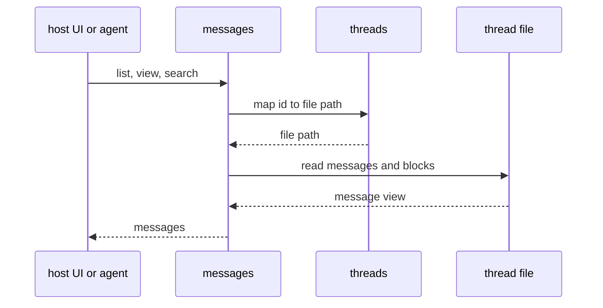

Each message carries the token estimate assigned when the message was created. The estimate describes the original message content. Derivations, such as smoothed turns or lower-band summaries, carry their own counts.

### Editing and deleting messages

Manual cleanup goes through messages, not `intake-stream`. Intake-stream records new activity from a harness; messages is where a person or agent can later correct, prune, or reorganize the readable conversation record. Two operations do this: edit changes a message's content, and delete removes a message — with its blocks — from the readable record. Both target closed turns only; the open turn is the live exchange and stays out of reach.

Delete is a projection-level operation. The message drops from reads and from its turn's membership, but the source events it was created from stay in the event log; the record underneath is never destroyed. Deleting a message that initiates a turn is refused in the current surface; whole-turn deletion is deferred until the turns mutation model is redesigned.

An edit runs the same way creation does. The deterministic work happens synchronously in the edit: the message and its blocks are updated and the token estimate is re-stamped. Derivations built from the old content are cleared and their inference work is queued again, each by the domain that owns it, exactly as it was queued the first time. An edit never leaves an old derivation in place to be judged against new content later; after an edit, a derivation is either current, or absent and queued to rebuild. Per-thread ordering of deferred work means a rebuilt derivation lands after any work that was already in flight on the old content.

A delete cascades the same way, with one difference: the deleted message's own forms drop rather than re-queue — their source is gone — while everything composed above it rebuilds. The cascade is bounded by structure: a message affects its turn's composed rendering and projection, and that turn's one containing chunk re-derives its detailed and brief summaries. Neighboring chunks never re-derive, and chunk boundaries never move; a chunk shrinks in place, it is never re-cut.

## Turns

A turn is one exchange in a thread. It starts with a `user_prompt`, or an automated prompt that stands in for one, and includes the assistant text, assistant thinking, tool calls, tool results, and runtime notes that follow. A turn closes when a `turn_end` arrives or when the next `user_prompt` starts a new turn.

The `turns` domain owns turn state, turn records, and turn-based containers such as chunks. It exposes the operations that open and close turns during intake, and it derives closed turns into the forms that later feed summaries, bands, and thread views.

### Opening and closing turns

`intake-stream` calls the `turns` surface as it processes incoming events. On a `user_prompt`, the turns operation opens a new turn, or closes the previous open turn and then opens a new one. On a `turn_end`, it closes the current open turn. If no turn is open, the `turn_end` is disregarded.

The open or close decision is synchronous. The result tells intake which turn, if any, a message-producing event belongs to. This is how messages get attached to a turn while the stream is still being recorded.

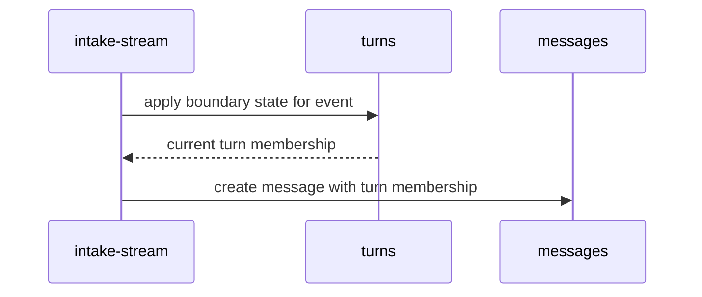

### Deriving closed turns

Closing a turn makes its membership stable. The slow work that follows can run after the close: building the full turn record, composing the turn's smoothed rendering, creating lower-band projection text, and preparing the turn for chunking. This work belongs to `turns`, even when it runs asynchronously. The smoothed rendering composes from message-level forms that `messages` already derived, such as smoothed prompts; what `turns` derives is the turn-shaped result, not the message-content forms inside it.

Part of the turn-shaped result is the turn's tool activity: a run of calls and results that carried out one task is composed into a short account of what the run did and how it ended, not left as a list of separate calls. Runs that changed state keep their outcome explicit; a rendering may compress what a sequence of edits did, but never whether it landed.

`turns` queues this work for itself when the close happens. Each derivation carries its own state, so a missing smoothing or a failed projection is visible as exactly that, and the `turns` surface exposes operations to check derivation state and re-queue what is missing or failed. A derivation that has not landed is a gap, not a blocker; consumers degrade and continue until repair fills it. When a turn is composed and a member derivation is not ready, composition tries to produce it, then falls to a deterministic floor, then to the original content — it never blocks, and the fallback is logged.

A closed turn keeps enough source information to trace back to the messages and events it came from. That lets a later edit, repair, or inspection report explain which source messages contributed to a turn and whether derived state is current.

### Chunks

A chunk is a container of turns. Chunks let the system group multiple closed turns into larger units that can be summarized or placed into lower-fidelity bands. Turns are the base unit; chunks are the next container above them.

The `turns` domain owns chunk formation because chunking depends on turn order, turn size, and lower-band projection state. Closed turns accumulate into the current open chunk until a size policy closes it. A closed chunk then gets its own derivations, queued by `turns` the same way a closed turn's are: the detailed and brief summaries that a thread view's lower bands show. The two shed tool activity at different rates: a detailed summary keeps the receipts — what was changed and whether it succeeded — while a brief summary keeps outcomes only. What ages out first is the activity's texture, never its result. Both carry derivation state and can be checked and re-queued through the `turns` surface. Thread-view later uses those chunks and summaries when it assembles a harness-ready context view.

### Deleting turns

The `turns` surface deletes a whole turn: the exchange unit and the messages inside it drop from the readable record together. This is the sanctioned path when a dead-end exchange should go away, and it is where a refused prompt-delete points. Like message mutations, it targets closed turns only, and the source events remain in the event log.

The cascade is the bounded one: the deleted turn's own derivations drop with it, the one chunk that contained it re-derives its detailed and brief summaries from the remaining turns, and nothing else changes. Chunk boundaries stay where the close policy cut them; if a chunk loses its last turn, it simply contributes nothing to views.

### Reading turns and chunks

The turns domain lists and views turns and chunks for a thread. These operations are used by agents and users who want to inspect the conversation at a higher level than individual messages, and by thread-view when it needs turn and chunk material for context assembly.

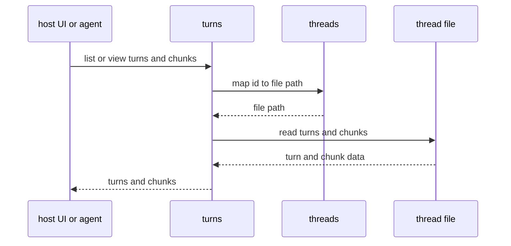

## Thread view

A thread view is a summarized, harness-ready rendering of a thread. It holds enough of the conversation for an agent to resume work without the full history: recent activity at high fidelity, older activity compressed into shorter forms. The `thread-view` domain generates these views, keeps them current as new events arrive, and renders them for a harness to consume. A harness either loads a view that LHC has written to a file or pulls the current view from LHC directly.

A view is a rendering, not a second copy of the conversation. It is assembled from records the other domains already own: messages, turns, chunks, and the summaries derived from them. Producing a view never changes the canonical history; it selects and arranges what already exists.

### Bands

A thread view is arranged in bands of decreasing fidelity, from the most recent activity down to the oldest:

- **full**: recent turns rendered close to their original form
- **smooth**: smoothed turns, cleaned and attenuated but with their content preserved
- **detailed**: detailed summaries of older chunks
- **brief**: brief summaries of the oldest chunks, the compressed floor of the view

The bands are a gradient, not a cliff. As a turn ages it moves down a band, losing fidelity in steps instead of dropping out of the view all at once. The recent end stays sharp for the work in progress; the old end stays cheap while still carrying the shape of what came before.

### Generating a view

Generating a view, the operation a user sees as a **smart compact**, sets the band arrangement for the whole thread: which turns and chunks fall into which band, rendered into a current view. It works by selecting artifacts the other domains have already derived, not by recomputing them. The smoothed turns and chunk summaries exist before a smart compact runs, so generating a view is assembly, not summarization.

A smart compact runs periodically, not on every turn. Each one resets a large part of the view, so running it constantly would be costly for a harness that caches its prompt. Between compacts the lower bands hold still: the brief, detailed, and smooth arrangements settled at the last compact do not move. Only the full band changes between compacts, as new turns arrive at the recent end and the oldest full turns wait to be re-banded at the next compact.

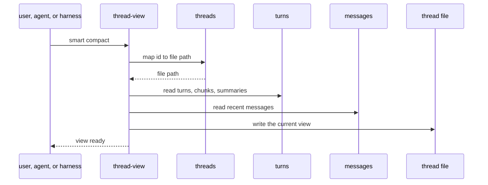

### Assembling the active view

Between compacts, the view a harness consumes is assembled cheaply from the locked brief, detailed, and smooth bands plus the current full-fidelity tail of recent turns. Assembling it is deterministic local work, reads and rendering, with no provider calls and no summarizing. An extensible harness can pull the assembled view before each model call without paying to re-derive anything.

Assembly selects already-derived artifacts; it does not create missing ones. If a band depends on a summary that has not been derived yet, or that failed to derive, the view reports the gap rather than inventing the missing content or running repair in the hot path. Recovering missing derived state belongs to the domain that owns it, not to view assembly.

Degrading is visible by obligation. A gap in band material renders as a marked gap in the view, so the agent reading it knows a stretch of history is thinner than it should be. The view never silently drops a span of the thread because its material was missing; an unmarked hole is worse than a degraded entry, because nothing downstream can tell the history was ever there.

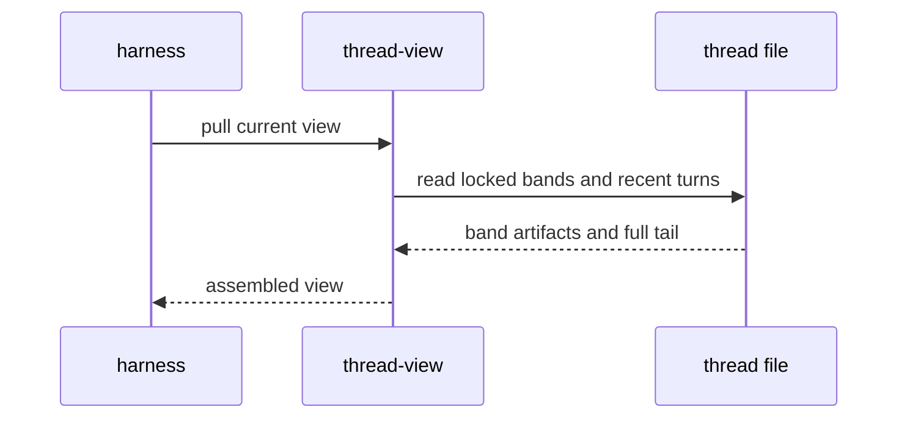

### Keeping derivations ready

A view is only as good as the artifacts waiting for it. Thread-view is the domain that needs derivations from everywhere, smoothed turns and chunk summaries from `turns`, tool-result summaries from `messages`, so thread-view watches their health. Triggered from the hot path but running off it, the readiness check walks the derivations the next view will need, lists what is missing or failed, and asks each owning domain through its surface to repair its own. Thread-view never derives anything itself and never touches another domain's derivation state; the repair ask is a surface call, and the owning domain decides what to queue. Thread-view identifies the gaps, prioritizes them, and drives the domains that own the work, so that when the next smart compact runs, assembly finds its materials ready.

### Tool results in the active view

Tool results move through fidelity on a shorter cycle than the bands. `messages` owns a result's forms, full output, summarized abbreviation, truncation fallback; `thread-view` owns the policy for which form a given view shows and when a result switches. Recent tool results show in full, because the agent is likely still working with them; older ones show abbreviated, because their full output is rarely needed once the work has moved on. When an older result's summary is not ready, the view degrades to a deterministic truncation of the full output rather than waiting.

The decision is split into two steps to keep the view stable for a harness that caches its prompt. A tool result becomes **eligible** for abbreviation as it ages past a size threshold, but staying eligible does not change the view. Eligible results are **activated** to their abbreviated form in batches, when the recent tail grows past its budget, rather than one at a time as each turn lands. Flipping results one by one would rewrite the prompt on most turns and invalidate the harness's cache each time; flipping a batch occasionally keeps the prompt prefix stable between activations. The thresholds and cadence are tunable; the architectural point is that abbreviation is a sticky, batched decision, not a fresh recomputation each turn.

### Rendering for a harness

The same assembled view renders in more than one form. An extensible harness that can take its context from LHC pulls the view as an in-memory message array. A closed harness that reads only its own session file gets the view written into that provider's file format. Both come from the same view; only the output form differs. A written provider file is a materialized rendering of the view, not a second source of truth: the thread file remains authoritative.

## Inspect

Inspect answers questions about a thread without changing it. The `inspect` domain produces overviews, statistics, and reports: how big a thread is, how many turns and chunks it holds, what derived state exists and what state each piece is in, what the current view contains and what it would cost a harness to load. Where `messages` works inside the history, inspect stands outside it and describes it.

Inspect is read-only and reads through the other domains' surfaces. It never writes, repairs, or derives. That is also the line between inspect and thread-view's readiness role: thread-view checks the specific derivations its next view needs and drives their repair; inspect reports on whatever a person or agent asks and changes nothing.

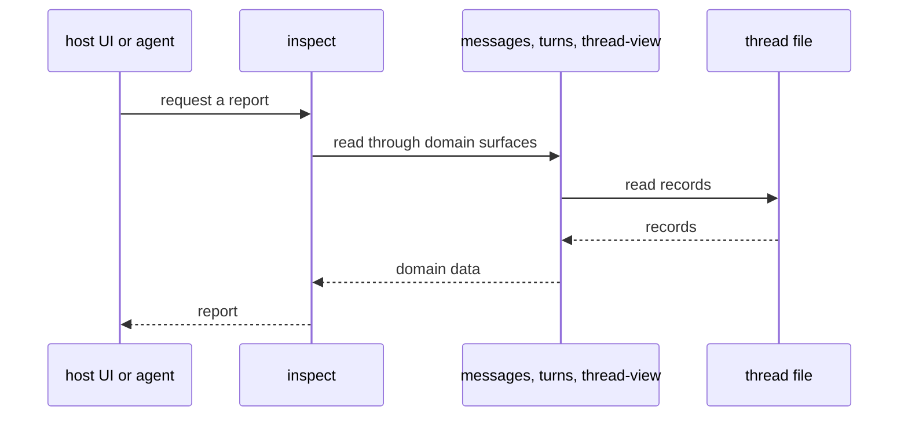
