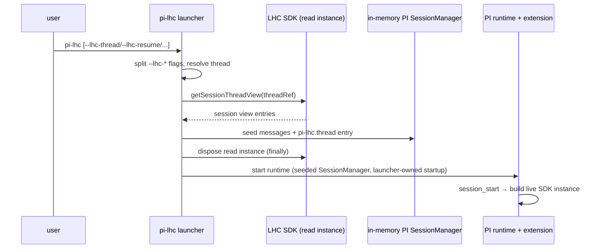
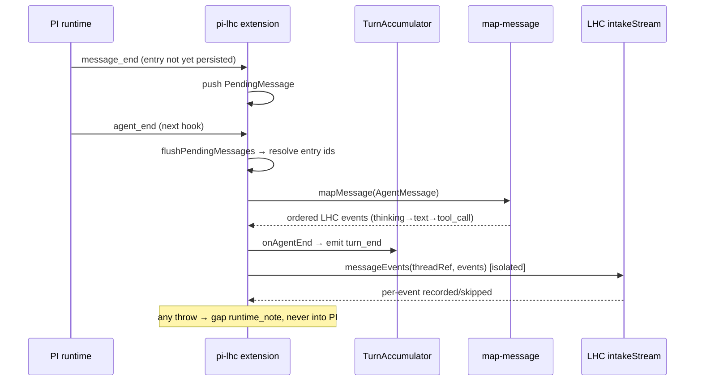
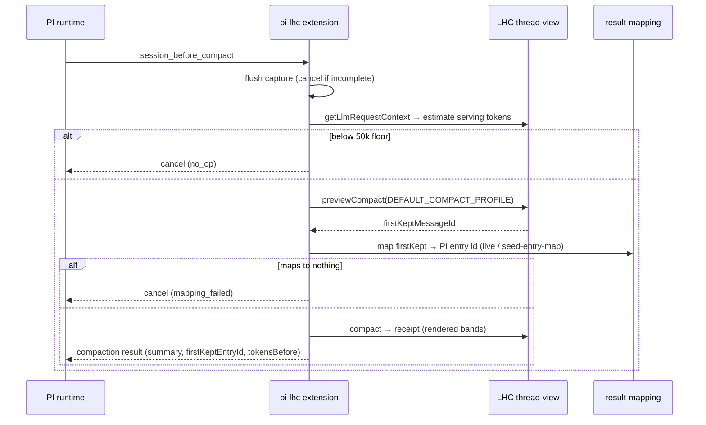

# Host: pi-lhc

Last verified against code: 2026-07-11. Precedence when facts disagree: code, then README, then [03-decisions-brief](03-decisions-brief.md), then this doc; see also the [decision registry](../decision-registry.md).

This document describes the `pi-lhc` host as it is, including its known debt. Host code is less shaped than the core SDK, and a cleanup rework is expected — the pi-lhc pass is tracked as item 18 in [docs/fixes-feature-log.md](../fixes-feature-log.md) (named compact profiles, connector cleanup, native-inference re-plumb). Where this doc names hardcoded thresholds or awkward seams, they are real and known, not hidden.

It builds on the vocabulary in [01-core-concepts.md](01-core-concepts.md) and the domain surfaces in [02-domain-design.md](02-domain-design.md). LHC terms — record, derivation, thread view, bands, compact point, visibility boundary, prune, intake stream, turn, chunk — are used exactly as defined there.

## What pi-lhc is

`pi-lhc` is one package holding two things that cooperate: a **PI extension** and a **launcher binary**. The extension is the host: it holds an SDK instance, observes PI's runtime through hooks, records everything into an LHC thread, and swaps LHC's smart compact in for PI's native compaction. The launcher is a thin binary that resolves which thread a session belongs to, seeds a PI session from that thread's view, and then starts the PI runtime with the extension attached.

What pi-lhc makes PI do, in three sentences: every message PI produces is recorded into an LHC thread as intake events; when PI would compact, LHC's smart compact runs instead and hands PI a compaction result; and when a session starts, PI's in-memory history is seeded from the LHC thread view rather than from a PI session file. The LHC thread is the durable record; the PI session is a rendering of it.

The extension retains almost no state. The registered connector holds a plain-data `SessionState` (thread ref, launch flags, health diagnostics) and an `LhcInstance` (the SDK handle, rebuilt each session) — and deliberately no PI `ctx`, because a fresh `ctx` arrives with every hook call and must never be captured (`lifecycle/state.ts:4-8`, `pi/types.ts:162-164`). This is what lets `/reload` reconstruct the extension cleanly.

## Lifecycle

### Launcher startup

The `pi-lhc` binary (`bin.ts`) resolves the home via `piLhcHome()` (`home.ts` — `PI_LHC_HOME` when set, else `~/.pi-lhc`), computes a default new-thread path at `<home>/threads/<uuid>.sqlite` (`defaultNewThreadFilePath`), sets `PI_CODING_AGENT_DIR` to `<home>/pi/agent` (a non-empty operator preset takes precedence — PI config then stays wherever it points), and calls `runPiLhcLauncher` (`launcher/run.ts`). The launcher splits its own `--lhc-*` flags out of argv before PI's parser ever sees them (`launcher/parse-args.ts`), so PI's native `--session`/`--resume`/`--continue` stay untouched — and are in fact rejected outright if a user passes them, because LHC owns session identity now.

Thread resolution has four outcomes, split across two layers: `--lhc-resume`'s interactive picker is handled in `launcher/resolve-startup.ts`, and the id / `--lhc-continue` / new-thread branches in `lifecycle/thread-resolution.ts:64`.

- `--lhc-thread <id>` resolves an existing thread by full or partial id; an ambiguous prefix fails loudly.
- `--lhc-resume` opens a **picker**: `resolveStartupThread` prompts on the TTY with `promptResumeChoice`, auto-selecting when there is a single candidate and returning null on a non-TTY (`launcher/resolve-startup.ts:37`). `--lhc-continue` is the non-interactive cousin — it takes the most recently created thread.
- No flag at all **creates a new thread**, titled with the cwd's leaf name (`thread-resolution.ts:96`).

More than one attach flag is a hard `conflicting_lhc_launch_flags` error (`lifecycle/lhc-launch-flags.ts:78`).

With a thread resolved, `prepareLhcLauncherStartup` (`launcher/startup.ts:49`) builds a short-lived read instance, calls `getSessionThreadView(threadRef)`, and seeds an in-memory PI `SessionManager` from the returned entries (`launcher/seed-session.ts:7`). It then appends the durable `pi-lhc.thread` entry to that session manager and **always disposes the read instance in a `finally`** — the launcher's seeding SDK is read-only and uses deterministic (no-inference) callbacks in the process. The resolved thread ref and launch flags are stashed via `setLauncherOwnedStartup`, a one-shot handoff the extension consumes on its first `session_start` (`launcher/startup.ts` → `index.ts:525`).

Finally the launcher builds a runtime factory (`launcher/runtime-factory.ts:34`) — which recreates cwd-bound PI services on each session replacement — and starts the PI runtime seeded with that pre-built session manager. Interactive mode announces the thread id to stderr; print/json mode writes it to stdout first.

### Instance init and dispose

Inside the extension, `initInstance` validates the thread through `threads.info`, then constructs the live SDK via `initLhc` — always in **background mode**, regardless of caller config, so derivation work drains automatically after each intake commit (`lifecycle/instance.ts:44`). Dispose awaits `drainSettled` by default so queued work finishes before the handle is dropped (`instance.ts:18`). `session_before_switch` and `session_shutdown` both route to the same dispose path, which flushes pending capture, disposes, and nulls the instance.

### The durable thread entry

`pi-lhc.thread` is a custom PI session entry carrying `{ threadId, registryPath? }` (`lifecycle/thread-entry.ts`). It is how a reload reattaches: on `session_start` the extension scans the session manager's entries newest-first for a `pi-lhc.thread` entry and, if found, resolves that thread rather than creating a new one (`index.ts:243`, `index.ts:533`). Reload resolution never creates and never re-prompts — it reattaches or fails.

### Fork

When PI forks a session (branching the conversation into a new tree), the extension creates a **new LHC thread seeded from the source**, rather than reattaching or capturing into the original. A fork is detected two ways: the `session_before_fork` hook records a `pendingFork` (source thread ref + fork entry id) as the primary path (`index.ts:412`), with PI's session tree as fallback evidence when the hook did not fire (`lifecycle/fork.ts`). Seeding replays the source thread's recorded events up to the fork point into the new thread and never writes the source (`fork.ts:129`). The upshot for thread identity: a fork is a genuine branch — two threads sharing a common prefix — not a reload of one thread and not an ordinary capture.

## Capture

### The hook rail

The extension registers PI hooks in two groups (`index.ts:130`): the Epic-1 rail (`session_start`, `message_end`, `turn_end`, `agent_end`, `model_select`, `thinking_level_select`, `session_before_fork`, `session_before_switch`, `session_shutdown`) and the compact pair (`session_before_compact`, `session_compact`). Every Epic-1 handler is wrapped in `guard`, which catches any throw and turns it into a plain-data `hook_handler_error` diagnostic — **capture never throws back into PI** (`index.ts:864`). Notably, PI's `context` hook is *not* registered: context reaches PI by seeding the session manager, not through a per-request hook.

Two hooks in the rail are deliberately unusual:

- `turn_end` maps to a **no-op**. PI fires one `turn_end` per agent *step* (the turn index resets each run), so mapping it one-to-one would shred the record into fragments. The real turn boundary is `agent_end` (`index.ts:881`, `pi/types.ts:44`).
- `message_end` does **not** capture immediately. PI persists a message's `SessionEntry` *after* `message_end` handlers return, so the entry id capture needs isn't available yet. Instead the handler pushes a `PendingMessage` recording the pre-append entry ids and a fallback fingerprint (`index.ts:800`). The *next* capture-bearing hook opens with `flushPendingMessages`, which finds each pending message's now-persisted entry by comparing stable JSON, then maps and captures it (`index.ts:751`). Capture is lagged one hook by design.

### Fan-out: one PI message, many LHC events

`mapMessage` turns a single PI `AgentMessage` into an ordered list of LHC intake events (`capture/map-message.ts:289`). An assistant message fans out in PI's confirmed part order — `assistant_thinking` (if any) → `assistant_text` (if any) → one `tool_call` per call in order — and, if the run aborted, a trailing `runtime_note` (`map-message.ts:230`). A user message produces a `user_prompt` plus `runtime_note`s for unsupported parts, never a silent drop; a tool result produces one correlated `tool_result`. An unknown role throws, and that throw is caught upstream and recorded as a **gap** rather than lost.

### Idempotency keys

Every event carries an idempotency key so PI resending a batch after a failure never double-writes. `eventKey` builds the key in four precedence tiers (`capture/idempotency.ts:37`): PI entry id, then tool-call id, then provider response id, then a content fingerprint (sha256 truncated to 24 hex chars) as the last resort. The first three tiers are reversible — `parseEventKeySource` reads a PI entry id back out of a key, which is what fork replay and the compact result-mapping rely on.

### The turn accumulator

`TurnAccumulator` enforces one LHC turn per agent run (`capture/turn-accumulator.ts:19`). It opens a turn when a batch contains a `user_prompt`, and it emits exactly one `turn_end` on `agent_end` — closing the LHC turn once, at the end of the whole agent run. PI's per-step `turn_end` is never fed to it. A hard-kill that skips `agent_end` leaves the turn open; that is tolerated and reattaches cleanly.

### Isolated flush with gap recording

Capture writes go through `flushIsolated`, which wraps `intakeStream.messageEvents` in a try/catch and converts any throw into a `storage_failure` OpResult (`capture/converter.ts:26`). When intake rejects a malformed event on an otherwise writable thread, `capture` writes a durable **gap** `runtime_note` — a `runtime_note` keyed by a fingerprint of the rejected batch — so the record shows a marked gap rather than silently skipping (`converter.ts:70`). Map-time throws are recorded the same way through `recordMappingFailure`. Failures land as diagnostics in `state.health`; none of them propagate into PI.

## Serving

Context reaches PI by **seeding the session manager**, not through a context hook. `applySessionThreadViewToSessionManager` walks an LHC `SessionThreadView`'s entries in record order and appends them to a PI `SessionManager` — model changes, thinking-level changes, and messages, each mapped to PI's shapes with synthetic `provider:"lhc"/model:"thread-view"` provenance (`serving/context.ts:81`). As it seeds, it collects LHC-message-id → PI-entry-id rows and appends them as a `pi-lhc.seed-entry-map` entry (see the compact bridge).

`/lhc-rehydrate` replaces the live PI session in place: it flushes capture, waits for idle, captures the current model preferences, and starts a fresh in-memory session hydrated from the latest thread view (`lifecycle/rehydrate.ts`, `index.ts:970`). This is how a user pulls the newest compacted view into a running session.

Two **export commands** exist for resume-fidelity diffing. `/lhc-export-threadview` writes the LHC serving view — exactly what the model would see — to `lhc-threadview-<ts>.txt`; `/lhc-export-pi-session` writes the live PI session entries to `lhc-pi-session-<ts>.txt` (`commands/export-threadview.ts`, `commands/export-pi-session.ts`). Diffing the two is how byte-identical resume was verified (2026-07-04).

## Compact bridge

When PI would compact, it fires `session_before_compact`, and the extension answers with a compaction result assembled by LHC's smart compact instead of PI's own summarizer. The handler (`compact/handler.ts:53`) runs a strict gate before it writes anything:

1. Flush pending capture; if the last capture failed, cancel with `capture_incomplete` — LHC will not compact over an incomplete record.
2. Estimate the serving context's token count. If it is below `COMPACT_FLOOR_TOKENS` (**50,000**, hardcoded), cancel with `no_op` — too small to be worth compacting.
3. `previewCompact` with `DEFAULT_COMPACT_PROFILE`; a real error cancels with `compact_error`.
4. Map the preview's `firstKeptMessageId` to a PI entry id. If it maps to nothing, cancel `mapping_failed`.
5. `compact` for real; validate the receipt carries rendered bands.
6. Assemble the compaction result (band summary text, first-kept entry id, tokens-before) and hand it back to PI.

The `firstKeptMessageId` → PI entry id mapping (`compact/result-mapping.ts:38`) is the subtle part. It tries two origins. **Live**: if the LHC message's idempotency key belongs to the *current* PI session and parses to an entry id present in the branch, use that. **Seeded**: otherwise look the LHC message id up in the `pi-lhc.seed-entry-map` — because after a rehydrate or fresh seed, the live keys reference the *old* PI session, and the seed-entry-map is the bridge that lets a compact point land on a real entry in the new session. If neither resolves, the compact cancels rather than pointing PI at a phantom entry. This seed-entry-map is what carries compact continuity across session boundaries.

## Inference

LHC's background derivations (smoothing, tool-result summaries, turn compression, chunk-brief summaries) need model calls, and pi-lhc provides them through **PI's own model registry plus `pi-ai`** (`inference/model-call.ts:189`). `createModelCall` resolves a `(provider, model)` pair against PI's registry, checks configured auth, and completes through `@earendil-works/pi-ai`, which is loaded by a runtime dynamic import so the bundler cannot resolve it away. The adapter returns shaped text or a classified failure and never fabricates completion text; if `pi-ai` is absent it returns a failure rather than inventing output.

The four inference-backed derivation kinds each have a model assignment (`inference/assignments.ts`), defaulting to a deliberately lightweight lane — `openai-codex/gpt-5.4-mini`, thinking `none` — chosen to stay distinct from the user's main agent model. `loadAssignments` fails loud on incomplete, placeholder, or unknown-prompt config. At startup, `validateReachable` probes each assignment against the registry and auth and surfaces unreachable lanes as a diagnostic (via UI notify when interactive, else a headless stderr write) — it never throws, and capture keeps running even if a lane is unreachable (`inference/startup-validation.ts:61`).

**Known contamination concern.** Because derivation inference shares PI's provider/auth lane, LHC's internal model calls ride the same harness plumbing as the user's session — the separate lightweight assignment is a mitigation, not an isolation. The planned fix is item 17's LHC-owned native inference lane, consumed by pi-lhc in item 18's re-plumb, which takes the derivation path off PI's registry entirely. Until then this is a harness-mediated lane.

## Slash commands

All are registered in `register()` (`index.ts:1051`). Note that PI hands a command its arguments as **one raw string**, not a split argv (`pi/types.ts:182`) — commands that take an argument parse it themselves.

| Command | What it does |
| --- | --- |
| `/lhc-rehydrate` | Replace the live PI session with a fresh in-memory session hydrated from the latest LHC thread view. |
| `/lhc-export-threadview` | Write the current LHC serving view (what the model sees) to `lhc-threadview-<ts>.txt` in cwd. |
| `/lhc-export-pi-session` | Write the live PI session entries to `lhc-pi-session-<ts>.txt` in cwd — the diff counterpart for resume fidelity. |
| `/lhc-tool-prune [targetTokens]` | Advance the visibility boundary so older tool results render truncated (no compact; default target 32k); auto-rehydrates so the running session picks up the new boundary. |

Launcher **flags** (`--lhc-thread`, `--lhc-resume`, `--lhc-continue`, `--lhc-help`) are separate from these in-session commands and are consumed before PI starts.

## State layout

All runtime state lives under one home, resolved by `home.ts` (one carve-out: a pre-set non-empty `PI_CODING_AGENT_DIR` redirects the PI config dir out of the home — see the `pi/agent/` row):

| Path | Purpose |
| --- | --- |
| `~/.pi-lhc/` (override `PI_LHC_HOME`) | Host home root |
| `registry.sqlite` | LHC thread registry |
| `threads/<uuid>.sqlite` | Per-thread LHC databases (`defaultNewThreadFilePath`) |
| `pi/agent/` | Entire PI config dir — auth, models, settings, sessions, extensions, skills — via `PI_CODING_AGENT_DIR` (`ensurePiAgentDirEnv`; a pre-set non-empty env value takes precedence over the home) |
| `backup.sh` | Optional snapshot rail (copied from `scripts/pi-lhc-backup.sh` on fresh install, or installed by migration) |
| `.env` | Optional env file (migration copies from legacy `~/.lhc/.env` when present) |

Parent directories are `mkdir`'d recursively because SQLite will not create them. Two custom PI session-entry types are durable state pi-lhc writes into the PI session: `pi-lhc.thread` (reattach target) and `pi-lhc.seed-entry-map` (compact continuity).

Plain `pi` on the same machine keeps a separate `~/.pi` — intentional divergence after a one-time seed. Machines with legacy split state (`~/.lhc` + `~/.pi/agent`) migrate offline with `scripts/migrate-to-pi-lhc.mjs` (`--dry-run` then `--yes`; refuses while a pi-lhc process is alive). Fresh installs install the backup rail from `scripts/pi-lhc-backup.sh` into the home (setup doc step 7); the script WAL-checkpoints then commits/pushes if the home is a git repo with `origin`/`main`.

The only `process.env` writes from the launcher are `PI_CODING_AGENT_DIR` (home-owned agent dir, written only when not already set) and `PI_OFFLINE=1` under `--offline`. Auth for derivation lanes is threaded through PI's providers under the resolved agent dir — the home's `pi/agent/` unless a preset redirected it.

## Known debt

- **`COMPACT_FLOOR_TOKENS = 50_000`** and **`DEFAULT_COMPACT_PROFILE`** (lowerBound 120k; bands full 25 / smooth 35 / detailed 20 / brief 20) are hardcoded in `compact/profile.ts`. The compact handler passes `DEFAULT_COMPACT_PROFILE` directly instead of selecting a **named profile** — the LHC side already has built-in `continuation`/`conversation`/`coding` profiles; wiring the connector to them is the half-done part (a) of fixes-log item 18.
- Thread-view still has **direct table reads** for live-tail assembly (noted in 02); pi-lhc inherits that boundary, not a design choice.
- The **`PiCommandHandler` args-is-a-string gotcha** (`pi/types.ts:182`): command handlers receive the raw remainder text, not a parsed argv, so any argument parsing is the handler's own responsibility.
- The **harness-mediated inference lane** (above) is the largest architectural debt — items 17/18 move it to a native lane.
- Overall connector shape (handler, serving, lifecycle) is flagged for a general cleanup pass in item 18, part (b). This host is less shaped than the core SDK on purpose; the rework is expected.
