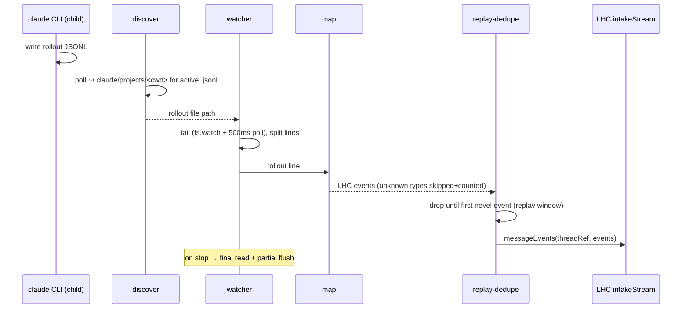

# Host: cc-lhc

Last verified against code: 2026-07-05. Precedence when facts disagree: code, then README, then [03-decisions-brief](03-decisions-brief.md), then this doc; see also the [decision registry](../decision-registry.md).

This document describes the `cc-lhc` host as it is, including its known warts. It is still POC-grade — less shaped than the core SDK, with a list of cosmetic and edge-case issues carried openly in [packages/cc-lhc/README.md](../../packages/cc-lhc/README.md) and folded in below. The wrapper exists to prove a second host pattern (item 9 in [docs/fixes-feature-log.md](../fixes-feature-log.md)); the Codex wrapper (item 10) is meant to reuse this shape behind a seam.

It builds on the vocabulary in [01-core-concepts.md](01-core-concepts.md) and the domain surfaces in [02-domain-design.md](02-domain-design.md). LHC terms — record, derivation, thread view, bands, compact point, visibility boundary, prune, intake stream, turn, chunk — are used exactly as defined there.

## What cc-lhc is

`cc-lhc` is a **PTY wrapper around the closed `claude` CLI**. Claude Code has no extension API rich enough to host LHC the way PI does — hooks are limited and disabled in some environments — so cc-lhc takes the outside position instead: it owns the `claude` process, passes the terminal through transparently, and reaches LHC by two side channels. It **watches** the rollout JSONL file Claude Code writes and feeds those records into an LHC thread (capture), and it **intercepts** a narrow set of `/lhc-*` command lines from stdin (control). Everything else — keystrokes, output, exit code — passes through untouched, so from the user's seat it is Claude Code.

Because the wrapper cannot inject context back into a running `claude` session, its compact/prune story is different from pi-lhc's in-memory seeding: it **rebuilds a fresh rollout file** from the thread view and restarts `claude --resume` on it (see below). The harness-specific bits — rollout format mapping and resume mechanics — are the seam a future Codex wrapper adapts.

## The wrapper

`bin.ts` strips two cc-lhc-only flags (`--no-capture`, `--no-inference`; the latter also honors `CC_LHC_NO_INFERENCE=1`) and passes all remaining argv verbatim to the child. `wrapper/run.ts` spawns the CLI under a PTY via `@lydell/node-pty` (`run.ts:85`), with cols/rows taken from the real stdout and `TERM=xterm-256color`. The child binary is `claude` on PATH, overridable with `CC_LHC_CLAUDE_BIN` (`shared/claude-bin.ts`).

Passthrough is raw and bidirectional: stdin is put in raw mode and forwarded to the PTY (after interception), PTY output is forwarded to stdout, and `SIGWINCH` resizes the PTY. `SIGINT`/`SIGTERM` are forwarded to the child. On child exit the wrapper propagates the exit code (`signal ? 128+signal : exitCode ?? 1`), stops capture, prints the final stats line, kills any live inference subprocesses, and restores the terminal (raw mode off, cursor shown) (`run.ts:175`). Stopping capture waits for the derivation queue to settle, capped at `DEFAULT_DRAIN_SETTLED_CAP_MS` (30 s, `intake/session.ts:41`) — so a session with heavy inference still draining can take a few seconds to exit, which reads as a pause rather than a hang. A `SIGUSR1` prints the current capture stats to stderr without stopping.

The PTY handle is held behind an indirection object so the data/exit handlers can be re-pointed at a *new* PTY after a restart without re-registering listeners (`run.ts:170`).

## Input interception

`wrapper/intercept.ts` is a byte-by-byte MITM state machine that captures **only** lines beginning `/lhc`. Everything else reaches the PTY unchanged. The design lesson baked into it — call it the Warp startup-sequence lesson — is that a terminal multiplexer or app emits control sequences that look nothing like typed text, and swallowing any of them corrupts the child; so the machine's default posture is *pass through*, and withholding is the rare, tightly-scoped exception.

**Arming.** Interception arms only on a fresh line, when the very first byte is `/` (`0x2f`) (`intercept.ts:296`). At that point the `/` is echoed to the screen, withheld from the PTY, and the shadow buffer becomes `"/"`. Any other printable byte at the start of a line clears `freshLine` and passes straight through — so a `/lhc` typed *after* any other character on the line is **not** intercepted; it must be the first thing on a fresh line.

**Candidate discrimination.** While withholding, each printable byte appends to the shadow buffer, which stays withheld only as long as it is still a viable prefix of `/lhc` (the buffer equals, starts with, or is a growing prefix of `/lhc`) (`intercept.ts:42`). The moment the buffer diverges — say the user types `/lho` — a **divergence flush** sends the withheld buffer plus the rest of the chunk to the PTY, erases the on-screen echo with backspace-space-backspace, and stops intercepting. So a mistyped command never gets eaten; it lands in Claude Code as if it had been typed normally.

**Dispatch.** On Enter (`\r`/`\n`) while withholding, the buffer dispatches as a command if it is exactly `/lhc` or starts with `/lhc-` (`intercept.ts:47`); otherwise the buffer and newline flush to the PTY. Kitty-keyboard-protocol Enter (a CSI `u` sequence with the `13` keycode) is recognized as a submit while withholding, so the command still dispatches under that input mode (`intercept.ts:163`). A `\r` dispatch swallows the paired `\n` that follows (CRLF).

**Control-byte handling.**
- **Ctrl-C (`0x03`) discards** — resets state, forwards the byte and the rest of the chunk to the PTY, and drops the withheld buffer entirely.
- **Escape flushes** — a bare ESC while withholding erases the echo and forwards the remainder, cancelling the candidate command without dispatching it.
- **Backspace (`0x7f`)** pops the last buffered char and erases one echoed char while the buffer is non-empty.
- **Escape sequences pass through untouched.** ESC begins a passthrough sub-mode that recognizes CSI (`[`), the string-terminated introducers OSC/DCS/SOS/PM/APC, and the legacy X10 3-byte mouse sequence, forwarding every byte of them to the PTY (`intercept.ts:126`). This is the concrete Warp lesson: startup and mouse/bracketed-paste sequences must reach Claude Code verbatim.

A single-flight `CommandInFlightGuard` prevents overlapping command dispatches; a second command while one is running prints `busy — command in progress` (`wrapper/command-guard.ts`).

## Capture

Capture runs in the wrapper process against the rollout JSONL file Claude Code writes under `~/.claude/projects/<encoded-cwd>/`. `rollout/discover.ts` polls that directory (250 ms) for a `.jsonl` file created or modified after the wrapper started, picking the newest. `rollout/watcher.ts` then tails it with both `fs.watch` and a 500 ms interval poll, tracking a byte offset, splitting on newlines, and holding a trailing partial line until it completes. On `stop()` it does one **final read and partial flush**, so a last line written without a trailing newline is still captured (`watcher.ts:128`). A partial that grows past 10 MB is dropped with a logged `parse_error`.

`intake/map.ts` maps each rollout line into LHC intake vocabulary (`HARNESS = "cc"`). The mapper is deliberately **tolerant of records it does not understand**: sidechain lines, `summary`/`file-history-snapshot` types, and meta command-wrapper lines are **skipped and counted** rather than erroring (the `summary`/`snapshot` skips fall into a general `unknown` tally, not per-type counters), and anything that produces no events (unknown role, empty message) increments the `unknown` counter and returns nothing — the mapper never throws on an unrecognized shape (`map.ts:190`). Images are the exception to skipping: an image-bearing user message is still captured as a `user_prompt`, with an `[image content not captured]` placeholder appended to its text and the image counted separately. The pixels drop; the turn does not — consistent with the record's "nothing silently omitted" rule. What it does map fans out an assistant record in order thinking → text → tool_use, mirroring the LHC event kinds. Idempotency keys are `cc-lhc:rollout:<uuid>:<blockIndex>:<kind>`, with a synthetic uuid when a line carries none.

**Session lineage** lives in a SQLite DB (`intake/lineage-db.ts`), whose `cc_session_lineage` table maps `rollout_session_id → thread_id` and whose `cc_thread_signatures` table stores per-thread content signatures. On startup, `resolveCaptureThread` looks up a thread by the current rollout session id, then by a `--resume` session id, then by `--continue`'s newest session (`lineage-db.ts:362`) — so **`--resume` follows lineage** and continues the same LHC thread across Claude Code restarts. If nothing matches, a new thread is created.

Continuing a thread means re-tailing a rollout that already contains records LHC has seen. `intake/replay-dedupe.ts` handles this with a **replay window**: while the window is active, each event's content signature (sha256 of kind + normalized payload) is checked against the thread's stored signatures and skipped if seen. The **first novel event closes the window** (`replay-dedupe.ts:62`) — after that, everything is sent even if a later signature happens to repeat, so genuine duplicate content later in the session is never silently dropped. Signatures are capped at the newest 500 per thread.



## Inference lane

Derivation inference runs through a `claude -p` **subprocess provider** (`inference/claude-cli.ts`). Each call spawns `claude -p --model <model> --system-prompt <sys>` with the derivation input on stdin and the completion on stdout. All four inference-backed derivation kinds are assigned **`model:"sonnet"`, `thinking:"none"`** (`inference/assignments.ts:15`) — a Sonnet-5-no-thinking baseline. The ruling behind it (2026-07-04) is that Haiku returned empty output and meta-commentary refusals on smoothing, so Sonnet-no-thinking is the safe baseline across every kind. (`"sonnet"` is a CLI alias; the concrete model is resolved inside the `claude` CLI.) The two compression lanes carry ratio steering (detailed 0.35–0.65, brief 0.08–0.2).

Process hygiene is the real risk here, not contamination — the system-prompt replacement flag suppresses most of Claude Code's own prompt. A `ConcurrencyLimiter` caps concurrent subprocesses at **3** (overridable via `CC_LHC_INFERENCE_CONCURRENCY`), with a semaphore queue; a call that can't get a slot before its timeout returns a `timeout` failure. Every child is tracked in a module-level `liveChildren` set and `killAllInferenceChildren()` SIGKILLs them all on teardown. `EPIPE` from a child that exited early is swallowed rather than surfaced, and timeouts SIGKILL the child. Stderr is classified into `auth` / `rate_limit` / `other`, and a missing binary reports `claude binary not found`.

`--no-inference` (or `CC_LHC_NO_INFERENCE=1`) switches the SDK to **manual mode** with deterministic callbacks — capture keeps running, but no model calls are made and drain-settled is skipped.

## Commands

Dispatched from `commands/dispatch.ts`; output lines are prefixed `\r\n[cc-lhc] `. When capture is disabled the commands report `capture disabled`.

| Command | What it does |
| --- | --- |
| `/lhc-status` | Show `threadView.status`: tail tokens vs threshold, zone, and derivation pending/failed counts. |
| `/lhc-stats` | Print the one-line capture stats (lines seen, events sent, skip tallies). |
| `/lhc-help` | List the five commands. |
| `/lhc-prune [targetTokens]` | Advance the visibility boundary via `threadView.prune`; if it changes anything, rebuild + restart (below). A no-op prune does not restart. |
| `/lhc-compact` | `previewCompact` then `compact`; on success, rebuild + restart. |

## Prune/compact restart flow

Because the wrapper cannot push new context into the running `claude` process, prune and compact take effect by **replaying a rebuilt session**. The sequence:

1. Run the LHC op (`prune` or `compact`) against the thread, mutating the stored view.
2. Read the resulting `getSessionThreadView` and **rebuild a rollout file** (`rollout/rebuild.ts`, `rollout/write-rebuilt.ts`). A fresh `randomUUID()` session id is minted, the envelope is reconstructed from the original rollout, view entries are mapped to new user/assistant JSONL lines with a rebuilt parent chain, and the file is written **fsync'd to a new path** `<projects>/<cwd>/<newSessionId>.jsonl`. **The original rollout is never modified.**
3. Append an entry to `sessions-index.json` (backed up once to `.bak`, then written atomically via temp-file rename) so Claude Code lists the rebuilt session. If the index exists but is unreadable, the op throws and does not touch it.
4. Kill the child with a SIGTERM → 3 s grace → SIGKILL, stop the old capture, record the new-session→thread lineage, and clear the screen.
5. Respawn `claude <originalArgv> --resume <newSessionId>`, and start a new capture session that carries the stats and thread forward (`wrapper/restart.ts:88`).

**Failure is safe by construction.** If the rebuild throws, the current session is left running unchanged and no restart happens (the command reports as much). If the *respawn* fails after the child was already killed, the wrapper raises a `RestartSpawnFailure` with a FATAL message telling the user the rebuilt session id and that they can recover manually with `claude --resume <newSessionId>` — the worst case is a manual resume, never a lost thread.

```mermaid
sequenceDiagram
  participant U as user
  participant Cmd as cc-lhc command
  participant V as LHC thread-view
  participant Rb as rebuild + sessions-index
  participant CC as claude CLI (child)
  U->>Cmd: /lhc-compact (or /lhc-prune)
  Cmd->>V: compact / prune
  V-->>Cmd: session thread view
  Cmd->>Rb: write NEW rollout <newId>.jsonl (fsync); append index
  Note over Rb: original rollout untouched
  Cmd->>CC: SIGTERM→3s→SIGKILL, stop old capture
  Cmd->>Cmd: record lineage newId→thread, clear screen
  Cmd->>CC: respawn claude --resume <newId>
  Cmd->>Cmd: start new capture (stats carried forward)
  Note over Cmd: rebuild throw → old session runs on; spawn fail → manual --resume
```

## State layout

cc-lhc owns its complete state under `~/.cc-lhc` (override `CC_LHC_HOME`), fully isolated from pi-lhc's `~/.lhc` (`intake/paths.ts`):

| Path | Purpose |
| --- | --- |
| `registry.sqlite` | LHC thread registry for cc-lhc threads |
| `cc-lhc.sqlite` | Session lineage (`rollout_session_id → thread_id`) and replay-dedupe signatures |
| `threads/<uuid>.sqlite` | Per-thread LHC databases |

Nothing cc-related is written under `~/.lhc`. The rebuilt rollout files it writes live where Claude Code expects them, under `~/.claude/projects/`.

## Known warts (POC)

Most are carried from the package README; a couple are additional edges found while verifying against code. All verified against code:

- **Exit is janky** — on child exit the Claude Code intro/alt-screen content is re-emitted into scrollback several times (~7× observed). Cosmetic; likely output-flush-after-restore ordering in `run.ts` `onExit`.
- **Backspace echo desync** — the divergence flush erases the inline echo with backspaces before forwarding, so wide/multibyte characters can render wrong; and editing a `/lhc` command while typing can garble the input line, because the withhold echo and Claude Code's TUI repaint the same region on independent schedules. The `\x08` erase assumes single-column ASCII. Self-corrects on the next repaint. The fix direction is a dedicated status line instead of inline echo.
- **No line editor while withholding** — arrow keys typed while a `/lhc` command is being withheld flush to the PTY; paste and UTF-8 in that state are best-effort.
- **`--continue` reattach gap** — lineage lookup for `--continue` matches the newest session against the newest lineage entry, which is best-effort, not exact.
- **Stats double-count after restart** — the stats object is carried into the new capture session, which re-tails the rebuilt rollout and re-increments `linesSeen` and the skip counters for every replayed line, so cross-restart totals over-count the replayed prefix (`eventsSent` stays roughly correct because replay-dedupe keeps duplicates out of it).
- **Rebuild is lossy** — rebuilt rollout lines are text-only: `model_change` / `thinking_level_change` view entries are dropped and tool results become plain user text lines.
- **Index fragility** — an orphan rollout file can remain if the `sessions-index.json` update fails afterward (harmless; index unchanged), and the `.bak` is a single slot holding only the pre-write snapshot.
