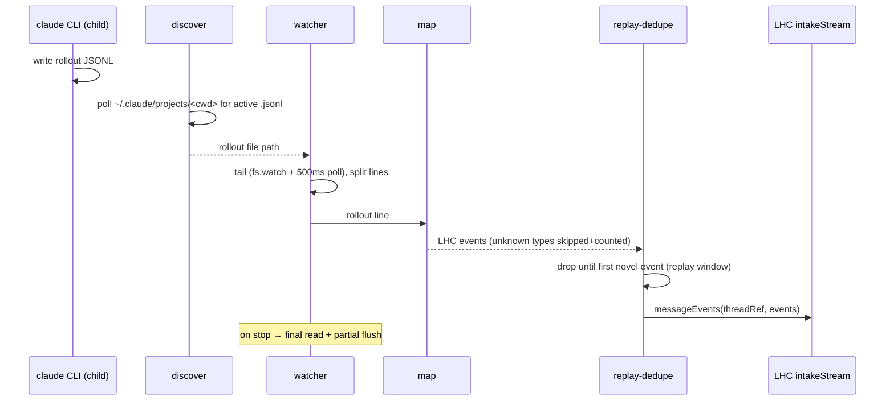

# Host: cc-lhc

Last verified against code: 2026-07-07. Precedence when facts disagree: code, then README, then [03-decisions-brief](03-decisions-brief.md), then this doc; see also the [decision registry](../decision-registry.md).

This document describes the `cc-lhc` host as it is, including its known warts. It is still POC-grade — less shaped than the core SDK, with a list of cosmetic and edge-case issues carried openly in [packages/cc-lhc/README.md](../../packages/cc-lhc/README.md) and folded in below. The wrapper exists to prove a second host pattern (item 9 in [docs/fixes-feature-log.md](../fixes-feature-log.md)); the Codex wrapper (item 10) is meant to reuse this shape behind a seam.

It builds on the vocabulary in [01-core-concepts.md](01-core-concepts.md) and the domain surfaces in [02-domain-design.md](02-domain-design.md). LHC terms — record, derivation, thread view, bands, compact point, visibility boundary, prune, intake stream, turn, chunk — are used exactly as defined there.

## What cc-lhc is

`cc-lhc` is a **PTY wrapper around the closed `claude` CLI**. Claude Code has no extension API rich enough to host LHC the way PI does — hooks are limited and disabled in some environments — so cc-lhc takes the outside position instead: it owns the `claude` process, passes the terminal through transparently, and reaches LHC by two side channels. It **watches** the rollout JSONL file Claude Code writes and feeds those records into an LHC thread (capture), and it offers a **leader-key command modal** — ctrl-] opens a wrapper-owned prompt for the LHC commands (control). Everything else — keystrokes, output, exit code — passes through untouched, so from the user's seat it is Claude Code.

Because the wrapper cannot inject context back into a running `claude` session, its compact/prune story is different from pi-lhc's in-memory seeding: it **rebuilds a fresh rollout file** from the thread view and injects `/resume <newSessionId>` into the running child, which hot-swaps the session in-place (see below). The harness-specific bits — rollout format mapping and resume mechanics — are the seam a future Codex wrapper adapts.

## The wrapper

`bin.ts` strips two cc-lhc-only flags (`--no-capture`, `--no-inference`; the latter also honors `CC_LHC_NO_INFERENCE=1`) and passes all remaining argv verbatim to the child. `wrapper/run.ts` spawns the CLI under a PTY via `@lydell/node-pty` (`run.ts:85`), with cols/rows taken from the real stdout and `TERM=xterm-256color`. The child binary is `claude` on PATH, overridable with `CC_LHC_CLAUDE_BIN` (`shared/claude-bin.ts`).

Passthrough is raw and bidirectional: stdin is put in raw mode and forwarded to the PTY (through the modal state machine), PTY output is forwarded to stdout, and `SIGWINCH` resizes the PTY. `SIGINT`/`SIGTERM` are forwarded to the child. On child exit the wrapper propagates the exit code (`signal ? 128+signal : exitCode ?? 1`), stops capture, prints the final stats line, kills any live inference subprocesses, and restores the terminal (raw mode off, cursor shown) (`run.ts:175`). Stopping capture waits for the derivation queue to settle, capped at `DEFAULT_DRAIN_SETTLED_CAP_MS` (30 s, `intake/session.ts:41`) — so a session with heavy inference still draining can take a few seconds to exit, which reads as a pause rather than a hang. A `SIGUSR1` prints the current capture stats to stderr without stopping.

The wrapper spawns exactly one PTY for its lifetime — prune/compact swap the *session* inside the running child rather than replacing the child (see the resume flow below), so the data/exit handlers are registered once and never re-pointed.

## Output doctrine: the wrapper never writes into a UI it doesn't own

Claude Code owns the terminal during passthrough. A wrapper byte printed "at wherever the cursor is" types garbage into the user's half-written prompt (observed live: an async drain-not-settled message landed inside CC's input box mid-sentence and broke the box border). The legitimate output surfaces are exactly:

- **(a) the alt-screen panel** while the modal is open — the wrapper owns that screen;
- **(b) the thread record** — runtime notes render natively in rebuilt transcripts (swap receipts, drain-not-settled, swap collisions);
- **(c) the wrapper log** — `~/.cc-lhc/wrapper.log` (`wrapper/wrapper-log.ts`, append-only, no rotation): capture diagnostics, resume/lineage logs, SIGUSR1 stats snapshots, overflow notices, receipts of commands whose modal was detached. `status` appends a final line whenever warnings exist ("N warnings since launch — see <path>"), so nothing logged is silently lost;
- **(d) stderr after the child has exited** and the screen is back with the shell — the exit stats line.

Nothing else, no exceptions. `CC_LHC_INPUT_DEBUG` already writes to its own file.

## Input: passthrough and the leader-key modal

`wrapper/modal.ts` replaced the old `/lhc-*` interception state machine (2026-07-07). The old design estimated Claude Code's input-box state from the stdin byte stream (a shadow count) and repeatedly desynced — CC-side box fills, editing keys, and terminal noise all mutate state the wrapper does not own. The replacement makes ambiguity impossible by construction: a **modal** owns the input line, or claude does — never both.

**Passthrough (default).** Every stdin byte forwards to the pty untouched. No freshness tracking, no slash detection, no withholding. The only state kept is escape-sequence tracking (CSI, OSC/DCS-style strings, legacy mouse — the Warp lesson: control sequences must reach the child verbatim) and bracketed-paste tracking (CSI 200~/201~). Both exist for exactly one reason: the leader byte is recognized only as a real keypress — inside a paste or an in-flight terminal response it stays literal and forwards.

**Leader.** Default **ctrl-]** (0x1d), telnet's escape-to-control-channel precedent; probed live as a no-op in claude 2.1.202 with both an empty and a drafted input box. Ctrl-G was rejected because BEL (0x07) terminates OSC sequences — a BEL on stdin inside an OSC response is protocol, not a keypress. Override with `CC_LHC_LEADER` (single control byte: literal, caret notation, or hex; NUL/BEL/TAB/LF/CR/ctrl-C/ESC rejected). Recognition covers every encoding a terminal may deliver for the configured byte: the legacy raw byte, **kitty CSI-u** (`ESC[93;5u` — claude pushes kitty disambiguate mode, so iTerm2/Warp/Ghostty encode ctrl-] this way; press/repeat claimed, releases and non-ctrl-only chords forwarded), and **xterm modifyOtherKeys** (`ESC[27;5;93~`, what tmux extended-keys emits — observed live). To swallow an encoded leader whole, passthrough holds a bare ESC and any following numeric CSI prefix until the sequence classifies (forwarded intact the moment it is ruled out; a stalled hold flushes via the same ~50 ms timer). Control-byte↔keycode mapping: 0x01–0x1a ↔ byte+96, 0x1b–0x1f ↔ byte+64, ctrl modifier (field 5).

**Modal.** On leader, the wrapper switches to the terminal's ALTERNATE SCREEN (`?1049h`) and draws a centered panel (`wrapper/panel.ts`): a `long-horizon commands> ` prompt line, receipt/notice rows above it, and a dim key-hint line (`Enter run · Esc close · ctrl-C detach`). The panel is a full positioned redraw after every input chunk and on resize — no TUI framework. Sharing Claude Code's canvas is over: in-place rows used to wedge below CC's input box and scroll its layout; the alt screen means the two buffers cannot fight (CC never emits alt-screen switches itself — probed — and its output is held while modal). Any dismissal leaves the alt screen (`?1049l` — the terminal restores CC's screen exactly, cursor re-shown) and THEN flushes the held output, so main-screen ordering is intact. An alt-screen guard (flag-tracked, idempotent) backs every process-level path too: the process-exit hook (crashes/uncaught exceptions), SIGINT/SIGTERM/SIGHUP (restore first, then forward to the child), and stdin end/close/error all restore-if-modal, and no path can double-leave. stdin drives our line editor while modal (ASCII-only — non-ASCII bytes ignored; backspace, ctrl-U kill, Enter executes, Esc/ctrl-C/leader-again dismisses in one keypress). Kitty CSI-u Enter/Esc/Backspace are handled (claude pushes kitty disambiguate mode); navigation keys and mouse reports are dropped while modal; other CSI/OSC/DCS sequences forward to the pty as presumed protocol traffic. pty OUTPUT is held throughout (`wrapper/output-hold.ts`, 4 MB cap — on overflow the modal cancels with a one-line notice and everything flushes; claude keeps running, its bytes are delayed, never dropped). `help`/`?` lists commands; an unknown command shows the help rows and stays modal. Commands are the `/lhc-` names minus the prefix: `status`, `stats`, `prune [targetTokens]`, `compact`.

A pending ESC deliberately **survives chunk boundaries** — whether it was a bare Esc keypress or the head of a split escape sequence is decided by the next byte, so a sequence split after its ESC is never misread (and the leader is suppressed for that one chunk — leader-again recovers). A truly bare Esc while modal is resolved by a ~50 ms timer in run.ts (`resolveBareEsc`); kitty terminals never send a bare ESC, so the timer only matters on legacy input. While a command is EXECUTING, input is dropped except **ctrl-C, which detaches**: the modal UI tears down and output resumes while the command keeps running (the single-flight guard still serializes); its receipt goes to the wrapper log on completion (doctrine — the child owns the live screen again) — the escape hatch for a hung command.

**Receipts.** A settled command puts its receipt lines into the panel above a fresh prompt, screen still held. The panel owns the alternate screen, so receipts are immune to the main-screen TUI's repaints by construction (raw prints are overwritten within a frame while a turn streams — rig-verified back when the modal shared the canvas). One keypress dismisses: leave the alt screen, then flush. **Exception — a CONFIRMED swap auto-dismisses**: compact/prune that end in a confirmed swap close the panel the instant the swap confirms (guarded leave, flush) and the user watches the resumed session repaint; the swap receipt renders natively in the transcript, so success needs no panel receipt. Refusals, errors, no-ops, and status/stats keep the stay-until-dismissed rhythm — on failure there is nothing behind the panel worth watching.

A single-flight `CommandInFlightGuard` prevents overlapping command dispatches (`wrapper/command-guard.ts`); input typed while a command is executing is dropped.

## Turn gate on mutating commands

`prune` and `compact` refuse with `turn in progress — rerun when idle` while a claude turn is open; `status`/`stats` stay instant. Turn state is a **fold over the rollout tail the wrapper already parses** (`intake/turn-signal.ts`, folded in `intake/session.ts` — not a parallel tracker). Assistant lines classify **content first, `stop_reason` as refinement** — 2.1.202 stamps `stop_reason` on every assistant line, but 2.1.201 writes none at all (see `test/fixtures/rollout-samples.jsonl`), and a stop_reason-only fold would stick open forever there: user prompt and tool_result lines open a turn; an assistant line containing tool_use blocks opens regardless of `stop_reason`; otherwise `stop_reason` other than `tool_use` closes (`end_turn`, and `stop_sequence` on synthetic/error lines), and with no `stop_reason` a text-bearing assistant line closes while thinking-only lines stay neutral; interrupt markers (`[Request interrupted…]`) close; meta lines, runtime notes, and sidechain lines are neutral. Replayed-prefix lines after a swap are excluded — they are served history, not live state. The fold lags the file by at most one watcher poll; two backstops cover the race:

1. **Last-instant recheck** — immediately before injecting `/resume`, the turn state is rechecked; if a turn opened during the rebuild (claude has async wakes: monitors, background tasks) the swap aborts cleanly: nothing is injected and the live session is untouched. The receipt states the partial truth: the thread view was already compacted/pruned (a view mutation without a swap is valid — the next successful swap serves it) and the rebuilt file may remain on disk unused.
2. **Silent collision log** — after a successful swap, the OLD session file is compared against its size at rebuild time; growth means a background turn raced the swap. Its content reached the thread record via the old capture's final-flush stop but is absent from the rebuilt live context, so a `runtime_note` is written into the thread record (queryable later, and re-served into rebuilt contexts — unlike an ephemeral debug line). Nothing prints to the user.

## Capture

Capture runs in the wrapper process against the rollout JSONL file Claude Code writes under `~/.claude/projects/<encoded-cwd>/`. `rollout/discover.ts` polls that directory (250 ms) for a `.jsonl` file created or modified after the wrapper started, picking the newest. `rollout/watcher.ts` then tails it with both `fs.watch` and a 500 ms interval poll, tracking a byte offset, splitting on newlines, and holding a trailing partial line until it completes. On `stop()` it does one **final read and partial flush**, so a last line written without a trailing newline is still captured (`watcher.ts:128`). A partial that grows past 10 MB is dropped with a logged `parse_error`.

`intake/map.ts` maps each rollout line into LHC intake vocabulary (`HARNESS = "cc"`). The mapper is deliberately **tolerant of records it does not understand**: sidechain lines, `summary`/`file-history-snapshot` types, and meta command-wrapper lines are **skipped and counted** rather than erroring (the `summary`/`snapshot` skips fall into a general `unknown` tally, not per-type counters), and anything that produces no events (unknown role, empty message) increments the `unknown` counter and returns nothing — the mapper never throws on an unrecognized shape (`map.ts:190`). Images are the exception to skipping: an image-bearing user message is still captured as a `user_prompt`, with an `[image content not captured]` placeholder appended to its text and the image counted separately. The pixels drop; the turn does not — consistent with the record's "nothing silently omitted" rule. Background-task notifications — user messages whose text starts with `<task-notification>` — are captured as `runtime_note` rather than `user_prompt`: they stay in the record and in rebuilt rollouts (the assistant's next turn responds to them), but they skip prompt smoothing and stay out of the user lane. Rebuilt rollouts re-serve runtime notes with a `[runtime note]` label, which the mapper also recognizes so the classification survives a re-tail. What it does map fans out an assistant record in order thinking → text → tool_use, mirroring the LHC event kinds. Idempotency keys are `cc-lhc:rollout:<uuid>:<blockIndex>:<kind>`, with a synthetic uuid when a line carries none.

**Session lineage** lives in a SQLite DB (`intake/lineage-db.ts`), whose `cc_session_lineage` table maps `rollout_session_id → thread_id` and whose `cc_thread_signatures` table stores per-thread content signatures. On startup, `resolveCaptureThread` looks up a thread by the current rollout session id, then by a `--resume` session id, then by `--continue`'s newest session (`lineage-db.ts:362`) — so **`--resume` follows lineage** and continues the same LHC thread across Claude Code restarts. If nothing matches, a new thread is created.

Continuing a thread means re-tailing a rollout that already contains records LHC has seen. `intake/replay-dedupe.ts` handles this with a **replay window**: while the window is active, each event's content signature (sha256 of kind + normalized payload) is checked against the thread's stored signatures and skipped if seen. The **first novel event closes the window** (`replay-dedupe.ts:62`) — after that, everything is sent even if a later signature happens to repeat, so genuine duplicate content later in the session is never silently dropped. Signatures are capped at the newest 500 per thread.



## Inference lane

Derivation inference runs through a `claude -p` **subprocess provider** (`inference/claude-cli.ts`). Each call spawns `claude -p --model <model> --system-prompt <sys>` with the derivation input on stdin and the completion on stdout. All four inference-backed derivation kinds are assigned **`model:"sonnet"`, `thinking:"none"`** (`inference/assignments.ts:15`) — a Sonnet-5-no-thinking baseline. The ruling behind it (2026-07-04) is that Haiku returned empty output and meta-commentary refusals on smoothing, so Sonnet-no-thinking is the safe baseline across every kind. (`"sonnet"` is a CLI alias; the concrete model is resolved inside the `claude` CLI.) The two compression lanes carry ratio steering (detailed 0.35–0.65, brief 0.08–0.2).

Process hygiene is the real risk here, not contamination — the system-prompt replacement flag suppresses most of Claude Code's own prompt. A `ConcurrencyLimiter` caps concurrent subprocesses at **3** (overridable via `CC_LHC_INFERENCE_CONCURRENCY`), with a semaphore queue; a call that can't get a slot before its timeout returns a `timeout` failure. Every child is tracked in a module-level `liveChildren` set and `killAllInferenceChildren()` SIGKILLs them all on teardown. `EPIPE` from a child that exited early is swallowed rather than surfaced, and timeouts SIGKILL the child. Stderr is classified into `auth` / `rate_limit` / `other`, and a missing binary reports `claude binary not found`.

`--no-inference` (or `CC_LHC_NO_INFERENCE=1`) switches the SDK to **manual mode** with deterministic callbacks — capture keeps running, but no model calls are made and drain-settled is skipped.

## Commands

Dispatched from `commands/dispatch.ts` (the modal maps `status` → `/lhc-status` etc., so the dispatch table survives). Receipt lines are prefixed `[cc-lhc] `. When capture is disabled the commands report `capture disabled`.

| Command | What it does |
| --- | --- |
| `status` | Show `threadView.status`: tail tokens vs threshold, zone, and derivation pending/failed counts. |
| `stats` | Print the one-line capture stats (lines seen, events sent, skip tallies). |
| `prune [targetTokens]` | Advance the visibility boundary via `threadView.prune`; if it changes anything, rebuild + in-app resume (below). A no-op prune does not resume. Refused while a turn is open. |
| `compact` | `previewCompact` then `compact`; on success, rebuild + in-app resume. Refused while a turn is open. |
| `help` / `?` | List the commands (handled in the modal). |

## Prune/compact resume flow

Because the wrapper cannot push new context into the running `claude` process, prune and compact take effect by **swapping to a rebuilt session in-place**. The sequence:

1. Run the LHC op (`prune` or `compact`) against the thread, mutating the stored view.
2. Read the resulting `getSessionThreadView` and **rebuild a rollout file** (`rollout/rebuild.ts`, `rollout/write-rebuilt.ts`). A fresh `randomUUID()` session id is minted, the envelope is reconstructed from the original rollout, view entries are mapped to new user/assistant JSONL lines with a rebuilt parent chain, and the **swap receipt is appended as a trailing `[runtime note]` user line** — Claude Code renders it natively in the transcript on resume, so no raw receipt write can corrupt the TUI. The file is written **fsync'd to a new path** `<projects>/<cwd>/<newSessionId>.jsonl`. **The original rollout is never modified.**
3. Append an entry to `sessions-index.json` (backed up once to `.bak`, then written atomically via temp-file rename) so Claude Code lists the rebuilt session. If the index exists but is unreadable, the op throws and does not touch it.
4. **Recheck turn state at the last instant** — if a turn opened while the rebuild ran, abort before touching the pty (original session untouched, refuse receipt, rebuilt file left unused). Otherwise **inject `/resume <newSessionId>\r` into the pty** (`wrapper/resume-injection.ts`). Claude Code hot-swaps the session in-place in ~1-2 s — no child kill, no TUI teardown. The child keeps the resumed session id and appends new turns to the rebuilt rollout file.
5. Decide the outcome with two layers. The fast layer watches the forwarded pty output for ~3 s for this swap's failure line, `Session <newSessionId> was not found` — scoped to the freshly minted id so replayed conversation text can never trip it, and matched whitespace-insensitively after stateful ANSI stripping because the TUI renders the line's word gaps as cursor-column jumps (`was\x1b[55Gnot\x1b[59Gfound.`), not spaces. The ground truth is the rebuilt rollout file itself: a successful swap touches and appends to it within ~1-2 s, so growth (size/mtime since injection) decides — a trip without growth is failure, a trip with growth self-heals to success, and a quiet window without growth polls a few seconds longer before ruling failure. **Success** → inject a single ctrl-L (`0x0c`) into the pty — Claude Code answers with a full TUI repaint that wipes the raw `[cc-lhc]` lines printed before injection (verified on 2.1.202; box content survives) — record the new-session→thread lineage (only now, so a failed resume leaves no stale row; the handoff capture re-records it on attach as the crash backstop), stop the old capture, and start a new one that tails the rebuilt rollout path directly (no discovery), carrying the stats and thread forward. The first `replayedPrefixLines` lines it tails are the replayed prefix — hard-skipped from intake (the thread already holds the real history; rebuilt lines are lossy renders that signature dedupe cannot match) and tallied per line under `replayed_prefix`, kept out of `linesSeen` and the mapper skip counters. The trailing swap-receipt note is deliberately **outside** that prefix: it is new history, so it maps into the record as `runtime_note` and later rebuilds re-serve it. Claude Code also appends a synthetic zero-usage assistant line (`"No response requested."`, model `<synthetic>`) when it resumes a session ending on a user line — the mapper skips it as meta so it never enters the record. No raw success receipt is printed. After the old capture stops (its final flush captures any raced lines), the OLD rollout's size is compared to the rebuild cutoff — growth means a background turn raced the swap, and a silent `runtime_note` records the collision in the thread. **Failure** → report it with the manual `/resume <newSessionId>` command as a raw print and change nothing else — the original session is still live and the old capture keeps running.

**Failure is safe by construction.** If the rebuild throws, the current session is left running unchanged and no resume is attempted (the command reports as much). If the injected resume does not take, the original session is untouched — the worst case is running the printed `/resume` command by hand, never a lost thread. A bare `/resume` is never injected (it opens an interactive picker).

```mermaid
sequenceDiagram
  participant U as user
  participant Cmd as cc-lhc command
  participant V as LHC thread-view
  participant Rb as rebuild + sessions-index
  participant CC as claude CLI (child)
  U->>Cmd: ctrl-] compact (or prune)
  Cmd->>V: compact / prune
  V-->>Cmd: session thread view
  Cmd->>Rb: write NEW rollout <newId>.jsonl (fsync); append index
  Note over Rb: original rollout untouched
  Cmd->>Cmd: record lineage newId→thread
  Cmd->>CC: inject "/resume <newId>\r" into pty
  CC->>CC: hot-swap session in-place (~1-2s)
  Cmd->>Cmd: watch output ~3s for "Session <newId> was not found"
  Cmd->>Cmd: confirm swap via rebuilt-rollout growth (ground truth)
  Cmd->>Cmd: swapped → record lineage, swap capture to rebuilt rollout (stats carried, prefix → replayed_prefix)
  Note over Cmd: rebuild throw → old session runs on; no swap evidence → report manual /resume, change nothing
```

## State layout

cc-lhc owns its complete state under `~/.cc-lhc` (override `CC_LHC_HOME`), fully isolated from pi-lhc's `~/.pi-lhc` (`intake/paths.ts`):

| Path | Purpose |
| --- | --- |
| `registry.sqlite` | LHC thread registry for cc-lhc threads |
| `cc-lhc.sqlite` | Session lineage (`rollout_session_id → thread_id`) and replay-dedupe signatures |
| `threads/<uuid>.sqlite` | Per-thread LHC databases |

Nothing cc-related is written under `~/.pi-lhc` (or the legacy `~/.lhc`). The rebuilt rollout files it writes live where Claude Code expects them, under `~/.claude/projects/`.

## Known warts (POC)

Most are carried from the package README; a couple are additional edges found while verifying against code. All verified against code:

- **Exit is janky** — on child exit the Claude Code intro/alt-screen content is re-emitted into scrollback several times (~7× observed). Cosmetic; likely output-flush-after-restore ordering in `run.ts` `onExit`.
- **ASCII-only modal editor** — the modal line editor ignores non-ASCII bytes and drops arrow keys; commands are ASCII so this costs nothing, but pasted unicode into the modal disappears silently.
- **Wrapper log is append-only** — `~/.cc-lhc/wrapper.log` has no rotation; a long-lived install grows it unbounded (POC-honest; delete it freely).
- **`--continue` reattach gap** — lineage lookup for `--continue` matches the newest session against the newest lineage entry, which is best-effort, not exact.
- **Rebuild is lossy** — rebuilt rollout lines are text-only: `model_change` / `thinking_level_change` view entries are dropped and tool results become plain user text lines.
- **Index fragility** — an orphan rollout file can remain if the `sessions-index.json` update fails afterward (harmless; index unchanged), and the `.bak` is a single slot holding only the pre-write snapshot.
