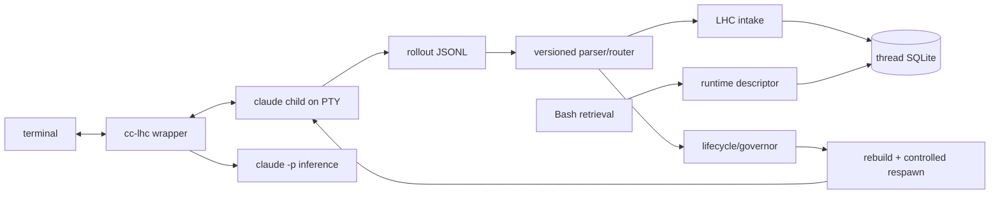

# Host: cc-lhc

Last verified against code and production certification: 2026-08-10, Claude
Code 2.1.226. Precedence when facts disagree: code, retained certification
evidence, package README, then this document.

This document builds on the vocabulary in [01-core-concepts.md](01-core-concepts.md)
and [02-domain-design.md](02-domain-design.md). Record, event, derivation, view,
band, compact point, visibility boundary, impression, and retrieval keep their
SDK meanings here.

## Host position

`cc-lhc` integrates LHC from outside the closed `claude` CLI. The wrapper owns
Claude under a PTY, preserves normal terminal behavior, observes Claude's
rollout JSONL, and gives the SDK the host services it cannot own: capture,
model calls, lifecycle, context mutation, and model-callable retrieval.

The durable boundary is the rollout stream, not terminal scraping. A versioned
parser/router turns rollout entries into typed conversation and lifecycle
events. Capture and runtime management consume separate projections of that
stream. PTY observation is used only for transport, the control panel,
non-semantic replacement-child liveness, and advisory lifecycle-command
warnings.

Claude Code hooks are not required. In environments where hooks are disabled,
the full certified path remains available.

## Architecture



The wrapper has four main lanes:

1. **Capture:** bind to the exact Claude session rollout, parse it, and append
   recognized conversation events to one LHC thread.
2. **Inference:** run derivation callbacks through isolated `claude -p`
   subprocesses with session persistence disabled.
3. **Retrieval:** expose stable `tN`/`mN` retrieval through ordinary Bash tool
   calls, bound by an inherited per-wrapper capability descriptor.
4. **Context lifecycle (capability-limited):** use provider-reported usage
   (input + cache creation + cache read), a source-labelled post-measurement
   estimate for content captured after the last provider request, and rollout
   turn boundaries to classify pressure. An interactive session mutates at a
   Claude-safe settled seam: compact/prune, rebuild a rollout, and replace the
   Claude child via spawn-first controlled handoff without changing the LHC
   thread. A one-shot seat mutates at invocation start instead, before any
   Claude process exists. Open-turn threshold crossings are classified and
   durably receipted but not mutated mid-turn. This host does not perform
   Codex-style in-place mid-agentic-turn request replacement, tool-tail
   preservation, or continuation markers.

## Capture and canonical attribution

The wrapper binds capture to a known Claude session ID and exact rollout path;
it does not select the newest file in the cwd. One LHC thread accumulates many
native Claude session IDs over its life, so the exclusive owner lease is keyed
by the **thread**, not by a session: every alias of one thread contends for one
lease. The lease is backed by OS-verifiable process identity and refuses a
second live wrapper before it can tail or spawn. PID reuse does not make a
stale owner look live.

At launch the wrapper resolves the host-qualified alias (`claude-code:<uuid>`)
through the LHC registry's alias map to a thread ID, takes that thread's lease,
then re-reads the thread's current alias **under the lease** and lands on that
session. The pre-lease lookup authorizes the lock key only — the current
pointer can advance in between. A launch through an older alias therefore
self-corrects onto the thread's current session instead of failing. On the
first registry miss, the pre-registry `cc-lhc.sqlite` lineage is imported
one way; after that the registry is authoritative and cc-lhc storage keeps
only host-local detail (rollout paths, prefix proof, prompt-intake evidence,
recovery detail). A rebuilt session reserved by a swap that never completed
never advanced the pointer, so a later launch discards it from session
selection — the file is left untouched — and continues on the current
session.

A swap the wrapper observed accepted (a live replacement, routed) but whose
registry pointer could not be written is recorded host-side
instead, together with the registry current observed at that moment. The next
launch reconciles that record into the registry under the thread lock, against
the pointer read under that same lock and before any session is chosen, so the
accepted replacement is never mistaken for an unaccepted artifact.

A record may repair only the exact predecessor state it observed. One wrapper
keeps its thread lease across every handoff it performs, so a later acceptance
can succeed with no launch in between and leave the earlier record behind;
matching the predecessor is what stops that stale record from dragging the
pointer back off the newer session. A successful acceptance also supersedes
older pending detail, but reconciliation stays correct without that cleanup.
Anything the record cannot repair — a pointer that moved on, or a pre-amendment
row with no observed predecessor — is settled without touching the pointer.

The registry stays the authority: a refusal saying that session belongs to
another thread settles the record rather than overriding the pointer. If the
registry merely cannot be written, the launch says so and lands on the accepted
replacement anyway — it is the live, captured session — and retries at the next
launch. None of this can stop a launch, and a failure after the thread lease is
taken releases it rather than stranding the thread.

The rollout parser maps recognized user, assistant, thinking, tool, result,
runtime, model-change, and turn-boundary records. Harmless top-level host
metadata is skipped and counted as telemetry. Unknowns are not failures merely
because they are unknown: capture becomes degraded only for a classified
integrity failure that threatens canonical content, attribution, continuity,
or isolation. Parser drift is visible and covered by real-rollout fixtures.

Assistant identity is stored from the response record. Thinking signatures are
opaque. Empty-and-unsigned thinking is
omitted from serving; empty-but-signed thinking is preserved. A rebuilt rollout
would replay signed thinking only when stored identity exactly matched the live
request identity. The wrapper cannot observe Claude's prepared request, so the
certified rebuild arm currently omits thinking blocks rather than guessing from
mutable session state.

Capture moves to the replacement at the routing switch; the outgoing
generation's final read and drain are fired and forgotten, because the old
rollout is never deleted and a hanging drain must never reach a live
replacement. Replay-prefix lines in rebuilt sessions are excluded positionally from intake:
they are a served projection of history already in the record, not new events.
The first live pair after the prefix resumes canonical capture on the same
thread.

## Retrieval

Claude invokes retrieval through its native Bash tool:

```text
cc-lhc get-turns [--from TOKENS] <tN>...
cc-lhc get-messages [--from TOKENS] <mN>...
```

Before Claude starts, the wrapper exports `CC_LHC_RUNTIME_DESCRIPTOR`, a path
to a private mutable descriptor. The descriptor progresses through explicit
opening, ready, degraded, and closed states and carries the exact wrapper
incarnation, process identity, Claude session, rollout path, registry, and LHC
thread binding. Every command reads it afresh.

Retrieval validates descriptor structure and ownership, process identity,
rollout basename/session binding, and—when Claude supplies it—the live
`CLAUDE_CODE_SESSION_ID`. It reserves the complete XML envelope and message-tag
bytes before passing the remaining byte budget to the SDK. A mismatch or stale
descriptor refuses atomically before archive access or impression writes.
Successful calls return historical records inside an explicit
`<recalled-history>` trust envelope, plus slicing/continuation receipts, and
write durable retrieval impressions.

The descriptor is revoked before a handoff generation dies. Failure to publish
the new ready descriptor leaves retrieval unavailable for that generation; it
does not guess a thread from cwd, recency, or global state.

## Inference lane

Inference callbacks spawn `claude -p` with bounded concurrency and timeout.
Every call passes `--no-session-persistence`, certified on Claude 2.1.226, so
inference subprocesses cannot create project rollouts that capture might
mistake for user sessions. Each child is tracked and terminated during wrapper
shutdown. `--lhc-no-inference` or `CC_LHC_NO_INFERENCE=1` disables model-backed
derivation while preserving capture. There is no capture-disabled or
observe-only wrapper mode: unmanaged passthrough is plain `claude`.

## Context policy and governor (capability-limited)

Policy precedence is builtin → user → project → launch/session. User config is
`$XDG_CONFIG_HOME/cc-lhc/config.json` (falling back to
`~/.config/cc-lhc/config.json`); project config is `.cc-lhc.json`.

Bad configuration is reported, never obeyed as an off switch. Unknown fields,
malformed values, unreadable files, and incoherent bounds fall back to the
built-in default for the fields involved, and automatic compact stays armed.
The notice — "Invalid compact configuration. Default configuration used. Please
fix or update the configuration." — surfaces at startup, in the wrapper log, in
the control panel, and in the compact message written to the rebuilt session.
Current code built-ins (see `packages/cc-lhc/src/governor/config.ts`) are:

| Setting | Default |
| --- | ---: |
| automatic compact | on |
| compact target (lower) | 180,000 tokens (LHC rendered-history domain) |
| trigger (upper) | 360,000 tokens (provider-reported input domain) |
| minimum runway | 50,000 tokens |
| LHC profile | `continuation` |
| automatic prune | off |
| native auto-compact | disabled per managed child (`DISABLE_AUTO_COMPACT=1`) |
| host capability | `capability_limited` (not Codex full state machine) |

Provider-reported input usage is authoritative: **input + cache creation +
cache read**. Predicted next-request pressure adds a **source-labelled**
estimate for content captured after that provider request; the estimate is never
relabelled as provider usage. When the latest usage line is missing or
malformed, the base is the last known provider reading — still a provider
number, marked `last_known` in the receipt — plus the growth measured on top of
it. The session's real size never disappears with a bad line.

Two inputs decide an automatic compact: the user's `autoCompact` policy and
measured pressure. Everything else the wrapper knows — capture health,
descriptor readiness, receipt storage, typed-ahead input — is diagnostics with
no blocking authority. Threshold crossing during an **open** agentic turn is
classified and written as a durable receipt with `wouldMutate=false` — Claude
Code has no mid-turn request-replacement seam. Automatic compact/handoff runs
only at a confirmed **settled** boundary. A native compact summary is reported loudly and
captured as one bounded closed turn; nothing latches and nothing stands down.

Capture that is degraded or still catching up is reconciled, not obeyed: the
wrapper rebuilds capture state from the persisted transcript (intake events
carry content-stable idempotency keys, so re-reading it records only what was
missed) and re-evaluates the skipped seam the moment capture reports ready. No
timer, no latch.

Durable governor receipts live in `cc-lhc.sqlite` (`cc_governor_receipts`),
tied to settle/usage/capture generation and optional handoff outcome. They
survive wrapper restart and are inspectable independently of `wrapper.log`.
Receipts are write-behind: when the store is unavailable the compact runs
against an in-memory receipt id with a loud warning rather than not running.

The control panel's `auto` and `bounds` edits apply only to the current wrapper
lifetime. `auto off` and an explicit `autoCompact: false` in config are the only
things that stop automatic compact.

**What this host cannot do (v1, by design):** Codex-style in-place mid-agentic-
turn continuation, synthetic tool-tail preservation, forced
`context_compact_continue` boundaries, or any claim of same-agentic-turn
parity with the full compact-continuation state machine.

## Compact/prune transaction

Manual and automatic context changes share one forward-only mutation and
handoff path.

The initial prompt a launch carries belongs to that launch. A wrapper-owned
replacement child inherits the launch's options and continues the conversation;
it never inherits the prompt, so the prompt cannot execute twice. Options whose
value boundary the argv does not establish — optional-value, variadic and
unknown options in their space form — are left out of the replacement and named
in the wrapper log; their `=value` form carries through. No launch form disables
compaction.

**Construction: one snapshot, then run to completion.** The settled seam is read
once — a bound thread, a closed turn, capture caught up — before any SDK work.
Nothing re-reads it. Input arriving, a turn opening, capture changing
generation: all of them append to a thread whose settled history the snapshot
already captured, so none of them can cancel construction. The rebuilt rollout
is written under bounded retries, each attempt re-reading the installed view; if
every attempt fails, the installed view stays and the next settled seam
re-materializes from it.

**Input ownership.** From the moment compact claims the settled session until
the whole operation settles, bytes bound for Claude are dropped rather than
delivered — never buffered, never journalled, never replayed. One line says so:
*input typed during compaction was not delivered — please resend.* Input that
started before ownership is not typed-ahead at all; it opens a normal turn and
compact re-evaluates at that turn's settle.

**Live asynchronous work is named before it is killed.** A swap replaces the
Claude child, and everything that child was still running asynchronously dies
with it: background agents, workflows, background shell commands, monitors, and
a pending `ScheduleWakeup` (Claude reconstructs `CronCreate` tasks from the
transcript on resume, but not wakeups). The wrapper derives that open set from
the same ordered rollout capture already reads. A launch acknowledgement opens
one item, and it is read as an acknowledgement only for the launcher that was
actually called — a familiar-looking result from any other tool opens nothing.
Only matching terminal evidence closes an item: a `completed`, `failed`,
`killed`, or `stopped` task notification, or a `TaskStop` result naming that
task. Monitor events and stall notices are progress; they refresh what is shown
and close nothing. Nothing closes on elapsed time either — a wakeup past its
moment stays open until a later `ScheduleWakeup` supersedes it or `stop: true`
cancels it, because the clock is not evidence about whether it ran. The set is
derived wrapper state with no side store, rebuilt by re-reading the rollout on
resume catch-up.

At an otherwise-eligible automatic seam with an operator at the terminal and
work still open, the panel names what the swap would cost and asks. This is a
present-user authority choice, not a gate, and the question comes before the
record: nothing durable is written until the operator authorizes it. Only an
explicit **y** proceeds, into the ordinary receipt-and-schedule path exactly
once — and only if the session still looks the way it did when the question
was asked. The session keeps running behind the panel, so consent is checked
against the world at the keypress: a turn that opened meanwhile, a seam that
stopped being eligible, or work that *started* meanwhile and was never on the
list all skip the seam as if the operator had declined. Work that *finished*
meanwhile does not — killing fewer than listed is what was agreed to.
Comparison is by stable item identity, never by the progress text an item
happens to be showing. The governor decision is recomputed too: a turn that
settled behind the panel with a smaller provider reading can leave the session
under the trigger, and then there is nothing to compact. When it still
authorizes one, that fresh observation — not the one that raised the question
— is what the receipt and the operation describe. Every other outcome — a decline, a dismissal, a stray key, a closed
terminal, a prompt that could not be drawn or was interrupted — skips that one
seam, leaves no receipt, no outcome, and no preference behind, and the next
eligible seam asks again while the work is still open. An empty set, a
noninteractive launch, and a one-shot launch all take the ordinary path
unchanged.

**Swap: spawn first.** A working session exists at every moment.

1. Spawn `claude --resume <rebuilt-session-id>` **off-route**: a real child that
   owns no terminal, no stdin, and no capture generation. Its render is held.
2. Establish observable viability while the old child is still live and
   untouched: the candidate emitted PTY output and survived a stabilization
   window. Session-file growth is recorded as corroborating evidence and is
   never required — a healthy resumed child may render its history without
   appending a byte. Prompt intake is not consulted; that is the one-shot
   pointer rule, not an interactive viability rule.
3. **Switch** input routing, output routing, the retrieval descriptor, and the
   capture generation in one step. Every later byte from the old child is
   dropped on the floor.
4. Record what already happened: canonical lineage and the current-session
   pointer, then a best-effort kill of the old child — a survivor is left
   running and named loudly by PID — then capture health, then the ready
   descriptor. None of these can undo the swap.

Spawn failure or a candidate that dies or stays mute is discovered at zero cost
and retried. There is no rollback anywhere: the oversized session is never
restored, because a swap either happens or never starts.

**When replacements repeatedly will not run.** Each nonviable swap costs the
session nothing and is retried at the next settled seam. After a bounded number
of them the retrying stops being free to keep doing, so two things happen
instead, and both persist. A standing alarm goes up: *cc-lhc rebuilt sessions
are not loading — likely a compatibility problem with the installed Claude
version.* That is explicitly a best guess inferred from observable viability,
not proof that Claude rejected the file; cc-lhc never parses the terminal to
find out. And R16's survival relaunch runs then and there: the old session is
relaunched **without** the injected `DISABLE_AUTO_COMPACT`, so Claude's own
compaction keeps it alive in degraded form.

Nothing about this ends the session. The old session stays live and captured,
retrieval keeps working, and manual compact still runs; what stops is the
automatic child swap, which would otherwise fail the same way on every seam.

Receipts are durable runtime records and distinguish provider trigger context
from rebuilt served-context size. They are write-behind throughout: no receipt,
stage, lineage, pointer, or descriptor write can veto or undo a compact.
Old-generation drain warnings after a successful handoff describe that
generation's bounded shutdown; current derivation status is evaluated on the
continuing thread.

## One-shot seats compact before they launch

A one-shot seat — `cc-lhc --resume <id> -p <prompt>`, the shape durable agents
run turn by turn — is one prompt and an exit. `-p` and `--print` name that seat
in every form the installed parser takes, including `--print=<v>` and `-p=<v>`;
the flag itself is zero-arity, so the prompt is the positional token, and no
form of the flag is ever inherited by a replacement child. It has no settled seam of its own
to compact at and no child worth swapping, so its compaction seam is the start
of the next invocation, before any Claude process exists.

At invocation start the wrapper takes the thread lease, then reads its own
pressure: the last authoritative provider count recovered from the persisted
transcript, plus a source-labelled estimate of the prompt it is about to send.
Catching LHC up from that transcript is how a stale capture recovers — intake
events carry content-stable idempotency keys, so re-reading the file records
only what a previous invocation missed. A missing or unreadable count falls back
to the last known reading plus growth, exactly as the live path does. Catch-up
is bounded so an operator's prompt still starts.

Compacting needs a snapshot of settled history LHC actually holds, so the seam
reports what capture is rather than asserting what it needs. Capture that has
not reached ready inside the bound, and a transcript whose last turn a previous
invocation left unfinished, are both unusable snapshots: the invocation launches
anyway, on the session it resumed, with capture left bound and still catching up
behind the running prompt. The next invocation compacts once that history has
settled. Reaching the bound costs the invocation its pre-launch compact, never
its launch.

Over the trigger, the wrapper compacts and writes the rebuilt session first,
then launches Claude **once**, resuming the rebuilt session with the original
prompt. The rebuilt session's capture generation is constructed before the
outgoing one is stopped, so a capture that will not start leaves the resumed
session bound, captured and current, and the prompt runs there instead. Nothing
was running while any of that happened, so there is nothing to interrupt and no
way for the prompt to execute twice. Under the trigger the
invocation simply launches on the session it resumed.

The thread's current-session pointer advances only once the rebuilt session is
observed accepting the prompt — a user prompt in the rebuilt rollout's live
suffix, which replayed prefix lines cannot produce. One observed intake means
one acceptance, and the wrapper settles it before handing the thread lease back:
a prompt taken during the final drain still reaches the registry, or the
host-side acceptance record the next launch reconciles, while this wrapper is
still the thread's owner. A launch that fails before that leaves the old session
current, so the next invocation lands there and discards the rebuilt artifact.
The prompt is never resent automatically; that call is the operator's.

A turn that grows past the trigger while it runs finishes and exits; the next
invocation compacts it. The trigger sits far below the hard context window, and
that runway is accepted.

## Restart in the middle of a swap

Restart completes forward. A replacement the wrapper accepted is kept — the
registry pointer, or the host-side acceptance record reconciled under the thread
lock, names it, and a later launch through any older alias lands on it. A
rebuilt rollout reserved by a swap that never completed is never activated: it
is discarded from session selection, left untouched on disk, and the launch
lands on the current session where capture continues and the next settled seam
re-materializes from the latest captured state, new turns included. Corrupt or
unreadable recovery bookkeeping is unclaimed work, not a wedge.

Durable handoff state written by a pre-rewrite build — an input journal, a
retained-input artifact, an open attempt row — is consumed once on the way up,
under the thread lease and never before it. The recovery directory and the
attempt table are shared by every thread on the box and neither carries a
thread column, so the lease decides what is ours to settle: an attempt row
through the thread id in its payload, a journal or artifact through the session
ids in its header matched against the sessions this thread has held. For state
that is ours, whatever condition it is in resolves to the same fact — input may
not have been delivered, so the operator is asked to resend, the state is
cleared, and the launch continues. Another thread's state, and anything whose
identity cannot be read, is left exactly as it is and says nothing to this
operator. A journal is read no further than its header frame.

## Terminal and control panel

The terminal doctrine is: the wrapper writes only to a surface it owns.
Claude owns the normal screen. Wrapper diagnostics go to the append-only
wrapper log, durable runtime receipts go through the record, and interactive controls
use an alternate-screen panel.

Press ctrl-] (configurable through `CC_LHC_LEADER`) for `status`, `stats`,
`compact`, `prune`, `export`, `auto`, `bounds`, and `help`. The modal recognizes
raw, kitty CSI-u, xterm modifyOtherKeys, and Windows Terminal win32 input
encodings; it preserves escape and bracketed-paste traffic and holds child
output while open. Overflow cancels the panel and flushes held bytes rather
than dropping them.

The advisory notifier recognizes high-confidence user-originated `/resume`,
`/clear`, and `/compact` input and warns without changing or blocking it. It is
independently disabled by `--lhc-no-notifier`. Rollout/session checks remain
the correctness boundary.

## Session policy

Fresh capture launches with a wrapper-assigned `--session-id`. Explicit
`--resume <id>` binds that exact session; bare `--resume` uses a wrapper-owned
cwd picker; `--continue` is resolved by the wrapper and passed to Claude as an
explicit resume. Search-term resume, conflicting selectors, and capture-enabled
fork/cwd/session-changing forms fail before spawn.

Supported continuity paths are wrapper-controlled handoff and launch-time
resume. User-issued in-app `/resume` is unsupported.
Claude 2.1.226 can switch to another session even when it was not in the
initial picker; certification proved that the advisory warning fires and the
resulting mismatch refuses retrieval without adding cross-session canonical
events or impressions.

`/clear` and native `/compact` are likewise advisory-notified because they can
change Claude lifecycle outside wrapper control. Claude's automatic compaction
is off on every managed child (`DISABLE_AUTO_COMPACT=1`, verified in the
installed 2.1.232/2.1.233/2.1.234 binaries; `DISABLE_COMPACT` is never used, so
manual `/compact` still works). An explicit user `--autocompact` passes through
and cc-lhc does not inject the disable for that launch, with an anomaly notice;
that omission is not a claim that native auto-compact then runs, since inherited
environment and Claude settings still govern it unobserved. When a
native summary does appear, it becomes one tagged, ~2,000-character user message
that is also one complete turn, and LHC compaction continues.

## Operator surfaces

Run `cc-lhc --lhc-help` for the wrapper-owned CLI, flags, environment, and panel
commands. Plain `--help` intentionally remains Claude's help.

Legacy stored turn renderings can be upgraded explicitly:

```text
cc-lhc backfill-labels <thread-id-or-prefix> --dry-run
cc-lhc backfill-labels <thread-id-or-prefix>
```

The SDK recomposes selected legacy `turn_rendering` rows with stable
`<tN>`/`<mN>` labels. The operation performs no inference, changes no canonical
events or source versions, queues no work, and reports missing/failed
renderings rather than repairing them silently.

## State

Durable state lives under `~/.cc-lhc` (override `CC_LHC_HOME`):

| Path | Purpose |
| --- | --- |
| `registry.sqlite` | LHC thread registry and the alias map (`claude-code:<uuid>` → thread, one current alias per thread) |
| `cc-lhc.sqlite` | Host-local session detail: rollout paths, prefix proof, replay signatures, pending-acceptance recovery |
| `threads/<uuid>.sqlite` | Per-thread record, derivations, views, and impressions |
| `owners/*.json` | Exclusive thread-owner leases (keyed by thread hash) |
| `runtime/*.json` | Mode-0600 retrieval capability descriptors |
| `recovery/*` | Only pre-rewrite artifacts, cleared at launch by the thread that owns them |
| `wrapper.log` | Append-only wrapper lifecycle diagnostics (no rotation yet) |

Per-wrapper runtime descriptors are private ephemeral capabilities. Rebuilt
Claude rollouts live under Claude's normal `~/.claude/projects/` tree.

## Certification contract

The retained evidence is
[`packages/cc-lhc/test/fixtures/slice7-certification-evidence.md`](../../packages/cc-lhc/test/fixtures/slice7-certification-evidence.md)
with its adjacent machine-readable manifest. It distinguishes deterministic
tests from production proof and binds the exercised dist artifacts by hash.

The 2026-08-10 production chain covered the installed Claude 2.1.226 artifact
under real SSH → tmux → PTY; two automatic compact handoffs; spontaneous
unpiped labeled retrieval and impressions; prune; clean exit/relaunch;
explicit wrapper resume; deliberate in-app mismatch; raw-PTY behavior; legacy
label migration; all derivations drained; and isolation from production state.

The compact-gating campaign (S1–S7) has its own retained record,
[`packages/cc-lhc/test/fixtures/lim99-s7-certification-evidence.md`](../../packages/cc-lhc/test/fixtures/lim99-s7-certification-evidence.md)
and its adjacent manifest, covering the forward-only compact path on Claude
2.1.235: the interactive spawn-first swap and typed-ahead drop, the one-shot
pre-launch compact, restart mid-swap, manual/panel compact, `autoCompact:false`,
the nonviability alarm with R16's survival relaunch, alias resolution with a
single thread owner, and the legacy pre-rewrite upgrade.

That run found one defect, since corrected: the intake discriminator matched
only `type: "summary"`, while the installed binary writes a
`system`/`compact_boundary` record plus a `user` record carrying
`isCompactSummary: true`, so the loud notice and the tagged bounded closed turn
never fired — the summary was captured as an ordinary user prompt and LHC
continued. Intake and observation now recognize that installed shape (and still
recognize `type: "summary"` for older rollouts), and the record's appended
amendment carries the passing canary (d) rerun on 2.1.235. The native-summary
paragraphs above describe current behavior.

The TypeScript SDK remains the contract source. The new
`turns.backfillRenderingLabels` operation creates port-parity follow-up
`long-horizon-context-0su.1`; that follow-up does not weaken this host's
certification.
