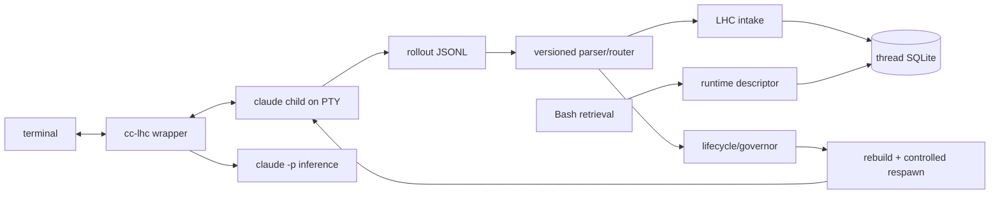

# Host: cc-lhc

Last verified against code and production certification: 2026-08-10, Claude
Code 2.1.226. Precedence when facts disagree: code, retained certification
evidence, package README, then this document.

This document builds on the vocabulary in [01-core-concepts.md](01-core-concepts.md)
and [02-domain-design.md](02-domain-design.md). Record, event, derivation, view,
band, compact point, visibility boundary, impression, and retrieval keep their
SDK meanings here.

## Host position

`cc-lhc` integrates LHC from outside the closed `claude` CLI. The wrapper owns
Claude under a PTY, preserves normal terminal behavior, observes Claude's
rollout JSONL, and gives the SDK the host services it cannot own: capture,
model calls, lifecycle, context mutation, and model-callable retrieval.

The durable boundary is the rollout stream, not terminal scraping. A versioned
parser/router turns rollout entries into typed conversation and lifecycle
events. Capture and runtime management consume separate projections of that
stream. PTY observation is used only for transport, the control panel,
non-semantic replacement-child liveness, and advisory lifecycle-command
warnings.

Claude Code hooks are not required. In environments where hooks are disabled,
the full certified path remains available.

## Architecture



The wrapper has four main lanes:

1. **Capture:** bind to the exact Claude session rollout, parse it, and append
   recognized conversation events to one LHC thread.
2. **Inference:** run derivation callbacks through isolated `claude -p`
   subprocesses with session persistence disabled.
3. **Retrieval:** expose stable `tN`/`mN` retrieval through ordinary Bash tool
   calls, bound by an inherited per-wrapper capability descriptor.
4. **Context lifecycle (capability-limited):** use provider-reported usage
   (input + cache creation + cache read), a source-labelled post-measurement
   estimate for content captured after the last provider request, and rollout
   turn boundaries to classify pressure. Mutation runs only at a Claude-safe
   settled seam: fenced compact/prune, rebuild a rollout, and replace the Claude
   child via controlled handoff without changing the LHC thread. Open-turn
   threshold crossings are classified and durably receipted but not mutated
   mid-turn. This host does not perform Codex-style in-place mid-agentic-turn
   request replacement, tool-tail preservation, or continuation markers.

## Capture and canonical attribution

The wrapper binds capture to a known Claude session ID and exact rollout path;
it does not select the newest file in the cwd. One LHC thread accumulates many
native Claude session IDs over its life, so the exclusive owner lease is keyed
by the **thread**, not by a session: every alias of one thread contends for one
lease. The lease is backed by OS-verifiable process identity and refuses a
second live wrapper before it can tail or spawn. PID reuse does not make a
stale owner look live.

At launch the wrapper resolves the host-qualified alias (`claude-code:<uuid>`)
through the LHC registry's alias map to a thread ID, takes that thread's lease,
then re-reads the thread's current alias **under the lease** and lands on that
session. The pre-lease lookup authorizes the lock key only — the current
pointer can advance in between. A launch through an older alias therefore
self-corrects onto the thread's current session instead of failing. On the
first registry miss, the pre-registry `cc-lhc.sqlite` lineage is imported
one way; after that the registry is authoritative and cc-lhc storage keeps
only host-local detail (rollout paths, prefix proof, prompt-intake evidence,
recovery detail). A rebuilt session reserved by a swap that never completed
never advanced the pointer, so a later launch discards it from session
selection — the file is left untouched — and continues on the current
session.

A swap the wrapper observed accepted (capture ready-after-replay plus a live
child) but whose registry pointer could not be written is recorded host-side
instead, together with the registry current observed at that moment. The next
launch reconciles that record into the registry under the thread lock, against
the pointer read under that same lock and before any session is chosen, so the
accepted replacement is never mistaken for an unaccepted artifact.

A record may repair only the exact predecessor state it observed. One wrapper
keeps its thread lease across every handoff it performs, so a later acceptance
can succeed with no launch in between and leave the earlier record behind;
matching the predecessor is what stops that stale record from dragging the
pointer back off the newer session. A successful acceptance also supersedes
older pending detail, but reconciliation stays correct without that cleanup.
Anything the record cannot repair — a pointer that moved on, or a pre-amendment
row with no observed predecessor — is settled without touching the pointer.

The registry stays the authority: a refusal saying that session belongs to
another thread settles the record rather than overriding the pointer. If the
registry merely cannot be written, the launch says so and lands on the accepted
replacement anyway — it is the live, captured session — and retries at the next
launch. None of this can stop a launch, and a failure after the thread lease is
taken releases it rather than stranding the thread.

The rollout parser maps recognized user, assistant, thinking, tool, result,
runtime, model-change, and turn-boundary records. Harmless top-level host
metadata is skipped and counted as telemetry. Unknowns are not failures merely
because they are unknown: capture becomes degraded only for a classified
integrity failure that threatens canonical content, attribution, continuity,
or isolation. Parser drift is visible and covered by real-rollout fixtures.

Assistant identity is stored from the response record. Thinking signatures are
opaque. Empty-and-unsigned thinking is
omitted from serving; empty-but-signed thinking is preserved. A rebuilt rollout
would replay signed thinking only when stored identity exactly matched the live
request identity. The wrapper cannot observe Claude's prepared request, so the
certified rebuild arm currently omits thinking blocks rather than guessing from
mutable session state.

Capture stays attached through child exit and performs a final rollout read.
Replay-prefix lines in rebuilt sessions are excluded positionally from intake:
they are a served projection of history already in the record, not new events.
The first live pair after the prefix resumes canonical capture on the same
thread.

## Retrieval

Claude invokes retrieval through its native Bash tool:

```text
cc-lhc get-turns [--from TOKENS] <tN>...
cc-lhc get-messages [--from TOKENS] <mN>...
```

Before Claude starts, the wrapper exports `CC_LHC_RUNTIME_DESCRIPTOR`, a path
to a private mutable descriptor. The descriptor progresses through explicit
opening, ready, degraded, and closed states and carries the exact wrapper
incarnation, process identity, Claude session, rollout path, registry, and LHC
thread binding. Every command reads it afresh.

Retrieval validates descriptor structure and ownership, process identity,
rollout basename/session binding, and—when Claude supplies it—the live
`CLAUDE_CODE_SESSION_ID`. It reserves the complete XML envelope and message-tag
bytes before passing the remaining byte budget to the SDK. A mismatch or stale
descriptor refuses atomically before archive access or impression writes.
Successful calls return historical records inside an explicit
`<recalled-history>` trust envelope, plus slicing/continuation receipts, and
write durable retrieval impressions.

The descriptor is revoked before a handoff generation dies. Failure to publish
the new ready descriptor leaves retrieval unavailable for that generation; it
does not guess a thread from cwd, recency, or global state.

## Inference lane

Inference callbacks spawn `claude -p` with bounded concurrency and timeout.
Every call passes `--no-session-persistence`, certified on Claude 2.1.226, so
inference subprocesses cannot create project rollouts that capture might
mistake for user sessions. Each child is tracked and terminated during wrapper
shutdown. `--lhc-no-inference` or `CC_LHC_NO_INFERENCE=1` disables model-backed
derivation while preserving capture.

## Context policy and governor (capability-limited)

Policy precedence is builtin → user → project → launch/session. User config is
`$XDG_CONFIG_HOME/cc-lhc/config.json` (falling back to
`~/.config/cc-lhc/config.json`); project config is `.cc-lhc.json`. Unknown
fields and invalid bounds fail visibly.

Invalid or unknown policy is reported and disarms automatic policy; Claude and
canonical capture continue. Current code built-ins (see
`packages/cc-lhc/src/governor/config.ts`) are:

| Setting | Default |
| --- | ---: |
| automatic compact | on |
| compact target (lower) | 180,000 tokens (LHC rendered-history domain) |
| trigger (upper) | 360,000 tokens (provider-reported input domain) |
| minimum runway | 50,000 tokens |
| retry growth after failure | 10,000 tokens |
| LHC profile | `continuation` |
| automatic prune | off |
| native compact | emergency backstop at 1,000,000 tokens |
| host capability | `capability_limited` (not Codex full state machine) |

Provider-reported input usage is authoritative: **input + cache creation +
cache read**. Predicted next-request pressure adds a **source-labelled**
estimate for content captured after that provider request; the estimate is never
relabelled as provider usage. Missing or invalid latest usage clears older
authority and cannot trigger a stale compact.

Observations are named decisions (not prose-only logs), folded with capture
health, descriptor readiness, turn state, active mutation, input epoch,
native-summary attention, and cooldown/hysteresis. Threshold crossing during an
**open** agentic turn is classified and written as a durable receipt with
`wouldMutate=false` — Claude Code has no mid-turn request-replacement seam.
Automatic compact/handoff runs only at a confirmed **settled** boundary. The
final pre-commit gate rechecks that no user input or lifecycle change
invalidated the observation. Native summary observation latches
`native_summary_attention` so LHC does not race the native writer.

Durable governor receipts live in `cc-lhc.sqlite` (`cc_governor_receipts`),
tied to settle/usage/capture generation and optional handoff outcome. They
survive wrapper restart and are inspectable independently of `wrapper.log`.

`--lhc-observe-only` reports decisions without mutation. The control panel's
`auto` and `bounds` edits apply only to the current wrapper lifetime.

**What this host cannot do (v1, by design):** Codex-style in-place mid-agentic-
turn continuation, synthetic tool-tail preservation, forced
`context_compact_continue` boundaries, or any claim of same-agentic-turn
parity with the full compact-continuation state machine.

## Compact/prune transaction

Manual and automatic context changes share one mutation and handoff path when
the launch argv is safe to replay into a replacement child.

Respawn safety fails closed for a positional initial prompt, prompt tokens after
`--`, or an option/value boundary the wrapper cannot prove. Automatic handoff
is disabled for that launch form so a prompt can never execute twice. Manual
compact/prune may still materialize and durably bind a rebuilt rollout; the
operator continues it with external `cc-lhc --resume <rebuilt-session-id>`.

1. Preview and apply the LHC compact/prune operation, then render the resulting
   thread view.
2. Build a fresh Claude rollout and sessions-index entry. The original rollout
   is never rewritten.
3. At the explicit commit point, begin an input barrier and revoke the old
   retrieval descriptor.
4. Gracefully terminate the old Claude process group, escalating after a
   bounded wait. Keep capture attached through exit, then final-flush it.
5. Spawn a new child as `claude --resume <rebuilt-session-id>` and start capture
   through the in-process pending binding—not through global lineage lookup.
6. Require both capture ready-after-replay and actual replacement-child PTY
   output followed by a stabilization window.
7. Only then record success lineage, publish the new ready descriptor, and
   deliver buffered user bytes exactly once.

Pre-commit cancellation leaves the old child untouched. Post-commit failure
attempts rollback to the old session. If neither child can safely receive the
buffer, the bytes are preserved in a recovery artifact. A failed replacement
never claims success, advances lineage, or publishes a ready descriptor.

Receipts are durable runtime records and distinguish provider trigger context
from rebuilt served-context size. Old-generation drain warnings after a
successful handoff describe that generation's bounded shutdown; current
derivation status is evaluated on the continuing thread.

## Terminal and control panel

The terminal doctrine is: the wrapper writes only to a surface it owns.
Claude owns the normal screen. Wrapper diagnostics go to the append-only
wrapper log, durable runtime receipts go through the record, and interactive controls
use an alternate-screen panel.

Press ctrl-] (configurable through `CC_LHC_LEADER`) for `status`, `stats`,
`compact`, `prune`, `export`, `auto`, `bounds`, and `help`. The modal recognizes
raw, kitty CSI-u, xterm modifyOtherKeys, and Windows Terminal win32 input
encodings; it preserves escape and bracketed-paste traffic and holds child
output while open. Overflow cancels the panel and flushes held bytes rather
than dropping them.

The advisory notifier recognizes high-confidence user-originated `/resume`,
`/clear`, and `/compact` input and warns without changing or blocking it. It is
independently disabled by `--lhc-no-notifier`. Rollout/session checks remain
the correctness boundary.

## Session policy

Fresh capture launches with a wrapper-assigned `--session-id`. Explicit
`--resume <id>` binds that exact session; bare `--resume` uses a wrapper-owned
cwd picker; `--continue` is resolved by the wrapper and passed to Claude as an
explicit resume. Search-term resume, conflicting selectors, and capture-enabled
fork/cwd/session-changing forms fail before spawn.

Supported continuity paths are wrapper-controlled handoff and launch-time
resume. User-issued in-app `/resume` is unsupported.
Claude 2.1.226 can switch to another session even when it was not in the
initial picker; certification proved that the advisory warning fires and the
resulting mismatch refuses retrieval without adding cross-session canonical
events or impressions.

`/clear` and native `/compact` are likewise advisory-notified because they can
change Claude lifecycle outside wrapper control. Native compact remains only
an emergency backstop; it is not the normal LHC path.

## Operator surfaces

Run `cc-lhc --lhc-help` for the wrapper-owned CLI, flags, environment, and panel
commands. Plain `--help` intentionally remains Claude's help.

Legacy stored turn renderings can be upgraded explicitly:

```text
cc-lhc backfill-labels <thread-id-or-prefix> --dry-run
cc-lhc backfill-labels <thread-id-or-prefix>
```

The SDK recomposes selected legacy `turn_rendering` rows with stable
`<tN>`/`<mN>` labels. The operation performs no inference, changes no canonical
events or source versions, queues no work, and reports missing/failed
renderings rather than repairing them silently.

## State

Durable state lives under `~/.cc-lhc` (override `CC_LHC_HOME`):

| Path | Purpose |
| --- | --- |
| `registry.sqlite` | LHC thread registry and the alias map (`claude-code:<uuid>` → thread, one current alias per thread) |
| `cc-lhc.sqlite` | Host-local session detail: rollout paths, prefix proof, replay signatures, pending-acceptance recovery |
| `threads/<uuid>.sqlite` | Per-thread record, derivations, views, and impressions |
| `owners/*.json` | Exclusive thread-owner leases (keyed by thread hash) |
| `runtime/*.json` | Mode-0600 retrieval capability descriptors |
| `recovery/*` | Ordered input retained after unrecoverable handoff failure |
| `wrapper.log` | Append-only wrapper lifecycle diagnostics (no rotation yet) |

Per-wrapper runtime descriptors are private ephemeral capabilities. Rebuilt
Claude rollouts live under Claude's normal `~/.claude/projects/` tree.

## Certification contract

The retained evidence is
[`packages/cc-lhc/test/fixtures/slice7-certification-evidence.md`](../../packages/cc-lhc/test/fixtures/slice7-certification-evidence.md)
with its adjacent machine-readable manifest. It distinguishes deterministic
tests from production proof and binds the exercised dist artifacts by hash.

The 2026-08-10 production chain covered the installed Claude 2.1.226 artifact
under real SSH → tmux → PTY; two automatic compact handoffs; spontaneous
unpiped labeled retrieval and impressions; prune; clean exit/relaunch;
explicit wrapper resume; deliberate in-app mismatch; raw-PTY behavior; legacy
label migration; all derivations drained; and isolation from production state.

The TypeScript SDK remains the contract source. The new
`turns.backfillRenderingLabels` operation creates port-parity follow-up
`long-horizon-context-0su.1`; that follow-up does not weaken this host's
certification.
