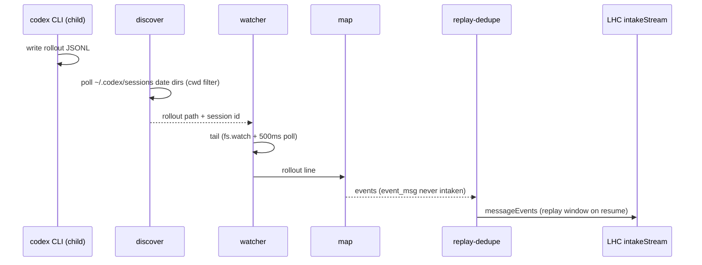
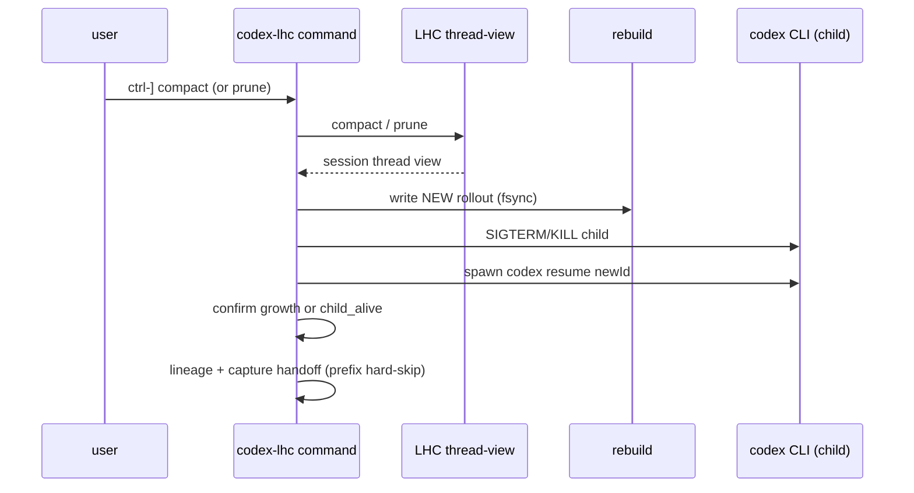

# Host: codex-lhc

Last verified against code: 2026-07-07. Precedence when facts disagree: code, then [packages/codex-lhc/README.md](../../packages/codex-lhc/README.md), then [03-decisions-brief](03-decisions-brief.md), then this doc; see also the [decision registry](../decision-registry.md).

This document describes the `codex-lhc` host as it is, including known warts. It is POC-grade — less shaped than the core SDK, with cosmetic and edge-case issues carried openly in the package README. The wrapper proves the second closed-harness host pattern (item 10 in [docs/fixes-feature-log.md](../fixes-feature-log.md)); it was built by copy-adapting `cc-lhc`, not by plugging into a shared host core (deliberate — seam hygiene preserved for later extraction).

It builds on [01-core-concepts.md](01-core-concepts.md) and [02-domain-design.md](02-domain-design.md). LHC terms are used exactly as defined there.

## What codex-lhc is

`codex-lhc` is a **PTY wrapper around the closed OpenAI Codex CLI** (`codex`). Codex has no extension API for LHC intake, so the wrapper takes the outside position: it owns the `codex` child process, passes the terminal through transparently, and reaches LHC by two side channels. It **watches** the rollout JSONL file codex writes under `~/.codex/sessions/YYYY/MM/DD/` and feeds mapped records into an LHC thread (capture), and it offers a **leader-key alt-screen panel** for LHC commands (control). Keystrokes, output, and exit codes otherwise pass through — from the user's seat it is Codex.

Because codex cannot hot-swap context inside a running TUI session the way Claude Code does with `/resume`, compact/prune **rebuild a fresh rollout file** from the thread view, **kill and respawn** `codex resume <newSessionId>`, then continue capture on the rebuilt path. Harness-specific bits — rollout mapping, discovery, respawn swap — are the seam a future shared host core would extract.

## The wrapper

`bin.ts` calls `prepareChildArgv` (`bin/prepare-child-argv.ts`) to strip `--no-capture`, `--no-inference`, and `--no-autocompact-suppression`, then passes remaining argv to the child. Unless the user already sets `model_auto_compact_token_limit` (any clap `-c` / `--config` form) or opts out, the wrapper appends `-c model_auto_compact_token_limit=100000000` to suppress native auto-compact (`prepare-child-argv.ts:58-60`).

`wrapper/run.ts` stamps `startedAt` before spawning capture (`run.ts:179-208`) so discovery's post-start mtime filter cannot miss a fast-created rollout. The child is spawned under a PTY via `@lydell/node-pty` (`run.ts:121-161`, `511`), with `TERM=xterm-256color`, cols/rows from stdout, binary from `CODEX_LHC_CODEX_BIN` / `shared/codex-bin.ts`. Passthrough is raw and bidirectional; `SIGWINCH` resizes the PTY; `SIGINT`/`SIGTERM` forward to the child. On child exit the wrapper propagates the exit code, stops capture, prints the final stats line, kills inference children, and restores the terminal (`run.ts:212-214`). Stopping capture awaits `drainSettled`, capped at 30 s (`intake/session.ts:37-38`, `235-259`) — a pause, not a hang. `SIGUSR1` prints capture stats without stopping.

Unlike cc-lhc's single-child lifetime, codex-lhc **respawns the child** on compact/prune swap (`wrapper/session-swap.ts`, `run.ts:493-507`). Swap-initiated kills are marked in a `WeakSet` so their exits do not tear down the wrapper (`run.ts:185`, `484-486`). While no live child exists (kill→respawn window), stdin bytes buffer in a 4 KiB ring and flush to the replacement child on spawn (`run.ts:54-55`, `423-437`, `505`).

## Input: passthrough and the leader-key panel

`wrapper/modal.ts` (ported from cc-lhc) makes ambiguity impossible by construction: a **modal** owns the input line, or codex does — never both.

**Passthrough (default).** Every stdin byte forwards to the pty untouched. Escape-sequence tracking (CSI, OSC/DCS, legacy mouse) and bracketed-paste tracking exist so the leader byte is recognized only as a real keypress — inside a paste or an in-flight terminal response it stays literal (`modal.ts:3-22`).

**Leader.** Default **ctrl-]** (`0x1d`); override `CODEX_LHC_LEADER` (single control byte; NUL/BEL/TAB/LF/CR/ctrl-C/ESC rejected — BEL terminates OSC responses on stdin) (`modal.ts:41-49`, `run.ts:224`).

**Panel.** On leader, the wrapper switches to the alternate screen (`?1049h`) and draws a centered panel (`wrapper/panel.ts`): `long-horizon commands> `, receipt rows, dim key hints. Pty output is held throughout (`wrapper/output-hold.ts`, 4 MB cap — overflow cancels modal with a notice and flushes). Dismissal leaves alt screen (`?1049l`) then flushes held output. An alt-screen guard backs every exit path: process exit, signals, stdin end/error (`panel.ts:28-33`). stdin drives an ASCII-only line editor while modal; kitty CSI-u keys handled; Enter executes; Esc/ctrl-C/leader-again dismisses. A pending ESC survives chunk boundaries; bare Esc resolves after ~50 ms (`run.ts:53`, `PENDING_ESC_RESOLVE_MS`). While a command is EXECUTING, input drops except **ctrl-C detach** — panel tears down, command keeps running, receipt prints on completion (`modal.ts` execute path).

**Commands.** `mapModalCommand` maps short names to dispatch: `status`, `stats`, `compact`, `prune [n]`, `help` (`modal.ts:101-116`). `commands/dispatch.ts` handles `/lhc-*` forms; bare `/lhc` → help; invalid prune args → usage hint (`dispatch.ts:16-17`, `57-58`). Receipts render as panel rows above a fresh prompt. `CommandInFlightGuard` prevents overlap (`wrapper/command-guard.ts`). Swap-from-panel dismisses the alt screen **before** child kill/respawn so teardown is visible on the main canvas (`run.ts:187`).

## Turn gate on mutating commands

`prune` and `compact` refuse with `turn in progress — rerun when idle` while a codex turn is open (`commands/context.ts:16`); `status`/`stats` stay instant. Turn state is a **fold over the rollout tail the wrapper already parses** (`intake/turn-signal.ts`, folded in `intake/session.ts:287-315`) — not a parallel tracker. `event_msg.task_started` opens; `task_complete` / `turn_aborted` close; `turn_context.turn_id` changes open (`turn-signal.ts:28-37`). Replayed-prefix lines after a swap are excluded from the fold — served history, not live state (`session.ts:311-316`). The fold lags the file by at most one watcher poll; there is no cc-lhc-style last-instant recheck before swap because codex swap is respawn-based, not pty injection.

## Capture

Capture runs in the wrapper process against the rollout JSONL codex writes. `rollout/discover.ts` polls `~/.codex/sessions/YYYY/MM/DD/` (today + yesterday for midnight rollover, 250 ms) for `rollout-<ts>-<uuid>.jsonl` created or modified after wrapper start, picking the newest mtime (`discover.ts:30-34`, `97-105`).

**Cwd filter (required).** Codex stores all sessions in one global date-dir tree — unlike Claude Code's per-project dirs. Without filtering, a concurrent codex session in another workspace can win the newest-mtime race and the wrapper captures a stranger's thread (found live during panel testing). `DiscoverDeps.expectedCwd` envelope-reads each candidate newest-first and skips non-matching `session_meta.cwd`; unreadable first lines retry on the next poll (`discover.ts:14-18`, `107-114`). `intake/session.ts` passes `expectedCwd: cwd` at discovery (`session.ts:350`).

`rollout/watcher.ts` tails with `fs.watch` plus a 500 ms poll, byte offset, newline split, partial-line hold, and final flush on `stop()` (`watcher.ts:5`, `128`). Partial lines past 10 MB are dropped with a logged parse error.

**Mapper — two-layer rule.** `intake/map.ts` maps codex rollout lines into LHC intake (`CODEX_HARNESS_ID = "codex"`, `map.ts:7`). The mapper is tolerant: unknown shapes skip+count, never throw. **`response_item` is canonical for conversation content**; the `event_msg` layer is never intaken as content — all `event_msg` lines increment `eventMsg`/`unknown` and return no events (`map.ts:385-388`), avoiding double-writes against duplicate `user_message` twins. User `response_item.message` → `user_prompt`; assistant → `assistant_text`; developer/system → skip+count; `reasoning` → `assistant_thinking` (encrypted-only → skip); tool call/output subtypes → `tool_call`/`tool_result` by `call_id`. Top-level `compacted` → `runtime_note` (`map.ts:391-398`). Idempotency keys: `codex-lhc:rollout:<lineId>:<blockIndex>:<kind>` (`map.ts:82-83`).

**Bootstrap → runtime_note.** Codex ships AGENTS.md / user_instructions / environment_context as user-role messages. Prefix-detected bootstrap text maps to `runtime_note`, not `user_prompt`, so it skips smoothing and stays out of the user lane (`map.ts:13-21`, `291-292`).

**Lineage and replay-dedupe.** SQLite at `~/.codex-lhc/codex-lhc.sqlite` holds `codex_session_lineage` (`rollout_session_id → thread_id`) and per-thread content signatures (`intake/lineage-db.ts:86`). `resolveCaptureThread` precedence: current session id → `codex resume <id>` argv (`intake/argv.ts:37-48`) → `resume --last` newest lineage (`lineage-db.ts:396-417`) → new thread (`lineage-db.ts:435-451`). On resume, `intake/replay-dedupe.ts` opens a replay window: signature hits skip until the first novel event closes the window permanently (`replay-dedupe.ts:56-64`); signatures capped at 500 (`replay-dedupe.ts:8`).

**Turn signal.** `intake/turn-signal.ts` classifies `event_msg.task_started` / `task_complete` / `turn_aborted` and `turn_context.turn_id` changes (`turn-signal.ts:28-37`). The capture session folds signals into `turnOpen` for the command gate (`session.ts:287-315`, `427-428`) — no separate `turn_end` emission from capture.

## Commands

Dispatched from `commands/dispatch.ts` (the panel maps short names → `/lhc-*`). Receipt lines are prefixed `[codex-lhc] ` (`commands/context.ts:13`). When capture is disabled the commands report `capture disabled`.

| Command | What it does |
| --- | --- |
| `status` | `threadView.status` tail/zone/derivation counts |
| `stats` | One-line capture stats |
| `prune [targetTokens]` | `threadView.prune`; on change, rebuild + swap. No-op prune does not swap. Refused mid-turn. |
| `compact` | `previewCompact` + `compact`; on success, rebuild + swap. Refused mid-turn. Serving-token counts in the swap receipt use `inspect.view` load cost (`commands/context.ts:76-81`, `compact.ts:37-63`). |
| `help` / `?` | List commands |

## Rebuild + swap

Prune/compact mutate the LHC thread view, then:

1. **Rebuild** — `rollout/rebuild.ts` + `write-rebuilt.ts` map `SessionThreadView` → codex JSONL. Proven-minimal shape: line 1 `session_meta` with fresh uuid in **both** `id` and `session_id` (`rebuild.ts:108-111`), `forked_from_id` from source (`rebuild.ts:122`), history as `response_item.message` lines, minimal `event_msg` twins (`user_message` / `agent_message`), tool results as plain user text only (`rebuild.ts:156-158`). Swap receipt appended as trailing `[runtime note]` user line + event twin (`rebuild.ts:132-150`); receipt is **outside** `replayedPrefixLines` so it re-intakes as `runtime_note` (`write-rebuilt.ts:41-47`). File fsync'd to new path under `~/.codex/sessions/YYYY/MM/DD/`; original rollout never modified; no codex sqlite writes (`write-rebuilt.ts:55-60`).

2. **Stop old capture** and **terminate child** (SIGTERM → SIGKILL, swap kills marked) (`session-swap.ts:162-186`, `301-302`).

3. **Respawn** `codex resume <newSessionId>` via prepared argv (`session-swap.ts:138-139`, `306-307`).

4. **Confirm** — primary signal: rebuilt rollout growth within 5 s (`session-swap.ts:18`, `190-205`). Interactive TUI resume often writes nothing until new input; fallback **`child_alive`** at window end if the child is still running (`session-swap.ts:205`). Dead child → failure/recovery.

5. **Success** — record lineage **post-confirm only** (`session-swap.ts:416-424`), start capture on rebuilt path with `replayedPrefixLines` hard-skipped from intake (`session.ts:288-304`, `426`). Stats carry forward on the same LHC thread.

6. **Failure-safe** — rebuild throw leaves the live session untouched (`session-swap.ts:281-294`). Respawn/confirm failure respawns the **original** session id on its untouched rollout (`session-swap.ts:243-251`, `370-392`) and prints `codex resume <id>` for manual recovery.

## Inference lane

Derivation inference uses a `claude -p` subprocess provider (`inference/claude-cli.ts`), same pattern as cc-lhc. Each call spawns `claude -p --model <model> --system-prompt <sys>` with the derivation input on stdin and the completion on stdout. All four inference-backed kinds are assigned **`model:"sonnet"`, `thinking:"none"`** (`inference/assignments.ts:14-51`) — Sonnet-no-thinking baseline after haiku smoothing failures in cc-lhc dogfood. Compression lanes carry ratio steering (detailed 0.35–0.65, brief 0.08–0.2).

Process hygiene is the real risk, not contamination — system-prompt replacement suppresses most of Claude Code's own prompt. `ConcurrencyLimiter` caps concurrent subprocesses at **3** (`CODEX_LHC_INFERENCE_CONCURRENCY`, default in `claude-cli.ts:8-9`), with a semaphore queue. Every child is tracked in `liveChildren` and `killAllInferenceChildren()` SIGKILLs on teardown. `EPIPE` from an early exit is swallowed; timeouts SIGKILL the child. Stderr classifies into `auth` / `rate_limit` / `other`; missing binary reports `claude binary not found`.

`--no-inference` (or `CODEX_LHC_NO_INFERENCE=1`) switches the SDK to **manual mode** — capture keeps running, but no model calls are made and drain-settled is skipped (`run.ts:171`, `session.ts:435`).

## State layout

codex-lhc owns state under `~/.codex-lhc` (`CODEX_LHC_HOME`, `intake/paths.ts:6-9`):

| Path | Purpose |
| --- | --- |
| `registry.sqlite` | LHC thread registry |
| `codex-lhc.sqlite` | Session lineage and replay-dedupe signatures |
| `threads/<uuid>.sqlite` | Per-thread LHC databases |

Nothing codex-related is written under `~/.lhc` or `~/.cc-lhc`. Rebuilt rollouts live under `~/.codex/sessions/`.

## Known warts (POC)

- **Interactive swap confirm** — growth may never arrive on interactive resume; `child_alive` fallback (`session-swap.ts:205`). Cosmetic: confirm mode appears in swap receipts.
- **Fresh session id on resume** — codex may register a new active session id with our rebuilt id as `forked_from_id`; capture tails the file we wrote, lineage uses our minted id.
- **Drain-not-settled on fast exit** — logged only when derivations remain pending after the 30 s cap (`session.ts:254-259`), not on a clean empty queue.
- **Stdin 4 KiB ring buffer** during kill→respawn (`run.ts:54-55`, `423-437`); oldest bytes drop on overflow.
- **Rebuild lossy** — `model_change` / `thinking_level_change` dropped; tool results as user text (`rebuild.ts:156-158`).
- **ASCII-only panel** — non-ASCII ignored in modal editor.
- **Global sessions tree + cwd filter** — concurrent cross-workspace codex sessions are a real hazard without `expectedCwd` (`discover.ts:14-18`).
