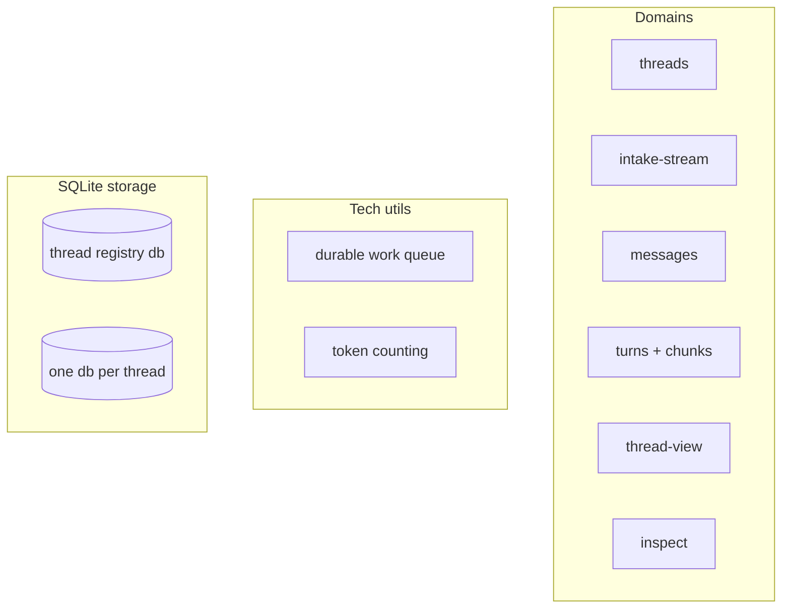
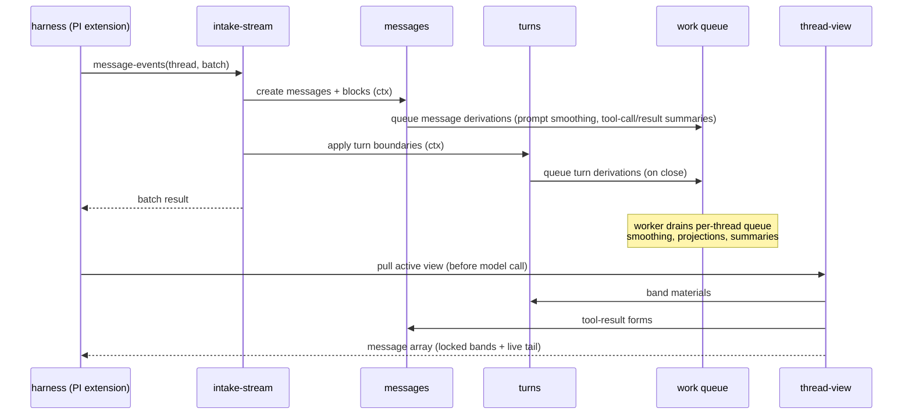

# Long Horizon Context (LHC) — Technical Architecture

## Status

This document defines the technical architecture for LHC. It establishes the system shape, core stack, and foundational decisions that all downstream epics and tech designs inherit. The domain model it builds on is defined in `../01-onboard/01-core-concepts.md` and `../01-onboard/02-domain-design.md`; those documents remain the authority on domain vocabulary and ownership.

---

## Architecture Thesis

LHC is a local-first TypeScript SDK, built as one package organized by domain service surfaces. Each thread is one SQLite file; a registry database maps thread ids to files. Every operation is stateless: a call takes a thread id or path, opens what it needs, works, and returns. The hot path — event intake and view pulls — is synchronous, deterministic, and local; everything involving inference runs later through a durable work queue, each piece owned by the domain that queued it. Domains call each other only through their public surfaces, enforced by import boundaries, so the same operations serve the SDK, in-process cross-domain calls, and future host applications without divergence.

---

## Core Stack

| Component | Choice | Version | Rationale | Checked | Compatibility Notes |
|-----------|--------|---------|-----------|---------|---------------------|
| Runtime | Node.js | >=24 | Built-in `node:sqlite` removes the native-dependency burden; modern ESM | 2026-06-09 | `DatabaseSync` exercised by the v1 reference build in this repo (31/31 green) |
| Language | TypeScript | ^5.9 | Strict typing is the SDK product surface | 2026-06-09 | `strict`, `NodeNext`, `noUncheckedIndexedAccess`, `exactOptionalPropertyTypes` |
| Package manager | pnpm | 10.x | Workspace root already established | 2026-06-09 | `packages/*` workspaces |
| Storage | `node:sqlite` (`DatabaseSync`) | Node built-in | One file per thread; zero install footprint for SDK consumers; synchronous API fits short-transaction design | 2026-06-09 | WAL mode + `busy_timeout`; stability status in Node 24 should be re-verified at first epic's tech design |
| Validation | Effect Schema (`effect`) | ^3.21 | Real decode/reject at the intake boundary with structured errors | 2026-06-09 | Scope pinned by prior decision: schema validation only; public APIs stay Promise/plain-object; no Effect SQL/queue/runtime |
| Token counting | `js-tiktoken` (`o200k_base`) | ^1.0 | Deterministic local base counts; pure JS, no native deps | 2026-06-09 | Base unit stored once; model-specific weights are derived later, never stored per-model |
| Tests | vitest | ^4 | Already in use; fast TS-native | 2026-06-09 | |
| Dev/test TypeScript runner | tsx | ^4 | Script and test ergonomics | 2026-06-09 | |

### Rejected Alternatives

| Considered | Why Rejected |
|-----------|-------------|
| better-sqlite3 | Native build/install burden on every SDK consumer; `node:sqlite` is sufficient and built in |
| One package per domain | Packaging ceremony before seams are stable; domains share transactions and an operation context. One package with enforced internal boundaries gives the protection without the friction |
| Effect-native public API (Effect SQL, PersistedQueue, Effect runtime in signatures) | Prior decision: Effect earns its keep at the validation boundary; a Promise/plain-object surface keeps the SDK consumable by any TS caller |
| Daemon / long-lived server process | Stateless per-call operations are the product stance; a server is a future adapter over the same SDK, not the core |
| JSONL / file-per-record storage | No transactions, no cheap indexed reads; SQLite gives both in one file per thread |
| Character-ratio token estimates | Proven unreliable in the POC; a real local tokenizer is cheap |

---

## System Shape

One package (`lhc`) exposing an SDK. Host applications wrap the SDK with whatever commands or UI they need; LHC does not maintain its own out-of-process CLI surface. All state lives in SQLite files on local disk.

### Top-Tier Domains

| Domain | Runtime Surface | Owns | Depends On | Downstream Inherits |
|--------|----------------|------|------------|---------------------|
| `threads` | SDK | Thread creation, registry, id→file resolution, thread metadata | SQLite storage | Thread file is authoritative for identity; registry is a refreshable convenience index; id stored once in file metadata |
| `intake-stream` | SDK | Ordered event intake, stream contract, synchronous turn-boundary coordination | `threads`, `messages`, `turns` | All-or-nothing batches; idempotency keys; hot path is deterministic-only; intake coordinates but does not own message/turn mechanics |
| `messages` | SDK | Message/block records, token stamping, reads (search deferred post-v1), edit and delete operations, message-level derivations (tool-result summaries, tool-call summaries, prompt smoothing) | `threads`, work queue, token counting | Full record never destroyed; delete is projection-level (source events remain); mutations target closed turns only and clear-and-regenerate dependents; deleting a turn-initiating prompt is refused toward `turns` delete; tool-result summary is a derivation with state, truncation is the deterministic fallback; message-level derivations queue when the message lands, not at turn close |
| `turns` | SDK | Turn lifecycle and state machine, turn delete, turn-level derivations (smoothed turn composition, lower-band projection), chunks as an internal subdomain (formation, close, detailed/brief summaries) | `threads`, `messages`, work queue | Membership is stamped synchronously and frozen at close; turn delete removes the exchange unit, closed turns only, bounded cascade (one chunk re-derives, boundaries never move); turn renderings compose message-level forms rather than re-deriving them; chunk internals are not a public surface; band materials are served to thread-view on request |
| `thread-view` | SDK | View assembly, smart compact, band locking, tool-result visibility policy (source-event-order boundary, whole-message protection floor), readiness sweep, rendering (message array + provider file) | `threads`, `messages`, `turns` | Views are derived and disposable; assembly is read-and-assemble only; missing derivations degrade, never block; source corruption blocks; thread-view drives repair through owning domains' surfaces and derives nothing itself |
| `inspect` | SDK | Read-only reports: composition, sizes, derivation health, view contents and cost | all domain surfaces | Never writes, repairs, or derives; reads only through domain surfaces |

### Tech Utils

Beneath the domains sit two pieces of shared technical machinery. A tech util has no surface, no CLI grouping, and no vocabulary in the product; it is internal plumbing. The dependency runs one way: domains use tech utils, and a tech util never calls a domain or carries domain logic. The working test is the name — if a function inside a util mentions a turn, a chunk, or a summary, it belongs in a domain instead.

**Durable work queue.** Work that cannot run in the hot path — smoothing a closed turn, summarizing a chunk, rebuilding derivations after an edit — is recorded as a durable work item in the thread's own file and drained by a worker later. Two guarantees carry it: pending work survives restart, and a thread's items run in order, so work queued by an edit lands after work already in flight on the old content. Each work kind has one owning domain that queues it and handles it. The queue owns an item's mechanics — recorded, claimed, retried, finished — and none of its meaning; semantic artifact states belong to the owning domain.

**Token counting.** The local tokenizer that stamps base-unit token estimates on messages at projection time. It is reached only through the domains that use it, and nothing else in the system counts tokens its own way.

New functionality lands inside an owning domain or as a new adapter over the SDK. Nothing lands between domains, and a third util does not appear casually; if a piece of work has no clear owner, that is a design problem to resolve, not a shared module to create.

---

## Cross-Cutting Decisions

### Package Layout and Boundary Enforcement

**Choice:** One package. Each domain is a directory with a public surface (`index.ts`) and an `internal/` directory. Tech utils live apart from domains. Cross-domain imports may target only another domain's surface; importing another domain's `internal/` fails lint. Path aliases (`@lhc/<domain>`) make the surface the ergonomic import.
**Rationale:** The failure mode this prevents is peer-to-peer reach-around: everything in one process, agents importing whatever is nearby until boundaries are labels. Make the right thing the easy thing and the wrong thing a CI failure.
**Consequence:** Every file belongs unambiguously to one domain or tech util. Tech designs specify which surface operations an epic adds; stories never add cross-internal imports. An import-boundary check runs in CI from the first epic.

### Storage Model

**Choice:** One SQLite file per thread, WAL mode, short transactions. The thread file stores its own id once as metadata; records inside it carry no thread id. A separate registry database maps id → file path with cached stats.
**Rationale:** The file is the thread: portable, snapshottable, sandbox-friendly. The registry is a convenience index, refreshable from the files, never the authority.
**Consequence:** Single-writer-per-thread is the concurrency model. Cross-thread parallelism is free. Callers hold thread ids; resolution to a path happens through `threads`, with direct-path access as the hot-path option.

### Operation Context

**Choice:** Cross-domain in-process calls share an operation context carrying the open database handle and transaction scope (plus clock, id generation, and injected providers as needed).
**Rationale:** When intake calls `messages` and `turns` inside one batch, the writes must land atomically. Each surface opening its own connection would make that impossible.
**Consequence:** Domain surface functions accept the context as their first parameter. The first epic's tech design pins its exact shape; after that it is inherited.

### Durable Work Queue

**Choice:** A durable work queue stored in the thread's own file. Per-thread ordering: work queued by an edit lands after in-flight work on the old content (one-at-a-time per thread is the current policy that guarantees this). Each work kind has one owning domain that queues it and handles it. Mechanical states (queued, claimed, retrying) belong to the queue; semantic artifact states belong to the domain.
**Rationale:** Pending work must survive restart, and edit clear-and-regenerate correctness leans on ordering. Queue rows living in the thread file means a snapshot of the thread includes its pending work.
**Consequence:** No cross-domain subscription exists anywhere. Asking another domain to act — including repair — is a surface call; the owning domain decides what to queue. Claim/lease/retry mechanics are pinned once in the derivation epic's tech design.

### Derivation State Vocabulary

**Choice:** One shared set of state names for derived artifacts, pinned once at the first derivation tech design. A domain's derivation report must let a caller distinguish: not-yet-derived, usable, failed-but-being-retried, terminally failed, and blocked on damaged source. The artifact's own state carries the semantic distinctions (expected, usable, terminal, blocked); whether a failure is still being retried is queue policy, surfaced by the report joining queue detail rather than duplicated into artifact state — the mechanical/semantic split applies to this vocabulary too. What a state means for a specific artifact stays the owning domain's call.
**Rationale:** Per-domain invented vocabularies are how five incompatible status systems happen.
**Consequence:** Every derived artifact records its state, a reason on failure, and timestamps. Consequence-of-absence is a separate axis decided by the consumer: derivation gaps degrade and report; only damage to the source record blocks. A degraded view marks its gaps; thread-view never silently omits a span of history because its material was missing.

### Validation and Errors

**Choice:** Effect Schema decodes every external input at the SDK boundary — strict shapes, per-kind payloads, rejection of caller-supplied server-generated fields. Errors are typed, structured results in three classes: caller error, state corruption, and system error (storage and environment failures, with stable codes). Corruption (for example, two open turns) fails loudly and stops the operation. Derivation gaps are artifact state, not operation errors; they report and degrade.
**Rationale:** Host applications inherit validation for free because it lives in the SDK. The corruption/gap split is the load-bearing lesson from the POC.
**Consequence:** No silent field-dropping, no permissive fallbacks on the record. Stubs fail closed with a typed error rather than returning fake success.

### Inference Access

**Choice:** Derivation handlers call inference through an SDK-construction seam. Tests may inject a `DerivationProvider` directly; production hosts supply one model-call function plus per-kind provider/model/prompt assignments, and LHC builds the adapter that implements `DerivationProvider` over it. Provider calls never run inside database transactions and never on the hot path.
**Rationale:** LHC owns derivation prompts, routing, failure classification, and provenance, while the host owns credentials and transport. Transactions stay short and the hot path stays deterministic.
**Consequence:** The core never opens auth stores or API clients. Real-inference delivery is proven by an opt-in suite whose host function reaches a real endpoint; deterministic doubles remain the default CI path.

### Token Accounting

**Choice:** A base-unit token estimate (`o200k_base`) is stamped on every message at projection time, synchronously. Model-specific estimates derive by applying calibrated weights to the base count at read time.
**Rationale:** One deterministic count stored once; retargeting models is a multiplication, not a re-count.
**Consequence:** Aggregates (turn, chunk, view, band) sum base units. Weight calibration is a future direction; nothing stores per-model counts.

---

## Boundaries and Flows

The major seams: harness/host → SDK (in-process call), domain → domain (surface call sharing the operation context), domain → tech util (internal use), worker → thread file (claimed work items), derivation handler → host model-call function.

The defining path — one conversational exchange:

**Breakdown:**

1. Harness sends an event batch — SDK call, all-or-nothing, idempotent on resend
2. Intake records events and coordinates `messages` and `turns` through their surfaces in one write context
3. Derivation work queues durably in the same flow — message-level work as each message lands, turn-level work at close; the batch result returns without waiting for any of it
4. A worker drains the thread's queue in order, calling owning-domain handlers; inference runs outside transactions
5. Before each model call, the harness pulls the active view: reads and deterministic assembly only
6. Smart compact, when triggered, assembles a new view from stored artifacts and locks new bands

**Downstream inherits:** steps 1–3 and 5 are hot-path and must stay deterministic and local. Step 4's mechanics are pinned in the derivation epic. Which artifacts exist is settled by the domain model; how each is produced is per-epic tech design.

---

## Constraints That Shape Epics

- **No inference on the hot path.** Intake and view pulls are deterministic. Anything needing a model goes onto the work queue. Epics must not put provider calls in synchronous flows.
- **Prompt-prefix stability is a budget.** Visible view content changes only at planned points (compact, tool-result boundary advance). Boundary advances happen in batches and protect newest whole tool-result messages rather than redeciding every result per turn. Features that would churn the rendered prefix per-turn are design errors with a direct dollar cost.
- **Single writer per thread.** No epic may assume concurrent writers to one thread file. Parallelism is across threads.
- **The record is append-plus-mutate only.** No feature destroys events; the only record mutations are the explicit edit and delete operations, both with clear-and-regenerate semantics, and delete is projection-level — the source event log retains what the readable record drops.
- **Stateless operations.** Nothing requires a daemon. Long-lived processes (worker loops, harness extensions, app servers) are host applications over the same stateless SDK calls.

---

## Downstream Decisions and Remaining Open Questions

Settled by downstream epics:

- Operation context shape is pinned by Epic 1 and extended by later epics through explicit seams such as provider injection and post-commit callbacks.
- Derivation state and repair contract are pinned by Epic 2: semantic artifact state belongs to domain records, retrying/exhaustion is queue/report detail, and repair runs through owning-domain surfaces.
- Work-queue claim/lease/retry mechanics are pinned by Epic 2, including source-versioned work items and reason-code failure classification.
- Chunk close policy is pinned by Epic 2 as accumulated-size behavior rather than the v1 reference's single-turn threshold check.
- Tool-result visibility mechanics are pinned by Epic 3: a source-event-order boundary advances in batches, protects newest whole tool-result messages, and uses tunable max/target/floor values.
- Provider-file rendering starts with PI session JSONL in Epic 3; additional provider formats are additive adapters later.
- Real-inference delivery and SDK-only consolidation are pinned by Epic 5: production hosts supply a model-call function and complete assignments at SDK construction, LHC owns the derivation prompts/adapter/classification/provenance, and the temporary LHC CLI surface is retired.

Remaining open questions:

- `node:sqlite` stability flag status on current Node 24.x LTS.

Deferred post-v1 (not open questions for v1 epics):

- Message search: deferred out of Feature 4; shape (`LIKE` vs FTS5, ranking, result granularity) gets decided from real usage once LHC and the PI extension are integrated.

---

## Assumptions

| ID | Assumption | Status | Notes |
|----|------------|--------|-------|
| A1 | Single user, single machine, one writing process per thread for v1 | Accepted | Cloud/sandbox deployment changes resolution, not the domain model |
| A2 | PI is the first harness; its extension wires in-process via the SDK | Accepted | Extension itself is outside this PRD's scope |
| A3 | Harnesses honor the stream contract (ordered events, `turn_end`, prompts open turns) | Accepted | Violations fail loudly by design; uncontrolled harnesses are a future adapter problem |
| A4 | `node:sqlite` is stable enough for production use in Node >=24 | To verify | Exercised green in the v1 reference build; confirm flag/stability status at first epic |
| A5 | A single SDK-construction inference seam suffices for v1 derivations | Accepted | Multi-provider routing is per-call through host-supplied provider/model assignment strings; LHC owns routing config, the host owns credentials and transport |

---

## Relationship to Downstream

- **This document settles:** stack, package layout and boundary enforcement, storage model, operation-context pattern, durable work queue model and ownership rules, validation/error conventions, inference seam, token accounting, hot-path constraints.
- **Epic specs settle:** exact behaviors per feature — flows, line-level ACs, TCs, data contracts, story slicing.
- **Tech design still decides:** schemas and queue mechanics, state vocabulary names, repair contracts, module-level design inside each domain, test design, the operation context's exact shape.
