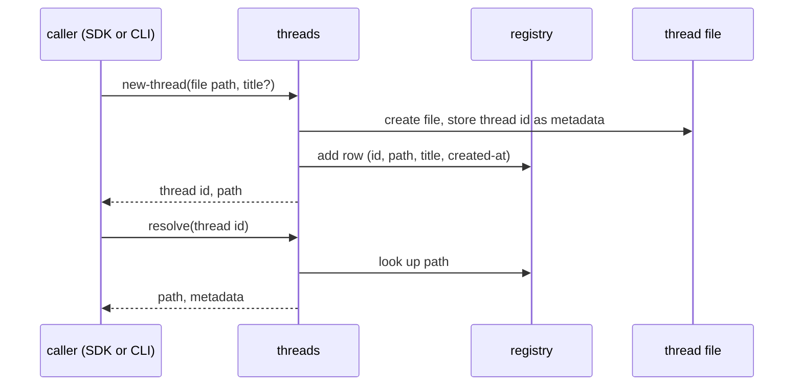
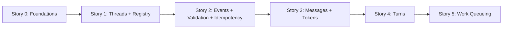

# Epic 01: Thread Record and Intake

**Status:** Draft for review
**PRD:** `../00-prd.md` — Feature 1
**Tech Arch:** `../01-tech-arch.md`
**Domain model:** `../../01-onboard/01-core-concepts.md`, `../../01-onboard/02-domain-design.md`

---

## Onboarding Context

LHC keeps the full history of an agentic conversation as a durable record and builds summarized working views from it. This epic builds the record's front half: threads come into existence, and harness activity flows into them.

Vocabulary used throughout:

- **Thread**: one ongoing conversation, stored in its own thread file. The file is the authority for the thread's identity and content.
- **Event**: one unit of harness activity (a prompt, a piece of assistant output, a tool call or result, a runtime note, a turn-end marker), recorded in stream order.
- **Message**: the readable form of a message-producing event. A message holds one or more **blocks** (text, tool payloads) and a token estimate.
- **Turn**: one user prompt and everything the assistant produced in response. Turn membership is stamped on messages as they arrive and frozen when the turn closes.
- **Work item**: a durably queued unit of derivation work that a later worker runs (this epic queues work items; running them is Epic 02).

The domains involved: `threads` owns creation and lookup, `intake-stream` owns the event path and coordinates, `messages` and `turns` own their records and queue their own derivation work.

## Feature Overview

A harness integration creates a thread, then streams conversation activity into it as event batches. Each batch lands atomically: events are recorded in order, messages and blocks are projected with token estimates, turn state advances through a small fixed rule set, and derivation work queues durably — all synchronously, before the call returns. Resends are safe through per-event idempotency keys. Incoherent batches are rejected whole, leaving the thread untouched.

Everything in this epic is deterministic and local. No inference runs anywhere in these flows; queued derivation work is recorded, not executed.

### Flow Summary

- [Flow 1: Thread Creation and Resolution](#flow-1-thread-creation-and-resolution) — new threads, the registry, reaching a thread by id or path. AC-1.1–1.7
- [Flow 2: Event Batch Intake](#flow-2-event-batch-intake) — recording, message projection, token estimates, message-level work queueing. AC-2.1–2.9
- [Flow 3: Turn Boundaries](#flow-3-turn-boundaries) — the turn state machine, membership stamping, turn-close work queueing, corruption detection. AC-3.1–3.9
- [Flow 4: Batch Validation and Rejection](#flow-4-batch-validation-and-rejection) — what makes a batch invalid and what rejection guarantees. AC-4.1–4.7
- [Flow 5: Idempotent Resend](#flow-5-idempotent-resend) — safe resends by idempotency key. AC-5.1–5.5

## User Profile

**Primary user:** Harness integrator wiring a harness (first: the PI extension) to the SDK.
**Context:** Sending thread events from inside the harness's lifecycle, between user activity and the harness's next model call.
**Mental model:** "I create a thread, then send ordered batches of conversation events. LHC records each batch whole or rejects it with a reason. If I'm unsure what landed, I resend and it sorts itself out."
**Key constraint:** Intake sits in the harness's hot path, so it must be local, deterministic, and fast; binary outcomes with structured reasons, never partial landings.

**Agents and developers** drive the CLI against a thread during integration work and verification: creating test threads, replaying captured sessions, reading back what landed.

**Operators** come later (inspection is Epic 04), but everything recorded here is what they will audit. Nothing in this epic may record state that cannot be read back and explained.

## Scope

### In Scope

The synchronous record path, end to end:

- Thread creation against a new file path; the thread file stores its own thread id exactly once, as file-level identity metadata (the registry also lists the id, as lookup data, not as the authority)
- The thread registry: a row per thread, id-to-path resolution, thread listing
- Event batch intake: ordered recording, all-or-nothing per batch
- Message and block projection from message-producing events, with token estimates stamped at creation
- The turn state machine: open on prompt, close on prompt-or-turn-end, membership stamping, corruption detection
- Durable queueing of derivation work: message-level work when qualifying messages land, turn-level work at turn close
- Idempotency-keyed resend safety
- SDK operations for all of the above, CLI commands wrapping them
- Minimal ordered read-back of events, messages, turns, and queued work items — the verification surface this epic's tests stand on

### Out of Scope

- Running queued work, derivation states, repair (Epic 02)
- View assembly, smart compact, band rendering (Epic 03)
- Message search, message editing, inspect reports, full browsing UX (Epic 04; the read-back here is minimal and ordered, not searchable)
- Registry cache refresh from thread files, cached registry statistics (later epic; the registry this epic writes is id, path, title, created-at)
- Harness-side wiring that produces event batches (PI extension work, separate PRD)
- Archival, thread deletion, thread file relocation

### Assumptions

| ID | Assumption | Impact if wrong |
|----|------------|-----------------|
| A1 | One writing process per thread file at a time; concurrent writers are out of contract | Concurrent-writer safety would need locking design now rather than later |
| A2 | Harnesses send events in stream order within and across batches | Out-of-order tolerance would reshape the turn state machine |
| A3 | Work-item granularity at turn close (one item or several per turn) is tech design's call; ACs verify presence and ownership, not item count | None — ACs are written to be granularity-neutral |
| A4 | Thread id format and generation are tech design's call; the contract is system-generated, unique, stable | None — contracts treat the id as a string |
| A5 | No batch size limit is specified; batches are bounded in practice by harness turn shape | A limit, if ever needed, is an additive validation rule |

---

## Flow 1: Thread Creation and Resolution

A harness or developer creates a thread by naming a file path that does not exist yet. Creation writes the thread file, stores the thread's identity in it, and registers it. From then on, callers reach the thread by id (resolved through the registry) or by path (directly), interchangeably.

### Acceptance Criteria

- **AC-1.1**: Creating a thread against a path that does not exist creates the thread file and returns the new thread id and the path.
- **AC-1.2**: Creating a thread against a path that already exists fails with `path_exists`; the existing file is untouched and no registry row is added.
- **AC-1.3**: The created thread file stores its thread id once, as file-level metadata, and the id is readable back from the file alone (without the registry).
- **AC-1.4**: Creation adds one registry row holding the thread id, file path, optional title, and created-at time.
- **AC-1.5**: Resolving a known thread id returns its file path and registry metadata; resolving an unknown id fails with `thread_not_found`.
- **AC-1.6**: Every thread-scoped operation accepts the thread by id or by file path, and both reach the same thread with identical behavior.
- **AC-1.7**: Listing threads returns the registry's rows.

### Test Conditions

- **TC-1.1** (AC-1.1, 1.3, 1.4): Create a thread at a fresh path → file exists, id returned, id readable from file metadata, registry row present with matching id and path.
- **TC-1.2** (AC-1.2): Create a thread at an occupied path → `path_exists` error; pre-existing file bytes unchanged; registry row count unchanged.
- **TC-1.3** (AC-1.5): Resolve the created id → correct path; resolve a random id → `thread_not_found`.
- **TC-1.4** (AC-1.6): Send the same event batch to one thread by id and to a second identical thread by path → identical results and identical read-back.
- **TC-1.5** (AC-1.7): Create three threads → list returns all three with ids, paths, titles, created-at.
- **TC-1.6** (AC-1.2): Creation failure leaves no orphan registry row pointing at a never-created file.

Estimated tests: 8–10

## Flow 2: Event Batch Intake

The harness sends an ordered array of events for one thread. Intake records them, projects messages, stamps token estimates, and queues message-level derivation work, all in one atomic operation. The result tells the harness exactly what happened to each event.

Event kinds: `user_prompt`, `assistant_text`, `assistant_thinking`, `tool_call`, `tool_result`, `runtime_note`, `turn_end`. All except `turn_end` produce a message; `turn_end` is recorded as an event only.

The envelope and event objects are strict contracts: an unknown field anywhere, on the envelope, on an event, or in a payload, is a validation failure unless this contract explicitly lists it. Nothing is silently dropped. Validation precedes idempotency: every event in the batch must pass shape validation before any skip decision is made. A duplicate key on a malformed event is a rejection, not a skip. Tool-result payloads are recorded in full at intake; any truncation or summarization of tool output is derived or rendering behavior belonging to later epics, never a property of the record.

### Acceptance Criteria

- **AC-2.1**: A batch of valid events is recorded in array order, with event order continuing from the thread's last recorded event; a following batch continues the same sequence.
- **AC-2.2**: Each message-producing event yields exactly one message carrying that event's content verbatim, structured as one or more typed blocks.
- **AC-2.3**: A `turn_end` event is recorded in the event order but produces no message.
- **AC-2.4**: Every message is stamped at creation with a deterministic local token estimate in the system's base unit; the same content always yields the same estimate.
- **AC-2.5**: A `tool_result` payload is recorded and read back in full, regardless of size; intake never truncates or summarizes record content.
- **AC-2.6**: Each event's actor and harness identifiers are recorded as given and carried onto its message.
- **AC-2.7**: The batch result reports, per event: recorded or skipped, and for recorded message-producing events the created message id; plus any turn transitions the batch caused and any work items it queued.
- **AC-2.8**: A `user_prompt` message durably queues prompt-smoothing work and a `tool_result` message durably queues tool-result-summary work, each owned by `messages`, in the same atomic operation that records the batch.
- **AC-2.9**: An empty batch is a caller error; nothing is recorded.

### Test Conditions

- **TC-2.1** (AC-2.1): Send two batches of three events → read-back shows six events in send order with contiguous ordering.
- **TC-2.2** (AC-2.2, 2.3): A batch with one of each event kind → six messages with kind-appropriate blocks and verbatim content; `turn_end` present in events, absent from messages.
- **TC-2.3** (AC-2.4): Two identical-content events in different threads → identical token estimates; estimate present on every message.
- **TC-2.4** (AC-2.5): A tool result with content far past any rendering threshold (hundreds of KB) → read-back returns it byte-identical.
- **TC-2.5** (AC-2.6): Events with distinct actor/harness values → values read back unchanged on event and message.
- **TC-2.6** (AC-2.7): Result for a mixed batch names each event's outcome, the message ids created, the turn transitions, and the queued work items.
- **TC-2.7** (AC-2.8): A batch with a prompt and a tool result → one `messages`-owned work item for prompt smoothing and one for tool-result summary, readable from the queue with `queued` status and correct source references.
- **TC-2.8** (AC-2.9): An empty events array → caller error naming the problem; thread read-back unchanged.
- **TC-2.9** (AC-2.8): Kinds that carry no message-level derivation (assistant text, thinking, runtime note) queue nothing.

Estimated tests: 11–13

## Flow 3: Turn Boundaries

Turn state advances synchronously as events land. The rules are small and fixed:

| Open turns | Event | Effect |
|------------|-------|--------|
| 0 | `user_prompt` | Open a turn; stamp the prompt's message to it |
| 1 | `user_prompt` | Close the open turn (queueing its derivation work), open a new turn, stamp the prompt to the new turn |
| 1 | `turn_end` | Close the open turn (queueing its derivation work) |
| 0 | `turn_end` | No turn effect; the event is still recorded |
| 0 or 1 | any other kind | Stamp the message to the open turn if one is open; otherwise the message has no turn membership |
| more than 1 | any | Corruption: fail the operation loudly, record nothing from the batch |

Membership stamping at intake is what makes everything downstream deterministic: when a turn closes, its contents are already known, and no later work re-derives them.

### Acceptance Criteria

- **AC-3.1**: A `user_prompt` arriving with no open turn opens a turn, and the prompt's message is stamped to it.
- **AC-3.2**: Message-producing events arriving while a turn is open are stamped to that turn.
- **AC-3.3**: A `user_prompt` arriving with a turn open closes the open turn and opens a new one in the same operation; the prompt's message belongs to the new turn.
- **AC-3.4**: A `turn_end` arriving with a turn open closes it.
- **AC-3.5**: A `turn_end` arriving with no open turn has no turn effect and is still recorded as an event.
- **AC-3.6**: Closing a turn — by either close path — durably queues that turn's derivation work, owned by `turns`, before the intake call returns.
- **AC-3.7**: A closed turn's membership is frozen: no later event joins it, and read-back of a closed turn always returns the same member messages.
- **AC-3.8**: Message-producing events arriving after a close and before the next `user_prompt` create messages with no turn membership, and those messages never join any turn afterward.
- **AC-3.9**: A thread found with more than one open turn fails the operation with a corruption-class error; the batch records nothing.

### Test Conditions

- **TC-3.1** (AC-3.1, 3.2): Prompt, then assistant text and a tool call/result → one open turn; all four messages stamped to it.
- **TC-3.2** (AC-3.3): Second prompt while first turn open → first turn closed with its members frozen; second turn open holding only the new prompt.
- **TC-3.3** (AC-3.4, 3.6): Prompt, activity, `turn_end` → turn closed; a `turns`-owned work item for that turn readable with `queued` status.
- **TC-3.4** (AC-3.5): `turn_end` as a thread's first event → recorded, no turn exists, no work queued, subsequent prompt opens turn 1 normally.
- **TC-3.5** (AC-3.7, 3.8): After a `turn_end`, send assistant text, then a new prompt → the text message has no membership; the closed turn's member list is unchanged; the new turn contains only the prompt.
- **TC-3.6** (AC-3.6): Close via implicit path (new prompt) → turn-derivation work item present, same contract as the explicit path.
- **TC-3.7** (AC-3.9): Manufacture a two-open-turns state in a fixture thread → any batch fails with the corruption error class; read-back confirms nothing recorded.
- **TC-3.8** (AC-3.3): A single batch containing `prompt, text, prompt, text, turn_end` → two closed turns, correct membership in each, two turn-derivation work items.

Estimated tests: 12–14

## Flow 4: Batch Validation and Rejection

Validation runs before anything lands. A batch that fails records nothing — no events, no messages, no turn changes, no work items — and the error names the first failing event and the reason in structured form. Caller errors (a bad batch, fixable by the harness) and corruption errors (damaged thread state, needing triage) are distinct classes in every result.

What makes an event invalid:

- An unrecognized event kind
- A missing or empty required field: idempotency key, actor, harness, or the payload fields its kind requires
- A payload that does not match its kind's shape, including a non-empty payload on `turn_end`
- Any caller-supplied server-generated field: event order, recorded-at time, or a server id
- Any field, on the envelope, event, or payload, that this contract does not list

### Acceptance Criteria

- **AC-4.1**: A batch containing an event with an unrecognized kind is rejected whole.
- **AC-4.2**: A batch containing an event missing a required field is rejected whole.
- **AC-4.3**: A batch containing an event that carries a server-generated field is rejected whole.
- **AC-4.4**: A batch containing an event whose payload does not match its kind is rejected whole.
- **AC-4.5**: A rejection error names the index of the first failing event and a structured reason for it.
- **AC-4.6**: After any rejection, the thread is unchanged: event order, messages, turn state, and queued work all read back exactly as before the attempt.
- **AC-4.7**: Every failed operation carries an error class distinguishing caller error (fix the batch and resend), state corruption (stop and triage the thread), and system error (environment problem: storage unavailable, disk full; retry or fix the environment), so a harness can choose its response without parsing prose.

### Test Conditions

- **TC-4.1** (AC-4.1–4.4): Four batches, each invalid one way (unknown kind; missing idempotency key; caller-supplied event order; `turn_end` with payload) → all rejected; per-batch error names index and reason.
- **TC-4.2** (AC-4.5): A batch with a valid first event and invalid third → error names index 2; read-back confirms the valid first event did not land.
- **TC-4.3** (AC-4.6): Record a healthy baseline, attempt a rejected batch, diff full read-back (events, messages, turns, work items) → logically identical to the baseline.
- **TC-4.4** (AC-4.7): A validation failure and a corruption failure (fixture from TC-3.7) → distinguishable error classes with stable codes.
- **TC-4.5** (AC-4.1, 4.6): A batch mixing valid new events, valid duplicates, and one invalid event → rejected whole; the duplicates' original records unchanged; the new events absent.

Estimated tests: 8–10

## Flow 5: Idempotent Resend

A harness that crashed or timed out mid-send cannot know what landed. It resends the same batch. Every event carries a caller-chosen idempotency key, unique per thread; events whose keys are already recorded are skipped, the rest land normally, and the result says which was which.

Deduplication is by key alone. Content under a reused key is not compared; the key is the harness's claim that this is the same event. Skips happen only after the whole batch passes validation: a malformed event is a rejection even when its key is already recorded.

### Acceptance Criteria

- **AC-5.1**: Resending a fully recorded batch records nothing, skips every event, and reports each skip with its idempotency key.
- **AC-5.2**: Resending a batch where some events are recorded and some are new skips the recorded ones and records the new ones in batch order.
- **AC-5.3**: Idempotency keys are scoped to the thread: the same key in two different threads records in both.
- **AC-5.4**: A skipped event causes no side effects: no duplicate message, no turn transition, no work item.
- **AC-5.5**: A valid event reusing a recorded key with different content is skipped; the original record is unchanged and the new content is not stored anywhere.

### Test Conditions

- **TC-5.1** (AC-5.1): Record a five-event batch, resend it identically → zero recorded, five skips reported by key, each carrying `skipReason: duplicate_idempotency_key`; full read-back unchanged.
- **TC-5.2** (AC-5.2): Resend with three old events plus two new → three skips, two recorded continuing the event order.
- **TC-5.3** (AC-5.3): Same key sent to two threads → both record.
- **TC-5.4** (AC-5.4): A resent batch containing a recorded `user_prompt` and a recorded `turn_end` → turn count and turn states unchanged; work-item count unchanged.
- **TC-5.5** (AC-5.5): Key K recorded with payload A; resend key K with valid payload B → skipped, read-back still returns payload A, no new message or work item.

Estimated tests: 8–10

---

## Data Contracts

Shapes at the SDK and CLI boundary. Field names are contractual; storage layout is not described here.

### Thread Reference

Every thread-scoped operation accepts one of:

| Field | Type | Meaning |
|-------|------|---------|
| `threadId` | string | Resolved to a file path through the registry |
| `filePath` | string | Used directly, no registry involvement |

### `threads new-thread`

Input:

| Field | Type | Required | Notes |
|-------|------|----------|-------|
| `filePath` | string | yes | Must not exist |
| `title` | string | no | Registry display title |

Output: `{ threadId, filePath }`. Errors: `path_exists`.

### `threads resolve` / `threads list`

Resolve input: `{ threadId }` → `{ threadId, filePath, title?, createdAt }`. Errors: `thread_not_found`.
List output: array of the same row shape.

### `intake-stream message-events`

Envelope:

| Field | Type | Required | Notes |
|-------|------|----------|-------|
| thread reference | id or path | yes | See Thread Reference |
| `events` | array | yes | Non-empty, stream order |

The envelope, event objects, and payloads are closed contracts: any field not listed in this section, at any of the three levels, is a validation failure. Nothing is silently dropped.

Per event:

| Field | Type | Required | Notes |
|-------|------|----------|-------|
| `eventKind` | string | yes | One of the seven kinds |
| `idempotencyKey` | string | yes | Caller-chosen, unique per thread |
| `actor` | string | yes | Non-empty; recorded as given (for example `user`, `assistant`) |
| `harness` | string | yes | Non-empty; source harness identifier (for example `pi`) |
| `payload` | object | yes | Shape fixed by kind; empty object for `turn_end` |

Payload fields by kind (exact boundary contract; unknown payload fields are a validation failure):

| Kind | Field | Type | Required | Notes |
|------|-------|------|----------|-------|
| `user_prompt` | `text` | string | yes | Prompt content |
| `assistant_text` | `text` | string | yes | Output text |
| `assistant_thinking` | `text` | string | yes | Thinking text |
| `tool_call` | `toolCallId` | string | yes | Caller's id linking call to result |
| `tool_call` | `toolName` | string | yes | |
| `tool_call` | `arguments` | object | yes | Tool arguments as given |
| `tool_result` | `toolCallId` | string | yes | Matches the originating call |
| `tool_result` | `content` | string | yes | Recorded in full, never truncated at intake |
| `tool_result` | `isError` | boolean | no | Marks an errored tool execution; defaults false |
| `runtime_note` | `text` | string | yes | Note content |
| `turn_end` | — | — | — | Payload must be an empty object |

Rejected if present on any event: event order, recorded-at, any server-generated id, schema version. These are produced by the system, never accepted from the caller.

### Batch Result

| Field | Type | Notes |
|-------|------|-------|
| `events` | array | Per input event, in order: `{ idempotencyKey, outcome: recorded \| skipped, messageId?, skipReason? }`. `skipReason` present exactly when skipped; sole value in this epic: `duplicate_idempotency_key` |
| `turnTransitions` | array | Each: `{ action: opened \| closed, turnId }`, in occurrence order |
| `queuedWork` | array | Each: `{ workItemId, owner, kind, sourceRef }` (shapes below) |
| `threadPosition` | object | `{ lastEventOrder }` after the batch |

### Error Result

| Field | Type | Notes |
|-------|------|-------|
| `errorClass` | string | `caller_error`, `state_corruption`, or `system_error` |
| `code` | string | Stable, for example `path_exists`, `thread_not_found`, `invalid_event`, `empty_batch`, `turn_state_corrupt`, `storage_failure` |
| `eventIndex` | number | Present on batch validation failures: first failing event |
| `reason` | string | Human-readable; structure lives in `code` and fields, not prose |

### Work Item (the Epic 02 seam)

The contract Epic 02's derivation pipeline consumes. Granularity (how many items one turn close queues) is tech design's call; the shape is not.

| Field | Type | Values in this epic |
|-------|------|---------------------|
| `workItemId` | string | System-generated, unique per thread |
| `owner` | string | `messages` or `turns` |
| `kind` | string | `prompt_smoothing`, `tool_result_summary` (owner `messages`); `turn_derivation` (owner `turns`) |
| `sourceRef` | object | `{ messageId }` for message-owned work; `{ turnId }` for turn-owned work |
| `status` | string | Always `queued` in this epic; the lifecycle beyond queued belongs to Epic 02 |
| `queuedAt` | string | Timestamp |

### Read-back Shapes (verification surface)

Ordered reads, no search, no editing:

- **Event**: `{ eventOrder, eventKind, idempotencyKey, actor, harness, payload, recordedAt }`
- **Message**: `{ messageId, sourceEventOrder, kind, blocks[], tokenEstimate, actor, harness, turnId? }`
- **Block**: `{ blockType, content }`
- **Turn**: `{ turnId, status: open | closed, memberMessageIds[], openedAtEventOrder, closedAtEventOrder? }`
- **Work item**: `{ workItemId, owner, kind, sourceRef, status: queued, queuedAt }`

### CLI Conventions

Commands mirror SDK operations: `lhc threads new-thread --file-path 
 [--title <t>]`, `lhc threads resolve --thread-id <id>`, `lhc threads list`, `lhc intake-stream message-events (--thread-id <id> | --file-path 
)` with the events JSON array on stdin. The CLI fails fast with a usage error when stdin is a TTY or empty for `message-events`. Results and errors print as JSON matching the SDK shapes; exit code 0 on success, non-zero on any error.

---

## Non-Functional Requirements

- Intake performs no inference and no network calls; every operation in this epic is deterministic and local.
- Batch intake is synchronous: when the call returns, everything it reports (events, messages, turn transitions, queued work) is durably recorded.
- A rejected batch leaves the thread logically identical to its pre-batch state: full read-back (events, messages, turns, queued work) compares equal. Equality is defined at the read-back level, not at file bytes, since storage internals may differ physically.
- One writing process per thread file; concurrent writers are out of contract (assumption A1).
- Read-back is ordered and deterministic: the same thread state always reads back identically.
- Queued work items survive process restart; queueing is part of the batch's atomicity, not a best-effort follow-on.

## Tech Design Questions

1. Work-item granularity at turn close: one `turn_derivation` item, or one per derived artifact? (Shape is fixed by the Work Item contract; count is design's call.)
2. What transaction boundary guarantees the batch's atomicity across events, messages, turn state, and work items, and how does thread-file creation stay atomic with its registry row (no row without a file, no orphan file on a failed create)?
3. What tokenizer provides the base-unit estimate, and how is its identity recorded so estimates remain interpretable if the base ever changes? (Tech arch names the intended choice; design confirms and pins it.)
4. How are error classes and codes represented so SDK results and CLI output stay structurally identical?
5. How does the two-open-turns corruption fixture get manufactured in tests without a public operation that can produce it?
6. Where does the registry live and how is it initialized on first use? (Functionally: list and resolve work before any thread exists, returning empty/not-found.)

---

## Story Breakdown

Partitioning follows the pipeline rather than the flow list: each story adds one stage of the intake path and its read-back, so every story lands testable behavior on top of the previous one. The flow-per-story cut was considered and rejected — Flow 2 alone spans projection, tokens, and queueing, and validation (Flow 4) shares machinery with recording rather than standing alone.

### Story 0: Package Foundations

**Delivers:** The walking skeleton everything else lands on: package scaffold, thread-file create/open seam, the error result model (classes and codes), test fixture builders, and the CLI rail with command routing.
**Governing idea:** Every later story adds behavior to a structure that already builds, runs, and fails closed.
**Prerequisite:** None.
**Boundary / risk notes:** Stubs fail closed with typed errors, never fake success (tech arch convention).
**Flows/ACs covered:** None directly; smoke tests only — package builds, CLI responds to `--help` and unknown commands, fixture builders produce valid event shapes.
**Estimated test count:** 4–6 smoke tests

### Story 1: Thread Creation, Registry, Resolution

**Delivers:** `threads new-thread`, `resolve`, `list` on SDK and CLI; the registry; id-or-path access for thread-scoped operations.
**Governing idea:** A thread exists, carries its identity in its own file, and can be found.
**Prerequisite:** Story 0.
**Boundary / risk notes:** Registry is convenience, file is authority — creation order must never leave a registry row without its file (AC-1.2, TC-1.6).
**Flows/ACs covered:** Flow 1 complete — AC-1.1 through AC-1.7.
**Estimated test count:** 8–10

### Story 2: Event Recording, Validation, Idempotency

**Delivers:** `intake-stream message-events` recording events durably in order, full batch validation with all-or-nothing rejection, idempotency-keyed skips, event read-back. No messages, turns, or work items yet.
**Governing idea:** The event stream lands exactly once, in order, whole-or-not-at-all.
**Prerequisite:** Story 1.
**Boundary / risk notes:** Validation and dedup share the per-event examination pass; the atomicity guarantee (AC-4.6) set here is what every later story's behavior rides on.
**Flows/ACs covered:** AC-2.1, AC-2.9 (recording, empty batch); Flow 4 — AC-4.1 through AC-4.6 (corruption half of AC-4.7 arrives in Story 4); Flow 5 — AC-5.1 through AC-5.5 at the event level, including validation-before-skip precedence.
**Estimated test count:** 15–17

### Story 3: Message Projection and Token Estimates

**Delivers:** Messages and blocks projected from recorded events in the same operation, token estimates stamped, actor/harness carried, message read-back.
**Governing idea:** Everything recorded becomes readable, with its size known.
**Prerequisite:** Story 2.
**Boundary / risk notes:** Projection extends the existing atomic operation — a projection failure must reject the batch, not strand recorded events without messages.
**Flows/ACs covered:** AC-2.2 through AC-2.6, including AC-2.5 full tool-result preservation; AC-5.4's no-duplicate-message clause.
**Estimated test count:** 11–13

### Story 4: Turn State Machine

**Delivers:** Turn open/close per the rule table, membership stamping, frozen closed turns, no-membership gaps after `turn_end`, corruption detection, turn read-back.
**Governing idea:** Turn membership is settled the moment an event lands, never later.
**Prerequisite:** Story 3.
**Boundary / risk notes:** Corruption detection (AC-3.9) completes AC-4.7's error-class split; the two-open-turns fixture has to be manufactured below the SDK, since no valid operation can produce it.
**Flows/ACs covered:** Flow 3 except AC-3.6 — AC-3.1 through AC-3.5, AC-3.7 through AC-3.9; completes AC-4.7.
**Estimated test count:** 12–14

### Story 5: Derivation Work Queueing

**Delivers:** Durable work items: message-level (prompt smoothing, tool-result summary, owned by `messages`) queued as qualifying messages land; turn-level (owned by `turns`) queued at both close paths; work-item read-back; the batch result complete with `queuedWork`.
**Governing idea:** All derivation work caused by an accepted batch is durably recorded by the time the batch's call returns.
**Prerequisite:** Story 4.
**Boundary / risk notes:** This story fixes the contract seam Epic 02 builds against — owner, kind, sourceRef, and `queued` status must match what the derivation epic consumes. Work items must queue inside the batch's atomic operation (a rejected batch queues nothing, a skipped event queues nothing).
**Flows/ACs covered:** AC-2.7, AC-2.8, AC-3.6; AC-5.4's no-work-item clause.
**Estimated test count:** 10–12

### Sequencing

Strictly linear: each story's read-back becomes the next story's verification floor. Total estimated tests: 60–72.

---

## Traceability

| AC | TCs | Story |
|----|-----|-------|
| AC-1.1 | TC-1.1 | 1 |
| AC-1.2 | TC-1.2, TC-1.6 | 1 |
| AC-1.3 | TC-1.1 | 1 |
| AC-1.4 | TC-1.1 | 1 |
| AC-1.5 | TC-1.3 | 1 |
| AC-1.6 | TC-1.4 | 1 |
| AC-1.7 | TC-1.5 | 1 |
| AC-2.1 | TC-2.1 | 2 |
| AC-2.2 | TC-2.2 | 3 |
| AC-2.3 | TC-2.2 | 3 |
| AC-2.4 | TC-2.3 | 3 |
| AC-2.5 | TC-2.4 | 3 |
| AC-2.6 | TC-2.5 | 3 |
| AC-2.7 | TC-2.6 | 5 |
| AC-2.8 | TC-2.7, TC-2.9 | 5 |
| AC-2.9 | TC-2.8 | 2 |
| AC-3.1 | TC-3.1 | 4 |
| AC-3.2 | TC-3.1 | 4 |
| AC-3.3 | TC-3.2, TC-3.8 | 4 |
| AC-3.4 | TC-3.3 | 4 |
| AC-3.5 | TC-3.4 | 4 |
| AC-3.6 | TC-3.3, TC-3.6 | 5 |
| AC-3.7 | TC-3.5 | 4 |
| AC-3.8 | TC-3.5 | 4 |
| AC-3.9 | TC-3.7 | 4 |
| AC-4.1 | TC-4.1, TC-4.5 | 2 |
| AC-4.2 | TC-4.1 | 2 |
| AC-4.3 | TC-4.1 | 2 |
| AC-4.4 | TC-4.1 | 2 |
| AC-4.5 | TC-4.2 | 2 |
| AC-4.6 | TC-4.3, TC-4.5 | 2 |
| AC-4.7 | TC-4.4 | 2, 4 |
| AC-5.1 | TC-5.1 | 2 |
| AC-5.2 | TC-5.2 | 2 |
| AC-5.3 | TC-5.3 | 2 |
| AC-5.4 | TC-5.4 | 2, 3, 5 |
| AC-5.5 | TC-5.5 | 2 |

## Validation Checklist

- [x] Every flow has numbered ACs and TCs mapping to them
- [x] Every AC appears in the traceability table with at least one TC and one story
- [x] Scope states in, out, and where out-of-scope items are handled
- [x] Assumptions carry impact-if-wrong
- [x] Data contracts cover every operation the flows exercise, including error shapes
- [x] No implementation detail below the SDK/CLI boundary (no storage layout, no module structure, no library names)
- [x] Behavior described as what the system does, not why or how the document is organized
- [x] Story breakdown sequenced with prerequisites, governing ideas, and test estimates
- [ ] Consumer test: a tech designer can design from this without asking foundational questions — pending review
