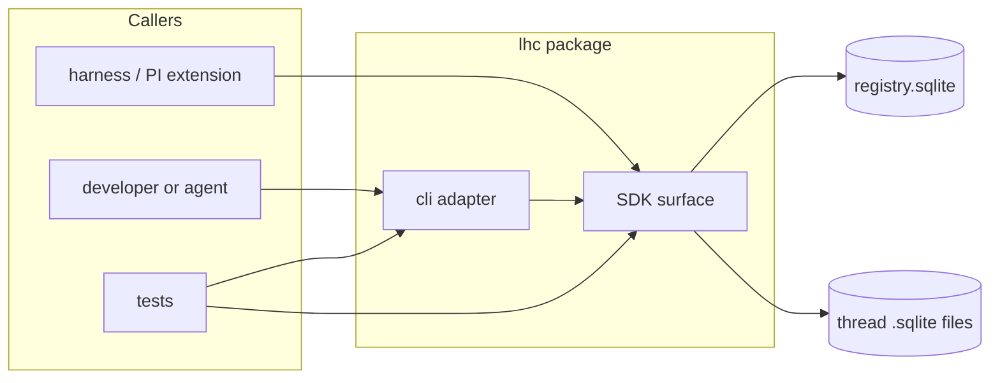
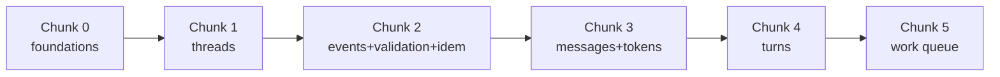

# Epic 01: Thread Record and Intake — Tech Design

**Status:** Draft, complete (companion test plan: `03-test-plan.md`)
**Inputs:** `01-epic.md` · `../01-tech-arch.md` · `../00-prd.md` · `../../01-onboard/01-core-concepts.md` · `../../01-onboard/02-domain-design.md`
**Test plan:** `03-test-plan.md` (companion document)

## Spec Validation

Adversarial read of the epic completed before design. Issues found and their dispositions:

| # | Issue | Status | Resolution |
|---|-------|--------|------------|
| 1 | Read-back is contractual (shapes defined, TCs depend on it) but no operations are named to perform it | Resolved — clarified | Read-back lives on the owning domains' surfaces: `intake-stream` reads events, `messages` reads messages, `turns` reads turns. Queued work items are readable through `messages.listQueuedWork` and `turns.listQueuedWork`, each domain exposing its own. This is the embryonic form of the derivation-state reporting surface Epic 02 expands, so nothing here is throwaway |
| 2 | Whether thread creation records an event is unstated; the kind list has no `thread_created` | Resolved — clarified | No creation event. The seven caller kinds are the only events; a thread's event order starts at 1 with its first batch. Creation facts (id, created-at, tokenizer) live in thread-file metadata, not the event stream |
| 3 | Id generation for messages, turns, and work items unspecified (A4 covers thread id only) | Resolved — clarified | Deterministic ids derived from order: `m<eventOrder>` for messages, `t<turnOrder>` for turns, `w-<sourceId>-<kind>` for work items. Read-back becomes goldenable and ids self-describe their source. Thread id is the one random id (collision scope is global, not per-thread) |
| 4 | NFR says rejection leaves the thread "byte-identical"; SQLite WAL makes physical byte comparison wrong | Resolved — clarified | The contract is logical equality: full read-back (events, messages, turns, work items) compares equal. TC-4.3 already tests via read-back diff; the design defines equality at that level |
| 5 | Registry location and initialization undefined (epic TD question 6) | Resolved | Explicit `registryPath` parameter on registry-touching operations, defaulting to `~/.lhc/registry.sqlite`. Lazy creation on first write; reads against an absent registry return empty list / `thread_not_found` without creating it |
| 6 | AC-1.6 "every thread-scoped operation accepts id or path" is over-broad read literally (`new-thread` has no id yet; `resolve` is id-by-definition) | Resolved — clarified | Thread-scoped means operations on an existing thread's content: `message-events` and all read-backs. Creation and resolution are registry-scoped by nature |

No blocking issues. The epic is designable as written.

## Context

LHC's product premise is that the full history of an agentic conversation is kept as a durable record nothing destroys, while harnesses work from derived views sized to budget. This epic builds the half that everything else stands on: the record itself, and the synchronous path that writes it. Nothing here runs inference, nothing here is async — and that is the point. By the time any intake call returns, the record is complete, turn membership is settled, and every piece of derivation work the async half will need is durably queued. Epic 02's workers, Epic 03's views, and Epic 04's inspection all consume what this epic writes without re-deriving any of it.

The design inherits hard lessons from the predecessor MVP, and three of them shape almost every decision below. First: turn membership used to be inferred after the fact by scanning the stream, which made every downstream consumer carry reconstruction logic and made repair guesswork — so here, membership is stamped synchronously in the hot path by a small fixed state machine, and a closed turn is frozen forever. Second: the MVP silently dropped unrecognized fields at the boundary, which let malformed integrations run for days before anyone noticed — so here, validation is strict and closed (unknown fields anywhere are rejections), all-or-nothing per batch, and validation always precedes idempotency skip decisions. Third: derived state used to block progress when it went stale, the single worst failure mode in the old system — so this epic records and queues but never gates on derivation, and the work-item seam it hands Epic 02 carries owner and kind so that derivation health stays the owning domain's business forever after.

The technical world is inherited from the tech arch, not chosen here: one TypeScript package organized by domain surfaces with enforced import boundaries, one SQLite file per thread via `node:sqlite`, a registry database mapping ids to paths, Effect Schema validation at the SDK boundary, `js-tiktoken` for base-unit token estimates, vitest, and a thin `parseArgs` CLI over the SDK. The six domains and two tech utils are likewise inherited; this epic builds four of the domains (threads, intake-stream, messages, turns — each only the record half) and both utils in their first real form.

What makes this epic's design interesting is concentrated in four places, and depth below is allocated accordingly: the atomicity boundary (one batch is one transaction across four record kinds, on a file that must also be creatable atomically with a second database's row), the turn state machine (small, fixed, and the source of all membership truth), validation-before-idempotency ordering (the precedence that keeps duplicate-key-malformed-event a rejection), and the work-item seam (the contract Epic 02 builds against, where granularity is decided here once). Thread creation, registry rows, listing, and read-back are deliberately shallow — they are standard table-backed operations with nothing novel in them.

## System View

### System Context

One process at a time touches a thread. The harness (or a developer, or a test) calls the SDK; the CLI is the same SDK reached through argv and stdin. Two kinds of database sit underneath: the registry (one, shared, found by path parameter) and thread files (one per thread, found through the registry or addressed directly).



No network, no daemon, no inference provider appears anywhere in this epic. The only external boundary is the filesystem, and it is part of the product contract (durability, restart survival, reopen-sees-same-truth), so tests use real SQLite files in temp directories rather than mocks. That single fact shapes the whole testing strategy: there is nothing to mock in this epic.

### Top-Tier Surfaces (inherited)

| Surface | This epic builds | Deferred to |
|---------|-----------------|-------------|
| `threads` | new-thread, resolve, list; registry storage | Catalog stats refresh (later epic) |
| `intake-stream` | message-events (the whole batch pipeline); event read-back | Nothing — this epic is its core |
| `messages` | Message/block projection, token stamping, message read-back, message-owned work queueing, queued-work read-back | Edits, search (Epic 04); derivation execution (Epic 02) |
| `turns` | Turn state machine, membership stamping, turn read-back, turn-owned work queueing, queued-work read-back | Chunks, derivation execution (Epic 02) |
| `thread-view` | Nothing | Epic 03 |
| `inspect` | Nothing | Epic 04 |
| work queue (util) | Durable item recording, deterministic item ids, `queued` status | Claim/lease/retry/drain (Epic 02) |
| token counting (util) | Base-unit estimates via `o200k_base`, stamped at projection | Model-weight calibration (future) |

### Module Structure

The tech arch's layout rule (domain directory = public surface + `internal/`) lands concretely as:

```text
packages/lhc/src/
  domains/
    threads/
      index.ts              // surface: newThread, resolve, listThreads
      internal/
        registry.ts         // registry open/init, row operations
        create.ts           // thread-file creation + compensation
    intake-stream/
      index.ts              // surface: messageEvents, listEvents
      internal/
        validate.ts         // envelope/event/payload schemas (Effect Schema)
        pipeline.ts         // the batch transaction: record → project → turns → queue
    messages/
      index.ts              // surface: createFromEvent, listMessages, listQueuedWork
      internal/
        project.ts          // event → message + blocks projection
        store.ts            // message/block row operations
    turns/
      index.ts              // surface: applyEvent, listTurns, listQueuedWork
      internal/
        state-machine.ts    // pure transition function (golden-cased)
        store.ts            // turn row operations
  tech-utils/
    work-queue/
      index.ts              // recordItem, listItems (status=queued)
    token-counting/
      index.ts              // estimate(text) -> count, tokenizer id constant
  shared/
    context.ts              // OperationContext: db handle, clock, id seam
    errors.ts               // ErrorResult vocabulary: classes + codes
    storage.ts               // sqlite open helpers, WAL pragmas, migration runner
    // mechanism-only by rule: shared/ may carry primitive cross-cutting
    // identifiers (threadId) and the result vocabulary, but no domain
    // workflows, row shapes, or policies — those fail review here
  cli/
    index.ts                // command routing (parseArgs), stdin handling
    render.ts               // result/error JSON printing, exit codes
  sdk.ts                    // public SDK assembly
  index.ts                  // package exports
```

Import boundaries are enforced from Story 0 by a zero-dependency check script (`scripts/check-boundaries.mjs`, run inside `verify`): no import may reach another domain's `internal/`, and `tech-utils`/`shared` may not import from `domains/`. The ergonomic path for cross-domain calls is the domain's `index.ts` surface, which is also the only path that compiles cleanly under the check.

### Module Responsibility Matrix

| Module | Responsibility | ACs |
|--------|---------------|-----|
| `threads/index.ts` + `internal/registry.ts` | Registry lifecycle, resolve, list | AC-1.4, AC-1.5, AC-1.7 |
| `threads/internal/create.ts` | Thread-file creation, id + metadata, registry row, compensation on failure | AC-1.1, AC-1.2, AC-1.3 |
| `intake-stream/internal/validate.ts` | Strict envelope/event/payload decode; server-field rejection; non-empty actor/harness; unknown-field rejection | AC-4.1–4.5, AC-2.9 |
| `intake-stream/internal/pipeline.ts` | The batch transaction: ordering, idempotency skips after validation, cross-domain coordination, result assembly | AC-2.1, AC-2.7, AC-4.6, AC-4.7, AC-5.1–5.5, AC-1.6 |
| `messages/internal/project.ts` | Event → message + typed blocks, verbatim content, token estimate stamping, actor/harness carry, full tool-result preservation | AC-2.2, AC-2.3, AC-2.4, AC-2.5, AC-2.6 |
| `messages/index.ts` (queue half) | Queue `prompt_smoothing` / `tool_result_summary` items for qualifying messages | AC-2.8 |
| `turns/internal/state-machine.ts` | Pure transition function over (open-turn state, event kind) | AC-3.1–3.5, AC-3.9 |
| `turns/index.ts` | Membership stamping, close paths, turn-owned `turn_derivation` queueing, frozen closed turns | AC-3.2, AC-3.6, AC-3.7, AC-3.8 |
| `tech-utils/work-queue` | Durable item recording inside the batch transaction, deterministic ids, ordered listing | AC-2.7 (queuedWork), AC-3.6 (durability half) |
| `tech-utils/token-counting` | Deterministic base-unit estimates | AC-2.4 |
| `shared/errors.ts` | `caller_error` / `state_corruption` classes, stable codes | AC-4.7 |
| `cli/*` | Command parity with SDK, stdin batch intake, JSON output, exit codes | AC-1.6 (CLI half), all flows' CLI TCs |

Every AC in the epic appears at least once; AC-1.6 spans `pipeline.ts` (thread-ref acceptance) and the CLI (flag parity).

## Design Decisions

The epic's six Tech Design Questions, answered, plus the decisions the Issues Found table committed to.

### 1. Work-item granularity: one item per derivation kind per source

A closed turn queues exactly one `turn_derivation` item. A qualifying message queues exactly one item per applicable kind (`prompt_smoothing` for prompts, `tool_result_summary` for tool results). If Epic 02's turn derivation wants internal fan-out (smoothing, projection as separate steps), it fans out on its own side of the seam; the contract stays one-item-per-source-per-kind. This keeps the seam minimal, makes work-item ids derivable from their source, and matches the v1 reference's one-trigger-per-turn model, which worked.

### 2. Transaction boundaries

**Batch intake is one SQLite transaction on the thread file.** `BEGIN IMMEDIATE` → record events → project messages/blocks → apply turn transitions → write work items → `COMMIT`. Any failure anywhere rolls back everything: AC-4.6's "thread unchanged" is the transaction's rollback, verified at the read-back level (Issue 4: logical equality, not file bytes). `BEGIN IMMEDIATE` takes the write lock up front, so the single-writer assumption failing loudly (SQLITE_BUSY after the busy timeout) rather than deadlocking mid-batch.

**Thread creation spans two databases and cannot be one transaction.** Order: create and initialize the thread file first, then insert the registry row; if the row insert fails, delete the file (compensation) and return the error. The invariant "no registry row without its file" holds absolutely (row is written second). The residual crash window — process death between file creation and row insert — leaves an orphan file with no row; it is harmless (nothing references it), detectable (a later registry-refresh feature can adopt or report it), and re-creation at the same path correctly fails `path_exists`, which an operator resolves by deleting the orphan. Documented behavior, not a bug to engineer away at v1 scale.

### 3. Tokenizer pinning and identity

`js-tiktoken` with `o200k_base`, as the tech arch names. The thread file records `token_estimator = "js-tiktoken:o200k_base"` in its metadata row at creation — implementation and base encoding both named, so a future implementation swap on the same base is distinguishable from a base change, so every stored estimate is permanently interpretable even if a future version changes the base. The counting function is pure and injected nowhere — it is deterministic, dependency-free, and called directly by projection (the operation context carries no tokenizer seam; there is nothing to vary in tests, and goldening real counts is the better assertion).

### 4. Error representation: result objects, never throws, identical across SDK and CLI

Every SDK operation returns a discriminated union:

```ts
type OpResult<T> =
  | { ok: true; value: T }
  | { ok: false; error: ErrorResult }   // shape exactly as the epic's Data Contracts
```

Three error classes, three caller responses:

| Class | Meaning | Caller's move |
|-------|---------|---------------|
| `caller_error` | The input is wrong | Fix the batch, resend |
| `state_corruption` | The thread's invariants are broken | Stop, triage the thread |
| `system_error` | The environment failed: storage unavailable, disk full, lock timeout, parent directory missing | Retry or fix the environment; the input and the thread are both presumed fine |

Infrastructure failures (SQLite errors, fs errors) are caught at the operation boundary and wrapped as `system_error` with the underlying detail in `reason` — they are expected operational outcomes, not programmer errors, so they belong in the result contract. Throwing is reserved for actual bugs in lhc (broken invariants in our own code), which no caller should be asked to handle as data. The CLI prints the same shapes and exits 0 or 1, so SDK and CLI results are structurally identical by construction (AC-4.7, TC-4.4). Codes are constants in `shared/errors.ts`; the set this epic ships: `path_exists`, `thread_not_found`, `invalid_event`, `empty_batch`, `empty_stdin`, `turn_state_corrupt`, `storage_failure`. One code is adapter-scoped: `empty_stdin` is produced only by the CLI adapter, before any SDK call — the SDK itself can never return it (an empty events array reaching the SDK is `empty_batch`). A transaction that fails with `system_error` still rolls back whole — AC-4.6's guarantee is class-independent.

### 5. The two-open-turns fixture

No public operation can produce two open turns (the state machine closes before opening). The fixture helper (`fixtures/corrupt.ts`, test-only, imported by no production code) opens the thread file directly with `node:sqlite` and inserts a second `status='open'` turn row. This is the one sanctioned below-SDK write in the test suite, it exists precisely because the contract makes the state unreachable, and the boundary-check script exempts the fixtures directory.

### 6. Registry location and initialization

`registryPath` is an explicit optional parameter on `newThread`, `resolve`, `listThreads`, and the id-form of thread references, defaulting to `~/.lhc/registry.sqlite`. First write creates the database and schema lazily. Reads against an absent registry do not create it: `listThreads` returns an empty array, `resolve` returns `thread_not_found`. Tests pass temp paths; the CLI exposes `--registry`. No environment variable in v1 — one configuration mechanism is enough until a real need arrives.

### 7. Deterministic ids (Issue 3)

| Record | Id | Example |
|--------|----|---------|
| Thread | random, URL-safe, generated once at creation | `th_8f3kq2v9` |
| Message | `m` + source event order | `m7` |
| Turn | `t` + turn order (1-based, per thread) | `t2` |
| Work item | `w-` + source id + `-` + kind | `w-m7-tool_result_summary`, `w-t2-turn_derivation` |

Message, turn, and work-item ids are scoped to their thread, not globally unique — `m7` exists in every thread that has seven events. Any context that crosses threads carries the thread id alongside.

Per-thread determinism makes read-back goldenable (the same event sequence always produces the same ids), makes work items naturally idempotent (re-queueing the same kind for the same source is the same id), and self-describes provenance in every id an operator ever sees. The thread id is random because its uniqueness scope is global across files and registries.

### 8. Operation context (tech arch question, pinned here for inheritance)

```ts
interface OperationContext {
  db: DatabaseSync;          // open thread-file handle, inside the batch transaction
  clock: () => Date;         // injected for deterministic recordedAt/queuedAt in tests
  threadId: string;          // resolved identity of the thread being operated on
}
```

Built by `intake-stream` when a batch begins (or by any surface that opens a thread), passed to every cross-domain surface call (`messages.createFromEvent(ctx, …)`, `turns.applyEvent(ctx, …)`), and never stored. Registry operations do not use it (different database, no shared transaction). This is the shape downstream epics inherit; Epic 02 will extend it with the provider seam when derivation handlers arrive.

### 9. Test substrate: real SQLite in temp directories, nothing mocked

The filesystem is the product contract in this epic — durability, restart survival, rejection-leaves-no-trace, reopen-sees-same-truth are all real-storage assertions. Every test gets a temp directory (registry + thread files), exercises the system through SDK operations or spawned/in-process CLI, and asserts on read-back. The What-Gets-Mocked table in the test plan is one row long: nothing. The clock is injected (not mocked — a fixed `clock` in the context is the real interface), and the tokenizer runs real because goldening true counts is strictly better than stubbing them.

---

## Flow Designs

The system view above says who owns what; this section says how each flow actually moves. One structural fact organizes everything: **Flows 2 through 5 are not four code paths.** They are four contractual views of a single operation — `intake-stream.messageEvents` — whose internal pipeline is: validate the whole batch (pure, no database), open the transaction, walk events in order (skip duplicates, record, project, apply turn transition, queue work), assemble the result, commit. Validation failures reject before the transaction opens; anything that fails inside it rolls back whole. Flow 1 alone is a separate operation set on `threads`.

The pipeline order is load-bearing, so it gets stated once here and referenced by each flow: **validate → begin → per event in array order: [dedup-check → record → project → turn-transition → queue] → result → commit.** Two consequences worth seeing before the per-flow detail. First, because validation is pure and runs before the transaction, a rejected batch costs no write lock and touches no state — AC-4.6 is the transaction's rollback for mid-flight failures, but for validation failures it is even simpler: nothing ever began. Second, because the turn transition runs per event *inside* the walk, membership stamping always sees the turn state as of that event's position in the stream — a batch containing two prompts produces two distinct turns with correct membership without any lookahead or repair pass (TC-3.8's exact scenario).

### Flow 1: Thread Creation and Resolution

Creation's only interesting problem is that it spans two databases — the new thread file and the registry — and SQLite transactions do not cross files. Design Decision 2 resolves it by ordering plus compensation, and the diagram below is that decision made visible. Resolution and listing are ordinary registry reads; their one subtlety is lazy initialization (Design Decision 6): reads against a registry that has never been written return empty results without creating the database.

```mermaid
sequenceDiagram
  participant C as caller
  participant T as threads surface
  participant F as thread file
  participant R as registry
  C->>T: newThread({ filePath, title?, registryPath? })
  T->>F: refuse if path exists (AC-1.2)
  T->>F: create db, schema, metadata row: thread id, created-at, token_estimator (AC-1.1, AC-1.3)
  T->>R: lazy-open or create registry; insert row (AC-1.4)
  alt registry insert fails
    T->>F: delete created file (compensation)
    T-->>C: error (no row without file, TC-1.6)
  else
    T-->>C: ok { threadId, filePath }
  end
  C->>T: resolve({ threadId })
  T->>R: select by id
  T-->>C: ok { threadId, filePath, title?, createdAt } or thread_not_found (AC-1.5)
```

The existence check and file creation are not atomic against a concurrent creator racing the same path — accepted under the single-writer assumption (A1); the loser of such a race gets a `system_error` from SQLite rather than silent corruption. Thread-file schema creation runs inside the new file's own transaction, so a half-initialized file cannot result from a crash mid-create: the file either has its full schema and metadata row or fails compensation cleanup, and an orphan from the crash window between the two databases is the documented harmless case.

Resolution feeds AC-1.6's id-or-path equivalence, which is implemented in exactly one place: a `resolveThreadRef` helper on the threads surface that turns `{ threadId }` into a path via the registry and passes `{ filePath }` through untouched. Every thread-scoped operation calls it first; no other code ever interprets a thread reference. The CLI's `--thread-id`/`--file-path` flags map onto the same helper, which is what makes TC-1.4's SDK/CLI equivalence structural rather than tested-into-existence.

| TC | Verifies | Design element exercised |
|----|----------|--------------------------|
| TC-1.1 | Create happy path | File schema + metadata row + registry insert |
| TC-1.2 | Occupied path refused | Existence check before any write |
| TC-1.3 | Resolve known/unknown | Registry select; `thread_not_found` |
| TC-1.4 | Id and path equivalence | `resolveThreadRef` as the single entry |
| TC-1.5 | Listing | Registry scan, lazy-init empty case |
| TC-1.6 | No row without file | Compensation on forced registry failure |

TC-1.6's forced failure is induced by pointing `registryPath` at a path whose parent is an existing regular file — creating a database there fails identically on every platform and privilege level (a read-only directory does not: root and many CI sandboxes ignore permission bits). The failure is real, after a real file creation, exercising real compensation — no mocking, per Design Decision 9.

### Flow 2: Event Batch Intake

The walk is where most of this epic's behavior lives. Each recorded event takes its order number from a counter initialized at `MAX(event_order)` when the transaction begins — skipped duplicates do not consume numbers, so the stream stays dense and AC-2.1's continuity holds across batches and across skips. Projection happens in the same iteration as recording: the message row, its blocks, the token estimate, and the actor/harness carry are written while the event is in hand, and the message id is the event's order number with an `m` prefix (Design Decision 7), so projection cannot drift from its source.

```mermaid
sequenceDiagram
  participant C as caller
  participant I as intake-stream
  participant M as messages
  participant T as turns
  participant W as work queue
  C->>I: messageEvents(threadRef, events[])
  I->>I: strict validation, whole batch, pure (AC-4.1–4.5, AC-2.9)
  I->>I: begin immediate; load turn state; corruption check (AC-3.9)
  loop each event in array order
    I->>I: skip if idempotency key recorded (AC-5.1–5.5)
    I->>I: record event row (AC-2.1)
    I->>M: createFromEvent(ctx, event) — message + blocks + estimate (AC-2.2–2.6)
    I->>T: applyEvent(ctx, kind, messageId?) — transition + stamping (AC-3.1–3.8)
    T->>W: queue turn_derivation on close (AC-3.6)
    I->>M: queueMessageWork(ctx, message) on prompt/tool_result (AC-2.8)
  end
  I->>I: commit
  I-->>C: BatchResult (AC-2.7)
```

Two projection details are contractual rather than implementation-free. Block structure by kind: text-bearing kinds (`user_prompt`, `assistant_text`, `assistant_thinking`, `runtime_note`) project one text block; `tool_call` projects one block carrying `toolCallId`, `toolName`, and `arguments`; `tool_result` projects one block carrying `toolCallId`, the full `content`, and `isError`. Nothing splits, summarizes, or normalizes content at intake — AC-2.5's full preservation is the absence of any code path that could shorten it, which is why TC-2.4's hundreds-of-KB round-trip is a meaningful regression tripwire rather than a formality. Token estimates count each message's text content (for tool calls, the serialized arguments; for tool results, the full content string) through the one `token-counting` util, and the estimate lands on the message row in the same insert.

The batch result is assembled during the walk, not reconstructed after it: each event appends its `{ idempotencyKey, outcome, messageId?, skipReason? }` entry as it is processed, turn transitions append as they fire, and work items append as they queue. The result a caller sees is therefore a faithful log of what the transaction did, in the order it did it — which TC-2.6 asserts for the mixed case.

| TC | Verifies | Design element exercised |
|----|----------|--------------------------|
| TC-2.1 | Order continuity | `MAX(event_order)` counter across batches |
| TC-2.2 | Per-kind projection, turn_end exception | Block mapping table; no-message path |
| TC-2.3 | Estimate determinism | Pure tokenizer, same content same count |
| TC-2.4 | Full tool-result fidelity | No-truncation projection path |
| TC-2.5 | Actor/harness carry | Event→message field copy |
| TC-2.6 | Result completeness | Walk-time result assembly |
| TC-2.7 | Message work queued | `queueMessageWork` on qualifying kinds |
| TC-2.8 | Empty batch refused | Validation before transaction |
| TC-2.9 | Non-qualifying kinds queue nothing | Kind gate in `queueMessageWork` |

### Flow 3: Turn Boundaries

The state machine itself is a pure function in `turns/internal/state-machine.ts`, deliberately separated from storage so the epic's rule table can be golden-cased directly against it:

```ts
type TurnState = { openTurnId: string | null };
type TurnEffect =
  | { kind: "none" }
  | { kind: "open" }
  | { kind: "close" }
  | { kind: "close_then_open" };

function transition(state: TurnState, eventKind: EventKind): TurnEffect;
```

Every row of the epic's table is one golden case: prompt with no open turn → `open`; prompt with open turn → `close_then_open`; `turn_end` with open turn → `close`; `turn_end` with none → `none`; other kinds → `none` (stamping is membership, not transition). The corruption row is handled before the walk, not in the function: the pipeline counts open turns when it loads state after `BEGIN IMMEDIATE`, and more than one fails the batch with `turn_state_corrupt` before any event is processed (AC-3.9) — since only this pipeline writes turn state and it maintains the 0-or-1 invariant, a violation can only mean external interference, and checking once at load is sufficient because the lock is already held.

The surface operation `turns.applyEvent` interprets the effect against storage: `open` inserts a turn row (`t<order>`, status `open`, opened-at-event-order) and returns the id for stamping; `close` updates status and closed-at and queues `w-t<order>-turn_derivation`; `close_then_open` does both in sequence, and the prompt that caused it stamps to the *new* turn (AC-3.3). Stamping itself is a column on the message row, written during projection using the turn id current *after* the transition — prompts transition first then stamp, which is the ordering that makes AC-3.1/3.3 come out right, while non-transition kinds stamp to whatever is open or null (AC-3.2, AC-3.8). A closed turn is never updated again by any code path in this epic; frozenness (AC-3.7) is the absence of a writer, verified by TC-3.5's read-back rather than enforced by a guard.

Membership read-back (`memberMessageIds`) is a query over messages' `turn_id` column ordered by event order — membership is stored on the member, not as a list on the turn, so there is exactly one source of truth and the frozen guarantee reduces to "messages never change their stamp," which projection's write-once design already gives.

| TC | Verifies | Design element exercised |
|----|----------|--------------------------|
| TC-3.1 | Open + stamping | `open` effect; stamp-after-transition order |
| TC-3.2 | Implicit close | `close_then_open`; new-turn stamping |
| TC-3.3 | Explicit close + work | `close` effect; turn work queueing |
| TC-3.4 | Orphan turn_end inert | `none` effect; event still recorded |
| TC-3.5 | Frozen turn, gap messages | No-writer frozenness; null stamping |
| TC-3.6 | Implicit close queues same work | Same close path both triggers |
| TC-3.7 | Corruption detected | Open-turn count at state load |
| TC-3.8 | Multi-turn batch | Per-event transition inside the walk |

### Flow 4: Batch Validation and Rejection

Validation is a pure function from the raw envelope to either a typed batch or the first failure, built as three Effect Schema layers matching the contract's three levels: envelope (thread ref shape, non-empty events array, no unknown fields), event object (the five required fields, no unknown fields, no server-generated fields — the explicit denial of `eventOrder`, `recordedAt`, `threadEventId`, `schemaVersion` is its own check with its own reason string, so the old silent-drop bug class is not just rejected but *named* when it appears), and per-kind payload (exact fields per the epic's table, closed). Failures map to `{ errorClass: "caller_error", code: "invalid_event", eventIndex, reason }` with the index of the first failing event — array order, first failure wins, matching AC-4.5.

Strictness is the entire design: every schema is closed (`Schema.Struct` with no index signature, decoded under `onExcessProperty: "error"`), so unknown-field rejection at all three levels falls out of the schema definitions rather than being a rule someone must remember to apply. The decoded result is a typed value the pipeline trusts completely — no defensive re-checking inside the transaction.

Error-class separation (AC-4.7) is structural: validation can only produce `caller_error`; the corruption check can only produce `state_corruption`; wrapped SQLite/fs failures can only produce `system_error`. TC-4.4 exercises one of each and asserts the classes differ; the design makes producing the wrong class require changing the wrong module.

| TC | Verifies | Design element exercised |
|----|----------|--------------------------|
| TC-4.1 | Four invalidity categories | Kind enum, required fields, server-field denial, payload shape |
| TC-4.2 | First-failure index | Ordered decode, fail-fast |
| TC-4.3 | Rejection leaves no trace | Pure validation before transaction; rollback for in-transaction failures |
| TC-4.4 | Class separation | One producer per class |
| TC-4.5 | Valid-prefix batch rejected whole | Whole-batch validation before any write |

### Flow 5: Idempotent Resend

Deduplication is a `SELECT idempotency_key FROM event WHERE idempotency_key IN (…)` at transaction start, producing the skip set for the walk. A skipped event emits its result entry with `skipReason: "duplicate_idempotency_key"` and is otherwise invisible: no event row, no message, no order-number consumption, and — the consequence that matters most — **no turn transition**, because the walk's transition step only runs for recorded events. A resent prompt cannot re-close a turn; a resent `turn_end` cannot close whatever happens to be open now (TC-5.4's exact assertions). Key scoping is per-thread by construction: the lookup runs against the thread file, and the same key in another thread is another file (AC-5.3, no code needed).

Content under a reused key is not compared (AC-5.5): the skip decision reads only the key column. This is stated as a design fact rather than left implicit — the original record wins, the resent content is never parsed past validation, and TC-5.5's payload-B-vanishes assertion is the proof.

| TC | Verifies | Design element exercised |
|----|----------|--------------------------|
| TC-5.1 | Full resend all-skip | Skip set covers batch; result reports reasons |
| TC-5.2 | Partial resend | Mixed walk; order continues from MAX, skips consume nothing |
| TC-5.3 | Per-thread key scope | Per-file lookup |
| TC-5.4 | Skips cause no side effects | Transition step gated on recorded |
| TC-5.5 | Key wins over content | Key-only skip decision |

---

## Interfaces

The complete public surface this epic ships, copy-paste ready. Internal module signatures stay out — they are design-time guidance in the flows above and implementation freedom below that.

### Shared vocabulary (`shared/errors.ts`, `shared/context.ts`)

```ts
export type ErrorClass = "caller_error" | "state_corruption" | "system_error";

export type ErrorCode =
  | "path_exists"
  | "thread_not_found"
  | "invalid_event"
  | "empty_batch"
  | "empty_stdin"          // CLI adapter only, emitted before any SDK call
  | "turn_state_corrupt"
  | "storage_failure";

export interface ErrorResult {
  errorClass: ErrorClass;
  code: ErrorCode;
  reason: string;          // human-readable; machine logic switches on code
  eventIndex?: number;     // present on batch validation failures
}

// Expected operational failures — caller errors, corruption, environment
// failures — are always returned as OpResult errors, never thrown.
// Programmer bugs inside lhc may still throw; callers are not expected
// to handle throws as contract outcomes.
export type OpResult<T> =
  | { ok: true; value: T }
  | { ok: false; error: ErrorResult };

export interface OperationContext {
  db: DatabaseSync;        // open thread-file handle, inside the batch transaction
  clock: () => Date;
  threadId: string;
}
```

### Thread references

```ts
export type ThreadRef =
  | { threadId: string; registryPath?: string }
  | { filePath: string };
```

### `threads` surface

```ts
export interface NewThreadInput {
  filePath: string;
  title?: string;
  registryPath?: string;
}
export interface ThreadInfo {
  threadId: string;
  filePath: string;
  title?: string;
  createdAt: string;       // ISO-8601
}

export function newThread(input: NewThreadInput): Promise<OpResult<{ threadId: string; filePath: string }>>;
export function resolve(input: { threadId: string; registryPath?: string }): Promise<OpResult<ThreadInfo>>;
export function listThreads(input?: { registryPath?: string }): Promise<OpResult<ThreadInfo[]>>;
```

### `intake-stream` surface

```ts
interface BaseEvent<K extends string, P> {
  eventKind: K;
  idempotencyKey: string;
  actor: string;           // non-empty
  harness: string;         // non-empty
  payload: P;              // shape fixed by kind, closed
}

export type MessageEventInput =
  | BaseEvent<"user_prompt", { text: string }>
  | BaseEvent<"assistant_text", { text: string }>
  | BaseEvent<"assistant_thinking", { text: string }>
  | BaseEvent<"runtime_note", { text: string }>
  | BaseEvent<"tool_call", { toolCallId: string; toolName: string; arguments: Record<string, unknown> }>
  | BaseEvent<"tool_result", { toolCallId: string; content: string; isError?: boolean }>
  | BaseEvent<"turn_end", Record<string, never>>;

// Derived, not parallel-maintained: the kind list cannot drift from the union.
export type EventKind = MessageEventInput["eventKind"];

export interface BatchResult {
  events: Array<{
    idempotencyKey: string;
    outcome: "recorded" | "skipped";
    messageId?: string;
    skipReason?: "duplicate_idempotency_key";
  }>;
  turnTransitions: Array<{ action: "opened" | "closed"; turnId: string }>;
  queuedWork: Array<{ workItemId: string; owner: WorkOwner; kind: WorkKind; sourceRef: WorkSourceRef }>;
  threadPosition: { lastEventOrder: number };
}

export function messageEvents(
  thread: ThreadRef,
  events: readonly MessageEventInput[],
): Promise<OpResult<BatchResult>>;

export function listEvents(thread: ThreadRef): Promise<OpResult<EventRecord[]>>;

// Read-back preserves the discrimination: intersecting the input union with
// server fields distributes over its members, so a narrowed eventKind narrows
// the payload on read exactly as it does on write.
export type EventRecord = MessageEventInput & {
  eventOrder: number;
  recordedAt: string;
};
```

### `messages` surface

```ts
export type BlockType = "text" | "tool_call" | "tool_result";
export interface Block {
  blockType: BlockType;
  content: Record<string, unknown>;  // per-kind shape as projected, verbatim source content
}
export interface MessageRecord {
  messageId: string;
  sourceEventOrder: number;
  kind: Exclude<EventKind, "turn_end">;
  blocks: Block[];
  tokenEstimate: number;
  actor: string;
  harness: string;
  turnId?: string;
}

export function listMessages(thread: ThreadRef): Promise<OpResult<MessageRecord[]>>;
export function listQueuedWork(thread: ThreadRef): Promise<OpResult<WorkItemRecord[]>>;  // owner=messages

// cross-domain surface, called by intake-stream inside the batch transaction:
export function createFromEvent(ctx: OperationContext, event: RecordedEvent): MessageCreated;
export function queueMessageWork(ctx: OperationContext, message: MessageCreated): QueuedWorkItem[];
```

### `turns` surface

```ts
export interface TurnRecord {
  turnId: string;
  status: "open" | "closed";
  memberMessageIds: string[];
  openedAtEventOrder: number;
  closedAtEventOrder?: number;
}

export function listTurns(thread: ThreadRef): Promise<OpResult<TurnRecord[]>>;
export function listQueuedWork(thread: ThreadRef): Promise<OpResult<WorkItemRecord[]>>;  // owner=turns

// cross-domain surface, called by intake-stream inside the batch transaction:
export function applyEvent(ctx: OperationContext, eventKind: EventKind, eventOrder: number): TurnTransitionOutcome;
```

### Work queue util (consumed by domains; no public SDK surface)

```ts
export type WorkOwner = "messages" | "turns";
export type WorkKind = "prompt_smoothing" | "tool_result_summary" | "turn_derivation";
export type WorkSourceRef = { messageId: string } | { turnId: string };

export interface WorkItemRecord {
  workItemId: string;
  owner: WorkOwner;
  kind: WorkKind;
  sourceRef: WorkSourceRef;
  status: "queued";        // the only status this epic writes
  queuedAt: string;
}
```

### Token counting util

```ts
export const TOKEN_ESTIMATOR_ID = "js-tiktoken:o200k_base";
export function estimateTokens(text: string): number;   // pure, deterministic
```

### CLI

```text
lhc threads new-thread --file-path <p> [--title <t>] [--registry <r>]
lhc threads resolve --thread-id <id> [--registry <r>]
lhc threads list [--registry <r>]
lhc intake-stream message-events (--thread-id <id> | --file-path <p>) [--registry <r>]   # events JSON array on stdin
lhc intake-stream list-events (--thread-id <id> | --file-path <p>) [--registry <r>]
lhc messages list (--thread-id <id> | --file-path <p>) [--registry <r>]
lhc messages list-queued-work …
lhc turns list …
lhc turns list-queued-work …
```

Every command prints the SDK result (`value` or `error`) as JSON and exits 0/1. `message-events` refuses a TTY or empty stdin with `empty_stdin`. No CLI-only behavior exists; every command body is one SDK call plus rendering.

---

## Verification Gates

Four script tiers, pinned here so every chunk's phases reference the same gates. All run from `packages/lhc`.

| Script | Composition | Gate for |
|--------|-------------|----------|
| `red-verify` | build + typecheck + lint + boundary check (no behavior tests) | Red phase exit: skeleton compiles clean, failing tests are assertion failures, not wiring failures |
| `verify` | `red-verify` + full test suite | Green phase exit; the default local gate |
| `green-verify` | `verify` + test-immutability check (Red-phase test files unchanged since Red commit) | Green completion: behavior was implemented, tests were not edited to pass |
| `verify-all` | `verify` + CLI process-boundary suite | Chunk completion and CI |

The boundary check is `scripts/check-boundaries.mjs` (no imports into another domain's `internal/`; `tech-utils` and `shared` import no domain; fixtures directory exempt). Test immutability is enforced by comparing Red-committed test file hashes — Green may add new test files but may not modify Red's. The CLI process-boundary suite spawns the built `dist/cli.js`; it is the only suite excluded from plain `verify` because it needs a build artifact, and its absence from `verify` is labeled in output (`SKIP: cli-process suite — run verify-all`), never silent.

## Work Breakdown

Six chunks, tracking the epic's six stories one-to-one — the pipeline ordering that made the stories right makes the chunks right, and keeping the mapping 1:1 means story generation later inherits a pre-validated decomposition. Each chunk runs Skeleton → Red → Green internally. A chunk is complete when `verify-all` passes and its exit criteria hold.

Substrate maturity is the through-line: every chunk consumes the previous chunk's *real* artifacts — real registry, real thread files, real recorded events — never stand-ins. By Chunk 3, a test that wants "a thread with six events" creates it through the Chunk 2 surface, which is both less fixture code and a continuous re-verification of everything upstream.

### Chunk 0: Foundations

**Risk shape:** four archetypes in one — pure types (error/result vocabulary), fixtures (builders + temp stores), command rail (CLI routing with structured-failure stubs), substrate (sqlite open/migrate, boundary script, verification scripts).
**Delivers:** `shared/` complete (errors, context, storage); `tech-utils/token-counting` complete (it is pure and small — no reason to stub what costs nothing to finish); CLI rail routing all commands to fail-closed stubs returning `{ ok: false, error: { errorClass: "system_error", code: "storage_failure", reason: "not implemented: <op>" } }`; fixture builders (`validEvent(kind, overrides?)`, `eventBatch(…)`, temp-dir factory, `openRaw(path)` for below-SDK assertions); all four verification scripts runnable.
**Exit criteria:** `verify-all` passes with zero behavior tests; smoke tests prove the rail (help, unknown command, stub failure shape), fixture validity (builders satisfy the Flow 4 schemas once they exist — initially golden-shaped), tokenizer determinism (golden counts for known strings), and boundary script failure on a deliberate violation (test-only sabotage file, then removed).
**Architecture-risk tests:** boundary-check self-test; verification scripts fail when they should (a failing test fails `verify`; an edited Red file fails `green-verify` — proven once here with a sacrificial file, then trusted).

### Chunk 1: Threads and Registry

**Risk shape:** cross-database compensation; lazy initialization.
**Delivers:** Flow 1 complete — `newThread`, `resolve`, `listThreads`, `resolveThreadRef`, registry lazy-create, thread-file schema v1 (metadata row: thread id, created-at, `token_estimator`), compensation on registry failure; CLI `threads` commands live.
**Consumes:** Chunk 0's temp-dir factory, error vocabulary, CLI rail.
**Exit criteria:** TC-1.1–6 green via SDK; same six via CLI in-process; `new-thread` + `resolve` through the spawned binary in the process suite. Thread files created here are the substrate every later chunk builds on.
**Acceptance-risk reminder:** AC-1.6 is only half-testable until `message-events` exists (TC-1.4 sends batches); the chunk proves read-path equivalence and leaves a named deferral for Chunk 2 to close.

### Chunk 2: Event Recording, Validation, Idempotency

**Risk shape:** the strict boundary and the transaction skeleton — the two highest-risk seams in the epic land together here, deliberately, before any projection complicates the walk.
**Delivers:** Flow 4 complete (three-layer closed schemas, error mapping with `eventIndex`); Flow 5 complete at event level (skip set, `skipReason`, density of order numbers); Flow 2's recording half (the transaction, `MAX(event_order)` counter, event rows, walk-time result assembly minus messages/turns/work); `listEvents`; closes TC-1.4.
**Consumes:** real threads from Chunk 1.
**Exit criteria:** TC-4.1–5, TC-5.1–5 (asserting events only), TC-2.1, TC-2.8 green; the no-trace guarantee (TC-4.3) proven by read-back diff against a baseline thread; rejected batch takes no lock (observable: a concurrent open succeeds during a rejection-path test).
**Architecture-risk tests:** atomicity under induced mid-walk failure (close the db handle mid-transaction via test seam — rollback leaves read-back at baseline); restart survival (write, close handle, reopen, read-back identical).

### Chunk 3: Message Projection and Tokens

**Risk shape:** lowest in the epic — per-kind mapping against fixed contracts; the risk is fidelity, not logic.
**Delivers:** `createFromEvent` wired into the walk; per-kind block projection; token stamping via the Chunk 0 util; actor/harness carry; `listMessages`; deterministic `m<order>` ids; messageId in batch results.
**Consumes:** recorded events from Chunk 2's real pipeline.
**Exit criteria:** TC-2.2–5 green; TC-5.4's no-duplicate-message clause green; the hundreds-of-KB round-trip (TC-2.4) green through both SDK and spawned CLI (stdin → read-back, proving no layer in between shortens content).

### Chunk 4: Turn State Machine

**Risk shape:** the pure function is golden-caseable and low-risk; the integration risk is ordering — transition-then-stamp inside the walk.
**Delivers:** `state-machine.ts` with golden cases per the epic's rule table; `applyEvent` against storage; stamping order (prompts stamp post-transition, others stamp to current-or-null); corruption check at state load; `listTurns` with membership-by-query; turn transitions in batch results. Work queueing on close is *not* here — Chunk 4 ships close paths that work completely and simply do not call the queue yet; Chunk 5 adds the queue call to those working paths inside the same transaction. Nothing is stubbed or faked at the seam, and no close fails for lack of queueing; Chunk 4's close tests assert transitions and membership only.
**Consumes:** real messages from Chunk 3 (stamping needs message rows).
**Exit criteria:** TC-3.1–2, TC-3.4–5, TC-3.7–8 green; golden suite covers every table row; TC-3.3/3.6's transition halves green with work-item assertions explicitly deferred to Chunk 5 (named deferral, same pattern as Chunk 1's).
**Architecture-risk tests:** the corrupt fixture (`fixtures/corrupt.ts` direct insert) produces `turn_state_corrupt` on any subsequent batch; state-load check fires before any event lands (baseline read-back unchanged after the failed batch).

### Chunk 5: Work Queueing

**Risk shape:** the Epic 02 seam — shape fidelity matters more than logic; everything here is contract.
**Delivers:** `tech-utils/work-queue` (recordItem, listItems); `queueMessageWork` (kind gate: prompt/tool_result only); turn-close queueing through the Chunk 4 seam; deterministic `w-` ids; `listQueuedWork` on both owning domains; `queuedWork` in batch results; work items inside the batch transaction (rejected batch queues nothing, skipped event queues nothing).
**Consumes:** real turns and messages from Chunks 3–4.
**Exit criteria:** TC-2.6–7, TC-2.9, TC-3.3/3.6 work-item halves, TC-5.4's no-work-item clause green; restart-survival rerun extended to work items; the full epic TC table green; `verify-all` green end to end.
**Acceptance-risk reminder:** the `WorkItemRecord` shape is what Epic 02 consumes — a deliberate review of the shape against the epic's Work Item contract table is an exit step, not just passing tests.

### Sequencing and integration



Strictly linear, matching the epic's story graph. The two named deferrals (Chunk 1→2: TC-1.4; Chunk 4→5: work-item assertions in TC-3.3/3.6) are the only cross-chunk test debts, both recorded in the chunk that owes them and asserted closed in the chunk that pays them. No chunk mocks a neighbor; the seam between Chunk 4 and 5 is an absent call added later, neither stubbed nor faked.

## Open Items for Story Generation

- Story 0 maps to Chunk 0 verbatim; Stories 1–5 map to Chunks 1–5. The epic's story skeletons carry the governing ideas; chunks above add the technical exit criteria.
- The test plan (`03-test-plan.md`) is the authoritative TC→file→assertion mapping; stories reference it rather than restating assertions.
- Both named deferrals must appear in the receiving story's scope (Story 2: TC-1.4; Story 5: TC-3.3/3.6 work halves) so no story claims completion over a debt it does not own.
