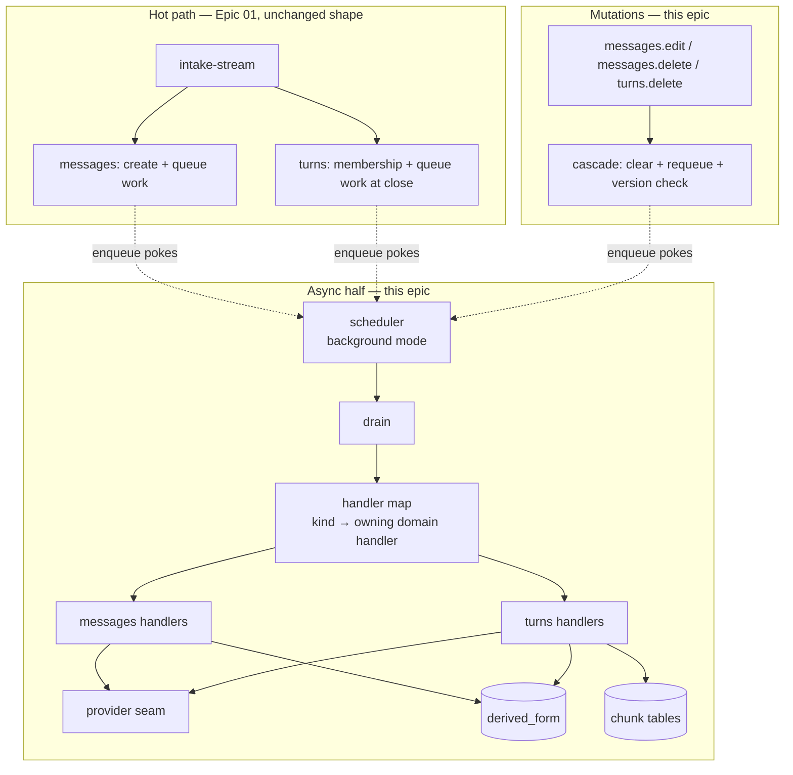
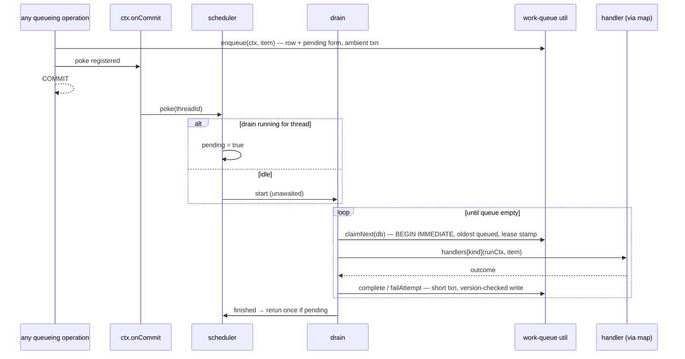

# Epic 02: Derivation Pipeline — Tech Design

**Status:** Draft, complete (companion test plan: `test-plan.md`)

Source epic: `epic.md` (47 ACs, 46 TCs, six flows). Upstream: `../01-tech-arch.md`, `../00-prd.md` Feature 2, `../../01-onboard/02-domain-design.md`. Built on Epic 01 as implemented in `packages/lhc/src` (118 tests green at design time).

---

## Part 1: System Context

### What exists (Epic 01, implemented)

The synchronous half is real code. Intake records event batches all-or-nothing, projects messages and blocks, stamps turn membership through the turn state machine, and queues derivation work it never runs:

- `work_item` table (migration v4): `work_item_id, owner, kind, source_ref, status, queued_at`. Status is unconstrained TEXT, deliberately: Epic 01 only writes `'queued'`; the claim states are this epic's to add.
- Queue sites: `messages.queueMessageWork` (per recorded message, inside the batch transaction; kinds `prompt_smoothing`, `tool_result_summary`) and `turns.closeTurnAndQueueWork` (at close, same transaction; kind `turn_derivation`).
- `tech-utils/work-queue` is mechanism-only: `recordItem`, `listItems`. It stores opaque `(owner, kind, sourceRef)` rows and knows nothing about what any kind means.
- `OperationContext` (`shared/context.ts`): `{ db, clock, threadId }` — an open thread-file handle inside the ambient transaction, an injected clock, the resolved thread id.
- Error contract (`shared/errors.ts`): `OpResult<T>`, three classes, eight codes. Expected failures return; bugs throw.
- Verification gates: `red-verify`, `verify`, `green-verify`, `verify-all` (the cli-process suite runs under `LHC_PROCESS_SUITE=1`).

### What this epic adds

The asynchronous half plus the record's sanctioned mutations, in five moves:

1. **Queue execution** — claim/run/record mechanics on the existing `work_item` table; a drain operation; SDK-internal scheduling in background mode.
2. **Derivation handlers** — `messages` (prompt smoothing, tool-call summary, tool-result summary) and `turns` (turn rendering + lower-band projection, chunk placement/close, chunk summaries), calling inference through an injected provider seam.
3. **Derived-form state** — one `derived_form` table carrying `pending | ready | failed | blocked` per form, with dependency-gap records on composed forms.
4. **Report and repair** — per-owner state listing joined with queue detail; idempotent re-queue.
5. **Mutations** — `messages.edit`, `messages.delete`, `turns.delete`: synchronous record update plus cascade clear-and-requeue in one transaction, with stale-write fencing so in-flight pre-mutation work can never overwrite rebuilt artifacts.



The hot path stays deterministic and local. Everything below the dotted lines runs behind the conversation, one item at a time per thread, surviving restarts because the queue rows and form states are durable and the in-memory scheduler is advisory.

### Design Decisions

**DD-1: Queue rows are live work, removed at terminal transition.** Epic 01 left `status` open for exactly this. `status` is the lifecycle of *current* work: `queued → claimed`, then the row is **deleted in the same transaction that records its outcome**. The queue is not an audit table: durable outcomes live on `derived_form` (state, reason, and — at exhaustion — final attempts/last-error copied onto the form row); the drain report is assembled in-memory from the run, not read back from retained rows. Retry does not get a status: a failed attempt under budget resets the item to `queued` with `attempts` incremented and `eligible_at` pushed out by backoff. "Is it being retried" is answerable from `attempts > 0 ∧ status = queued`, which the report exposes while the item is live.

Terminal dispositions (reported by the drain or mutation that produced them, then the row is gone):

| Case | disposition (in report) | row after |
|---|---|---|
| handler succeeded, write landed | `done` | deleted |
| handler succeeded, write discarded as stale (source version moved) | `stale_discarded` | deleted |
| still-queued item made obsolete by a mutation's cascade | `superseded` | deleted (reported on the mutation result, not a drain) |
| retry budget exhausted, or unknown kind at dispatch | `failed_terminal` | deleted; form `failed` carries reason + final attempts |
| handler found source damage | `failed_terminal` | deleted; form `blocked` carries the damage reason |

Five dispositions, no others valid. **Removal at terminal transition is mandatory, not housekeeping**: it is what lets a later explicit requeue insert the same deterministic work-item id for the current source version without colliding with a dead row. Work-item identity includes the source version (`w-<sourceId>-<kind>-v<sourceVersion>`), so an old claimed item and a post-mutation replacement item can coexist; the old item's completion is discarded by DD-3, and the new item is free to write the current form. The blocked-source case is terminal by necessity: blocked forms refuse requeue until the source is repaired, so a live item could only retry pointlessly against damage; the form's `blocked` state (with the damage reason) is what distinguishes it from ordinary exhaustion.

**DD-2: One `derived_form` table for all owners, keyed `(subject_kind, subject_id, form)`.** Not columns on owning rows, not per-domain tables. The repair report, the mutation cascade, and Epic 03's coverage sweep all want "every form's state for a range of subjects" — one table makes those single queries. Domain ownership is preserved by convention and review (each handler writes only its owner's forms), not by table partition; the boundary check script already polices cross-domain imports, which is where ownership violations would have to originate. `content` lives in the row: forms are text artifacts of bounded size (the largest, a turn rendering, is far smaller than the source it renders).

**DD-3: Source version as the stale-result check (AC-5.4).** Each `derived_form` row carries `source_version INTEGER` — which version of the source this form derives from. A mutation's cascade clears forms by incrementing `source_version` and setting state `pending`. Work items carry the source version they were queued for, and the work-item id includes it (`w-<sourceId>-<kind>-v<sourceVersion>`). A completing write lands only if the item's version equals the row's current `source_version`; a stale job result (item queued before the mutation, racing it) misses and is discarded as a no-op completion, reported `stale_discarded`. The rule in one line: **a background result must not overwrite a derived form if the source changed since the job was queued.** Ordering does most of the work (serial-per-thread means cascade-queued items run after in-flight ones); the version check covers the one window ordering can't: an item claimed before the mutation, completing after it.

**DD-4: The scheduler is an SDK-internal module, not a domain and not part of the queue util.** `tech-utils/work-queue` stays storage-only (it gains claim/complete functions, still pure SQL against an open handle). The scheduler — per-thread single-flight flag, pending-coalesce flag, post-commit pokes, mode selection — lives in `src/scheduler.ts` at the SDK assembly layer, because it is the one component that holds cross-operation in-memory state and constructs its own short-lived `OperationContext`s outside any caller transaction. Hosts never see it; they see `mode: "background" | "manual"` at SDK construction.

**DD-5: Post-commit pokes ride the operation context.** `OperationContext` gains `onCommit(fn)` — a callback list the transaction owner (intake's pipeline, a mutation operation, a repair re-queue) flushes after its `COMMIT` succeeds and drops on rollback. `enqueue` (the new wrapper around `recordItem`) registers the poke there. This keeps "queueing is what schedules processing" true at every queue site — intake, cascade, repair — without any site remembering to nudge, and makes the poke transactional by construction. In manual mode `onCommit` still fires; the scheduler's poke is simply a no-op.

**DD-6: Handlers are registered in a map at SDK construction; the drain dispatches by kind.** Each domain exports its handler table (`messages.workHandlers`, `turns.workHandlers`); assembly merges them. The map is the only join between the queue's opaque kinds and domain code. An unregistered kind is `state_corruption` (`unknown_work_kind`): the item lands `failed_terminal`, its form (if resolvable) lands `failed`, the drain continues (AC-1.8).

**DD-7: Provider seam is seven semantic operations returning `ProviderResult`.** `DerivationProvider` is injected at SDK construction next to the clock. `ProviderResult` is `{ ok: true, text } | { ok: false, retryable, reason }`. Classification is the adapter's duty (rate limit → retryable; content refusal → not). The deterministic double ships in `test/fixtures` and implements all seven operations as marked input-derived output (`smoothed(<first 40 chars>)…`) with per-test scripting: fail-next-N, fail-kind, latency, input capture. No mocks of internal modules anywhere — the double is dependency injection at the same seam production uses, which is the no-mocks rule applied, not an exception to it.

**DD-8: Mutations are synchronous domain operations sharing one cascade module.** `messages/internal/cascade.ts` owns walk-and-clear (message → turn forms → chunk summary forms, per the epic's cascade-scope table); `turns.delete` calls the same walk from the turn level. The cascade runs inside the mutation's transaction: record update, membership change, form clears (source-version bumps), replacement enqueues — one commit. Mutations touch canonical and derived state only — **never any generated thread-view**: an existing generated view is immutable once written; edits and deletes become visible in active context at the next compact/rebuild (an explicit refresh, if ever added, writes a new view rather than patching one in place). Two close paths for the same machinery, edit and delete, differing only in whether the subject's own forms re-queue (edit) or drop (delete).

**DD-9: Chunk close policy is config with pinned defaults: target 2200, max 4400 projected tokens.** Accumulated-size rule per the epic: close when `accumulated + incoming ≥ target` (incoming starts the next chunk); a single turn `≥ max` forms its own closed chunk immediately. Values live in `SdkConfig.chunkPolicy`, defaulted centrally, overridable for tests. Determinism (AC-3.9) follows from the policy reading only durable projected-token values.

**DD-10: Background-mode catch-up is per-thread, on first touch.** The scheduler keeps a `Set<threadId>` of threads it has seen this process lifetime; the first operation context constructed for an unseen thread (any operation — read or write) schedules a catch-up drain. Cheap when the queue is empty (one indexed query), and it is the crash-recovery path: rows left by a dead process run on next touch (AC-1.6).

**DD-11: CLI provider resolution is explicit config, never a default.** SDK hosts inject the provider at `createSdk`. The CLI — which has no construction step — resolves its provider from `--provider <name>` or `LHC_PROVIDER`, looked up in a small named-provider registry. `lhc work drain` (and any provider-needing command) without a resolvable provider fails with a `caller_error` (`provider_not_configured`) naming the flag and env var — never a silent no-op. The deterministic test double registers in the same registry and is selected the same way (process-suite tests set `LHC_PROVIDER`), so spawned-CLI tests exercise the production resolution seam; the double is never a production default. Report, requeue, and mutations need no provider — only drain dispatches handlers.

**DD-12: The mutation contract in three lines.**

```text
canonical state changes now;
derived state is repaired/rebuilt through explicit work;
generated thread-view changes on compact/rebuild unless explicitly refreshed.
```


### Issues Found (against the epic during design)

| # | Issue | Resolution | Status |
|---|-------|-----------|--------|
| 1 | Epic is silent on whether a *queued-not-yet-claimed* item made obsolete by a mutation is removed or left to run (cascade re-queues a replacement; the original would run twice) | Cascade supersedes queued items for cleared forms: still-`queued` items for a cleared `(subject, form)` are **deleted** in the cascade transaction and reported on the mutation result (`superseded` ids — a drain never sees them); claimed items are left to the source-version check. One mechanism (version check) for the race, one (supersede-delete) for the queue tidy | Resolved — design addition, no AC change (patch 2026-06-10) |
| 2 | Tool-call summary outcome can go stale: summary lands `unknown` (result hadn't arrived), result arrives in a later batch — AC-2.4's join-by-call-id now disagrees with the stored outcome | Repair at intake (now epic AC-2.8): when a `tool_result` lands, one indexed lookup by call id — paired call's summary exists with outcome `unknown` → requeue it in the same transaction (idempotent via the requeue no-op rule). This is not the AC-3.3 auto-cascade the epic forbids: that rule covers derivation dependencies improving; here the summary's *source record* (the call+result pair) completed underneath it, which is clear-and-regenerate's own territory. Common case (pair in one batch) never triggers: the summary runs after both landed | Resolved — epic patched (AC-2.8/TC-2.8) |
| 3 | TC-1.5 ("wait on the drain's completion signal") implies an awaitable handle for background drains, which the epic never specifies as API | `drainSettled(ref: ThreadRef): Promise<void>` on the SDK — resolves when the scheduler has no running or pending drain for the resolved thread. Shipped as a real API (not test-only): the PI extension will want it at session close. Settles the "how do tests await background mode" question once | Resolved — small API addition |
| 4 | Epic's error-code table says mutation `not_found` reuses the Epic 01 code, but Epic 01's code is `thread_not_found` (threads only). Message/turn misses need their own code | `message_not_found`, `turn_not_found` added as `caller_error` codes | Resolved — code addition |

---

## Part 2: Module Architecture

### Placement

```
src/
  scheduler.ts                    ← NEW: single-flight, coalesce, pokes, catch-up, drainSettled
  sdk.ts                          ← gains: createSdk(config) assembly (provider, mode, clock, chunk policy)
  shared/
    context.ts                    ← gains: onCommit hook; runInTransaction helper owns flush/drop
    errors.ts                     ← gains: 7 codes (4 epic + issue-4 pair + unknown_work_kind)
    derivation.ts                 ← NEW: DerivedFormState, FormKind, DerivedForm types; state guards
  tech-utils/
    work-queue/index.ts           ← gains: enqueue (recordItem + onCommit poke), claimNext, complete,
                                     failAttempt, supersedeQueued, queueDetail — all pure SQL, domain-blind
  domains/
    messages/
      index.ts                    ← gains: workHandlers, report, requeue, edit, deleteMessage
      internal/
        handlers.ts               ← NEW: prompt smoothing, tool-call summary, tool-result summary
        outcome.ts                ← NEW: mechanical outcome stamping (record-derived, never provider)
        cascade.ts                ← NEW: shared walk-and-clear; edit + delete close paths
        forms.ts                  ← NEW: derived_form reads/writes for message-owned forms
    turns/
      index.ts                    ← gains: workHandlers, report, requeue, deleteTurn
      internal/
        handlers.ts               ← NEW: turn derivation (rendering + projection), chunk summaries
        compose.ts                ← NEW: rendering composition, fallbacks, gap recording, tool-run accounts
        chunks.ts                 ← NEW: placement, close policy, chunk tables
        forms.ts                  ← NEW: derived_form reads/writes for turn-owned forms
  cli/
    work.ts                       ← NEW: lhc work drain / report / requeue
    messages-mutate.ts            ← NEW: lhc messages edit / delete
    turns-mutate.ts               ← NEW: lhc turns delete
```

Boundary rules unchanged: domains import `tech-utils` and `shared`, never each other's internals; `scheduler.ts` imports domain handler tables through `domains/*/index.ts` only; the check-boundaries script gains the scheduler's allowed-import line.

### Storage (migration v5, one migration for the epic)

```sql
-- claim mechanics on the existing table
ALTER TABLE work_item ADD COLUMN attempts INTEGER NOT NULL DEFAULT 0;
ALTER TABLE work_item ADD COLUMN last_error TEXT;
ALTER TABLE work_item ADD COLUMN claimed_at TEXT;
ALTER TABLE work_item ADD COLUMN claim_expires_at TEXT;
ALTER TABLE work_item ADD COLUMN eligible_at TEXT;        -- backoff gate; NULL = immediately eligible
ALTER TABLE work_item ADD COLUMN payload TEXT;            -- JSON: { sourceVersion?, form? }; id format includes sourceVersion
CREATE INDEX idx_work_item_queue ON work_item (status, eligible_at, rowid);
-- No disposition column: queue rows are live work only (DD-1). Terminal
-- outcomes are deleted with the row and reported in-memory by the drain or
-- mutation that produced them; durable outcome state lives on derived_form.

CREATE TABLE derived_form (
  subject_kind TEXT NOT NULL CHECK (subject_kind IN ('message','turn','chunk')),
  subject_id   TEXT NOT NULL,
  form         TEXT NOT NULL,
  state        TEXT NOT NULL CHECK (state IN ('pending','ready','failed','blocked')),
  content      TEXT,
  reason       TEXT,
  metadata     TEXT,             -- JSON: { outcome?: ToolOutcome } — mechanically stamped, never provider-authored
  source_version INTEGER NOT NULL DEFAULT 1,  -- which version of the source this form derives from (DD-3)
  gaps         TEXT,              -- JSON list: [{ subjectKind, subjectId, form }] | NULL
  derived_at   TEXT,
  PRIMARY KEY (subject_kind, subject_id, form)
);

CREATE TABLE chunk (
  chunk_id     TEXT PRIMARY KEY,
  chunk_order  INTEGER NOT NULL UNIQUE,
  status       TEXT NOT NULL CHECK (status IN ('open','closed')),
  accumulated_projected_tokens INTEGER NOT NULL DEFAULT 0
);
CREATE TABLE chunk_member (
  chunk_id   TEXT NOT NULL REFERENCES chunk(chunk_id),
  turn_id    TEXT NOT NULL UNIQUE REFERENCES turns(turn_id),
  member_idx INTEGER NOT NULL,
  PRIMARY KEY (chunk_id, member_idx)
);

-- projection-level delete (the record keeps everything; reads filter)
ALTER TABLE message ADD COLUMN deleted_at TEXT;
ALTER TABLE turns   ADD COLUMN deleted_at TEXT;

-- F-02 backfill: pending form rows for work queued before v5 existed,
-- so UPDATE-only completion finds them (row missing must mean deleted).
-- prompt_smoothing → smoothed_prompt; tool_result_summary → tool_result_summary;
-- turn_derivation → turn_rendering + lower_band_projection (two rows).
INSERT INTO derived_form (subject_kind, subject_id, form, state, source_version)
  SELECT 'message', json_extract(source_ref, '$.messageId'), 'smoothed_prompt', 'pending', 1
  FROM work_item WHERE status = 'queued' AND kind = 'prompt_smoothing';
-- (analogous INSERTs for the other three mappings)
```

Why columns-not-rows for delete: the epic's contract is "drops from reads and membership, events remain." A `deleted_at` stamp filtered by every read keeps the projection reversible-in-principle, keeps event read-back untouched, and makes "delete twice → refusal" a one-column check. Turn membership reads (`message.turn_id`) filter deleted messages; chunk membership reads filter deleted turns.

The state-row lifecycle (epic contract): `enqueue` for a form's work creates-or-resets its `derived_form` row to `pending` in the same transaction — queueing and the pending state are atomic, and enqueue is the **only** place a form row is created. Pre-exhaustion failures touch only `work_item.attempts/last_error`. The row leaves `pending` only via handler success (`ready`), budget exhaustion (`failed` + reason + final attempts/last-error copied from the item before its row is deleted), or source damage (`blocked`). **Completion writes are UPDATE-only, never upsert**: a completing handler must find the row at its expected source version or its result is discarded as stale — see the truth table in Part 3b.

Migration backfill (F-02 patch): v5 inserts a `pending` row (source_version 1) for every live `queued` work item existing at upgrade time, mapped per kind (`prompt_smoothing` → `smoothed_prompt`, `tool_result_summary` → `tool_result_summary`, `turn_derivation` → `turn_rendering` + `lower_band_projection`). Without this, Epic 01 threads upgrading lazily would drain their pre-v5 queue into UPDATE-only completions that hit nothing and discard — the backfill keeps "row missing = subject deleted" exact.

### Flow designs

**Flow 1 — Queue execution.**



The drain claims under `BEGIN IMMEDIATE` (claim is a write); runs the handler with **no open transaction** (provider call lives here); completes in a second short transaction. A drain finding the head item claimed with an unexpired lease stops with `stoppedBecause: "in_flight"` and processes nothing (AC-1.4); a head gated by backoff stops it with `"waiting"` — the never-skip-ahead rule in Part 3b governs both. Expired lease → reclaim: attempts increment, item runs again; the source-version check and idempotent artifact write make a double-run harmless (the first run's write either landed before reclaim — completing the item — or lands stale and discards). Lease default 120s (config), chosen >> p99 provider latency.

Retry/backoff: budget 3 attempts (config). `failAttempt` under budget: status back to `queued`, `attempts++`, eligibility delayed by `min(2^attempts × 5s, 60s)` encoded as a `claim_expires_at`-style `eligible_at` check in `claimNext`'s WHERE. At budget: status `failed_terminal`, form → `failed` with the final reason (AC-1.9). Backoff values are config; tests set them to 0.

**Flow 2 — Message-level derivation.** Handlers read the message row + blocks; tool-call summary additionally reads its paired result by `tool_call_id` (`outcome.ts` derives `succeeded | failed | unknown` mechanically from `isError`/presence — the provider's text never touches the outcome field, AC-2.4). The outcome lands in `derived_form.metadata`, not in `content`: machine-readable apart from provider text. Intake's `MESSAGE_WORK_KINDS` map gains `tool_call: "tool_call_summary"` (AC-2.2). The second intake touch is the late-result repair (AC-2.8): when projecting a `tool_result`, one indexed lookup — does a `tool_call_summary` form exist for the paired call with `metadata.outcome = "unknown"`? If so, requeue it in the batch transaction (the requeue no-op rule makes this idempotent). Both touches are deterministic and local. Forms land via `forms.ts` **UPDATE-only writes with the source-version check** (never upsert — the pending row exists from enqueue; a write that finds no matching row discards as stale).

**Flow 3 — Turn composition and chunks.** `turn_derivation` handler: load member messages (deleted-filtered), collect their message-level forms, compose rendering (`compose.ts`) — ready forms verbatim, non-ready fall back to raw/truncated content **recording a gap per fallback** (AC-3.2); tool runs become outcome-explicit accounts grouped by consecutive tool activity (AC-3.4). Rendering → provider `composeTurnRendering`; projection → `projectLowerBand`. Both land as turn forms; placement then runs in the completion transaction: append to open chunk (`chunks.ts`), close on accumulated policy (DD-9), closing enqueues `chunk_summary_detailed` + `chunk_summary_brief` (two items, independent retry — AC-3.8) whose handlers read member projections and call their provider ops.

Gap semantics (AC-3.3): gaps are recorded facts on the landed artifact. A dependency later repairing does not touch dependents; `report` surfaces gapped artifacts; explicit `requeue` rebuilds (next source version, gaps recomputed from current dependency states).

**Flow 4 — Report and repair.** `report(ref, { owner, notReady? })` is one query: `derived_form` LEFT JOIN live `work_item` rows for the subject's forms, exposing state + reason + gaps + queue detail (`attempts`, `last_error`, `eligible_at`). The five distinctions read: `pending` & no attempts = waiting; `pending` & attempts>0 = retrying; `ready`; `failed`; `blocked`. `requeue(ref, { subjectKind, subjectId, form })`: refused for `blocked` (with the blocking reason) and for missing rows; no-op if a live item already targets the form at its current source version (AC-4.5, one EXISTS check); otherwise enqueue at the form's current source version. Requeue of a `failed` form never collides with old work: the failed item's row was deleted at terminal transition (DD-1), and the deterministic id is scoped to the current source version.

**Flows 5/6 — Mutations.** One transaction (`runInTransaction`): validate (exists via deleted-filtered read; turn closed; for message-delete: not turn-initiating — else `message_initiates_turn` naming the turn and the turns-delete path), apply record change (content+blocks+token re-stamp for edit; `deleted_at` stamp for deletes), run cascade (DD-8): bump source version + `pending` on cleared forms, drop forms whose subject is deleted (state rows removed — dropped, not failed, AC-6.6), supersede-delete still-queued old-version items (issue 1), enqueue replacements with target source version, register poke. Claimed old-version items may still finish; DD-3 discards their stale results because their source version no longer matches. Result reports changed/cleared/dropped/queued/superseded. Refusals: `turn_open`, `message_not_found`/`turn_not_found`, second delete of the same id → `message_not_found` by the filtered read (AC-6.7's "refusal, not silent success").

---

## Part 3: Interfaces

```typescript
// ── shared/derivation.ts ─────────────────────────────────────────
export type FormKind =
  | "smoothed_prompt" | "tool_call_summary" | "tool_result_summary"
  | "turn_rendering" | "lower_band_projection"
  | "chunk_summary_detailed" | "chunk_summary_brief";

export type DerivedFormState = "pending" | "ready" | "failed" | "blocked";

export interface DependencyGap { subjectKind: "message" | "turn" | "chunk"; subjectId: string; form: FormKind; }

export interface DerivedForm {
  subjectKind: "message" | "turn" | "chunk";
  subjectId: string;
  form: FormKind;
  state: DerivedFormState;
  content?: string;          // ready only
  reason?: string;           // failed | blocked
  sourceVersion: number;     // which version of the source this form derives from (DD-3)
  gaps?: DependencyGap[];    // composed forms; landed-with-fallback record
  metadata?: { outcome?: ToolOutcome };  // mechanically stamped fields; never provider-authored
  derivedAt?: string;
}

// outcome on tool-activity summaries — mechanically stamped (AC-2.4)
export type ToolOutcome = "succeeded" | "failed" | "unknown";

// ── provider seam (injected at createSdk) ────────────────────────
export type ProviderResult =
  | { ok: true; text: string }
  | { ok: false; retryable: boolean; reason: string };

export interface DerivationProvider {
  smoothPrompt(i: { text: string }): Promise<ProviderResult>;
  summarizeToolCall(i: { toolName: string; argsJson: string;
    pairedResult?: { content: string; isError: boolean } }): Promise<ProviderResult>;
  summarizeToolResult(i: { toolName: string; content: string }): Promise<ProviderResult>;
  composeTurnRendering(i: { parts: RenderingPart[] }): Promise<ProviderResult>;
  projectLowerBand(i: { rendering: string }): Promise<ProviderResult>;
  summarizeChunkDetailed(i: { memberProjections: string[] }): Promise<ProviderResult>;
  summarizeChunkBrief(i: { memberProjections: string[] }): Promise<ProviderResult>;
}

export interface RenderingPart {
  messageId: string;
  kind: EventKind;
  text: string;                    // ready form content, or raw/truncated fallback
  fallback: boolean;               // true ⇒ gap recorded
  outcome?: ToolOutcome;           // tool activity only
}

// ── SDK assembly ─────────────────────────────────────────────────
export interface SdkConfig {
  provider: DerivationProvider;
  mode: "background" | "manual";
  clock?: () => Date;
  retry?: { budget: number; backoffBaseMs: number; backoffCapMs: number };   // 3 / 5000 / 60000
  lease?: { durationMs: number };                                            // 120000
  chunkPolicy?: { targetProjectedTokens: number; maxProjectedTokens: number }; // 2200 / 4400
}
export function createSdk(config: SdkConfig): Lhc;

export interface Lhc {
  threads: /* Epic 01 surface, unchanged */;
  intakeStream: /* Epic 01 surface; tool_call now queues work */;
  messages: MessagesSurface;
  turns: TurnsSurface;
  work: WorkSurface;
  drainSettled(ref: ThreadRef): Promise<void>;   // issue 3: resolves when no running/pending drain (internal resolution to thread id)
}

// ── work surface (CLI: lhc work …) ───────────────────────────────
export interface WorkSurface {
  drain(ref: ThreadRef, opts?: { maxItems?: number }): Promise<OpResult<DrainReport>>;
}
export interface DrainReport {
  ran: Array<{ workItemId: string; kind: WorkKind; sourceRef: WorkSourceRef;
    disposition: "done" | "failed_terminal" | "stale_discarded";  // superseded never reaches a drain — cascade deletes + reports it on MutationResult
    attempts: number; reason?: string }>;
  stoppedBecause: "empty" | "in_flight" | "waiting" | "max_items";
  waitingUntil?: string;    // head's eligible_at when stoppedBecause = "waiting"
  remaining: number;        // live items left behind the stop point
}

// ── per-owner report + repair (CLI: lhc messages report / lhc turns report …) ──
export interface FormReportEntry extends DerivedForm {
  queue?: { status: "queued" | "claimed"; attempts: number;
    lastError?: string; eligibleAt?: string };   // live item, if any
}
export interface MessagesSurface /* extends Epic 01 */ {
  workHandlers: Record<WorkKind, WorkHandler>;
  report(ref: ThreadRef, opts?: { notReady?: boolean; messageId?: string }):
    Promise<OpResult<FormReportEntry[]>>;
  requeue(ref: ThreadRef, target: { messageId: string; form: FormKind }):
    Promise<OpResult<{ workItemId: string } | { noop: "already_queued" }>>;
  edit(ref: ThreadRef, input: { messageId: string; content: string }):
    Promise<OpResult<MutationResult>>;
  deleteMessage(ref: ThreadRef, input: { messageId: string }):
    Promise<OpResult<MutationResult>>;
}
export interface TurnsSurface /* extends Epic 01 */ {
  workHandlers: Record<WorkKind, WorkHandler>;
  report(ref: ThreadRef, opts?: { notReady?: boolean; turnId?: string; chunkId?: string }):
    Promise<OpResult<FormReportEntry[]>>;
  requeue(ref: ThreadRef, target: { subjectKind: "turn" | "chunk"; subjectId: string; form: FormKind }):
    Promise<OpResult<{ workItemId: string } | { noop: "already_queued" }>>;
  deleteTurn(ref: ThreadRef, input: { turnId: string }): Promise<OpResult<MutationResult>>;
}
export interface MutationResult {
  changed: { messageIds: string[]; turnIds: string[] };
  cleared: Array<{ subjectKind: string; subjectId: string; form: FormKind }>;
  dropped: Array<{ subjectKind: string; subjectId: string; form: FormKind }>;
  queued: Array<{ workItemId: string; kind: WorkKind }>;
  superseded: string[];      // work item ids tidied by the cascade (issue 1)
}

// ── handler contract (internal; the map's value type) ────────────
export type WorkHandler = (run: HandlerRunContext, item: WorkItemRecord)
  => Promise<HandlerOutcome>;
export interface HandlerRunContext {
  openDb(): DatabaseSync;            // short-txn access; NEVER held across provider calls
  provider: DerivationProvider;
  clock: () => Date;
  config: Required<SdkConfig>;
}
export type HandlerOutcome =
  | { ok: true }                                   // forms written by handler, version-checked
  | { ok: false; retryable: boolean; reason: string }
  | { ok: false; blocked: true; reason: string };  // source damage → form blocked, item terminal

// ── error codes added (shared/errors.ts) ─────────────────────────
//  turn_open                caller_error      mutation against open turn
//  message_initiates_turn   caller_error      delete refused toward turns.delete
//  message_not_found        caller_error
//  turn_not_found           caller_error
//  unknown_work_kind        state_corruption  unregistered kind at dispatch
//  provider_failure         system_error      exhausted retries; form.reason carries detail
//  source_damaged           state_corruption  handler found corrupt source; form blocked
```

CLI additions mirror the SDK one-for-one: `lhc work drain|--max-items`, `lhc messages report|requeue|edit|delete`, `lhc turns report|requeue|delete` — same validation, same result JSON, parity tested in the process suite (AC-5.6, AC-6.8).

---

## Part 3b: Mechanics

The SQL-level contracts an implementer must not have to invent. All statements run against the thread file handle; `BEGIN IMMEDIATE` wherever a write occurs.

**claimNext selection.** Head-first, never skip-ahead: the claim decision is made against the oldest live row only — a later eligible row is never considered while an older live row exists. One statement, atomic under `BEGIN IMMEDIATE`:

```sql
WITH head AS (
  SELECT work_item_id, status, eligible_at, claim_expires_at
  FROM work_item
  WHERE status IN ('queued','claimed')
  ORDER BY rowid LIMIT 1
)
UPDATE work_item SET status='claimed', claimed_at=:now,
  claim_expires_at=:now_plus_lease,
  attempts = attempts + CASE WHEN status='claimed' THEN 1 ELSE 0 END
WHERE work_item_id = (
  SELECT work_item_id FROM head
  WHERE (status='queued' AND (eligible_at IS NULL OR eligible_at <= :now))
     OR (status='claimed' AND claim_expires_at <= :now)   -- expired lease: reclaim
) RETURNING *;
```

No row returned → re-read the head to classify, and the drain ends with one of three outcomes: **empty** (no live rows), **in_flight** (head claimed, lease unexpired — AC-1.4), or **waiting** (head queued, `eligible_at` in the future — backoff gates the head, and strict ordering means it gates everything behind it too). That last case is the head-of-line cost accepted in the design: a retrying head blocks the queue until eligible or exhausted; the queue is never reordered around it. Reclaim increments `attempts` (the CASE in the UPDATE): an expired lease means a run died or hung, and the increment makes crashes visible to operators through the report and counts them against the retry budget. Normal claims of `queued` rows never touch `attempts` — failed runs count themselves via failAttempt.

**complete / failAttempt transaction rules.** The handler runs with no open transaction. Completion is one short `BEGIN IMMEDIATE` that does all of: the version-checked form write, **the item row's deletion** (DD-1 — disposition is reported in-memory, not stored), and — for turn derivation — chunk placement/close plus any summary enqueues. failAttempt under budget: `status='queued', attempts=attempts+1, last_error=:reason, eligible_at=:now + min(backoffBase × 2^attempts, backoffCap)` — the row lives on. At budget: the form's `failed` write (final reason plus the item's attempts/last_error copied onto the form) and the item row's deletion, same transaction.

**Source-version truth table.** The form write is `UPDATE derived_form SET ... WHERE subject_kind=:sk AND subject_id=:sid AND form=:form AND source_version=:item_source_version` (item version from payload; backfilled v5 rows and their pre-v5 items are both version 1):

| Row version vs item | UPDATE hits | Item disposition (reported, row deleted) |
|---|---|---|
| equal | yes — form → ready/failed/blocked | `done` |
| row ahead (mutation intervened) | no rows — write discarded | `stale_discarded` |
| row missing (subject deleted) | no rows | `stale_discarded` |

**Cascade algorithm.** Shared by edit, message delete, turn delete — inside the mutation's transaction, after the record change:

1. Enumerate affected forms from the epic's cascade-scope table: subject's own forms; subject's turn's `turn_rendering` + `lower_band_projection`; that turn's chunk's two summary forms. (Turn delete starts at step "turn's forms.")
2. For *dropped* forms (subject itself deleted): `DELETE FROM derived_form WHERE ...` — rows removed, not failed (AC-6.6).
3. For *cleared* forms: `UPDATE derived_form SET state='pending', content=NULL, reason=NULL, gaps=NULL, metadata=NULL, source_version=source_version+1`.
4. Supersede still-queued items targeting any affected form: `DELETE FROM work_item WHERE status='queued' AND ...`, deleted ids reported as `superseded` on the mutation result (claimed items are left to the version check).
5. Enqueue replacement items for cleared forms, payload carrying the new source version; register the commit poke.

**Deleted-read filter rule.** Every read that surfaces messages or turns appends `AND deleted_at IS NULL` — message reads, turn membership loads (`message.turn_id` joins), chunk member loads, composition's member enumeration, report subject resolution. The two exceptions, deliberate: Epic 01 event read-back (events are never deleted) and mutation validation's own existence check (which reads the filtered view, so a deleted target is `*_not_found`). The filter lives in the shared read helpers in each domain's `forms.ts`/internal readers — one place per domain, not per call site.

### Module Responsibility Matrix

| Module | Owns | Must not own | Primary AC/TC |
|---|---|---|---|
| `scheduler.ts` | single-flight, coalesce, post-commit pokes, catch-up, drainSettled | queue SQL; any domain meaning | AC-1.2/1.5/1.6, TC-1.2/1.5 |
| `tech-utils/work-queue` | enqueue/claim/complete/failAttempt/supersede SQL; eligibility; lease | what any kind means; provider calls; form writes | AC-1.1/1.3/1.4, TC-1.3/1.4 |
| `messages/internal/handlers.ts` | three message-form derivations via provider | turn/chunk anything; outcome from text | AC-2.1–2.3/2.6, TC-2.1–2.3 |
| `messages/internal/outcome.ts` | mechanical ToolOutcome stamping | provider access entirely | AC-2.4/2.8, TC-2.4/2.8 |
| `messages/internal/cascade.ts` | walk-and-clear, supersede, replacement enqueues for all three mutations | record updates themselves (operations own those) | AC-5.2/5.3/6.2/6.5, TC-5.2/6.2 |
| `turns/internal/compose.ts` | rendering parts, fallbacks, gap records, tool-run accounts | chunk policy; storage | AC-3.2–3.4, TC-3.2–3.4 |
| `turns/internal/chunks.ts` | placement, accumulated close policy, chunk tables, summary enqueues | summary content; provider calls | AC-3.5–3.7/3.9, TC-3.5–3.7/3.9 |
| `*/internal/forms.ts` | version-checked derived_form reads/writes for the owner | other owners' forms | AC-4.1, TC-4.1 |

---

## Part 4: Work Breakdown

Seven chunks matching the epic's stories. Every chunk: skeleton (types + stubs failing closed) → red (tests asserting the contract) → green (implement; `verify` passes) → `green-verify` gate. Test immutability from red onward. The fail-closed rule from Epic 01 stands: stubs return `{ ok: false, error: storageFailure("not implemented") }` — never fake success.

| Chunk | Delivers | Key risk the tests must pin |
|---|---|---|
| 0 Foundation | migration v5, `shared/derivation.ts`, provider double, handler-map assembly, `createSdk(config)`, enqueue-wraps-recordItem + onCommit, scheduler skeleton (manual mode complete; background flag present) | double determinism; unknown-kind dispatch; enqueue atomicity (row + pending form + poke drop on rollback) |
| 1 Queue execution | claimNext/complete/failAttempt, lease + reclaim, retry/backoff, drain + report, background scheduling + catch-up + drainSettled, supersede mechanics | TC-1.3 kill-mid-drain (process suite: spawn, SIGKILL between claim and complete, reopen, drain); TC-1.4 claim exclusion |
| 2 Message derivation | three messages handlers, outcome stamping, `tool_call` queue-site addition, forms upsert | outcome never provider-derived (TC-2.4's three-variant proof); hot-path locality (TC-2.2) |
| 3 Turn + chunk | compose with fallbacks + gaps + tool-run accounts, projection, placement, close policy, two summary kinds | TC-3.9 determinism replay; TC-3.3 gap-stands-after-repair; close-at-threshold edge (TC-3.6/3.7) |
| 4 Report + repair | per-owner report joins, requeue idempotency, blocked refusal | TC-4.2 retrying-visible-via-join; TC-4.5 requeue no-op |
| 5 Edit | mutation validation, cascade module, source-version check, supersede | TC-5.4 stale-result check (scripted double: claim before edit, complete after) |
| 6 Delete | deleted_at stamps, filtered reads everywhere, initiating-prompt refusal, turn delete, empty chunk | TC-6.1 events-survive-delete; TC-6.5 bounded cascade; TC-6.7 triple-refusal |

Dependencies are strictly linear (each chunk's tests use the previous chunk's machinery). Chunk 1 is the long pole; its process-suite tests are the epic's hardest fixtures and get designed first in the test plan.

Verification gates: unchanged scripts. New tests slot into the existing suites: `work-execution.test.ts`, `derivation-messages.test.ts`, `derivation-turns.test.ts`, `report-repair.test.ts`, `mutations.test.ts`, `cli-process-work.test.ts`, plus fixture additions. The test plan maps every TC to its file with setup and assertion.

### Deviation Table

| # | Deviates from | What | Why | Status |
|---|---|---|---|---|
| E02-FIX1 | DD-4 completion (not a deviation) | Background mode arms one `unref()`'d wake at the head's `eligible_at` when a drain pass stops on `waiting`, re-entering the existing single-flight/coalesce poke path; at most one pending wake per thread (a poke or newer wake clears it), and `drainSettled` spans the wake. Manual mode unchanged. | DD-4 background scheduling did not honor the backoff eligibility gate — a backed-off head could stall until an unrelated poke arrived. This completes DD-4's design intent; the durable `claimNext` gate stays the correctness guard, the timer only a nudge. | Done (fix-batch-002) |
| E02-FIX2 | AC-3.4 spec-compliance restoration (not a deviation) | `composeRenderingInput` groups maximal runs of consecutive tool activity into one `RenderingPart` + one tool-run receipt with an outcome-explicit run account (tools, call count, per-call outcomes; mixed outcomes stay explicit). Per-message mechanical stamping is untouched. | The initial build shimmed one part/receipt per tool message; AC-3.4 and story §Anti-Shim require grouped run accounts. Restores spec compliance. | Done (fix-batch-002) |
