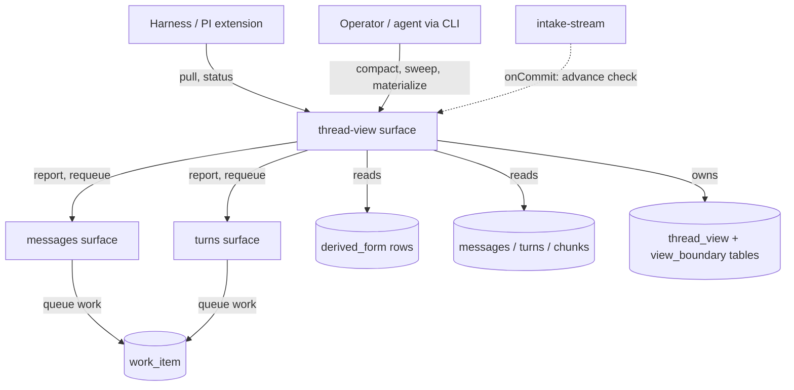
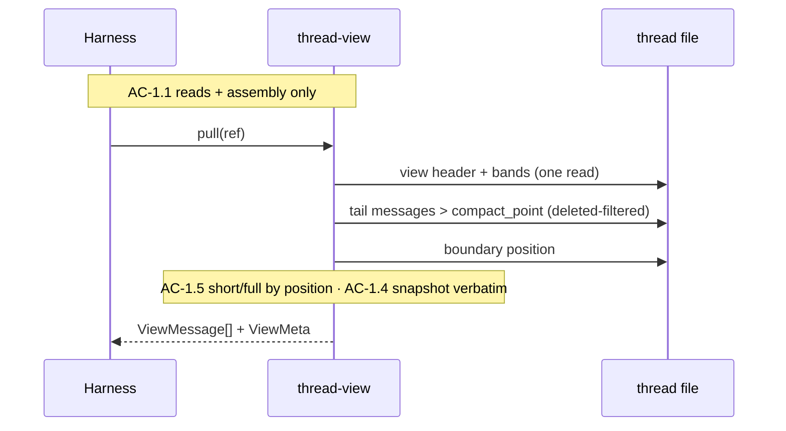

# Epic 03: Thread Views and Smart Compact — Tech Design

**Status:** Draft, complete (companion test plan: `test-plan.md`)

Consumed by: BA/SM (story sharding), Tech Lead (story technical sections), implementing agents (interface and mechanism authority). Epic: `epic.md` (38 ACs, 27 TCs, five flows). Tech arch: `../01-tech-arch.md`. Domain design: `../../01-onboard/02-domain-design.md`. Epic 02 surfaces: `../02-derivation-pipeline/tech-design.md`.

---

## Context

Epics 01 and 02 built a thread record that knows things and a derivation pipeline that summarizes them, and neither produces anything a model can be prompted with. The record holds events, messages, turns, chunks; the pipeline lands seven kinds of derived form beside them. What a harness needs is one assembled artifact: the conversation, arranged as a fidelity gradient, sized to a budget, in the shape its provider API takes. This epic builds that artifact — the thread view — and the four operations around it: pull, compact, sweep, and the visibility boundary that keeps the live tail from drowning in tool output.

Two cost structures dominate the design, and they pull in the same direction: do nothing per-turn. The pull sits on the hot path between the user's action and the model call, so it must be reads and string assembly — every judgment (which chunk in which band, which tool result short) was made earlier by an explicit operation. And the harness caches its prompt prefix; every byte that changes above the newest content is money. The MVP's tool-result truncation re-decided every result's visibility on every message — the prefix churned every turn, which at Opus-class pricing is roughly $0.15 per turn, forever. The replacement design changes the prompt only at discrete, attributable events: a compact (explicit, rare), or a boundary advance (batched, budget-triggered). Between those events, identical pulls return identical bytes.

The view is a snapshot, not a projection-on-read. A compact selects the band arrangement, renders each band's text from stored artifacts, and stores the rendered snapshot; pulls serve those bytes verbatim until the next compact. Record mutations and repairs land in the record immediately and become visible at the next compact — this was settled deliberately in the epic round (edit-then-recompact, no live view patching, no force-refresh) because curation is an occasional batch act, not a runtime channel. The one self-acting piece is the boundary: old tool results in the tail age to short form in batches when a budget breaks, because tool bloat accumulates without anyone deciding it.

The design leans entirely on Epic 02's machinery and adds no derivation of its own. Band material is `derived_form` rows; health reads are the owners' `report` surfaces; repair is the owners' `requeue`; the post-commit trigger is the instance seam from epic-fix-001. One Epic 02 dependency is in flight at design time: the requeue patch (live-work-only queue rows) — Story 3 gates on it. The Epic 02 deviation table was read at design time; the in-flight fix batch (backoff wake, tool-run grouping) improves what this epic consumes but changes no interface this design binds to.

## Spec Validation

Epic 03 validated clean for design: every AC maps to implementation work, contracts are complete, edge TCs exist (corruption refusal, advance failure, monster turn, never-compacted thread). Design-time entries:

| Issue | Spec Location | Resolution | Status |
|-------|---------------|------------|--------|
| Transient classification basis | AC-3.3, epic TD-Q9 | By **reason-code classification table** (per TD-Q9), owned by `sweep.ts`: rate-limit / timeout / provider-unavailable classes ⇒ transient; content-refusal / validation / `unknown_work_kind` ⇒ permanent; **unclassified codes ⇒ permanent** (reported in the receipt as unclassified, never requeued — the conservative default; the other way re-spends on a permanent failure at every compact). Attempt count distinguishes only retrying-vs-exhausted, never repairability. Dependency: exhausted forms must persist the final failure's reason class, not a bare retry-exhausted marker — the Story 0 fixture proves the two failed states carry distinguishable codes; if Epic 02's persisted reason is opaque, that is an Epic 02 patch named at the Story 3 gate. | Resolved — clarified |
| Boundary advance in manual mode | AC-4.9 ("automatic") | The advance runs in **both** host modes: it registers on `ctx.onCommit` and executes synchronously at flush. Unlike the drain (inference, background-only), the advance is cheap and deterministic — a CLI intake must advance the boundary too, or CLI-driven threads bloat. "Automatic" means SDK-internal, not background-mode-only. | Resolved — clarified |
| Brief band cannot always hold all remaining history | AC-2.4 sizing vs degrade-never-omit | The view has a **coverage edge**: oldest chunks beyond the brief budget are outside the view, recorded as `coveredFrom` on the view and in the receipt. This is the window's edge made explicit and reported — not a silent omission (the record keeps everything; inspect reaches it). | Resolved — clarified |
| Band context messages need a role | AC-5.1 | Rendered as `user`-role messages with band-marker headers. Provider APIs reject unknown roles; `system` placement is harness-owned; `user` is what the MVP's injection used and what PI session files accept anywhere. | Resolved — clarified |

## System View

The thread-view domain is a consumer at the top of the existing stack. Everything below it already exists; this epic adds the shaded surface and its storage:



One thread file holds all of it — the view tables live beside the record they render, so a thread file remains self-contained and snapshot-portable (tech arch). The harness's two calls (`pull`, `status`) are hot-path; everything else is operator-paced.

### External Contracts

**The pull result is the product.** What crosses the boundary to the harness:

| Data | Shape | Consumer | Notes |
|------|-------|----------|-------|
| Pull result | `ViewMessage[]` + `ViewMeta` | PI extension context hook | Bands as labeled `user` messages, then tail in record order |
| Status | `ViewStatus` | Extension turn-boundary checks, operators | Numbers only; the caller owns policy |
| Compact receipt | `CompactReceipt` | Operator, extension logging | One JSON receipt; no streaming |
| Sweep receipt | `SweepReceipt` | Operator, compact embedding | Per owner/kind/state accounting |
| Materialized file | PI session JSONL | Closed harnesses, inspection | Format pinned below from PI source |

**PI session file format** (pinned from `repo-ref/pi/packages/coding-agent/src/core/session-manager.ts`): JSONL; line 1 is the header `{ type: "session", version, id, timestamp, cwd }`; each subsequent line is `{ type: "message", id, parentId, timestamp, message: { role, content } }` with `parentId` chaining each entry to the previous. All generated fields derive from view metadata (AC-5.2): `id` from the thread id + view created-at, timestamps from view/message record times, never `Date.now()`. The conformance fixture is a structure-trimmed real PI session file checked into `test/fixtures/`.

**Error contract** (inherited vocabulary, no new classes): `caller_error` (bad profile, bad budgets, unknown thread), `state_corruption` (canonical span unreadable at compact — AC-2.5), `system_error` (storage failures). All operations return `OpResult`; programmer errors at construction throw (Epic 02 rule).

**Runtime prerequisites:** unchanged from Epic 02 — Node with `node:sqlite`, no new dependencies. No provider is required by any Epic 03 operation; the CLI view commands must work with no provider configured (they never call one).

**CLI grammar** (full flag surface, Epic 01/02 convention):

```
lhc view pull        --file-path <p> | --thread-id <id>   [--json]
lhc view status      --file-path <p> | --thread-id <id>   [--json]
lhc view compact     --file-path <p> | --thread-id <id>   [--profile <name>]
                     [--lower-bound <n>] [--full <n>] [--smooth <n>] [--detailed <n>] [--brief <n>]
                     [--no-sweep] [--json]
lhc view sweep       --file-path <p> | --thread-id <id>   [--json]
lhc view materialize --file-path <p> | --thread-id <id>   --out <path> [--format pi-session]
```

Band flags override profile values field-wise (AC-2.2); validation errors name the violated constraint (AC-2.3). Visibility budgets are SDK config; no per-invocation CLI flags for them in this epic.

## Module Boundaries

### Top-Tier Surfaces

| Surface | Source | This Epic's Role |
|---------|--------|------------------|
| `thread-view` | Tech arch (named, empty until now) | The epic's home: all five operations |
| `messages`, `turns` | Inherited | Read-only consumers: report/requeue surfaces, record reads. **No changes to either domain.** |
| `intake-stream` | Inherited | One additive touch: registers the advance check on `ctx.onCommit` (mirror of Epic 02's poke registration) |
| `sdk.ts` / `cli/` | Inherited | SDK gains the `threadView` namespace + view config; CLI gains `lhc view *` commands |

### Placement

```
src/
  sdk.ts                          ← gains: threadView surface assembly; SdkConfig.view (profiles, budgets, threshold)
  domains/
    intake-stream/index.ts        ← gains: one onCommit registration (advance check), beside the existing poke
    thread-view/
      index.ts                    ← NEW: surface — pull, compact, sweep, status, materialize
      internal/
        select.ts                 ← NEW: band selection walk (deterministic arrangement from record + forms)
        render.ts                 ← NEW: band text rendering, degrade ladders, subject keys, tail formatting
        snapshot.ts               ← NEW: thread_view/thread_view_band row IO; atomic replace
        boundary.ts               ← NEW: visibility boundary row IO; advance check; compact reset
        sweep.ts                  ← NEW: report walk, transient classification, requeue calls, receipt
        profiles.ts               ← NEW: built-in profiles; config resolution; validation
        materialize.ts            ← NEW: PI session JSONL writer
  cli/
    view.ts                       ← NEW: lhc view pull|compact|sweep|status|materialize
  shared/
    view.ts                       ← NEW: view vocabulary (types below) — shared so cli/sdk/tests import one home
```

Boundary rules, one addition: `thread-view` imports `messages`/`turns` through their `index.ts` surfaces only, never internals; nothing imports `thread-view/internal`; **and `intake-stream` imports the `thread-view` surface** (the advance registration, Flow 4) — sanctioned by the surface-call rule, named here so Story 0's boundary gate expects it. The check-boundaries script gains both lines: thread-view's allowed imports, and intake-stream's added thread-view-surface line. Note for the script: this creates the domain graph's first surface-level cycle (intake → thread-view → messages ← intake) — runtime-safe (registration-then-flush, no import-time execution), but if the script models a DAG it needs a sanctioned-cycle annotation, not a silent pass.

### Module Responsibility Matrix

| Module | Status | Responsibility | Depends on | ACs |
|--------|--------|----------------|------------|-----|
| `thread-view/index.ts` | NEW | Surface ops, OpResult wrapping, transaction ownership | internals, threads (resolve) | all (entry) |
| `internal/select.ts` | NEW | Band arrangement: who lands in which band, coverage edge | record reads, derived_form reads | AC-2.4, 2.9, 2.10 |
| `internal/render.ts` | NEW | Band/tail text, degrade ladders, gap entries, short forms | select output, forms | AC-2.5, 2.10, 1.5, 4.2, 5.1 |
| `internal/snapshot.ts` | NEW | View rows: read for pull, atomic replace at compact | sqlite | AC-1.4, 2.6 |
| `internal/boundary.ts` | NEW | Boundary row, advance check (sum → move → write), reset | sqlite, config | AC-4.1–4.9 |
| `internal/sweep.ts` | NEW | Walk reports, classify, requeue, receipt | messages/turns surfaces | AC-3.1–3.7 |
| `internal/profiles.ts` | NEW | Built-ins, resolution, validation | config | AC-2.2, 2.3, 4.8 |
| `internal/materialize.ts` | NEW | JSONL render from pull output + view meta | render | AC-5.2–5.4 |
| `cli/view.ts` | NEW | Command parity, JSON output | sdk | AC-3.7, 5.5 |
| `intake-stream/index.ts` | MODIFIED | +1 onCommit registration | shared/context | AC-4.9 |
| `sdk.ts` | MODIFIED | surface assembly, view config validation | thread-view | AC-2.1, 2.2 |

**Must-not-own** (the inverse matrix, the lines that keep this domain honest): `select`/`render` never write derived forms or queue work; `sweep` never touches `work_item` or `derived_form` directly — owners' surfaces only; `boundary` never reads content (token sums come from stored estimates); `materialize` never reads the record directly (it renders pull output, guaranteeing AC-5.3 parity by construction).

## Storage

Migration v6, three tables in the thread file:

```sql
CREATE TABLE thread_view (
  singleton INTEGER PRIMARY KEY CHECK (singleton = 1),  -- one active view, enforced structurally
  view_id TEXT NOT NULL UNIQUE,        -- v<compact event order>, deterministic; receipts/materialize metadata
  created_at TEXT NOT NULL,            -- clock at compact; metadata source for materialize
  compact_point INTEGER NOT NULL,      -- event_order where the tail begins
  covered_from INTEGER NOT NULL,       -- oldest event_order represented in any band
  profile_name TEXT,                   -- null when explicit params
  config_json TEXT NOT NULL,           -- resolved bound + percentages
  arrangement_json TEXT NOT NULL,      -- ordered entries: {band, subjectKind, subjectId, formUsed, degraded}
  gaps_json TEXT NOT NULL,             -- [{band, subjectId, reason}]
  source_state_json TEXT NOT NULL      -- {maxEventOrder, formCounts} the compact saw — receipt/debug
);
CREATE TABLE thread_view_band (
  view_id TEXT NOT NULL REFERENCES thread_view(view_id) ON DELETE CASCADE,
  band TEXT NOT NULL CHECK (band IN ('brief','detailed','smooth')),
  rendered_text TEXT NOT NULL,         -- the snapshot bytes served verbatim
  token_count INTEGER NOT NULL,
  PRIMARY KEY (view_id, band)
);
CREATE TABLE view_boundary (
  thread_singleton INTEGER PRIMARY KEY CHECK (thread_singleton = 1),
  position INTEGER NOT NULL,           -- source event order (compact_point's coordinate system); tool results at-or-behind render short
  updated_at TEXT NOT NULL
);
```

One active view: `thread_view` holds at most one row; compact's transaction deletes and inserts (AC-2.6 — the cascade clears bands with it). The full band is not stored — it *is* the record after `compact_point`, read live at pull. `view_boundary` is a singleton row seeded at migration to position 0 (everything full). Budgets live in config, not rows.

This is the derived-state provenance story for this epic: the snapshot carries its config, its arrangement, its gaps, and the record state it saw (`source_state_json`), so "why does the view say this" is answerable from the row alone. No staleness machinery — the view is *defined* as stale-until-next-compact by product decision, so there is nothing to detect.

## Deterministic Algorithms

The two mechanical cores. Both pure functions over read state; golden cases in the test plan.

### Band selection (`select.ts`)

Inputs: lower bound `L`, percentages `{full, smooth, detailed, brief}`, the record (messages with token estimates, closed turns, chunks with membership), derived forms. Walk backward from newest:

1. **Compact point:** take messages newest-first until their estimate sum first reaches `L × full%`; the compact point is the event order of the oldest taken message's turn *boundary* — snapped forward to the nearest turn start so the tail never begins mid-turn. Open-turn messages always land in the tail regardless of budget.
2. **Smooth band:** closed turns older than the compact point, newest-first, while the band's rendered estimate stays ≤ `L × smooth%`. Estimate = `turn_rendering` token count (fallback form's count when degraded). A turn whose addition would cross the budget stops the band (turn included only if the band was empty — one oversized turn still represents). Whole-entry fills mean the assembled total may land under or over the lower bound — it is a target, not a cap (epic AC-2.4); the receipt carries actuals.
3. **Detailed band:** chunks entirely older than the smooth band's coverage, newest-first, same fill rule against `L × detailed%`, using `chunk_summary_detailed` counts.
4. **Brief band:** remaining chunks, newest-first, against `L × brief%`. When chunks remain after the budget, the view's `covered_from` is the oldest included chunk's start; older history is outside the view (receipt reports it).
5. Turns closed but not yet chunked that fall between detailed/brief coverage and the smooth band stay in the **smooth band's coverage walk** (they are turns; they take the smooth representation and its budget) — bands are defined by *representation*, not by strict time strata.
6. **Turnless messages** (Epic 01 stragglers: events landing between a `turn_end` and the next prompt carry `turnId = null`, e.g. a runtime note) attach to the **following turn** for selection and coverage: they ride that turn's band assignment, their token estimate counts into that turn's cost in the fill walk, and they render raw with a marker (`[inter-turn note]`) immediately before that turn's band entry. A turnless message with no following turn is tail by construction (it sits after the last turn boundary, where the compact point cannot pass it). No message can be outside both the bands' coverage accounting and the tail — the silent-omission hole this rule closes is golden case G4.

Tie-breakers, pinned: inclusion thresholds are ≤ (an entry exactly filling the budget is included); walks are newest-first everywhere; chunk coverage is decided by the chunk's newest member turn. Same inputs ⇒ same arrangement, byte-for-byte (AC-2.9 / TC-4.5's sibling for compact: replay equality is a test-plan golden case).

### Boundary advance (`boundary.ts`)

After intake commit (flush of `ctx.onCommit`): `SUM(token_estimate)` over tool-result messages with `source_event_order > boundary.position` and `source_event_order > compact_point` (one indexed query). The boundary is a **source event order** position everywhere — storage, interfaces, and prose; it shares the compact point's coordinate system. If sum ≤ `max`: return. Else walk those results oldest-first, accumulating flips, until remaining sum ≤ `target` **or** the next flip would touch the protected set. The floor protects **whole messages**: walking newest-backward, tool results join the protected set until its sum first reaches or exceeds `floor` — so at least the newest tool result is always protected when any exists, an oversized newest result is protected alone even though it exceeds the floor by itself, and the full zone may consequently sit above `target` (or even `max`) until newer batches or a compact create room (AC-4.5). Write the new position (own short transaction), done. Never backward; compact reset writes `position = compact_point` inside the compact transaction. Failures: caught, logged to stderr-level diagnostics, never thrown into intake's caller — the condition stays visible because status computes the same sum live (AC-4.9's "visible in status" is structural, not stored).

### Degrade ladders (`render.ts`)

| Band / context | First | Then (degraded) | Then (degraded) | Gap entry |
|----------------|-------|------------------|------------------|-----------|
| Smooth (turn) | `turn_rendering` | `lower_band_projection` | deterministic excerpt of the turn's messages (truncated, marked) | `[turn t12 unavailable: <reason>]` |
| Detailed (chunk) | `chunk_summary_detailed` | `chunk_summary_brief` | concatenated member projections (truncated, marked) | `[chunk c4 unavailable: <reason>]` |
| Brief (chunk) | `chunk_summary_brief` | `chunk_summary_detailed`, truncated | — | `[chunk c4 unavailable: <reason>]` |
| Tail tool result (short) | `tool_result_summary` | deterministic truncation (existing Epic 01 abbreviation rule) | — | n/a (raw content always exists) |

"Usable" means `state = ready`. Every fallback marks the entry degraded in the arrangement and the rendered text (`[degraded: brief-from-detailed]`); every band entry renders its subject key (`§c4`, `§t12` — AC-2.10). A gap entry is the last rung, never absence: every selected subject appears in the rendered band in some form (AC-2.5).

### Tail message rendering (`render.ts`)

The tail mapping is contract, not implementation choice — it shapes both render targets identically:

| Message kind | Role | Content shape |
|--------------|------|---------------|
| `user_prompt` | `user` | text verbatim |
| `assistant_text` | `assistant` | text verbatim |
| `assistant_thinking` | `assistant` | fenced: `[thinking]\n<text>\n[/thinking]` — included (the tail is full fidelity; bands compress thinking away for older turns); harness-side conversion may re-block or drop per provider rules |
| `tool_call` | `assistant` | `[tool call · <name>] <compact args>` — deterministic arg rendering, Epic 01's abbreviation rule for oversized args |
| `tool_result` (ahead of boundary) | `user` | `[tool result · <name>]\n<full content>` |
| `tool_result` (at-or-behind boundary) | `user` | `[tool result · <name> · abridged]\n<summary or deterministic truncation>` (per the short-form ladder) |
| `runtime_note` | `user` | `[runtime note] <text>` |

Worked example — a flipped result followed by live work:

```
user:      [tool result · read_file · abridged]
           Read src/scheduler.ts (412 lines): drain loop with single-flight
           coalescing; poke registration on commit. [full content in record §m214]
assistant: [thinking]
           The drain stops on waiting — that's the stall. Fix is a timer at eligible_at.
           [/thinking]
assistant: The scheduler never wakes after backoff. Patching claimNext's caller.
assistant: [tool call · edit] src/scheduler.ts: +wake timer at waitingUntil
user:      [tool result · edit]
           Successfully replaced 1 block in src/scheduler.ts.
```

## Flow-by-Flow Design

### Flow 1: Pull

**Covers:** AC-1.1–1.7. The hot-path read. Resolve thread → read view header + band rows (if any) → read tail messages after `compact_point` (deleted-filtered, record order) → read boundary → format: band messages (one `user` message per non-empty band, marker header + snapshot bytes verbatim), then tail messages (tool results at-or-behind boundary in short form), return with `ViewMeta`. No view row: whole record is tail from event 1 (AC-1.3).



### Flow 2: Compact

**Covers:** AC-2.1–2.7, 2.9, 2.10. Operator-paced. Resolve → validate profile/params (`profiles.ts`, AC-2.2/2.3) → sweep unless skipped (Flow 3; its receipt embeds) → read record + forms → `select.ts` arrangement → `render.ts` band texts + gaps → one `BEGIN IMMEDIATE` transaction: delete old view row (cascade drops bands), insert new header + bands, write boundary reset → receipt.

```mermaid
sequenceDiagram
    participant OP as Operator/CLI
    participant TV as thread-view
    participant SW as sweep.ts
    participant MT as messages/turns
    participant DB as thread file
    OP->>TV: compact(ref, {profile})
    TV->>TV: resolve + validate (AC-2.2/2.3)
    alt sweep not skipped (AC-3.6)
        TV->>SW: sweep
        SW->>MT: report ×2
        SW->>MT: requeue (transient only)
        SW-->>TV: SweepReceipt (no waiting, AC-3.2)
    end
    TV->>DB: read record + derived forms
    Note over TV: select.ts — corruption check aborts here,<br/>prior view untouched (AC-2.5)
    Note over TV: render.ts — ladders, gaps, keys (AC-2.10)
    TV->>DB: BEGIN IMMEDIATE
    TV->>DB: delete view row (cascade bands)
    TV->>DB: insert header + bands
    TV->>DB: boundary ← compact point (AC-4.7)
    TV->>DB: COMMIT (AC-2.6 — crash = rollback whole)
    TV-->>OP: CompactReceipt (AC-2.7)
``` Corruption check: selection reads that hit unreadable canonical rows (missing message for a turn member, broken chunk membership) abort pre-transaction with `state_corruption` naming the subject (AC-2.5); the prior view is untouched because nothing wrote. Crash inside the transaction: SQLite rolls back whole — prior view serves (AC-2.6, TC-2.4 via the Story-0 injection seam).

### Flow 3: Sweep

**Covers:** AC-3.1–3.7. `messages.report` + `turns.report` → bucket each form: `ready` / `pending`→in-flight / `blocked` / `failed`+classify by the reason-code table (transient / permanent / unclassified-as-permanent). Transient: call owner's `requeue`; `noop: already_queued` counts as in-flight (this is also what makes AC-3.4's once-per-invocation structural — the second ask is a noop). Permanent or blocked: report only. Receipt per owner/kind/state with reasons. No waiting: requeue returns when the row is written; background mode's queue drains it later (TC-3.4's heal leg).

### Flow 4: Boundary

**Covers:** AC-4.1–4.9. Two writers only: the post-commit advance (described above) and compact's reset.

**Wiring (DD — the advance seam, pinned).** Intake-stream imports the thread-view *surface* (sanctioned: domains call each other's surfaces in-process, never internals — the same rule that lets intake call `messages.createFromEvent`). At the end of batch projection it registers the advance on `ctx.onCommit`: advance first (synchronous, cheap), queue poke second (fires async drain); the advance call is wrapped so a throw is caught and diagnosed, never eats the poke, never reaches intake's caller (isolation half of epic TD-Q1). The advance runs at flush in **both host modes** — unlike the poke it is not mode-gated, because it is deterministic and cheap; this is what keeps CLI-driven threads from bloating. **Budgets resolve like the poke resolves** (epic-fix-001's instance seam): an SDK operation carries its instance's `SdkViewConfig.visibility` on the per-instance seam; below-SDK direct domain calls fall back to the defaults (32000/24000/8000). The CLI builds a real SDK (`cli/work.ts` pattern), so CLI intake gets config-or-defaults through the same path — no separate CLI budget channel, no silently different behavior. The advance's `SUM(token_estimate)` filters deleted messages — the sum must equal what pull would render.

### Flow 5: Materialize

**Covers:** AC-5.1–5.5. `materialize(ref, { path })`: run pull internally, map to JSONL (header from view metadata; entries chained by parentId; band messages and tail messages in pull order), write file, return path. Parity with pull is structural — same source array (AC-5.3). Never-compacted threads materialize their tail-only pull (AC-5.4). CLI: `lhc view pull --json`, `lhc view materialize --out <path>`.

## Interface Definitions

`src/shared/view.ts` — the vocabulary (abridged to the load-bearing shapes; field comments carry AC refs in source):

```typescript
export type Band = "brief" | "detailed" | "smooth";

export interface ViewProfile {
  name: string;
  lowerBound: number;                     // target assembled size; whole-entry fills may land under or over (epic Data Contracts)
  percentages: { full: number; smooth: number; detailed: number; brief: number }; // sum 100
}
export interface VisibilityBudgets { maxTokens: number; targetTokens: number; floorTokens: number; } // max > target ≥ floor

export interface ViewMessage { role: "user" | "assistant"; content: string; band?: Band; } // band absent ⇒ tail
export interface ViewMeta {
  compactPoint: number | null;            // null ⇒ never compacted (AC-1.3)
  coveredFrom: number | null;
  boundaryPosition: number;
  gapCount: number; degradedCount: number;
  viewId: string | null; createdAt: string | null;
}
export interface PullResult { messages: ViewMessage[]; meta: ViewMeta; }

export interface ViewStatus {
  tailTokens: number; threshold: number; compactRecommended: boolean;
  derivation: { pending: number; retrying: number; failed: number; blocked: number };
  view: { degraded: number; gaps: number; builtAt: string } | null;
  visibility: { zoneTokens: number; maxTokens: number };
}

export interface CompactReceipt {
  viewId: string; profile: string | null; config: ViewProfile["percentages"] & { lowerBound: number };
  bands: Record<Band, { entries: number; tokens: number }>;
  tailTokens: number; coveredFrom: number; compactPoint: number;
  degraded: Array<{ band: Band; subjectId: string; usedForm: string }>;
  gaps: Array<{ band: Band; subjectId: string; reason: string }>;
  sweep: SweepReceipt | { skipped: true };
}
export interface SweepReceipt {
  owners: Array<{ owner: "messages" | "turns"; kind: string;
    ready: number; inFlight: number; requeued: string[];           // subject ids
    blocked: Array<{ subjectId: string; reason: string }>;
    permanentFailed: Array<{ subjectId: string; reason: string }>; }>;
}
```

Surface (`thread-view/index.ts`) — all `Promise<OpResult<...>>`, all taking `ThreadRef`:

```typescript
export async function pull(ref: ThreadRef): Promise<OpResult<PullResult>>;
export async function status(ref: ThreadRef): Promise<OpResult<ViewStatus>>;
export async function compact(ref: ThreadRef, opts: { profile?: string; params?: Partial<ViewProfile>; sweep?: boolean }): Promise<OpResult<CompactReceipt>>;
export async function sweep(ref: ThreadRef): Promise<OpResult<SweepReceipt>>;
export async function materialize(ref: ThreadRef, opts: { path: string; format?: "pi-session" }): Promise<OpResult<{ writtenPath: string }>>;
```

Stubs are structured-result: each returns `{ ok: false, errorClass: "system_error", reason: "not implemented: <op>" }` until Green (machine-readable contract; no throw stubs on this surface). Internal pure functions (`selectArrangement`, `advanceDecision`, `renderBand`) may throw `NotImplementedError` in skeleton.

**SDK config addition** (validated at construction, throws on nonsense per Epic 02 rule):

```typescript
export interface SdkViewConfig {
  profiles?: ViewProfile[];               // merged over built-ins by name
  visibility?: Partial<VisibilityBudgets>; // defaults: 32000 / 24000 / 8000
  compactThreshold?: number;              // status trigger; default 160000
}
```

Built-in profiles (defaults, knobs not architecture): `continuation` 120k/30/30/20/20, `conversation` 120k/12/48/20/20, `coding` 120k/25/35/20/20.

## Testing Strategy

Inherited wholesale from Epic 02: real temp SQLite thread files everywhere (persistence is the product); the deterministic `DerivationProvider` fake is the only mock, and in this epic it appears *only in fixture setup* (draining Epic 02 work to manufacture form states) — no Epic 03 operation may touch it, and the architecture-risk suite asserts zero provider calls across pull/compact/sweep/status/materialize. CLI parity through the spawned-process suite (`LHC_PROCESS_SUITE=1`). Verification tiers reuse the project's existing `verify` family unchanged.

The Story-0 fixture is the load-bearing test asset: one recorded conversation (~12 turns, 4 chunks, tool-heavy middle) drained through real Epic 02 machinery into known form states — ready everywhere, plus manufactured failed-transient (provider fake scripted retryable-fail-exhaust on named subjects), failed-permanent (scripted non-retryable), blocked (source damage via the Epic 01 corruption pattern on a sacrificial sibling fixture), and a canonical-corruption variant. States reached through production paths, never hand-written rows; fixture invariant tests prove each state by read-back before any story consumes it.

Full TC→test mapping, architecture-risk table, golden cases for both algorithms, and chunk Red/Green detail: `test-plan.md` (Config A companion).

## Work Breakdown

Chunks mirror the epic's six stories 1:1 — the cut survived design unchanged.

| Chunk | Scope | ACs | Key risk carried |
|-------|-------|-----|------------------|
| 0 Foundation | v6 migration, profiles, fixture, seam injection point | FC-0.x | Fixture fidelity (production-path states) |
| 1 Pull + Status | Tail-only pull, status read | AC-1.1–1.3, 1.5p, 1.7, 2.8 | Array shape is the contract everything renders into |
| 2 Compact | Selection, render, snapshot, atomic replace, receipts | AC-2.1–2.7, 2.9, 2.10, 1.4, 1.6 | Atomic replace (crash test); selection determinism goldens |
| 3 Sweep | Walk, classify, requeue, receipts, embed | AC-3.1–3.7 | **Gate (extended): Epic 02 requeue patch landed, AND the terminal-failure write path verified against landed code** — exhausted forms must persist a classifiable reason class (and `metadata.attempts`/`lastError` per the patch direction); if the persisted reason is opaque at the gate check, the named Epic 02 patch is: stamp the provider's `retryable` flag onto the failed form at exhaustion (Epic 02 knew it at failure time and currently discards it), which makes classification exact rather than inferred |
| 4 Boundary | Advance, floor, reset, short-form pulls | AC-4.1–4.9, 1.5 | Seam ordering with poke; monster-turn floor |
| 5 Render targets | Materialize, format fixture, parity, CLI | AC-5.1–5.5 | Format fidelity to real PI session |

Dependencies: 0 → 1 → 2 → {3, 4} → 5 (3 and 4 are independent of each other; 5 wants 4 so the boundary-affected tail proves parity in both targets).

## Open Questions

| # | Question | Blocks | Resolution path |
|---|----------|--------|-----------------|
| Q1 | Does the PI extension want band messages split per-band (current design) or as one block? | Nothing (shape change is render-local) | Settle during extension integration; revisit at Epic 05/PRD-2 |

Note on `view_id` (`v<compact event order>`): two compacts with no intervening intake produce the same id. Harmless — the singleton row is replaced whole and `created_at` disambiguates receipts — but stated so nobody "fixes" it into a uniqueness bug hunt.

## Deferred Items

| Item | Related | Reason |
|------|---------|--------|
| Non-PI render formats | AC-5.x | Epic scope: renderer-per-format is additive later |
| Sweep cross-invocation requeue cap | AC-3.4, epic TD-Q6 | Receipt visibility suffices v1; revisit if repeated-transient-failure loops appear in use |
| Aging banded history out of the thread file | — | Future direction (tech arch); `covered_from` is the seam it will use |
