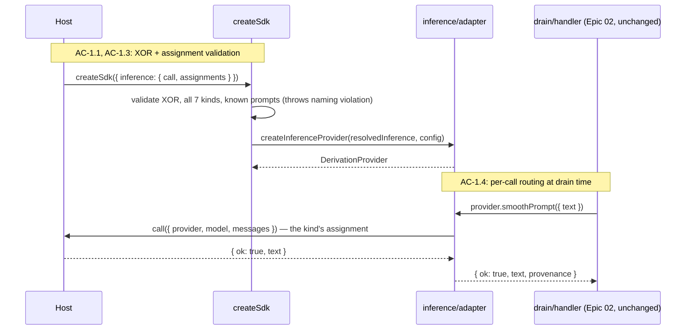

# Epic 05: Derivation Inference — Tech Design

**Epic:** `epic.md` (22 ACs / 15 TCs across 6 flows)
**Test Plan:** `test-plan.md` (full TC→test mapping, Red/Green detail)
**Tech Arch:** `../01-tech-arch.md`
**Consumed contracts:** Epic 02 provider seam and queue machinery (as built, deviations closed), Epic 03 visibility boundary (Flow 5 patches its contract), Epic 04 lifecycle exercise (as built; deviation state — e.g. overview boundary from `pull.meta` — is the consumed truth)

## Context

Four epics built a derivation pipeline that has never made a model call. The seam was designed for this moment: `DerivationProvider` is an interface with seven semantic operations, the deterministic provider implements it with marker strings, and every handler, queue row, retry path, and state transition in `domains/` is provider-agnostic. This epic builds the second implementation of that interface — the real one — plus the injection path that lets a host supply model access without LHC ever touching a credential.

The design splits inference into two layers with different owners. The **semantic layer** is LHC's and lives in a new `src/inference/` area: seven prompt templates, output shaping, per-kind model assignment, failure classification, provenance stamping. The **transport layer** is the host's and crosses the boundary as exactly one function: `(provider, model, messages) → text or structured failure`. The host's function is the only code that knows what `"anthropic"` means; LHC treats provider and model strings as opaque routing keys carried from config to call. This is the seam decision recorded in `post-epic-4-work.md`, and it is why the PI extension's eventual contribution is ~15 lines while the seven prompts stay tunable inside LHC without touching any host.

Two riders land in the same epic because they consolidate decisions the inference work exposes. The CLI retirement deletes the one consumer of the named-provider registry and env-resolution path, which means provider arrival collapses to a single mechanism — injection at `createSdk` — exactly as the new `inference` config option arrives. Doing these together means the construction-validation story is written once against the final shape rather than patched twice. The boundary-advance patch is independent of inference entirely; it rides because it is small, fully validated in the POC (commits `1cf2dc45`, `6a9aa7a4`, `f12a850d` are the reference implementation), and it shares this pack's spec cycle rather than deserving its own.

One thing this design deliberately does not do: chase output quality. The prompts ship structurally sound and explicitly pre-dial-in; the dial-in working period that follows the integrated-harness pairing produces the tuned prompts and model choices, and its findings backfill this pack before acceptance. Every TC in this epic asserts structure, routing, classification, and provenance — never whether a summary is good.

## Design Decisions

- **DD-1: One transport function, not seven.** The host injects a single `ModelCall`; per-kind knowledge (which provider/model/prompt) lives in LHC config. Injecting seven functions would move LHC's derivation catalog into every host's wiring and make an eighth kind a breaking host change. The function takes the provider string per call, so multi-lane hosts route inside one function.
- **DD-2: The adapter is a `DerivationProvider`.** No seam movement. `createInferenceProvider(inference, config)` returns the same interface the deterministic provider implements; `createSdk` and everything below it see a provider, full stop. Handlers, queue, drain, states: zero changes for Flows 1–4 (except the one-line provenance copy, DD-4).
- **DD-3: Classification maps onto the existing `ProviderResult`.** Epic 02's failure shape is already `{ ok: false, retryable, reason }`. The classification table is a pure function `ModelCallFailureKind → { retryable, reason }` where `reason` is the kind string itself — stable, machine-readable, and the queue machinery consumes `retryable` exactly as it always has. No queue changes, no new states.
- **DD-4: Provenance rides the `ProviderResult` and is copied, never authored.** The ok branch gains `provenance?: { provider, model, prompt }`. The adapter stamps it (it alone knows the assignment); handlers copy it into `DerivedFormMetadata.provenance` alongside the existing mechanical stamps. The deterministic provider simply never sets it. This keeps the "metadata is mechanically stamped" invariant: provenance comes from config-known strings, not model output.
- **DD-5: Construction is `provider` XOR `inference`.** `createSdk` accepts exactly one. The `inference` path validates the assignment map (all seven `FormKind`s present, every prompt name known) and builds the adapter; the `provider` path is unchanged and keeps the deterministic provider as the test default. Both/neither is a `TypeError` at construction, matching the existing config-mistakes-throw contract.
- **DD-6: The adapter owns a per-call timeout.** Epic tech-design question 2, resolved: a hung host function must not stall a drain, and the host shouldn't have to remember a duty LHC can enforce. `Promise.race` against `inference.timeoutMs` (default 60 000); a timeout classifies as `timeout` (retryable). A host that resolves later resolves into nothing.
- **DD-7: Input bounding is an adapter seam with a generous default.** Question 3, resolved: `summarizeToolResult` content over `inference.maxInputChars` (default 200 000) is truncated head-and-tail with a marker before prompt rendering. The bound exists so a pathological tool result cannot blow a small-context model; the value is a dial-in tunable, the seam is design.
- **DD-8: Prompts are modules in a name-keyed registry.** Question 1, resolved: `src/inference/prompts/` holds one module per template exporting `{ name, render(input) → messages }`; `prompts/index.ts` assembles the registry. Config selects by name; dial-in swaps by adding a module and editing config — no handler, adapter, or host changes. Versioning is in the name (`smoothing-v1`).
- **DD-9: The turn-end trigger is a gate in the pipeline, not a new seam.** Question 4, resolved: `pipeline.ts` already registers the advance `onCommit`, ordered before the queue poke, throw-isolated, both host modes. The change is registering it only when the batch's walk saw a `turn_end` event. Ordering against the queue poke is untouched — same registration site, same pinned order. The advance still runs at flush strictly after intake's COMMIT, in its own short transaction.
- **DD-10: Whole-turn eviction via `turn_id` grouping; turnless results degrade to singleton groups.** The zone walk groups tool results by `turn_id` (the message column), oldest group first by the group's lowest `source_event_order`. A `turn_id IS NULL` tool result (turnless intake is legal) is its own group — whole-turn semantics degenerate to whole-message for messages that belong to no turn, which preserves the epic's "no turn is ever partially flipped" without inventing membership.
- **DD-11: Floor retirement is a config-surface change, not a migration.** `VisibilityBudgets` becomes `{ maxTokens, targetTokens }` (64 000 / 32 000 defaults); `floorTokens` is deleted from the type, resolution, and validation. No schema change — `view_boundary` is untouched; the decision function changes shape, the storage doesn't. The protected floor's *job* survives structurally: the newest closed turn group is never evicted, and the open turn is invisible to a check that only runs at turn close.
- **DD-12: CLI deletion removes the registry, keeps the deterministic provider.** `src/providers/registry.ts` (named resolution, `LHC_PROVIDER`) dies with its only consumer. `src/providers/deterministic.ts` stays — it is the CI-default test provider and the byte-stable fixture substrate. The twelve `cli-process-*.test.ts` suites delete; `verify-all` drops the `LHC_PROCESS_SUITE` gate and gains the opt-in inference suite (which self-reports ran/not-ran).
- **DD-13: The real-inference suite is a second host of the same contract.** The OpenRouter-backed `ModelCall` lives in `test/fixtures/openrouter-call.ts`, implements the AC-1.2 contract over plain `fetch`, and runs Flow 1's construction/routing assertions parameterized (question 5, resolved: shared assertion helpers parameterized over the function, not duplicated tests). Key arrives via `OPENROUTER_API_KEY`; absence produces an explicit not-ran record, never a silent pass.

## Top-Tier Surfaces

| Surface | Source | This Epic's Role |
|---------|--------|------------------|
| SDK assembly (`src/sdk.ts`) | Tech arch | Gains the `inference` construction path (DD-5); loses CLI-only exports |
| `shared/` | Tech arch | `derivation.ts` gains provenance on `ProviderResult`/metadata; `view.ts` loses `floorTokens` |
| `inference/` (new, peer of `providers/`) | This epic | The semantic layer: adapter, classification, prompts. Not a domain — it implements the provider seam, owns no thread state, queues no work |
| `domains/thread-view` | Tech arch | `boundary.ts` decision reshape (DD-10); seam/registration untouched except the gate (DD-9) |
| `domains/intake-stream` | Tech arch | One-line gate on the advance registration (DD-9) |
| `domains/messages`, `domains/turns` | Tech arch | One-line provenance copy in each handler's form write (DD-4) |
| `cli/`, `providers/registry` | Tech arch (retiring) | Deleted (DD-12) |

`inference/` must not import `domains/`; it depends only on `shared/` types. The boundaries check gains that rule.

## Module Architecture

```
src/
├── inference/                          # NEW: the semantic layer (DD-1..DD-8)
│   ├── types.ts                        # NEW: ModelCall, ModelCallResult, ModelCallFailureKind,
│   │                                   #      InferenceConfig, ModelAssignment, ResolvedInferenceConfig
│   ├── classify.ts                     # NEW: classification table + exception containment (DD-3)
│   ├── adapter.ts                      # NEW: createInferenceProvider — DerivationProvider impl (DD-2)
│   └── prompts/
│       ├── index.ts                    # NEW: PROMPT_REGISTRY (name → PromptTemplate) (DD-8)
│       ├── smoothing-v1.ts             # NEW: ported from POC, settled
│       ├── tool-call-v1.ts             # NEW: pre-dial-in
│       ├── tool-result-v1.ts           # NEW: pre-dial-in (input bounding lives here-adjacent, DD-7)
│       ├── turn-compose-v1.ts          # NEW: pre-dial-in
│       ├── lower-band-v1.ts            # NEW: pre-dial-in
│       ├── chunk-detailed-v1.ts        # NEW: pre-dial-in
│       └── chunk-brief-v1.ts           # NEW: pre-dial-in
├── sdk.ts                              # MODIFIED: provider XOR inference; assignment validation;
│                                       #           export cleanup (registry exports removed)
├── shared/
│   ├── derivation.ts                   # MODIFIED: ProviderResult ok-branch + DerivedFormMetadata
│   │                                   #           gain provenance? (DD-4)
│   └── view.ts                         # MODIFIED: VisibilityBudgets → { maxTokens, targetTokens },
│                                       #           defaults 64000/32000 (DD-11)
├── domains/
│   ├── intake-stream/internal/pipeline.ts   # MODIFIED: advance registration gated on turn_end (DD-9)
│   ├── thread-view/internal/boundary.ts     # MODIFIED: turn-grouped zone, peek-ahead decision (DD-10)
│   ├── messages/internal/…handlers          # MODIFIED: copy result.provenance → metadata (DD-4)
│   └── turns/internal/…handlers             # MODIFIED: same one-line copy (DD-4)
├── providers/
│   ├── deterministic.ts                # EXISTS: unchanged — CI-default test provider
│   └── registry.ts                     # DELETED (DD-12)
└── cli/                                # DELETED entirely (DD-12)
```

## Module Responsibility Matrix

| Module | Status | Responsibility | Dependencies | ACs |
|--------|--------|----------------|--------------|-----|
| `inference/types.ts` | NEW | The boundary vocabulary: `ModelCall` contract, failure kinds, config shapes | none (pure types) | AC-1.2 |
| `inference/classify.ts` | NEW | `classifyFailure(kind)` table; `safeCall` wrapper (timeout, thrown-exception containment) | `types` | AC-3.1, AC-3.3, AC-2.4 (empty-output check lives in adapter but classifies here) |
| `inference/adapter.ts` | NEW | The seven operations: render prompt → bounded input → `safeCall` → shape → `ProviderResult` with provenance | `types`, `classify`, `prompts`, `shared/derivation` | AC-2.1, AC-2.2, AC-2.4, AC-2.5, AC-1.4 |
| `inference/prompts/*` | NEW | Named templates: `render(input) → messages`; registry | `shared/derivation` (input types) | AC-2.2, AC-2.3 |
| `sdk.ts` | MODIFIED | XOR validation, assignment validation (all seven kinds, known prompts), adapter construction; SDK-only export surface | `inference/*`, existing | AC-1.1, AC-1.3, AC-6.1 |
| `shared/derivation.ts` | MODIFIED | Provenance fields on result/metadata | — | AC-2.5 |
| `domains/*/handlers` | MODIFIED | Copy `provenance` into form metadata on success | — | AC-2.5 |
| `shared/view.ts` | MODIFIED | Two-field budgets, 64k/32k defaults, `max > target` validation | — | AC-5.4 |
| `intake-stream/pipeline.ts` | MODIFIED | Register advance only when batch committed a `turn_end` | — | AC-5.1 |
| `thread-view/boundary.ts` | MODIFIED | Turn-grouped zone read; peek-ahead whole-group decision; newest-group protection | — | AC-5.1–5.3, AC-5.5 |
| `test/fixtures/openrouter-call.ts` | NEW (test) | The real `ModelCall` host: fetch to OpenRouter, contract-conformant failures, key resolution | — | AC-4.1 |
| deletions (`cli/`, `registry.ts`, process suites) | DELETED | — | — | AC-6.1–6.3 |

Queue machinery, drain, states, repair report: explicitly **untouched** (DD-3). Flow 3's behavior lands entirely in `classify.ts` + the adapter; the queue consumes `retryable` as it has since Epic 02.

## Flow-by-Flow Design

### Flow 1: Inference Wiring and Model Assignment (AC-1.1–1.4)

Construction is where every mistake should die. `createSdk` gains the XOR check first (before any other validation, so the error names the rule, not a downstream symptom), then — on the `inference` path — assignment validation: iterate the seven `FormKind`s, require each present with non-empty `provider`/`model` strings and a `prompt` name found in `PROMPT_REGISTRY`; reject unknown kind keys. The resolved config then feeds `createInferenceProvider`, whose return value drops into the existing `resolved.provider` slot — everything downstream of construction is Epic 02 code.



The routing fact worth stating precisely: the adapter closes over the assignment map at construction; each operation looks up its own kind's entry at call time. There is no per-thread or per-item routing state — two drained items of different kinds calling different lanes is just two closure lookups.

### Flow 2: The Adapter and the Seven Prompts (AC-2.1–2.5)

Each adapter operation is the same five-step pipeline: (1) bound the input where DD-7 applies, (2) `render` the kind's prompt template into a messages array, (3) `safeCall` the host function with the kind's assignment, (4) reject empty/whitespace text as `empty_output`, (5) return `{ ok: true, text, provenance }`. The operations differ only in which template renders and which input fields embed — the pipeline is one private function parameterized by kind.

A prompt template's contract, worked example (`tool-result-v1`):

```ts
// prompts/tool-result-v1.ts
export const toolResultV1: PromptTemplate<{ toolName: string; content: string }> = {
  name: "tool-result-v1",
  render: (i) => [
    { role: "system", content: "You summarize tool output for an engineering record. Preserve concrete facts: paths, identifiers, counts, error text. State the outcome plainly. No commentary, no speculation, 150 words maximum." },
    { role: "user", content: `Tool: ${i.toolName}\n\nOutput:\n${i.content}` },
  ],
};
```

The rendered array is the entire call — single-turn, no tools, no streaming (Assumption 2). The smoothing template ports the POC's settled prompt text verbatim; the other six are written to its standard (concrete instruction, fact-preservation rule, length bound) and carry a `// PRE-DIAL-IN` marker comment. The chunk-brief template's input is already receipt-stripped by the Epic 02 handler before the provider is called — the adapter inherits that structural guarantee and the test plan re-asserts it through the adapter (TC-2.2).

What the adapter must never do: parse the response for outcomes, receipts, or any mechanical fact. Those stamps happen in handlers from the record, exactly as under the deterministic provider (AC-2.2). The adapter's only additions to the result are the text and the config-known provenance strings.

### Flow 3: Failure Classification (AC-3.1–3.3)

`classify.ts` is two small exports. The table:

```ts
export const FAILURE_CLASSIFICATION: Record<ModelCallFailureKind, { retryable: boolean }> = {
  rate_limit: { retryable: true },
  timeout: { retryable: true },
  network: { retryable: true },
  empty_output: { retryable: true },
  other: { retryable: true },
  auth: { retryable: false },
  invalid_request: { retryable: false },
};
```

And `safeCall(call, input, timeoutMs)`: wraps the host function in try/catch (thrown → `{ ok: false, kind: "other", message }`) and a timeout race (→ `{ ok: false, kind: "timeout", message }`). The adapter maps the structured failure to Epic 02's `ProviderResult`: `{ ok: false, retryable: FAILURE_CLASSIFICATION[kind].retryable, reason: kind }`. From there the existing machinery does everything — backoff on retryable, immediate `failed` on terminal, exhaustion copying attempts/last-error into form metadata. The misconfigured-lane story (config names an unauthed provider) needs no code: the host function returns `auth`, classification makes it terminal, the health report shows `failed` forms with reason `auth` per assigned kind.

### Flow 4: Real-Inference Verification (AC-4.1–4.2)

The suite (`test/inference-real.test.ts`) keys on `OPENROUTER_API_KEY`. Present: build the OpenRouter `ModelCall` fixture, construct an SDK with all seven kinds assigned to the configured cheap model (`OPENROUTER_MODEL`, defaulted in the fixture), and run the legs. Absent: emit one structured not-ran record (a test that asserts-and-reports the skip reason loudly — visible in output as `NOT-RAN: real-inference (OPENROUTER_API_KEY unset)`, never a green checkmark indistinguishable from a pass). The accounting rule is implemented as a suite-level guard, not per-test `skip`s, so the run/not-run state is one fact reported once.

The capstone reuses Epic 04's lifecycle sequence with the assertion set swapped: where the deterministic leg asserted byte-exact replay and marker content, this leg asserts structure — every `FormKind` reaches `ready` at least once with non-empty text containing no deterministic marker pattern (`/^(smoothed|toolcall|toolresult|rendering|projection|detailed|brief)\(/`), provenance naming the real model, and the checkpoint-coherence ladder (mutation clears → pending; drain → ready with *different* content; second compact's view reflects post-edit content).

### Flow 5: Turn-End Boundary Advance (AC-5.1–5.5)

Two modules change. In `pipeline.ts`, the walk already knows whether the batch contained a `turn_end` (it processes the event kinds); the advance registration at line ~150 gains that condition. Everything about the registration — first-before-poke order, throw isolation, both host modes, flush-after-COMMIT — is untouched.

In `boundary.ts`, the zone read gains `turn_id` and the decision regroups:

```
readZoneToolResults: + turn_id per row (same WHERE, same order)
groupZone: consecutive rows by turn_id → groups, each { turnId, sourceEventOrders, tokenSum }
           (turn_id NULL ⇒ singleton group, DD-10)
advanceDecision(groups, { maxTokens, targetTokens }):
  total ≤ max → null
  walk groups oldest-first, stopping before the protected tail
    (the newest closed turn + any trailing turnless singletons recorded
     after it; with no closed turn in the zone, the newest group):
    evict group only if (remaining − group.tokenSum) ≥ target   ← peek-ahead, AC-5.3
    newPosition = group's highest sourceEventOrder
  return newPosition
    (lands in [target, target + one group) only when reachable without
     evicting the protected tail; otherwise the protections win and the
     zone lawfully stays above the window, AC-5.3)
```

Worked example (golden G2 in the test plan): groups of 30k/25k/20k/15k tokens (oldest→newest), max 64k, target 32k. Total 90k > max. Evict 30k → 60k remaining, ≥ 32k ✓. Evict 25k → 35k remaining, ≥ 32k ✓. Peek 20k: 35k − 20k = 15k < 32k → stop. Boundary lands after the 25k group; zone = 35k, in [32k, 32k+20k). The 15k newest group was never a candidate.

The landing window is conditional, not absolute. The `[target, target + one group)` guarantee holds only when reachable without breaking the explicit protections: newest-closed-turn protection, and the structural protection of trailing turnless singleton groups recorded after the newest closed turn. Those trailing singletons cannot be evicted without first flipping the protected newest turn — the boundary is a positional marker advanced oldest-first, so any landing at or past them would render that turn short — which is why their protection is structural rather than a separate rule. When those protections force the zone to remain above the window, they take precedence and the landing guarantee does not apply; the zone lawfully sits above target, or even above max, until a newer turn closes or a compact creates room. TC-5.2's newest-turn-protection leg — the newest closed turn alone exceeding target, leaving the zone above `target + one turn` — is the canonical instance of this exception, and the implementation and tests already enforce it.

The shared-query invariant survives: `visibilityZoneTokens` (status's sum) and the decision's walk read the same WHERE-clause population, so status and advance can never disagree about the zone — the property the existing code makes structural stays structural.

`VisibilityBudgets` loses `floorTokens` everywhere it appears: the type, `resolveViewConfig`'s defaults and validation (which gains `maxTokens > targetTokens`), and the status read's reporting shape is unchanged (`zoneTokens`/`maxTokens` already). Existing Epic 03 tests asserting floor behavior are superseded — the test plan's amendment ledger names each one (the spec-sanctioned test-change path, as Epic 02's F-3 established).

### Flow 6: CLI Retirement (AC-6.1–6.3)

Deletion plus proof. Delete `src/cli/`, the `src/cli.ts` bin entrypoint (a separate file outside the directory — it imports `./cli/index.js` and breaks the build if left), the `bin` manifest entry, and the `dev:cli` script; delete `src/providers/registry.ts` and its two `sdk.ts` re-exports; delete the twelve `cli-process-*.test.ts` files; rewrite `verify`/`verify-all` (the `SKIP: cli-process` echo and `LHC_PROCESS_SUITE` gate go; `verify-all` becomes red-verify + full vitest including the self-accounting inference suite). The proof is three-legged: a public-API surface snapshot test (import the package entry, assert the export-name set against a checked-in expected list — catches both leftover CLI exports and accidental removals), a source-level grep test for `LHC_PROVIDER`/registry references, and the unchanged-SDK-coverage check (the full remaining suite green proves no behavior test rode out with the process suites — process suites asserted *parity*, never unique behavior, which is why deletion is safe).

The Epic 04 deviation note is written into this pack's deviation table at story completion: spawned `inspect health` parity was backfilled before Epic 05, and this story deletes the spawned-process parity surface instead of carrying it forward.

## Interface Definitions

```ts
// ── inference/types.ts ──────────────────────────────────────────

/** The one function a host supplies. Single-turn completion; provider/model
 *  are opaque routing keys the host's implementation interprets. (AC-1.2) */
export type ModelCall = (input: ModelCallInput) => Promise<ModelCallResult>;

export interface ModelCallInput {
  provider: string;
  model: string;
  messages: { role: "system" | "user"; content: string }[];
}

export type ModelCallResult =
  | { ok: true; text: string }
  | { ok: false; kind: ModelCallFailureKind; message: string };

/** `empty_output` is adapter-generated (AC-2.4); hosts never return it.
 *  Thrown exceptions classify as `other` (AC-3.3). */
export type ModelCallFailureKind =
  | "rate_limit" | "timeout" | "network" | "empty_output" | "other"
  | "auth" | "invalid_request";

export interface ModelAssignment {
  provider: string;
  model: string;
  prompt: string; // must name a PROMPT_REGISTRY entry (AC-1.3)
}

/** SdkConfig.inference — the alternative to SdkConfig.provider (DD-5). */
export interface InferenceConfig {
  call: ModelCall;
  assignments: Record<FormKind, ModelAssignment>; // all seven, validated complete
  timeoutMs?: number;      // default 60_000 (DD-6)
  maxInputChars?: number;  // default 200_000 (DD-7)
}

// ── inference/prompts/index.ts ──────────────────────────────────

export interface PromptTemplate<I = unknown> {
  name: string;
  render(input: I): ModelCallInput["messages"];
}
export const PROMPT_REGISTRY: Record<string, PromptTemplate<never>>;

// ── inference/classify.ts ───────────────────────────────────────

export const FAILURE_CLASSIFICATION: Record<ModelCallFailureKind, { retryable: boolean }>;
/** try/catch + timeout race around the host function (AC-3.3, DD-6). */
export function safeCall(
  call: ModelCall, input: ModelCallInput, timeoutMs: number,
): Promise<ModelCallResult>;

// ── inference/adapter.ts ────────────────────────────────────────

/** The real provider. Same interface the deterministic provider implements;
 *  createSdk slots it into resolved.provider (DD-2). */
export function createInferenceProvider(config: ResolvedInferenceConfig): DerivationProvider;

// ── shared/derivation.ts (additions only) ───────────────────────

export interface ProviderProvenance { provider: string; model: string; prompt: string }
// ProviderResult ok-branch: { ok: true; text: string; provenance?: ProviderProvenance }
// DerivedFormMetadata: + provenance?: ProviderProvenance   (DD-4; AC-2.5)

// ── shared/view.ts (change) ─────────────────────────────────────

export interface VisibilityBudgets { maxTokens: number; targetTokens: number }
// defaults 64_000 / 32_000; resolveViewConfig validates maxTokens > targetTokens (AC-5.4)

// ── sdk.ts (change) ─────────────────────────────────────────────

export interface SdkConfig {
  provider?: DerivationProvider;   // XOR with inference (AC-1.1)
  inference?: InferenceConfig;
  // …existing fields unchanged
}
// removed exports: resolveNamedProvider, registeredProviderNames (AC-6.1)
```

Skeleton stubs follow the house pattern: `inference/` functions are machine-readable-contract code, so stubs return structured failures (`{ ok: false, kind: "other", message: "not implemented" }`) rather than throwing; `createInferenceProvider` may throw `NotImplementedError` at construction since construction errors throw by contract.

## Error Contract

Construction errors are `TypeError`s naming the violated rule (existing contract): `"createSdk config: exactly one of provider or inference"`, `"inference.assignments missing kind chunk_summary_brief"`, `"inference.assignments.smoothed_prompt.prompt names unknown template 'smoothing-v2'"`, `"view.visibility.maxTokens must be > targetTokens"`. Operating failures never throw: they are `ProviderResult` failures with `reason` = the failure kind, flowing into form state via the unchanged Epic 02 paths (`failed` with reason `provider_failure` at exhaustion, terminal kinds immediately).

## Runtime Prerequisites

| Prerequisite | Where | How to Verify |
|---|---|---|
| Node ≥ 22 (`node:sqlite`, native `fetch`) | Local + CI | `node --version` (existing) |
| `OPENROUTER_API_KEY` | Opt-in suite only | Suite self-reports ran/not-ran; never required by CI default |
| `OPENROUTER_MODEL` | Opt-in suite, optional | Fixture default (cheap model) used when unset |

No new dependencies. The OpenRouter fixture uses plain `fetch` in test code (epic NFR).

## Testing Strategy

The mock boundary moves with this epic, and naming it precisely is the design's most important testing statement: **the external boundary is now the `ModelCall` function.** Flows 1–3 test against scripted fake functions (canned successes, scripted failure sequences, recording wrappers) — these are boundary mocks, not internal mocks, because the function *is* where LHC's code ends. The `DerivationProvider` interface is no longer the mock seam for this epic's tests; it's internal wiring under test (the adapter is the unit). Epic 02–04 suites keep their provider-level doubles untouched — their subject was never the adapter.

Everything else follows house rules: real temp SQLite for anything touching thread state (boundary tests, capstone), no internal module mocks, deterministic provider remains the CI default for all existing suites. The opt-in suite is the only network-touching code in the repo and is labeled in `verify-all` accounting as `ran` or `not-ran (reason)` — the four-tier verify scripts keep their names; composition changes are in Flow 6.

Test segmentation after the process suites delete: one vitest tier (default, no network) plus the env-gated inference suite in the same runner. No separate integration runner — the capstone is a vitest test that happens to make real calls when keyed.

## Work Breakdown

Chunk order mirrors the epic's story order; the test plan carries per-chunk Red/Green tables.

| Chunk | Scope | ACs | Key risk |
|-------|-------|-----|----------|
| 0: Foundation | `inference/types.ts`, provenance type additions, fake-call fixtures (`test/fixtures/model-call.ts`: recording/scripted builders), prompt-template type + registry skeleton | — | Fixture validity: scripted fakes must satisfy the AC-1.2 contract shape |
| 1: CLI retirement | Flow 6 deletions + proofs + verify-script rewrite | 6.1–6.3 | Deleting a behavior test disguised as a process test (mitigation: surface snapshot + full-suite green before/after comparison) |
| 2: Seam + assignments | XOR, validation, adapter construction wiring | 1.1–1.4 | Validation drift from `FormKind` (mitigation: iterate the exported union, never a literal list) |
| 3: Adapter + prompts | Seven operations, templates, bounding, empty-output, provenance | 2.1–2.5 | Provenance authored from output instead of config (it's three config strings — keep it that way) |
| 4: Classification | Table, `safeCall`, handler provenance copies | 3.1–3.3 | Re-implementing retry logic the queue already owns (the adapter returns `retryable`; nothing more) |
| 5: Real suite + capstone | OpenRouter fixture, accounting guard, seven round-trips, capstone leg | 4.1–4.2 | Silent skip (the accounting guard is the deliverable; review it first) |
| 6: Boundary advance | Gate, grouping, peek-ahead, config change, Epic 03 test amendments | 5.1–5.5 | Floor-test amnesia — superseded tests must be amended per the ledger, not deleted wholesale |

Dependencies: 0 → 2 → 3 → 4 → 5; 1 and 6 are independent of the pipeline chunks (1 first by story order; 6 anytime).

## Deferred Items

| Item | Related | Reason | Where |
|------|---------|--------|-------|
| Tuned prompts + model choices | AC-2.3 | Dial-in working period; needs harness corpora | Backfills this pack pre-acceptance |
| Config generalization (token-band routing, fallback chains) | Flow 1 | Vocabulary derived from seven dialed-in answers | Post-dial-in design |
| Mid-turn safety ceiling | Flow 5 | POC removed it; no usage evidence of need | Revisit on evidence |
| Full integrated harness (capture ext, corpora, converter, journeys) | Flow 4 | Paired working period post-epic | `post-epic-4-work.md` |
| PI extension transport + config values | Flow 1 | Extension PRD | `pi-ext-prd-notes.md` |
