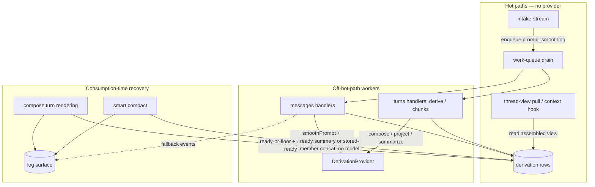

# Epic 06: Derivation Recovery and Observability — Tech Design

**Status:** Draft, complete (companion test plan: `test-plan.md`)
**Epic:** `epic.md` · **Tech Arch:** `../01-tech-arch.md` · **Domain model:** `../../onboard/02-domain-design.md`
**Source notes:** `../notes/derivation-cascade-decisions.md`
**Consumed by:** BA/SM (story sharding), implementing agents (interface + mechanism authority).

---

## Context

Epics 02/03/05 built and shipped the derivation pipeline: the work queue with version-checked completion and terminal failure (`tech-utils/work-queue`), the four-state derivation vocabulary (`shared/derivation.ts`), message-level handlers, turn composition (`domains/turns/internal/compose.ts`), chunk mechanics (`chunks.ts`), and the readiness sweep (`domains/thread-view/internal/sweep.ts`). All green.

This epic is a **delta over that working system**, not a new build. The recovery cascade it describes is *substantially already present*: `composeRenderingInput` already resolves each component to its ready form or a deterministic fallback and records a `DependencyGap`; `truncateForFallback` already floors tool activity; the work queue already lands `failed`/`blocked` with reasons; the sweep already does report→classify→requeue. The work here is to **complete, correct, and make observable** what exists:

1. **Rename** `form`→`derivation` across code and schema (the vocabulary is now settled).
2. **Add the deterministic smoothing floor + length gate** (the smoothing handler is currently single-stage inference only).
3. **Split tool-result rendering** explicitly into deterministic-truncation (full band) vs inference-summary (smooth band) with tiered targets, and **remove `tool_call_summary`** (a derivation type that exists but is being dropped).
4. **Make the cascade write recovered components back as `ready`** and route fallback *events* to a new **logging surface** (the gaps exist as data but are not yet logged, and recovery does not yet persist).
5. **Define background vs compact chunk recovery** (requeue-and-wait vs stored-member concat fallback — compact calls no model).
6. **Type runtime changes** as `model_change`/`thinking_level_change` blocks instead of flat `runtime_note`.

Two disciplines, inherited and reinforced. **No provider work inside a DB write transaction**, and **no provider work at all on the intake/serving hot paths** — turn-construction recovery that re-derives runs its provider call outside the completion transaction, exactly as the existing handlers do. **And compact calls no model at all** (Epic 03 invariant: compact assembles stored artifacts; the sweep, which runs before it, is the only thing that requeues). This epic does not change that: compact-time chunk recovery is *concat-from-stored-members only*, never an inline provider call. Healing of a not-ready chunk summary happens through the existing sweep + background drain, then the next compact picks up the healed artifact — not by compact re-deriving inline.

### Mock boundary

The only external boundary is `DerivationProvider` (`shared/derivation.ts`). Tests run everything else real — real temp SQLite per the persistence/atomicity/idempotency contracts — and substitute the provider through the existing `createDeterministicProvider()` (`providers/deterministic.ts`), whose output is marked and input-derived so in-process and spawned runs are byte-identical. New recovery tests reuse it plus a **failing/slow provider double** to exercise terminal-failure and retryable paths. Nothing else is mocked.

---

## System View



The new component is the **log surface** (a tech-util, dotted edges). Everything else is existing modules gaining behavior. Turn-construction recovery write-back (`COMPOSE`) closes the loop back into the derivation rows so a later consumer reads `ready`; compact does **not** write derivations — it assembles stored material and its not-ready summaries heal via the sweep + background drain.

---

## Module Boundaries

| Module | Status | Owns / changes | AC |
|---|---|---|---|
| `shared/derivation.ts` | MODIFY | Story 0: rename `FormKind`→`DerivationType`, `DerivedForm`→`Derivation`, `DerivedFormState`→`DerivationState`, `derived_form`→`derivation` (schema). Story 2: remove `tool_call_summary` from the kind set | rename (S0), AC-2.5 (S2) |
| `tech-utils/logging/` | NEW | The logging surface: levels, durable store, write + query, contained failure | AC-5.1–5.5 |
| `sdk.ts` | MODIFY | `export * as logging from "./tech-utils/logging/index.js"` — host-visible `lhc.logging.write` / `lhc.logging.query` | AC-5.2 |
| `tech-utils/work-queue/index.ts` | MODIFY | Drop `tool_call_summary` from `WorkKind`/registry/`LEGACY_KIND_FORMS`; no mechanics change | AC-2.5 |
| `domains/messages/internal/handlers.ts` | MODIFY | Smoothing: deterministic floor + length gate; remove `toolCallSummaryHandler`; terminal-failure lands `failed` (existing) | AC-1.1–1.7, AC-2.8 |
| `domains/messages/internal/smoothing.ts` | NEW | Pure deterministic cleaning function (whitespace, trivial casing) | AC-1.1 |
| `domains/turns/internal/compose.ts` | MODIFY | Remove `tool_call_summary` from `PART_PLANS`; cascade write-back; emit fallback log events | AC-2.5, AC-3.1–3.8 |
| `domains/turns/internal/derive.ts` | MODIFY | After compose, write recovered components back `ready`; log fallbacks | AC-3.6, AC-3.8 |
| `domains/turns/internal/chunks.ts` | MODIFY | Background chunk-summary requeue-and-wait on not-ready member input (reason `member_projection_not_ready`) | AC-4.1, AC-4.8 |
| `domains/turns/index.ts` | MODIFY | New surface op `compactChunkMaterial(...)` returning ready summary or deterministic member-concat (no provider call); thread-view calls this, never `turns/internal/*` | AC-4.2–4.4, AC-4.7 |
| `domains/turns/internal/chunk-recovery.ts` | NEW | Pure: assemble a chunk's band entry from stored member content when its summary is not ready (concat, no model) | AC-4.2–4.4, AC-4.7 |
| `domains/thread-view/internal/snapshot.ts` (compact) | MODIFY | Call the turns surface op for not-ready summaries; surface warnings; block only on source corruption. No provider call, no `turns/internal/*` import | AC-4.3–4.5 |
| `domains/intake-stream/index.ts` (`MessageEventInput`) + `internal/validate.ts` | MODIFY | Add `model_change`/`thinking_level_change` to the public event union and validation | AC-6.1–6.3 |
| `domains/messages/internal/project.ts` | MODIFY | Project `model_change`/`thinking_level_change` events into typed blocks | AC-6.1–6.3 |
| `providers/deterministic.ts` | MODIFY | Drop `summarizeToolCall` op (follows `tool_call_summary` removal) | AC-2.5 |

**Must-not-own:** the log surface is a tech-util — it knows levels and rows, never what a derivation *means*; it never reads or writes `derivation` rows. Thread-view still derives nothing and calls **no provider**: compact's not-ready summaries resolve through the `turns.compactChunkMaterial` surface op (stored-concat, no model), and thread-view must not import `domains/turns/internal/*` (boundary-risk test). The cascade's recovery write-back is a dedicated version-checked write (DD-4), not a reuse of `complete()`.

---

## Design Decisions

### DD-1: The rename is mechanical and total; persisted identifiers change once

`form`→`derivation` touches types (`FormKind`→`DerivationType`, `DerivedForm`→`Derivation`, `DerivedFormState`→`DerivationState`, `DerivedFormMetadata`→`DerivationMetadata`, `FormReportEntry`→`DerivationReportEntry`, `HandlerFormWrite`→`HandlerDerivationWrite`), the `derived_form` table → `derivation`, the column `form` → `derivation_type`, and every reference. This is a migration (v7): the table/column rename runs in `shared/storage.ts` migration. The existing suite is the rename's safety net — behavior is unchanged, so green-after-rename is the gate (Story 0). The rename keeps `tool_call_summary` *in* the kind set (just renamed `DerivationType`); its **removal is Story 2's** (AC-2.5), where it is dropped from the kind set, the work-queue registry, `LEGACY_KIND_FORMS`, `PART_PLANS`, the provider interface, and the deterministic provider. Splitting it this way keeps Story 0 behavior-preserving and gives the removal its own red/green in its owning story.

### DD-2: Deterministic smoothing is a pure function, run in the handler before inference

The smoothing handler gains a deterministic stage. `cleanPrompt(text): string` in `domains/messages/internal/smoothing.ts` is pure (no DB, no model, no clock): whitespace normalization and trivial casing only — never typo correction (that needs the model). The handler:

1. Reads the prompt text (existing `loadSource`).
2. Computes `cleaned = cleanPrompt(text)`.
3. If `tokenCount(cleaned) > config smoothing cap`: land `cleaned` as the `ready` content, no provider call.
4. Else: call `provider.smoothPrompt({ text: cleaned })`; on success land its text; on retryable failure return retryable (existing); on terminal failure land `failed` (existing `failTerminal`).

The deterministic result is the **floor** the cascade reuses (DD-5) and the over-cap output. There is no second field and no "skipped" state — over-cap and full both land `ready` (AC-1.4). The cap is `config.smoothing.maxInferenceTokens` (default named in the test plan; a dial-in value).

Fenced code: a line in the `smoothing-v1` prompt instructs "leave fenced code blocks and inline literals verbatim." No segmentation, no regex protection (AC-1.3). Verified by a fenced-code test against the deterministic provider's passthrough plus a real-inference test in the next epic.

### DD-3: Tool-result rendering — the split already half-exists; this names the tiers and the state

Full-band truncation is `truncateForFallback` (already in `compose.ts`, limit 200) reached through the visibility boundary (Epic 03) — no change to the truncation mechanism (AC-2.1). Smooth-band summary is `tool_result_summary` via `summarizeToolResult` (exists). New: the **tier gate** decides per result, by token count, whether a `tool_result_summary` inference item is created at all:

- `> largeTierTokens` (≈5000): no inference item; the derivation is satisfied by truncation and lands `ready` directly (AC-2.7). The enqueue path checks the source size and, over the threshold, writes the truncation as the `ready` content instead of queuing inference.
- `≤ largeTierTokens`: inference item as today, with the tier's target compression in the prompt.

Tiers are config (`config.toolResult.tiers`), first-pass values in the test plan, tunable next epic. Per-tool guidance is a keyed lookup the `tool-result-v1` prompt consults; the keys and text are first-pass scaffolding here.

### DD-4: The cascade write-back is a dedicated version-checked write that defers to live work

This is the corrected AC-3.8 behavior, and the review correctly flagged that reusing `complete()` is wrong: `complete()` requires a `ClaimedWorkItem` and deletes it, but consumption-time recovery has no claim, and a pending/claimed background item could later overwrite a floor-written value. So recovery write-back is its own operation, not `complete()`:

`recoverDerivation(ctx, { subjectKind, subjectId, derivationType, content, sourceVersion })` runs in one short `BEGIN IMMEDIATE` and writes `state = ready, content = ?` **only if both hold**:
1. the row's `sourceVersion` still matches (the stale-discard guard `complete()` already uses), and
2. **no live work item is claimed or pending for that derivation** (`!hasLiveItem(...)`, the same predicate the sweep uses).

If a live item exists, recovery does **not** persist — the consumer still *renders* with the floor for this turn (no block, no hole), but it leaves the derivation alone so the in-flight worker produces the real summary. This resolves the race the review named: a floor write can never clobber work that is about to produce the genuine derivation, and a genuine completion is never clobbered by a floor. When no live item exists (the common case — a terminally `failed` or long-`pending`-abandoned derivation), recovery persists `ready` so the next consumer doesn't re-pay.

**All persisted recovery outcomes land plain `ready`** — no degraded state, no floor-used marker (notes line 78/80: no upgrade process consumes such a marker). The fallback *event* goes to the log (DD-5). Tool-result floor is always `truncateForFallback`, never raw (AC-3.8/3.3).

The seam with the background worker (AC-1.7/2.8): the *worker* records honest `failed` on terminal failure; the *consumer* later resolves that `failed` to `ready` — but only when no worker is mid-flight on it. Two moments, no race.

### DD-5: The log surface is a tech-util with one write method, fail-soft

`tech-utils/logging/` mirrors the work-queue's capability shape: domain-blind, a `log` table (level, message, derivation_type?, subject_id?, reason?, floor_used?, recorded_at), a `writeLog(ctx, entry)` function, and a `queryLog(db, q)` helper for the actionable fields (AC-5.4). It is **exposed as a public surface** the same way every domain is: `sdk.ts` adds `export * as logging from "./tech-utils/logging/index.js"`, so the host calls `lhc.logging.write(...)` and `lhc.logging.query(...)` (AC-5.2) — the same functions LHC internals call. (It is a tech-util by ownership — domain-blind — but, unlike work-queue, it has a public surface because the host writes to it; that is the one externally exposed method the epic names.) The write is wrapped so a logging failure is caught and dropped, never propagated to the operation that logged (AC-5.5), and it does not share the caller's transaction (a log write must not roll back a turn). Channel rule (AC-5.3): fallback *events* go here; derivation *state* (`failed`/`blocked` + reason) stays on the derivation row.

### DD-6: Background chunk recovery waits; compact recovery concats from stored members (no model)

Two consumption contexts, two behaviors (epic AC-4.8 vs AC-4.2–4.4):

- **Background** (`chunks.ts` / chunk-summary handler): a chunk summary whose member `lower_band_projection` is not ready **requeues and waits** — no consumer is waiting, so deferring until the input lands is correct. Mechanically: the handler, finding a not-ready member input, returns retryable with reason **`member_projection_not_ready`** (a dependency-not-ready reason, *not* `provider_unavailable` — the review's #5: a health report must not misclassify normal dependency waiting as provider failure). The existing backoff requeues it; member source corruption returns `blocked`.
- **Compact** (`turns.compactChunkMaterial`, called from `snapshot.ts`): a not-ready chunk summary resolves to a **deterministic concatenation of the chunk's stored member content** (uncompressed) — no provider call, honoring the Epic 03 "compact never calls a model" invariant. Compact emits a visible warning, is stoppable, and blocks only on canonical source corruption of the span (`state_corruption`, existing). Healing of the summary itself happens out-of-band: the sweep (which runs before compact) requeues transient failures, the background drain produces the real summary, and the *next* compact uses it. Compact never re-derives inline.

The difference is not a deadline-driven inline re-derivation (compact makes no model call either way) — it is *what fallback is used*: background waits for the real input; compact uses stored members now and lets the sweep/drain heal for next time.

### DD-7: Turn-construction recovery never holds a transaction across a provider call; compact makes no provider call

Turn-construction recovery that re-derives reuses the existing handler discipline: read inputs (short txn or none), call the provider with no open transaction, then `recoverDerivation` persists in one short `BEGIN IMMEDIATE` (DD-4). The provider call sits between two short transactions, never inside one (AC-3.7).

Compact (AC-4.6) is simpler than the prior draft claimed: it makes **no provider call at all** (DD-6), so there is no across-provider-transaction concern — its chunk recovery is a pure stored-member concat. The AC-4.6 test therefore asserts the stronger property directly: a compact over not-ready summaries observes **zero provider calls**.

---

## Interfaces

### Renamed vocabulary (`shared/derivation.ts`)

```ts
// was FormKind / FORM_KINDS — tool_call_summary removed
export const DERIVATION_TYPES = [
  "smoothed_prompt",
  "tool_result_summary",
  "turn_rendering",
  "lower_band_projection",
  "chunk_summary_detailed",
  "chunk_summary_brief",
] as const;
export type DerivationType = (typeof DERIVATION_TYPES)[number];

export type DerivationState = "pending" | "ready" | "failed" | "blocked";

export interface Derivation {          // was DerivedForm
  subjectKind: SubjectKind;
  subjectId: string;
  derivationType: DerivationType;      // was `form`
  state: DerivationState;
  content?: string;
  reason?: string;
  sourceVersion: number;
  gaps?: DependencyGap[];
  metadata?: DerivationMetadata;
  derivedAt?: string;
}
```

### Deterministic smoothing (`domains/messages/internal/smoothing.ts`, NEW)

```ts
// Pure: whitespace normalization + trivial casing only. No typo correction
// (that is the model's job), no DB, no clock. The floor for AC-1.1 and the
// cascade.
export function cleanPrompt(text: string): string;
```

### Log surface (`tech-utils/logging/index.ts`, NEW)

```ts
export type LogLevel = "info" | "warning" | "error";

export interface LogEntry {
  level: LogLevel;
  message: string;
  derivationType?: DerivationType;
  subjectId?: string;
  reason?: string;       // e.g. "not_ready" | "failed_floor"
  floorUsed?: string;    // for fallback events
}

// Fail-soft: never throws to the caller, never shares the caller's txn.
export function writeLog(ctx: OperationContext, entry: LogEntry): void;

export interface LogQuery {
  level?: LogLevel;
  derivationType?: DerivationType;
  subjectId?: string;
}
export function queryLog(db: DatabaseSync, q: LogQuery): StoredLogEntry[];
```

### Recovery write-back (`domains/turns/internal/` — NOT `complete()`)

```ts
// Persists a consumption-time recovered component as ready, version-checked,
// and ONLY if no live work item is claimed/pending for that derivation
// (DD-4). No ClaimedWorkItem required. Returns whether it persisted.
export function recoverDerivation(ctx: OperationContext, r: {
  subjectKind: SubjectKind; subjectId: string;
  derivationType: DerivationType; content: string; sourceVersion: number;
}): { persisted: boolean };   // false when a live item exists (left for the worker)
```

### Compact chunk material (`domains/turns/index.ts` surface op — no provider)

```ts
// Returns the ready chunk summary if present, else a deterministic
// concatenation of the chunk's stored member content. NEVER calls a provider
// (Epic 03 compact-no-model invariant). thread-view calls THIS, not internals.
export function compactChunkMaterial(ctx: OperationContext, chunkId: string):
  | { kind: "ready"; content: string }
  | { kind: "concat"; content: string; reason: string }   // fallback used; caller warns + logs
  | { kind: "blocked"; reason: string };                  // member source corruption
```

### Typed runtime-change blocks

Added to the public event union (`domains/intake-stream/index.ts`) and validated in `internal/validate.ts`; projected to typed blocks in `domains/messages/internal/project.ts`.

```ts
// public MessageEventInput gains:
//   | BaseEvent<"model_change", { previousModel: string; newModel: string }>
//   | BaseEvent<"thinking_level_change", { previousLevel: string; newLevel: string }>
// projected message block content:
interface ModelChangeBlock { blockType: "model_change"; previousModel: string; newModel: string; }
interface ThinkingLevelChangeBlock { blockType: "thinking_level_change"; previousLevel: string; newLevel: string; }
```

---

## Mechanics

### Smoothing handler (modified `smoothPromptHandler`)

```
load prompt text (existing)
cleaned = cleanPrompt(text)
if tokenCount(cleaned) > config.smoothing.maxInferenceTokens:
    return ok, forms:[{ smoothed_prompt, content: cleaned }]   # over-cap → ready, no provider
result = await provider.smoothPrompt({ text: cleaned })        # provider call, no open txn
return landForm(smoothed_prompt, result)                        # existing: retryable / failed / ready
```

### Cascade write-back (modified turn derivation)

```
{ parts, gaps, receipts } = composeRenderingInput(messages, derivations)   # existing, pure
for each gap in gaps:
    writeLog(ctx, { level: "warning", derivationType: gap.derivationType,
                    subjectId: gap.subjectId, reason, floorUsed })            # DD-5
# write recovered components back ready (DD-4), deferring to live work:
for each part that fell back:
    recoverDerivation(ctx, { ...part, content: flooredContent, sourceVersion })
    # persists ready ONLY if version matches AND no live work item exists;
    # otherwise leaves it for the in-flight worker (rendering still used the floor)
persist turn_rendering / lower_band_projection (existing)
```

`recoverDerivation` is a dedicated short-transaction write (DD-4), not `complete()` — it needs no claimed item, version-checks against stale source, and skips persistence when a live work item is claimed/pending so a floor write never clobbers in-flight real derivation.

### Compact chunk material (`turns.compactChunkMaterial`, called from `snapshot.ts`) — no provider

```
for each chunk summary needed by the band plan:
    m = turns.compactChunkMaterial(ctx, chunkId)              # surface op, NO provider call
    case m.kind:
      "ready":   use m.content
      "concat":  use m.content (stored member concat, AC-4.3)
                 warn (visible channel, AC-4.4); writeLog(error, ...) (AC-4.7)
      "blocked": return state_corruption                      # AC-4.5 — only source corruption blocks
```

Compact makes zero provider calls (DD-6). A not-ready summary becomes a stored-member concat now; the summary itself heals via the pre-compact sweep + background drain, and the next compact uses the healed artifact.

---

## Architecture-Risk Tests

Per the skill's checklist, this epic touches the high-risk areas; the test plan names these explicitly:

- **Source-truth vs derived:** full tool result preserved while truncated/summarized (AC-2.6); recovery never mutates canonical source.
- **Atomicity/rollback:** `recoverDerivation` is version-checked and skips when a live work item exists, so a floor write never clobbers in-flight real derivation (DD-4); log write never rolls back a turn (DD-5).
- **Concurrency:** the named race — background work claimed/pending while a consumer floors — is handled by `recoverDerivation`'s `!hasLiveItem` guard; the test seeds a claimed item and asserts the floor does not overwrite and the worker still wins.
- **Idempotency/retry:** background chunk requeue-and-wait does not duplicate work (existing `hasLiveItem`/version scoping); the wait reason is `member_projection_not_ready`, not a provider-failure reason, so health classification stays correct.
- **Threshold/sizing:** tool-result tier gate boundary (AC-2.3/2.7); smoothing length cap boundary (AC-1.2).
- **Migration/compatibility:** the v7 rename migration; existing suite green post-rename; `tool_call_summary` removal has its own coverage.
- **No-provider discipline:** turn recovery's provider call sits outside the write transaction, proven by a competing-write probe during the call (AC-3.7); compact makes zero provider calls, proven by a provider spy over a not-ready-summary compact (AC-4.6).

---

## Verification Gates

Reuse the existing tiers (`red-verify` / `verify` / `green-verify` / `verify-all`); no new scripts. Story 0's rename is mechanically behavior-preserving — the existing suite green under the renamed vocabulary is its gate. The `tool_call_summary` removal is Story 2's (AC-2.5), a real behavior/schema change with its own red/green there. Recovery stories gate on `verify`. The provider doubles (`failingProvider`, `probingProvider`, `spyProvider`) live in `test/` fixtures alongside the existing deterministic provider.

---

## Tech Design Questions (resolved)

1. **Turn-summarization-at-close parity:** RESOLVED by reading the code — `composeRenderingInput` is pure/deterministic and turn derivation calls `composeTurnRendering`/`projectLowerBand` as provider ops at close. So turn-construction recovery *can* call a provider; DD-7 governs the discipline (provider call between two short txns, never inside one). Compact, separately, calls no provider (DD-6).
2. **Deterministic stage placement:** in the handler (DD-2), not intake. Intake stays provider-free and the floor is computed where the prompt text is already loaded.
3. **Background chunk floor:** DD-6 — requeue-and-wait with reason `member_projection_not_ready` (not `provider_unavailable`), block only on member source corruption.
4. **`lower_band_projection` standalone:** confirmed via `LEGACY_KIND_FORMS` and `compose`/`chunks` — it is turn-derivation's second output and the chunk-detailed input. No new work; documented in DD-6.
5. **Log storage + public surface:** `log` table in the thread DB (DD-5), indexed on (level, derivation_type, subject_id); exposed as `lhc.logging.write` / `lhc.logging.query` via `sdk.ts` (`export * as logging`).
6. **Compact-time recovery vs the Epic 03 "compact never calls a model" invariant:** RESOLVED — compact makes no provider call (DD-6). Not-ready summaries resolve to stored-member concat; healing is the sweep + drain + next compact. This preserves the upstream invariant and the cache-stability story; **no upstream doc change needed**. (An earlier draft had compact re-deriving inline — corrected.)
7. **Smoothing cap value:** first-pass default in the test plan; a dial-in value (next epic).
8. **Rename mechanics:** v7 migration renames table/column; types renamed across the tree (Story 0). `tool_call_summary` is renamed-but-retained in Story 0 and **removed in Story 2** (AC-2.5), so the rename stays behavior-preserving and the removal gets its own coverage (DD-1).

---

## Work Breakdown (chunks)

| Chunk | Story | Phases |
|---|---|---|
| 0 | Foundation: v7 rename migration + `tech-utils/logging` (rename retains `tool_call_summary`; its removal is Story 2) | Red (rename compiles; log surface skeleton) → Green (suite passes under renamed vocabulary; log tests pass). Rename is mechanically behavior-preserving. |
| 1 | Smoothing floor + length gate | Red → Green |
| 2 | Tool-result tiers + `tool_call_summary` removal | Red → Green |
| 3 | Cascade write-back + fallback logging | Red → Green |
| 4 | Chunk background-wait + compact stored-member concat fallback (no model) | Red → Green |
| 5 | Runtime-change typing | Red → Green |

Detailed TC→test mapping and per-chunk Red/Green exit criteria are in `test-plan.md`.

---

## Deferred / Out of Scope

- Prompt/model/tier **tuning** against real corpora (next epic).
- pi-lhc consumption of typed runtime blocks for session restoration.
- Host buffer-surfacing UX.
- The "subsequent passes" set (wire-API band representation, smooth-band message pairs, post-compact cost).
