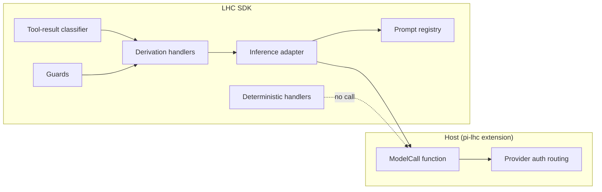
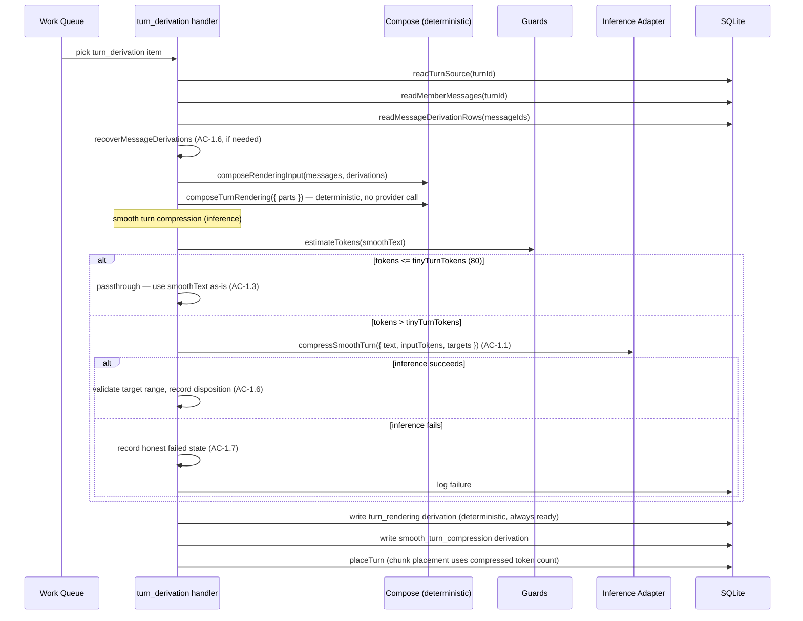
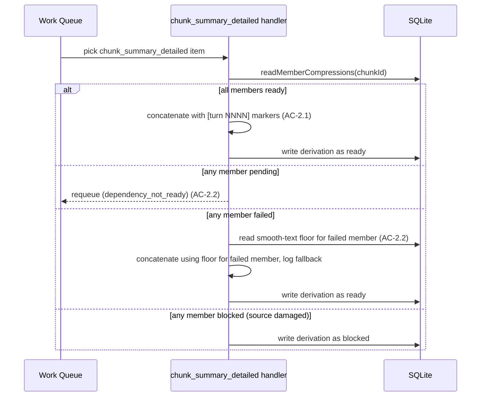
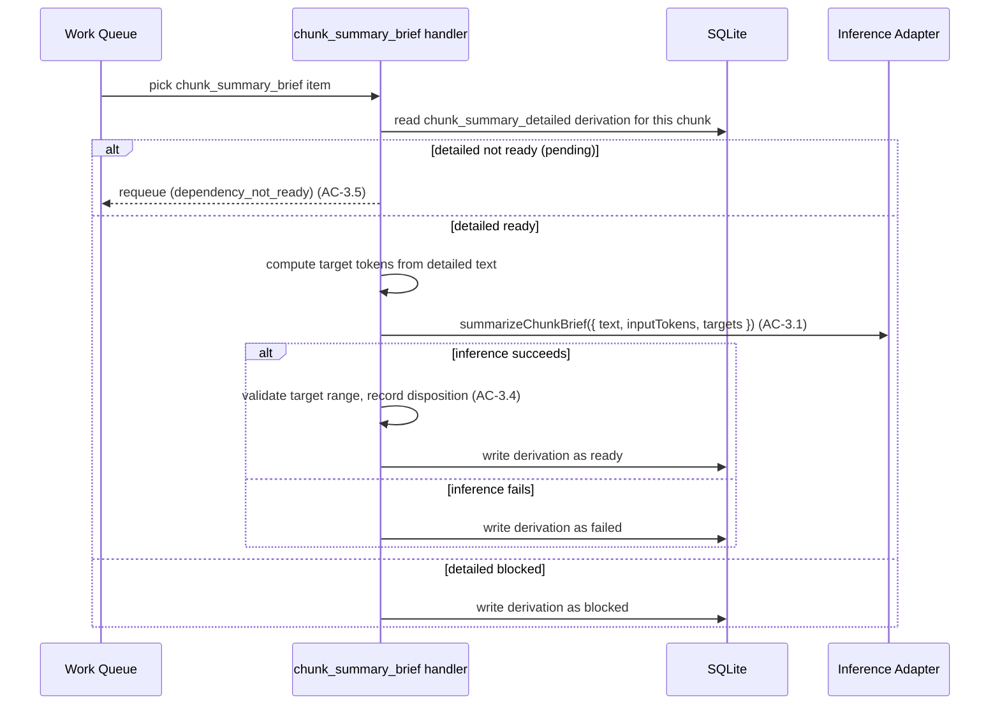
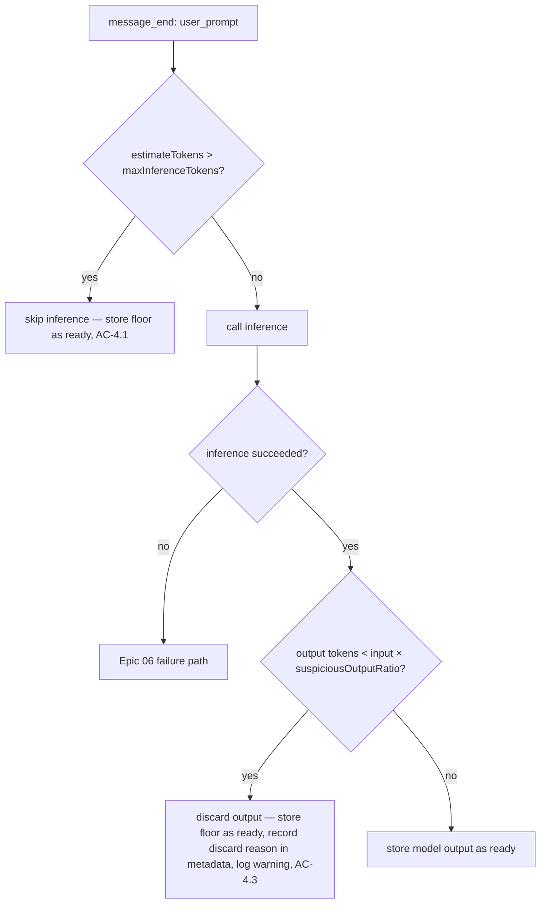

# Tech Design: Epic 07 — Derivation Dial-In

**Epic:** `./epic.md`
**Tech Arch:** `../01-tech-arch.md`
**Test Plan:** `./test-plan.md`
**Domain model:** `../../../onboard/01-core-concepts.md`, `../../../onboard/02-domain-design.md`
**Status:** Draft — revision 3

---

## Issues Found During Design

| # | Source | Issue | Status | Resolution |
|---|--------|-------|--------|------------|
| 1 | Epic AC-0.2 | `inference/` dissolution targets are clear but the epic does not name the destination of every file | Resolved — designed | File-by-file mapping in §Module Restructure |
| 2 | Epic AC-6.3 | Defaults table uses "Limit / guard" column mixing input caps, timeouts, and passthrough thresholds | Resolved — designed | Split into typed per-derivation guard fields in §Assignment Config Shape |
| 3 | Epic AC-1.3 | `smooth_turn_compression` handler must consume smooth turn text but current `projectLowerBand` consumes rendering text | Resolved — designed | Handler input changes in §Flow 1 |
| 4 | Epic AC-2.1 | `chunk_summary_detailed` handler currently calls inference; must become deterministic concatenation | Resolved — designed | Handler rewrite in §Flow 2 |
| 5 | Tech Arch | Tech arch says `domains/` is the top-level folder containing all domain surfaces | Resolved — designed | Tech arch patched in Story 0 alongside the restructure, not deferred |
| 6 | Epic AC-0.4 | Rename `lower_band_projection` → `smooth_turn_compression` needs migration path for existing thread DBs | Resolved — designed | Migration detail in §Rename Migration |
| 7 | Rev 1 feedback | `turn_rendering` and `chunk_summary_detailed` appeared on `DerivationProvider` despite being deterministic | Resolved — designed | Provider interface now contains only inference operations |
| 8 | Rev 1 feedback | AC-1.7 failure state was set to `ready` with floor; contradicts Epic 06's honest-failure model | Resolved — designed | Background failure lands `failed`; consumer recovery uses floor per Epic 06 |
| 9 | Rev 1 feedback | AC mappings in several flows did not match epic numbering | Resolved — designed | All flow sections re-checked against epic AC/TC text |
| 10 | Rev 1 feedback | Tool-result large-response behavior was inconsistent (excerpt-and-call vs deterministic fallback) | Resolved — designed | Single path: excerpt-and-call; no deterministic skip tier |
| 11 | Rev 2 feedback | Deterministic prompt files (`turn-compose-v1.ts`, `chunk-detailed-v1.ts`) still listed in `shared-tech/prompts/` despite being non-inference | Resolved — designed | Removed from prompt registry; deterministic formatting lives in `turns/internal/` |
| 12 | Rev 2 feedback | Rename handled old derivation rows but not old queued/claimed/failed work items with `lower_band_projection` kind | Resolved — designed | Explicit work-item rule in §Rename Migration |
| 13 | Rev 2 feedback | Real-inference code example showed `callOpenRouter` pseudo-path, contradicting "same construction as pi-lhc" | Resolved — designed | Example replaced with host-provided `ModelCall` fixture reference |

---

## Context

Epics 05 and 06 built the derivation infrastructure that makes this epic possible. Epic 05 wired inference into LHC: a host-injected model-call function, a name-keyed prompt registry, an inference adapter that renders prompts and routes through the host function, deterministic handlers for the non-inference derivations, and a per-derivation-type assignment config naming provider, model, and prompt. Epic 06 built the four-state derivation model (`pending` / `ready` / `failed` / `blocked`), a consumption-time recovery cascade, deterministic floors that keep the system usable when inference fails, a logging surface, and the rename from `form` vocabulary to `derivation` vocabulary. By the end of Epic 06, every derivation type has a working handler with rough first-pass prompts. The handlers run end-to-end, but the prompts are untested, the production methods are provisional, and there are no guards against obvious failure modes.

This epic replaces that provisional state with the tested prompts, model assignments, guards, and classifier that came out of the `derivation-testing/` work. The constraint that shaped this design is that the boundary between LHC and the host does not change: the host still provides one model-call function at SDK construction, and LHC still routes per-derivation-type with provider-lane/model strings. What changes is entirely internal to LHC — the prompts, the production methods, the guards, and the module structure. Three derivation types change their production method: `lower_band_projection` becomes `smooth_turn_compression` (per-turn inference compression instead of deterministic composition), `chunk_summary_detailed` becomes deterministic concatenation (it was an inference call), and `chunk_summary_brief` consumes compressed-turn material instead of raw smooth turns. Two derivation types gain guards: `smoothed_prompt` gets an input-size cap and a suspicious-output check, `tool_result_summary` gets a deterministic tool-result classifier before its model call. Each of these changes traces directly to evidence from the testing work — measured compression ratios, observed model breakdown thresholds, and prompt iterations that produced stable outputs.

The module structure also changes because `inference/` was added as a top-level folder without being a domain or a clean cross-cutting concern, and that drift was not corrected before now. The six domain folders move from `src/domains/` to `src/` top level so the top-level surfaces match the onboarding docs exactly. The `inference/`, `providers/`, `shared/`, and `tech-utils/` folders consolidate into one `shared-tech/` folder that is clearly not a domain. The `DERIVATION_TYPES` typed array and `DerivationType` union are removed because the only code that needed the full enumeration was the construction-time validation loop, which is itself being replaced with per-key validation against the prompt registry.

This work connects to the later pi-lhc epic as the layer that makes dogfooding worthwhile: until the prompts are tuned and the guards are in place, serving derivations through the extension produces low-quality context bands. It also connects to a future interactive tuning epic that will revisit per-derivation prompts and model choices against real corpora — but that work is out of scope here. This epic ships the mechanism plus the first-pass tuned prompts; later tuning swaps prompts and model assignments without touching handler logic.

---

## Verification Scripts

The project's verification gates map to the four conceptual tiers the skill requires. The script names are the project's configured names, not the recommended defaults.

| Script | Tier | Purpose | When Used |
|--------|------|---------|-----------|
| `pnpm run red-verify` | Red-exit | Quality gate for TDD Red exit: build + typecheck + lint + boundaries, no behavior tests | After writing tests, before Green |
| `pnpm run verify` | Standard | build + typecheck + lint + boundaries + vitest | Continuous during implementation |
| `pnpm run green-verify` | Green-exit | verify + test-immutability check | After implementation passes tests |
| `pnpm run verify-all` | Deep | Full verify (currently equal to `verify` in this project) | Story completion, epic completion |

### New Verification Additions

| Script | What It Checks | Added By |
|--------|---------------|----------|
| `pnpm run boundaries` (updated rules) | `shared-tech/` may not import domain modules; domains may not import other domains' `internal/` modules (AC-0.6) | Story 0 |

---

## Tech Design Question Answers

### TDQ-1: Tiny-turn threshold

**Default: 80 tokens.** Turns with smooth text at or below 80 estimated tokens skip inference compression and pass through the smooth text as-is. The derivation lands `ready` with the uncompressed smooth text. The threshold is a guard field (`guards.smoothTurnCompression.tinyTurnTokens`) so it can be adjusted without code changes.

Rationale: during testing, turns under ~100 tokens were mostly single-exchange user-prompt-plus-short-response pairs where compression produced overhead without meaningful reduction. 80 tokens is conservative enough to catch genuinely tiny turns without accidentally skipping substantive short exchanges.

### TDQ-2: Suspicious-output ratio

**Default: 0.15 (15%).** If the model returns output whose estimated token count is less than 15% of the input token count, the output is discarded, the deterministic floor (raw prompt text) is stored as `ready`, and the discard reason is recorded in derivation metadata and logged.

This applies only to `smoothed_prompt`. The guard fires after inference returns successfully — it is not a timeout or error handler. The ratio is a guard field (`guards.smoothedPrompt.suspiciousOutputRatio`).

Rationale: during testing, GPT-5.4 mini occasionally returned a one-line "summary" instead of a smoothed prompt. These outputs were always below 15% of input size. Real smoothing on prompts under the 700-token cap typically lands between 70% and 100% of input length.

### TDQ-3: Tool-result classifier placement

**Module: `messages/internal/classify-tool-result.ts`** — a pure function, no DB access, no model call. It takes `toolName`, `toolResult` (string), and `isError` (boolean), and returns a `ToolResultClassification` object. The `messages` domain owns it because tool-result classification is message-derivation behavior, not shared infrastructure. The handler in `messages/internal/handlers.ts` calls the classifier before constructing the inference input.

### TDQ-4: Excerpt strategy

**Head/tail with a marker.** The existing `boundContent` function in the adapter already implements this: content over `maxInputChars` keeps its head and tail around a `[... truncated ...]` marker. This epic does not change the excerpting strategy. The tool-result classifier's `parsedFacts` (match counts, exit codes, paths) give the model authoritative mechanical facts even when the raw output is truncated, so head/tail loss is less damaging than it would be without the classifier.

For tool results specifically, the handler excerpts using `boundContent` before the model call. There is no separate "skip inference for large results" tier — all tool results go through excerpt-then-call. The `maxInputChars` config controls the excerpt ceiling.

### TDQ-5: Turn-boundary markers

**Format: `[turn NNNN]`** where `NNNN` is the zero-padded four-digit turn order. Each member's compressed text is prefixed with this marker and separated by a blank line. The marker format is a constant in the chunk-detailed handler, not config.

Example:
```text
[turn 0042]
The user asked to restructure the module layout. The agent moved six domain folders...

[turn 0043]
The user corrected the import path convention...
```

### TDQ-6: Target validation behavior

**Accept as-is and log.** When a `smooth_turn_compression` or `chunk_summary_brief` output falls outside the target range, LHC accepts the output as `ready`, records the size disposition (`in_spec`, `above_spec`, `below_spec`) in derivation metadata, and logs an info-level entry. No retry is triggered for out-of-spec but usable output.

Rationale: during testing, models consistently produced usable output even when slightly outside the target range. Retrying for range compliance risks worse quality on the second attempt. The metadata disposition lets inspection surfaces report spec adherence without blocking derivation readiness.

### TDQ-7: Assignment config shape

**Extend `ModelAssignment` with optional per-derivation fields; add a parallel `DerivationGuards` config.** Per-derivation target ranges, thinking level, and prompt selection stay on `ModelAssignment`. Operational limits (input caps, timeout, tool-result classifier flags, suspicious-output thresholds, tiny-turn thresholds) live in a separate `DerivationGuards` config. This keeps the assignment table clean (provider + model + prompt + target + thinking) while allowing guards to vary independently.

```typescript
interface ModelAssignment {
  provider: string;
  model: string;
  prompt: string;
  thinking?: "none" | "minimal" | "medium" | "high";
  targetMinRatio?: number;
  targetMaxRatio?: number;
  targetAimRatio?: number;
}

interface DerivationGuards {
  smoothedPrompt?: {
    maxInferenceTokens?: number;       // default 700
    suspiciousOutputRatio?: number;     // default 0.15
  };
  toolResultSummary?: {
    timeoutMs?: number;                 // default 60_000
  };
  smoothTurnCompression?: {
    tinyTurnTokens?: number;            // default 80
  };
}
```

The existing `InferenceConfig` gains a `guards?: DerivationGuards` field. All guard values have defaults filled at construction.

---

## System View

### External Boundaries

LHC's external boundary does not change. The host provides one `ModelCall` function and assignment config at SDK construction. LHC calls that function with provider-lane/model routing keys. The host interprets those keys and routes to the appropriate auth path (Codex login, Claude subscription, OpenRouter API key).



Deterministic handlers (`turn_rendering`, `chunk_summary_detailed`) never reach the inference adapter or the host `ModelCall`. They live entirely within their owning domain (`turns`).

### Provider Lane Routing

The host's `ModelCall` implementation routes by provider-lane key. LHC does not interpret these keys; it passes them through from assignment config. The three tested lanes:

| Lane | Provider key | Models | Auth |
|------|-------------|--------|------|
| Codex | `codex` | `gpt-5.4-mini`, `gpt-5.4` | Codex login or OpenAI API key |
| Claude | `claude` | `haiku-4.5`, `opus-4.6` | Claude subscription or Anthropic API key |
| Open-weight | `open-weight` | `qwen-3.6-35b-a3b`, `glm-5.2` | OpenRouter API key |

---

## Module Boundaries

### Top-Tier Surfaces

The top-tier surfaces are the six domain folders plus one shared-tech area. The domain surfaces are inherited from the tech arch and the onboarding docs; this epic flattens them to `src/` top level. The shared-tech area is a consolidation of four existing non-domain folders.

| Surface | Source | This Epic's Role |
|---------|--------|-----------------|
| `intake-stream` | Inherited from tech arch | Unchanged — event intake still drives derivation triggers |
| `messages` | Inherited from tech arch | Adds tool-result classifier; adds smoothed-prompt guards |
| `turns` | Inherited from tech arch | Rewrites smooth-turn-compression handler; adds deterministic chunk-detailed concatenation; rewrites brief handler to consume detailed |
| `threads` | Inherited from tech arch | Unchanged |
| `thread-view` | Inherited from tech arch | Band fallback ladder updated for renamed derivation type |
| `inspect` | Inherited from tech arch | Unchanged — consumes derivation metadata fields added by guards |
| `shared-tech` | Consolidation of `shared/` + `tech-utils/` + `providers/` + `inference/` | New top-level area; carries inference adapter, prompt registry, deterministic provider, vocabulary, work queue, token counting, logging |

### Surface Ownership / Compatibility Direction

The `domains/` wrapper folder is removed. Code that imported `../domains/messages` now imports `../messages`. This is a one-directional migration.

| Surface/Name | Canonical Owner | Compatibility Facade | Allowed Direction | Forbidden Direction | Verification |
|--------------|-----------------|----------------------|-------------------|---------------------|--------------|
| `src/messages/` (was `src/domains/messages/`) | `messages` domain | None | old path → new path | new path → old path | `pnpm run boundaries` + import audit in Story 0 |
| (same for all six domains) | each domain | None | old → new | new → old | boundaries |
| `src/shared-tech/` (was `shared/`, `tech-utils/`, `providers/`, `inference/`) | `shared-tech` area | None | old → new | new → old | boundaries |

No compatibility facades. This is a hard rename. Old import paths break at compile time and are fixed during Story 0.

### Module Responsibility Matrix

| Module | Status | Responsibility | Dependencies | ACs Covered |
|--------|--------|----------------|--------------|-------------|
| `messages/internal/handlers.ts` | MODIFIED | smoothed-prompt guards; tool-result classifier call before inference | shared-tech inference adapter, `classify-tool-result` | AC-4.1–4.4, AC-5.3–5.5 |
| `messages/internal/classify-tool-result.ts` | NEW | deterministic tool-result classification into operationClass/responseShape/promptMode/parsedFacts | none (pure function) | AC-5.1, AC-5.2 |
| `turns/internal/derive.ts` | MODIFIED | turn-close handler calls `compressSmoothTurn` with smooth text; message-level recovery before compression; tiny-turn passthrough | shared-tech inference adapter, shared-tech derivation vocabulary | AC-1.1–1.7 |
| `turns/internal/chunks.ts` | MODIFIED + NEW | deterministic `concatenateDetailedChunk` with turn-boundary markers; member not-ready/blocked handling | shared-tech derivation vocabulary | AC-2.1–2.4 |
| `turns/internal/derive.ts` (chunk_summary_brief path) | MODIFIED | brief handler consumes `chunk_summary_detailed` text; target validation; dependency wait on detailed | shared-tech inference adapter | AC-3.1–3.5 |
| `turns/internal/compose.ts` | UNCHANGED | deterministic `composeTurnRendering` stays a plain function in `turns` | none external | (supports AC-1.x as deterministic input) |
| `thread-view/internal/select.ts` | MODIFIED | band fallback ladder references `smooth_turn_compression` instead of `lower_band_projection` | shared-tech derivation vocabulary | (downstream of AC-0.4 rename) |
| `shared-tech/inference-adapter.ts` | MODIFIED | adds `compressSmoothTurn`; removes `projectLowerBand`; removes `summarizeChunkDetailed` | shared-tech prompts, shared-tech inference-types | AC-1.1, AC-3.1 |
| `shared-tech/inference-types.ts` | MODIFIED | `ModelAssignment` gains target ratios; `InferenceConfig` gains `guards`; `DerivationGuards` added | none | AC-6.1–6.4 |
| `shared-tech/prompts/index.ts` | MODIFIED | prompt registry contains inference prompts only; deterministic prompt files removed | none | AC-0.3 |
| `shared-tech/prompts/smooth-turn-compression-v1.ts` | NEW | tested per-turn compression prompt | none | AC-1.2 |
| `shared-tech/prompts/chunk-brief-v1.ts` | MODIFIED | tested brief prompt with examples and commentary | none | AC-3.2, AC-3.3, AC-3.4 |
| `shared-tech/derivation.ts` | MODIFIED | `DERIVATION_TYPES` and `DerivationType` removed; derivation type becomes plain string | none | AC-0.3 |
| `shared-tech/storage.ts` | MODIFIED | schema DDL rename `lower_band_projection` → `smooth_turn_compression`; first-open migration deletes old work-queue rows | none | AC-0.4 |
| `shared-tech/scheduler.ts` | MODIFIED (moved from `src/scheduler.ts`) | drain loop, lease, single-flight — unchanged behavior, new location; `openThreadDatabase` injected by SDK wiring, no domain import | shared-tech storage, shared-tech work-queue, injected `openThreadDatabase` | (supports all derivation flows; not AC-attributed) |
| `sdk.ts` | MODIFIED | construction validation changes to per-key against prompt registry; defaults filled | shared-tech inference-types | AC-6.1–6.4 |

### Target Layout

```text
src/
├── intake-stream/          ← from domains/intake-stream/
├── messages/               ← from domains/messages/
│   └── internal/
│       └── classify-tool-result.ts  ← new (TDQ-3)
├── turns/                  ← from domains/turns/
├── threads/                ← from domains/threads/
├── thread-view/            ← from domains/thread-view/
├── inspect/                ← from domains/inspect/
├── shared-tech/            ← consolidation of shared/ + tech-utils/ + providers/ + inference/ + top-level scheduler
│   ├── scheduler.ts        ← from src/scheduler.ts (drain loop, lease, single-flight — technical infra, not a domain)
│   ├── derivation.ts       ← from shared/derivation.ts (minus DERIVATION_TYPES, DerivationType)
│   ├── context.ts          ← from shared/context.ts
│   ├── errors.ts           ← from shared/errors.ts
│   ├── inspect.ts          ← from shared/inspect.ts
│   ├── report.ts           ← from shared/report.ts
│   ├── storage.ts          ← from shared/storage.ts
│   ├── view.ts             ← from shared/view.ts
│   ├── tool-result-rendering.ts  ← from shared/tool-result-rendering.ts
│   ├── inference-types.ts  ← from inference/types.ts
│   ├── inference-adapter.ts ← from inference/adapter.ts
│   ├── classify.ts         ← from inference/classify.ts
│   ├── deterministic.ts    ← from providers/deterministic.ts
│   ├── logging/            ← from tech-utils/logging/
│   ├── token-counting/     ← from tech-utils/token-counting/
│   ├── work-queue/         ← from tech-utils/work-queue/
│   └── prompts/            ← from inference/prompts/ — inference prompts only
│       ├── index.ts
│       ├── smoothing-v1.ts
│       ├── tool-result-v1.ts
│       ├── smooth-turn-compression-v1.ts  ← new, replaces lower-band-v1.ts
│       └── chunk-brief-v1.ts             ← updated with tested prompt + examples
└── sdk.ts
```

**Removed from `prompts/`:** `turn-compose-v1.ts` and `chunk-detailed-v1.ts`. These were deterministic prompt files for non-inference derivations. `turn_rendering` is deterministic composition handled by `turns/internal/compose.ts`. `chunk_summary_detailed` is deterministic concatenation handled by `turns/internal/chunks.ts`. Neither has a prompt template; neither appears in the prompt registry.

**`shared-tech/scheduler.ts` dependency-injection fix:** The current `src/scheduler.ts` imports `openThreadDatabase` from `./domains/threads/index.js`. After the move to `shared-tech/`, that import would violate the AC-0.6 rule (`shared-tech/**` may not import domains). Story 0 removes the import and instead injects the open-thread-DB function through SDK wiring: `createSdk` (which already wires the `threads` domain) passes `openThreadDatabase` into the scheduler at construction. The scheduler calls the injected function; it does not name the `threads` domain. This is the one structural change required by the move beyond import-path rewriting.

### Rename Migration

All occurrences of `lower_band_projection` become `smooth_turn_compression`:

| Location | Change |
|----------|--------|
| `shared-tech/derivation.ts` | String literal in type definitions |
| `shared-tech/prompts/index.ts` | `DEFAULT_PROMPT_NAMES` key |
| `shared-tech/inference-adapter.ts` | `projectLowerBand` method renamed to `compressSmoothTurn` |
| `turns/internal/derive.ts` | Handler derivation type string, provider method name |
| `turns/internal/derivations.ts` | SQL queries referencing the type |
| `turns/internal/chunks.ts` | Member projection reads |
| `thread-view/internal/select.ts` | Band fallback ladder |
| `shared-tech/storage.ts` | Schema DDL string |
| Test fixtures | All fixture builders and assertions |

**Existing thread DB rows:** Thread SQLite files may contain derivation rows with `derivation_type = 'lower_band_projection'`. These are handled by:

1. Schema DDL does not change the column type — `derivation_type TEXT` and the work-queue kind column both stay string-typed.
2. Read queries (turn composition, band rendering, chunk member reads, repair reports) query for `'smooth_turn_compression'` only. Old `'lower_band_projection'` rows are invisible to these queries.
3. Repair/rebuild/recovery writes new rows with `'smooth_turn_compression'`. When a turn's compression is re-derived, the new row supersedes the old `'lower_band_projection'` row by version. The old row remains in the table but is no longer read.
4. Inspect/report queries filter on the current set of derivation types; old `'lower_band_projection'` rows are excluded from reports by default.
5. No proactive cleanup deletes old derivation rows. They occupy negligible space and are harmless.
6. Old work-queue items referencing `lower_band_projection` as the kind are a hard error after rename — there is no handler registered for that kind. To prevent this, Story 0 adds a **thread-file migration step** (not an informal startup sweep) in the storage migration sequence in `shared-tech/storage.ts`, assembled into the thread-file migration history by `threads/internal/create.ts`: the migration deletes any work-queue rows with `kind = 'lower_band_projection'` and logs a warning. It runs once per thread DB, recorded in the migration history so it never re-runs. These items are safe to delete because the derivation they would have produced is superseded by the next turn-close or recovery pass under the new name.

This is safe because existing `lower_band_projection` rows are only consumed by turn composition and band rendering, both of which will re-derive under the new name when their consumer (chunk close, compact) next runs.

### Typed Enumeration Removal

The `DERIVATION_TYPES` array and `DerivationType` union type are removed from `shared-tech/derivation.ts`. All code that previously typed against `DerivationType` now uses `string`.

**Valid key authority:** The prompt registry (`shared-tech/prompts/index.ts`) is the source of valid inference derivation type keys. Construction validation checks that each provided assignment key names a prompt registry entry. The known deterministic derivation types (`turn_rendering`, `chunk_summary_detailed`) are validated by their handler registration, not by the prompt registry.

### Tech Arch Update

Story 0 updates `01-tech-arch.md` §System Shape to reflect the new layout:
- Remove the `domains/` wrapper from the domain list
- Add `shared-tech/` to the diagram in place of separate `shared/`, `tech-utils/`, `providers/`, `inference/`
- Update the import boundary description

### Import Boundary Rules (AC-0.6)

The boundary checker enforces:
1. `shared-tech/**` may not import from any domain folder (`intake-stream/`, `messages/`, `turns/`, `threads/`, `thread-view/`, `inspect/`)
2. Domain `X/internal/**` may not be imported by domain `Y` (cross-domain internal access forbidden)
3. Domain `X/` may import from `shared-tech/` and from other domains' public surface (index.ts)

### Flow 0 AC Mapping

This section consolidates the foundation work that is otherwise distributed across §Target Layout, §Rename Migration, §Typed Enumeration Removal, §Tech Arch Update, and §Import Boundary Rules.

| AC | Covered By |
|----|-----------|
| AC-0.1 | Domain folders flattened to `src/` top level (§Target Layout, §Surface Ownership) |
| AC-0.2 | `inference/`, `providers/`, `shared/`, `tech-utils/` consolidated into `shared-tech/` (§Target Layout) |
| AC-0.3 | `DERIVATION_TYPES` array and `DerivationType` union removed; derivation type is a plain string discriminator; prompt registry holds inference prompts only, deterministic prompt files removed (§Typed Enumeration Removal, §Target Layout) |
| AC-0.4 | `lower_band_projection` renamed to `smooth_turn_compression` in code, schema, prompts, tests; old derivation rows and work-queue items handled by explicit rules (§Rename Migration) |
| AC-0.5 | `verify-all` green after restructure; sanctioned expectation changes limited to the rename and the assignment-validation change (§Verification Scripts) |
| AC-0.6 | Import boundary rules enforced: `shared-tech/` does not import domains; domains do not cross into other domains' internals (§Import Boundary Rules) |

---

## Flow-by-Flow Design

### Flow 1: Smooth Turn Compression (AC-1.1 → AC-1.7)

The `turn_derivation` handler currently calls `projectLowerBand` with the rendering text as input. After this epic, it calls `compressSmoothTurn` with the **smooth turn text** as input — the text assembled from message-level derivations before the turn rendering is composed.

`composeTurnRendering` remains deterministic and stays entirely within the `turns` domain. It does not go through the inference adapter or the `DerivationProvider` interface.

#### Handler Change



The smooth text for compression input is the concatenated text from `composeRenderingInput` — the same material that feeds `composeTurnRendering`. This is the smooth turn content with user prompts (smoothed if ready, raw otherwise), tool results (summarized if ready, truncated otherwise), and assistant text verbatim.

#### Target Calculation

```typescript
const inputTokens = estimateTokens(smoothText);
const targetMin = Math.ceil(inputTokens * assignment.targetMinRatio);  // default 0.35
const targetMax = Math.floor(inputTokens * assignment.targetMaxRatio); // default 0.65
const targetMid = Math.round(inputTokens * assignment.targetAimRatio); // default 0.50
```

These are passed to the prompt template as variables (AC-1.2).

#### Prompt Template: `smooth-turn-compression-v1`

The prompt is derived from the tested prompt text in `../../../../derivation-testing/chunk_summary_detailed/prompt-turn-compress-v1.md`:

```text
Below is one exchange from a coding conversation.

It is about {{inputTokens}} tokens long.

Shorten it to about {{targetMidTokens}} tokens. The final output must fall
within {{targetMinTokens}}–{{targetMaxTokens}} tokens.

Write the shortened version as compact prose.

Preserve:
- the user's request, correction, decision, or preference
- the agent's answer, action, mistake, or commitment
- the useful conclusion from thinking, if it affected the work
- the useful outcome from tool calls/results, if it affected the work
- concrete files, paths, commands, model names, numbers, errors, test results,
  and commit hashes
- unresolved questions or blocked work

Remove:
- raw thinking text
- raw tool output
- repeated acknowledgements
- apologies and status chatter
- local filler
- details that did not affect what happened next

Do not say only that a tool ran or a file was read. Say what it showed, changed,
proved, or failed to do.

Before returning, estimate whether the output is within
{{targetMinTokens}}–{{targetMaxTokens}} tokens.
If it is too short, expand it by restoring missing substance.
If it is too long, contract it by removing lower-value detail.

The final answer must be within {{targetMinTokens}}–{{targetMaxTokens}} tokens.

Return only the shortened exchange.
```

#### Derivation State After Compression

| Situation | Derivation state | Metadata |
|-----------|-----------------|----------|
| Inference succeeds, output in target range | `ready` | `sizeDisposition: "in_spec"`, provenance |
| Inference succeeds, output outside target range | `ready` | `sizeDisposition: "above_spec"` or `"below_spec"`, provenance |
| Inference fails in background | `failed` | reason from provider |
| Consumer recovery uses smooth-text floor | `ready` | `floorUsed: "smooth_text"` (per Epic 06) |
| Tiny turn passthrough | `ready` | `floorUsed: "tiny_turn_passthrough"` |
| Source damaged | `blocked` | reason |

Background inference failure records the honest `failed` state (AC-1.7). Consumer-time recovery (when chunk close or compact needs the compressed text) uses the smooth-text floor per Epic 06 recovery rules.

**AC mapping:** AC-1.1 (inference compression), AC-1.2 (prompt with targets), AC-1.3 (tiny-turn passthrough), AC-1.4 (substance preserved), AC-1.5 (noise removed), AC-1.6 (message-level recovery before compression + target validation), AC-1.7 (honest failed state + consumer floor recovery + logging).

---

### Flow 2: Chunk Detailed as Deterministic Concatenation (AC-2.1 → AC-2.4)

The `chunk_summary_detailed` handler currently calls inference. After this epic, it deterministically concatenates member `smooth_turn_compression` texts with turn-boundary markers. This handler lives entirely within the `turns` domain and never reaches the inference adapter or provider interface.

#### Handler Change



#### Concatenation Function

```typescript
function concatenateDetailedChunk(
  members: Array<{ turnOrder: number; content: string }>
): string {
  return members
    .map(m => `[turn ${String(m.turnOrder).padStart(4, "0")}]\n${m.content}`)
    .join("\n\n");
}
```

No provider call. No prompt template. `chunk_summary_detailed` does not appear on the `DerivationProvider` interface. The deterministic provider's existing `summarizeChunkDetailed` is removed.

**AC mapping:** AC-2.1 (deterministic concatenation, no model call), AC-2.2 (requeue on pending, floor for failed, blocked on source damage), AC-2.3 (turn-boundary markers present), AC-2.4 (deterministic — same members produce same ordered output).

---

### Flow 3: Chunk Brief from Compressed Material (AC-3.1 → AC-3.5)

The `chunk_summary_brief` handler currently calls inference over raw member projections. After this epic, it calls inference over the `chunk_summary_detailed` text — the concatenated compressed-turn material from Flow 2.

#### Handler Change



The brief handler depends on the detailed derivation being ready. This is a sequential dependency: detailed must land before brief can start.

#### Prompt Template: `chunk-brief-v1`

The brief prompt is derived from the tested prompt text in `../../../../derivation-testing/chunk_summary_brief/brief-prompt.md`, including full examples, XML-tagged input/output blocks, commentary on good/bad examples, and the historical-memory-note instructions. The prompt is large (~8k tokens of instructions and examples) because testing showed that generous examples with commentary produced consistently better brief outputs.

Key prompt characteristics:
- Instructs the model to write a past-tense historical memory note
- Includes one good example with commentary and two bad examples with explanations
- Uses descriptive XML block tags (`<good-example-1-input>`, `<bad-example-1-output>`, etc.) to delineate large example blocks
- Target range: 8–20%, aim 12% of input tokens (AC-3.2)
- Self-check instruction at the end

#### Brief Dependency Chain

```text
smooth_turn_compression (per turn, inference)
  → chunk_summary_detailed (per chunk, deterministic concat)
    → chunk_summary_brief (per chunk, inference)
```

**AC mapping:** AC-3.1 (brief consumes detailed text), AC-3.2 (prompt includes target tokens), AC-3.3 (historical narration output), AC-3.4 (prompt includes good/bad examples with commentary), AC-3.5 (requeues when detailed not ready; compact-time recovery falls back to deterministic stored-member concatenation per Epic 06).

---

### Flow 4: Smoothed-Prompt Guards (AC-4.1 → AC-4.4)

The `smoothed_prompt` handler in `messages/internal/handlers.ts` gains two guards. Both sit in the handler, not in the adapter or provider.

#### Guard Logic



#### Config

```typescript
guards.smoothedPrompt.maxInferenceTokens    // default 700
guards.smoothedPrompt.suspiciousOutputRatio  // default 0.15
```

Both guards produce `ready` derivations with deterministic floor content (AC-4.4). The over-cap skip is normal behavior, not an error. The suspicious-output discard records `discardReason: "suspicious_output_ratio"` in derivation metadata so it is queryable through the reporting/inspect surface (AC-4.3).

**AC mapping:** AC-4.1 (skip above cap, floor stored as ready), AC-4.2 (cap configurable with default), AC-4.3 (suspicious output discarded, reason in metadata + log), AC-4.4 (both guards land ready, no retry).

---

### Flow 5: Tool-Result Classification (AC-5.1 → AC-5.5)

A deterministic tool-result classifier runs before the `tool_result_summary` inference call. It produces structured facts the prompt can use as authoritative input.

#### Tool-Result Classifier Interface

```typescript
// messages/internal/classify-tool-result.ts

interface ToolResultClassification {
  toolName: string;
  outcome: "succeeded" | "failed" | "unknown";
  operationClass: ToolOperationClass;
  responseShape: ToolResponseShape;
  promptMode: ToolPromptMode;
  parsedFacts: Record<string, string | number | boolean>;
}

type ToolOperationClass =
  | "read"
  | "mutation_write"
  | "mutation_edit"
  | "command"
  | "search"
  | "verification";

type ToolResponseShape =
  | "structured_receipt"
  | "simple_failure"
  | "search_result"
  | "test_result"
  | "file_content"
  | "diff_output"
  | "large_log"
  | "unknown_content";

type ToolPromptMode =
  | "receipt"
  | "failure"
  | "search_summary"
  | "test_summary"
  | "content_summary"
  | "diff_summary"
  | "large_log";

function classifyToolResult(input: {
  toolName: string;
  toolResult: string;
  isError: boolean;
}): ToolResultClassification;
```

#### Classification Heuristics

The classifier is a pure function (AC-5.2). It determines `operationClass` from `toolName`:
- `read` → `"read"`
- `write` → `"mutation_write"`
- `edit` → `"mutation_edit"`
- `bash` → `"command"` (refined by command pattern detection in the result text: test/verify → `"verification"`, rg/grep/find → `"search"`)

It determines `responseShape` from result text patterns:
- `"Successfully wrote N bytes"` → `"structured_receipt"`
- `"Successfully replaced N block(s)"` → `"structured_receipt"`
- `"ENOENT"` or `isError` with short text → `"simple_failure"`
- rg-style `file:line:` matches → `"search_result"`
- test pass/fail count patterns → `"test_result"`
- otherwise → `"unknown_content"`

`promptMode` is derived from `(operationClass, responseShape)`.

`parsedFacts` extracts mechanical values when patterns match: exit codes, byte counts, block counts, match counts, target paths, failure types, retry guidance (AC-5.1).

#### Handler Integration

The existing `tool_result_summary` handler path gains a classification step before the provider call:

```typescript
const classification = classifyToolResult({
  toolName,
  toolResult: content,
  isError: outcome === "failed",
});

// Excerpt large responses (AC-5.3)
const excerptedContent = boundContent(content, config.maxInputChars);

const result = await provider.summarizeToolResult({
  toolName: classification.toolName,
  content: excerptedContent,
  outcome: classification.outcome,
  targetTokens,
  guidance: toolResultGuidance(toolName),
  classification,  // passed to prompt template (AC-5.5)
});
```

The prompt template uses `classification.parsedFacts` as authoritative input and `classification.promptMode` to select the right instruction block (AC-5.2, AC-5.5).

The handler uses a hard timeout (`guards.toolResultSummary.timeoutMs`, default 60s) via `AbortController` on the model call (AC-5.4).

**AC mapping:** AC-5.1 (classifier extracts mechanical facts), AC-5.2 (prompt mode selection by response shape), AC-5.3 (large responses excerpted), AC-5.4 (hard timeout), AC-5.5 (parsed facts authoritative in prompt).

---

### Flow 6: Assignment Config and Defaults (AC-6.1 → AC-6.4)

#### Extended Config Types

```typescript
interface InferenceConfig {
  call: ModelCall;
  assignments: Record<string, ModelAssignment>;
  guards?: DerivationGuards;
  timeoutMs?: number;     // default 60_000
  maxInputChars?: number; // default 200_000
}
```

See §TDQ-7 for `ModelAssignment` and `DerivationGuards` type definitions.

#### Construction Validation Changes

After this epic:
- Each provided assignment key is checked: if it names an inference derivation type, it must have a valid prompt registry entry (AC-6.1)
- Deterministic types (`turn_rendering`, `chunk_summary_detailed`) accept optional provider/model; prompt is optional (AC-6.3)
- Unknown assignment keys are rejected — the valid set is the union of prompt registry keys and known deterministic type names
- Missing inference derivation types are filled from defaults (AC-6.2)
- All guard values have defaults filled at construction (AC-6.2)

#### Default Assignment Table

In the tables below, the section heading is the default provider lane.

**Codex lane defaults:**

| Derivation type | Default model | Thinking | Target range | Guard | Notes |
|---|---|---|---|---|---|
| `smoothed_prompt` | `gpt-5.4-mini` | none | n/a | input cap: 700 tokens; suspicious ratio: 0.15 | Skip inference above cap |
| `tool_result_summary` | `gpt-5.4-mini` | none | n/a | timeout: 60s | Tool-result classifier selects prompt mode |
| `smooth_turn_compression` | `gpt-5.4-mini` | none | 35–65%, aim 50% | tiny-turn: 80 tokens | Passthrough below threshold |
| `chunk_summary_brief` | `gpt-5.4-mini` | none | 8–20%, aim 12% | n/a | From compressed-turn input |
| `turn_rendering` | (deterministic) | n/a | n/a | n/a | Unchanged |
| `chunk_summary_detailed` | (deterministic) | n/a | n/a | n/a | Deterministic concatenation |

**AC mapping:** AC-6.1 (config accepted with target fields), AC-6.2 (defaults filled), AC-6.3 (deterministic assignment not invoked), AC-6.4 (each inference type has default provider lane + model).

---

## Interface Definitions

### DerivationProvider (inference operations only)

Deterministic operations (`composeTurnRendering`, `summarizeChunkDetailed`) are **removed** from this interface. They live in their owning domain as direct functions, not provider operations.

```typescript
interface DerivationProvider {
  smoothPrompt: (input: {
    text: string;
  }) => Promise<ProviderResult>;

  summarizeToolResult: (input: {
    toolName: string;
    content: string;
    outcome: string;
    targetTokens: number;
    guidance: string;
    classification?: ToolResultClassification;
  }) => Promise<ProviderResult>;

  compressSmoothTurn: (input: {
    text: string;
    inputTokens: number;
    targetMinTokens: number;
    targetMidTokens: number;
    targetMaxTokens: number;
  }) => Promise<ProviderResult>;

  summarizeChunkBrief: (input: {
    text: string;
    inputTokens: number;
    targetMinTokens: number;
    targetMidTokens: number;
    targetMaxTokens: number;
  }) => Promise<ProviderResult>;
}
```

### Deterministic Functions (domain-owned)

These are plain functions in the `turns` domain, not provider operations:

```typescript
// turns/internal/compose.ts (existing, unchanged)
function composeTurnRendering(parts: TurnPart[]): string;

// turns/internal/chunks.ts (new)
function concatenateDetailedChunk(
  members: Array<{ turnOrder: number; content: string }>
): string;
```

### ToolResultClassification

See §Flow 5 for full type definition.

### DerivationGuards

See §TDQ-7 for full type definition.

---

## Testing Strategy

> **Reference:** Full TC-to-test traceability, architecture-risk tests, and the real-inference layer live in `./test-plan.md`. This section states the testing design decisions.

### Test Pyramid

```text
         /\
        /  \  Manual scenario testing — full pipeline review
       /----\  with real models
      /      \
     /--------\  Real-inference round-trip tests (gated)
    /          \  - Provider lane routing, deterministic-zero-call
   /------------\  Service mock tests (primary)
  /              \  - Routing, prompt shape, call count, guards, validation
 /----------------\  Pure function tests
/                  \  - Tool-result classifier, deterministic concatenation
```

### Mock Boundary

The single mock boundary is the host `ModelCall` function at the SDK construction seam. The provider spy intercepts `ModelCall`, records every call (provider, model, messages), and returns canned responses. Internal modules (handlers, adapter, classifier, compose, chunks) are never mocked — they run for real against the spy.

| Layer | Mock? | Why |
|-------|-------|-----|
| Host `ModelCall` | Yes | External boundary — the only code outside LHC |
| SQLite | Real temp | Derivation persistence, work queue, states are product contract |
| Filesystem | Real temp | Thread DB layout, restart survival are product contract |
| Config injection | Test-local | No business logic, just setup |
| Handlers / adapter / classifier | No | That's what's being tested |

### Real-Inference Layer

The real-inference suite uses the same `ModelCall` fixture the pi-lhc extension will use — a host-provided function that routes by provider-lane key using the host's own auth. The test does not ship its own OpenRouter or OpenAI client; it consumes whatever the host fixture provides.

When no host `ModelCall` fixture is available (no auth configured), the suite emits a single NOT-RAN line with reason. No silent passes.

Real-inference tests assert loosely: non-empty response, response within a wide band, derivation lands `ready`, provenance names the configured provider/model, deterministic derivations made zero provider calls. See `./test-plan.md` for the full per-TC table.

### Tool-Result Classifier Tests

The tool-result classifier is a pure function with no mocks:

```typescript
describe("classifyToolResult", () => {
  it("classifies successful write as structured_receipt", () => {
    const result = classifyToolResult({
      toolName: "write",
      toolResult: "Successfully wrote 12345 bytes to src/foo.ts",
      isError: false,
    });
    expect(result.operationClass).toBe("mutation_write");
    expect(result.responseShape).toBe("structured_receipt");
    expect(result.promptMode).toBe("receipt");
    expect(result.parsedFacts.byteCount).toBe(12345);
    expect(result.parsedFacts.targetPath).toBe("src/foo.ts");
  });

  it("classifies edit failure as simple_failure", () => {
    const result = classifyToolResult({
      toolName: "edit",
      toolResult: "Found 2 occurrences of edits[0] in src/bar.ts. Each oldText must be unique.",
      isError: true,
    });
    expect(result.operationClass).toBe("mutation_edit");
    expect(result.responseShape).toBe("simple_failure");
    expect(result.outcome).toBe("failed");
    expect(result.parsedFacts.matchCount).toBe(2);
  });

  it("is deterministic: same input always produces same output", () => {
    const input = { toolName: "bash", toolResult: "exit code 1", isError: true };
    const a = classifyToolResult(input);
    const b = classifyToolResult(input);
    expect(a).toEqual(b);
  });
});
```

---

## Work Breakdown

### Story 0: Foundation — restructure, rename, and config

**Scope:** Module restructure, derivation-type rename, typed-enumeration removal, assignment config extension, tech arch update.
**ACs:** AC-0.1 through AC-0.6, AC-6.1 through AC-6.4
**Relevant Tech Design Sections:** §Module Boundaries, §Target Layout, §Rename Migration, §Typed Enumeration Removal, §Flow 0 AC Mapping, §TDQ-7
**Architecture-Risk Tests:** Old work-queue items with `lower_band_projection` kind must be deleted on first open (not re-queued) — see test-plan.md architecture-risk row. Import-boundary rules must be enforced by the checker, not just documented.
**Acceptance Risk Reminders:** Verify no `domains/` wrapper import paths remain; verify `shared-tech/` does not import any domain; verify old work-queue items are deleted not crashed on.
**Chunk Risk Shape:** No state machine; this is a structural rename. Authority is the prompt registry + handler registration for valid derivation-type keys. No derived state produced. Downstream consumers: all later stories. Seams touched: every import in the codebase.
**Substrate Maturity:** N/A (foundation).

**TDD Red phase:**
1. Write boundary test asserting `shared-tech/` cannot import domains → fails (folder doesn't exist)
2. Write test asserting `smooth_turn_compression` is a valid derivation type in schema → fails (still `lower_band_projection`)
3. Write test asserting assignment config accepts per-derivation guards → fails (type doesn't exist)
4. Write test asserting partial assignments (inference-only) are accepted at construction → fails (current validation requires all types)

**TDD Green phase:**
1. Move domain folders from `src/domains/X/` to `src/X/`
2. Consolidate `shared/`, `tech-utils/`, `providers/`, `inference/`, and top-level `scheduler.ts` into `src/shared-tech/`
3. Update all import paths
4. Remove `DERIVATION_TYPES` array and `DerivationType` union; valid-key authority moves to prompt registry + handler registration
5. Rename `lower_band_projection` → `smooth_turn_compression` in code, schema, prompts, tests (old derivation rows remain unreadable; old work-queue items deleted on first open with warning — see §Rename Migration)
6. Add `DerivationGuards` type and default filling at construction
7. Update boundary checker rules
8. Update `01-tech-arch.md` §System Shape
9. `pnpm run verify-all` green

**Estimated tests:** ~12
**ACs covered:** 0.1, 0.2, 0.3, 0.4, 0.5, 0.6, 6.1, 6.2, 6.3, 6.4

---

### Story 1: Smoothed-prompt guards

**Scope:** Input-size cap and suspicious-output guard on `smoothed_prompt`.
**ACs:** AC-4.1 through AC-4.4
**Relevant Tech Design Sections:** §Flow 4, §TDQ-1, §TDQ-2, §TDQ-7
**Architecture-Risk Tests:** Suspicious-output discard must record `discardReason` in metadata so it is queryable, not just logged — AC/TC mapping alone could miss this if the test only checks the log line.
**Acceptance Risk Reminders:** Verify over-cap skip produces `ready` (not a new state); verify suspicious-output discard produces `ready` with floor content.
**Chunk Risk Shape:** `smoothed_prompt` state machine: `pending` → `ready` (inference) or `ready` (floor via cap or discard). Authority is the message record. Derived state: the smoothed text. Downstream: turn composition. Seam touched: `messages/internal/handlers.ts`.

**TDD Red phase:**
1. Test: prompt over 700 tokens → derivation ready with floor content, no provider call → fails
2. Test: suspicious output (< 15% ratio) → floor stored, discard reason in metadata → fails
3. Test: normal prompt → provider called, output stored as ready → passes (existing behavior)

**TDD Green phase:**
1. Add cap check in `smoothed_prompt` handler before provider call
2. Add suspicious-output check after provider returns
3. Record `discardReason` in derivation metadata on discard
4. Log discard at warning level

**Estimated tests:** ~6
**ACs covered:** 4.1, 4.2, 4.3, 4.4

---

### Story 2: Tool-result classification and prompt-mode routing

**Scope:** Deterministic tool-result classifier and hard timeout on tool-result inference.
**ACs:** AC-5.1 through AC-5.5
**Relevant Tech Design Sections:** §Flow 5, §TDQ-3, §TDQ-4, §Deterministic Algorithm Boundaries
**Architecture-Risk Tests:** Classifier must be a pure function — golden cases for each response shape prove determinism. Timeout must produce a classified failure, not an unhandled exception — test with a mock that never resolves.
**Acceptance Risk Reminders:** Verify classifier has no DB/model/clock access; verify timeout fires via `AbortController` and the derivation lands `failed` with a timeout reason.
**Chunk Risk Shape:** `tool_result_summary` state machine unchanged. Authority is the message record + the tool result text. Derived state: the summary text + classification metadata. Downstream: turn composition. Seam touched: `messages/internal/handlers.ts`, new `messages/internal/classify-tool-result.ts`.

**TDD Red phase:**
1. Test: `classifyToolResult` with write success → structured_receipt → fails (function doesn't exist)
2. Test: classification passed to prompt template → fails (handler doesn't pass it)
3. Test: tool-result classifier is deterministic (same input → same output) → fails
4. Test: hard timeout aborts long-running call → fails

**TDD Green phase:**
1. Implement `classifyToolResult` in `messages/internal/classify-tool-result.ts`
2. Wire classifier call into tool-result handler before provider call
3. Pass classification to prompt template
4. Update prompt template to use `parsedFacts` and `promptMode`
5. Add `AbortController` timeout around tool-result model call

**Estimated tests:** ~7
**ACs covered:** 5.1, 5.2, 5.3, 5.4, 5.5

---

### Story 3: Smooth turn compression

**Scope:** Replace deterministic `lower_band_projection` composition with per-turn inference compression; add tiny-turn passthrough and target validation.
**ACs:** AC-1.1 through AC-1.7
**Relevant Tech Design Sections:** §Flow 1, §TDQ-1, §TDQ-6
**Architecture-Risk Tests:** Background failure must record honest `failed` state; consumer recovery (chunk close, compact) must use the smooth-text floor per Epic 06 — test the recovery path explicitly, not just the happy path. Stale work-queue item must not overwrite a floor-written `ready` after rename — covered by Story 0's first-open delete.
**Acceptance Risk Reminders:** Verify `failed` state on background inference failure (not `ready`); verify consumer recovery writes `ready` with `floorUsed` metadata; verify message-level recovery runs before compression (AC-1.6).
**Chunk Risk Shape:** `smooth_turn_compression` state machine: `pending` → `ready` (in-spec) or `ready` (out-of-spec) or `failed` (background) or `blocked` (source damaged). Authority is the turn record. Derived state: compressed text + `sizeDisposition`. Downstream: `chunk_summary_detailed`. Seam touched: `turns/internal/derive.ts`, `shared-tech/inference-adapter.ts`.
**Substrate Maturity:** Depends on Story 0 rename (the derivation type must exist) and on Epic 06 recovery being in place.

**TDD Red phase:**
1. Test: turn-close → `compressSmoothTurn` called with smooth text and target tokens → fails (method doesn't exist)
2. Test: tiny turn (< 80 tokens) → passthrough, no provider call → fails
3. Test: compression fails → derivation lands `failed`, not `ready` → fails (current behavior stores floor)
4. Test: output outside target → ready with `sizeDisposition` in metadata → fails
5. Test: `composeTurnRendering` makes zero provider calls → passes (existing deterministic behavior, verified by spy)

**TDD Green phase:**
1. Add `compressSmoothTurn` to `DerivationProvider` (inference only) and inference adapter
2. Install `smooth-turn-compression-v1` prompt template
3. Rewrite turn handler to call `compressSmoothTurn` with smooth text input
4. Add tiny-turn guard
5. Add target-range validation and disposition metadata
6. Background failure records honest `failed` state; consumer recovery uses floor per Epic 06

**Estimated tests:** ~10
**ACs covered:** 1.1, 1.2, 1.3, 1.4, 1.5, 1.6, 1.7

---

### Story 4: Chunk detailed deterministic

**Scope:** Replace `chunk_summary_detailed` inference call with deterministic concatenation of member `smooth_turn_compression` texts.
**ACs:** AC-2.1 through AC-2.4
**Relevant Tech Design Sections:** §Flow 2, §TDQ-5, §Deterministic Algorithm Boundaries
**Architecture-Risk Tests:** Byte-identical determinism must hold across two runs with the same members — golden case proves this. Member-not-ready handling must requeue on `pending`, use floor on `failed`, block on `blocked` — test all three branches.
**Acceptance Risk Reminders:** Verify zero provider calls for `chunk_summary_detailed`; verify `[turn NNNN]` markers present; verify byte-identical output on re-run.
**Chunk Risk Shape:** `chunk_summary_detailed` state machine: `pending` → `ready` (concatenation) or `blocked` (member source damaged). Authority is the chunk record + member compression rows. Derived state: concatenated text. Downstream: `chunk_summary_brief`. Seam touched: `turns/internal/chunks.ts`, `turns/internal/derive.ts`.
**Substrate Maturity:** Depends on Story 3 (`smooth_turn_compression` must produce ready content for members).

**TDD Red phase:**
1. Test: chunk close → provider spy records zero calls for `chunk_summary_detailed` → fails (currently calls inference)
2. Test: output contains `[turn NNNN]` markers → fails
3. Test: two runs with same members → byte-identical output → fails
4. Test: failed member → floor used, logged; pending member → requeue → fails

**TDD Green phase:**
1. Rewrite chunk detailed handler to deterministic concatenation
2. Implement `concatenateDetailedChunk` in `turns/internal/chunks.ts`
3. Remove `summarizeChunkDetailed` from `DerivationProvider` interface
4. Add pending/failed/blocked member handling

**Estimated tests:** ~5
**ACs covered:** 2.1, 2.2, 2.3, 2.4

---

### Story 5: Chunk brief from compressed material

**Scope:** Rewrite `chunk_summary_brief` to consume `chunk_summary_detailed` text instead of raw member projections.
**ACs:** AC-3.1 through AC-3.5
**Relevant Tech Design Sections:** §Flow 3, §TDQ-6
**Architecture-Risk Tests:** Brief must wait on detailed not-ready (requeue), not silently use stale or missing material — test the dependency wait explicitly. Compact-time fallback per Epic 06 must use deterministic stored-member concatenation.
**Acceptance Risk Reminders:** Verify brief reads detailed text (not member projections); verify brief prompt includes examples and commentary (AC-3.4); verify brief requeues when detailed is `pending`.
**Chunk Risk Shape:** `chunk_summary_brief` state machine: `pending` → `ready` (in-spec) or `ready` (out-of-spec) or `failed` (background) or `blocked` (detailed blocked). Authority is the chunk record + detailed derivation. Derived state: brief text + `sizeDisposition`. Downstream: thread-view band rendering. Seam touched: `turns/internal/derive.ts`, `shared-tech/prompts/chunk-brief-v1.ts`.
**Substrate Maturity:** Depends on Story 4 (detailed must produce ready content).

**TDD Red phase:**
1. Test: brief handler reads detailed derivation text as input → fails (currently reads member projections)
2. Test: brief prompt includes target token variables and examples → fails
3. Test: brief waits on detailed not-ready → requeues → fails (currently waits on member projections)

**TDD Green phase:**
1. Rewrite brief handler to consume detailed text
2. Install `chunk-brief-v1` prompt template with examples
3. Add target-range validation and disposition metadata
4. Update dependency: brief depends on detailed, not on individual members

**Estimated tests:** ~6
**ACs covered:** 3.1, 3.2, 3.3, 3.4, 3.5

---

### Story 6: Verification smoke run

**Scope:** Real-inference end-to-end verification across all new pipeline paths.
**ACs:** Structural verification across all flows
**Relevant Tech Design Sections:** §Testing Strategy, §Real-Inference Layer, `./test-plan.md`
**Architecture-Risk Tests:** Real-inference tests must use the same `ModelCall` fixture the extension uses; if unavailable, NOT-RAN accounting must fire. No silent passes.
**Acceptance Risk Reminders:** Verify per-derivation-type provider/model routing; verify deterministic derivations make zero provider calls; verify all inference derivations land `ready` with non-empty content.
**Chunk Risk Shape:** No state machine; this is verification. No derived state. Seam touched: `test/inference-real.test.ts`.

**TDD Red phase:**
1. Red exit: existing real-inference tests fail because handler signatures/derivation types changed

**TDD Green phase:**
1. Extend `inference-real.test.ts` with verifications for all new pipeline paths
2. Verify per-derivation-type provider/model routing, deterministic-zero-call, and ready-state outcomes
3. Full `pnpm run verify-all` green with API keys available

**Estimated tests:** ~3 (real-inference, gated)
**ACs covered:** Structural verification across all flows

---

## Runtime Prerequisites

| Prerequisite | Where Needed | How to Verify |
|---|---|---|
| Node.js >= 24 | All | `node --version` |
| `~/.lhc/.env` with `OPENROUTER_API_KEY` | Standalone real-inference tests only (not pi-lhc extension auth) | `grep OPENROUTER_API_KEY ~/.lhc/.env` (presence only) |
| Host `ModelCall` fixture (pi-lhc-provided) | Dogfooding real-inference tests through the extension | Extension auth available in the host process |
| `pnpm` 10.x | All | `pnpm --version` |

---

## Derived-State Provenance

This epic persists derived state that downstream artifacts consume: `smooth_turn_compression`, `chunk_summary_detailed`, `chunk_summary_brief`, `smoothed_prompt`, and `tool_result_summary`. The provenance model is inherited from Epic 06 and does not change shape; this epic adds metadata fields.

| Field | Present On | Purpose |
|-------|-----------|---------|
| `sourceRevision` | all derivations | which version of the source this derivation derives from (Epic 06 DD-3) |
| `state` | all derivations | `pending` / `ready` / `failed` / `blocked` (Epic 06) |
| `provenance` | inference derivations | provider lane, model, prompt name, thinking level |
| `sizeDisposition` | `smooth_turn_compression`, `chunk_summary_brief` | `in_spec` / `above_spec` / `below_spec` (new this epic) |
| `discardReason` | `smoothed_prompt` | `suspicious_output_ratio` when suspicious-output guard fires (new this epic) |
| `floorUsed` | `smooth_turn_compression` | `smooth_text` / `tiny_turn_passthrough` when floor is used (new this epic) |

Regeneration policy: a derivation is re-derived when its source revision changes or when recovery is triggered by a consumer. Re-derivation overwrites the prior row by version. Metadata from a prior attempt is overwritten, not appended — there is no candidate history.

Stale/invalid handling: a derivation whose source has changed is treated as stale by consumers; recovery re-derives it. A derivation in `failed` state is superseded when consumer recovery runs and succeeds. A derivation in `blocked` state (source damaged) is not retried until the source is repaired.

---

## Deterministic Algorithm Boundaries

Two deterministic algorithms are introduced or changed. Both have golden cases in `test-plan.md`.

### `concatenateDetailedChunk`

- **Threshold inclusivity:** all member content is included; no member is dropped for size.
- **Ordering:** members are ordered by `turnOrder` ascending.
- **Boundary values:** turn order is zero-padded to four digits (`[turn 0042]`).
- **Oversized behavior:** no size cap; if a single member is very large, the concatenated output is very large.
- **Golden case:** three members with turn orders 42, 43, 44 produce a fixed expected string with `[turn 0042]`, `[turn 0043]`, `[turn 0044]` markers separated by blank lines.

### `classifyToolResult`

- **`outcome` rule:** `isError=true` → `failed`; `isError=false` with success-marker pattern → `succeeded`; otherwise `unknown`.
- **`operationClass` rule:** determined by `toolName` lookup; `bash` refined by command pattern in result text.
- **`responseShape` priority:** `structured_receipt` > `simple_failure` > `search_result` > `test_result` > `file_content` > `diff_output` > `large_log` > `unknown_content`. First match wins.
- **`promptMode` derivation:** pure function of `(operationClass, responseShape)`.
- **`parsedFacts` extraction:** exit code, byte count, block count, match count, target path, failure type, retry guidance — extracted when the pattern matches, omitted otherwise.
- **Determinism:** same input always produces the same output. No clock, no randomness, no model call.
- **Golden cases:** one per response shape in `test-plan.md`.

---

## Open Questions

| # | Question | Owner | Blocks | Resolution |
|---|----------|-------|--------|------------|
| Q1 | The brief prompt is large (~8k tokens of instructions and examples). Should the prompt be cached at the adapter level, or is per-call render cost acceptable? | Tech lead | Story 5 | Defer to implementation; measure render cost during Story 5 |
| Q2 | The tiny-turn threshold (80 tokens) and suspicious-output ratio (0.15) are defaults; should they be overridable per-thread or only at SDK construction? | Tech lead | Story 0 | Default: SDK construction only; per-thread override is out of scope unless dogfooding shows a need |
| Q3 | When `chunk_summary_detailed` member compression fails and the floor is used, should the detailed concatenation note which members used the floor? | Tech lead | Story 4 | Default: log the fallback per-member, do not annotate the concatenated text |

---

## Deferred Items

| Item | Related AC | Reason Deferred | Future Work |
|------|-----------|-----------------|-------------|
| Real prompt/model tuning against recorded corpora | all | Out of scope — this epic ships first-pass tuned prompts | Future interactive tuning epic |
| Per-thread override of guard thresholds | AC-4.2, AC-6.2 | Not needed for v1 | Revisit after dogfooding |
| Aggregate "brief of briefs" deeper band | AC-3.x | Not needed until threads have enough brief material | Future band work |
| Full-band tool-call arg truncation in the 32k–64k sliding window | none | Adjacent to this epic but separate concern | Future hot-path work |
| Bulk migration of old `lower_band_projection` derivation rows (proactive delete) | AC-0.4 | Harmless to leave; no proactive cleanup | Never, unless space becomes an issue |

---

## Related Documentation

- Epic: `./epic.md`
- Test Plan: `./test-plan.md`
- Tech Arch: `../01-tech-arch.md`
- Domain model: `../../../onboard/01-core-concepts.md`, `../../../onboard/02-domain-design.md`
- Testing reference: derivation-testing notes under `../../../../derivation-testing/`
