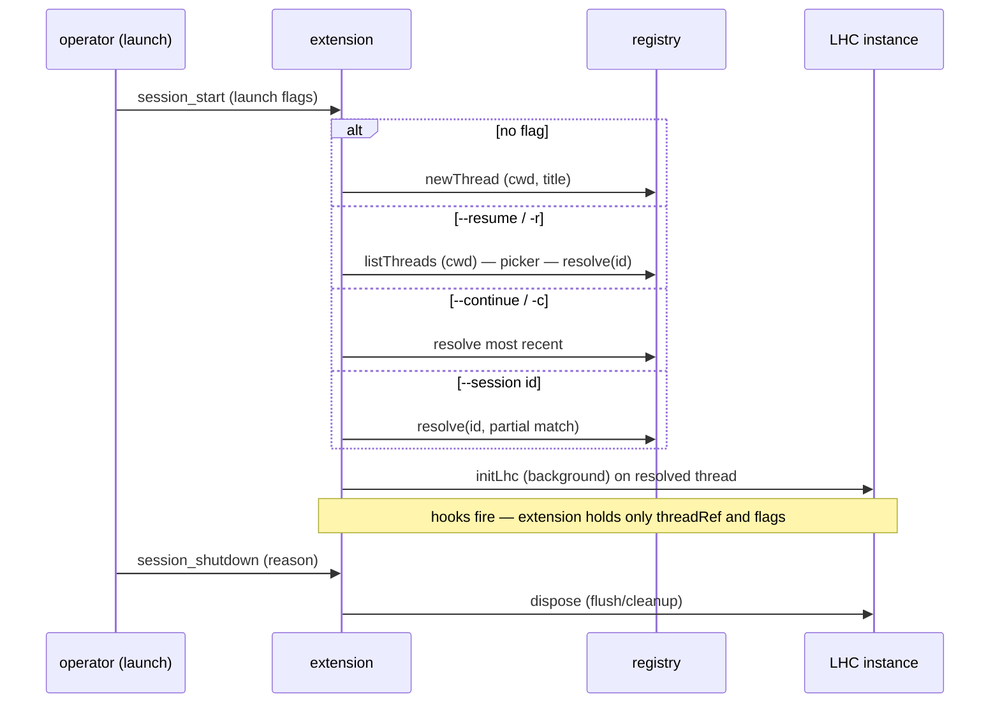
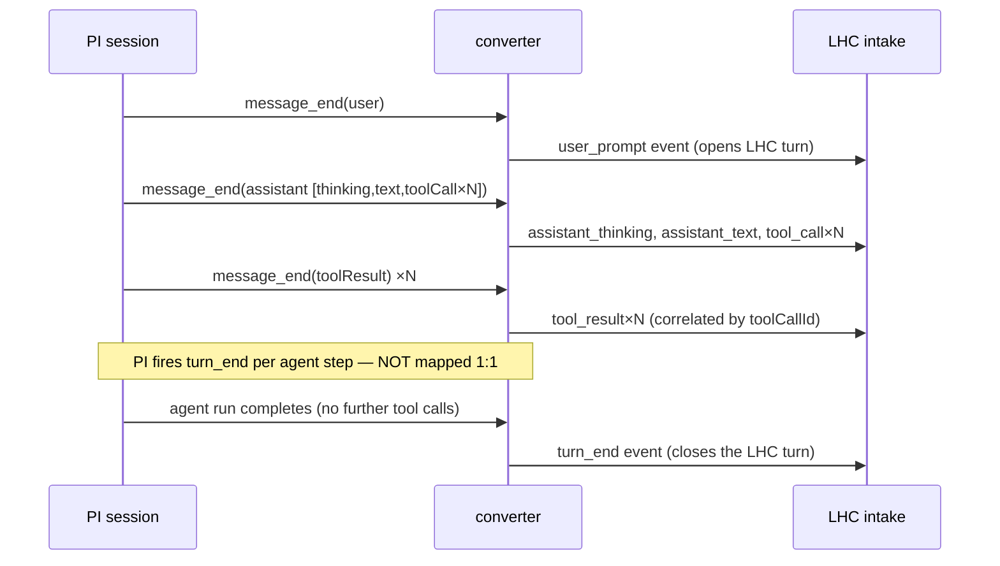
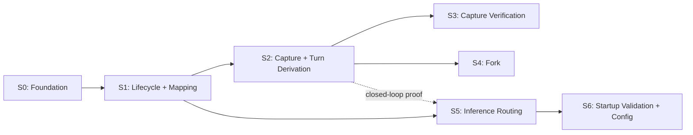

# Epic 1: Connector Core

**Status:** Draft for review. **Ready for tech design once M0 lands.** Per the PRD's M0 gate, this epic's capture-verification tests consume the M0 corpus fixtures (Story 3) and two M0 decisions must be settled before tech design: the image/file-reference handling choice and the tool-call rendering choice (A5). These are named as M0 inputs below, not left as open tech design questions.
**PRD:** `../00-prd.md` — Feature 1
**Tech Arch:** `../01-tech-arch.md`
**Wiring research:** `../notes/pi-ext-integration-research.md` (verified against PI v0.79.2)
**Domain model:** `../../onboard/01-core-concepts.md`, `../../onboard/02-domain-design.md`

---

## Onboarding Context

**PI** is the coding agent this extension loads into. PI runs a **session** (its unit of work — one running conversation with a model). PI exposes an **extension API**: an extension registers handlers for **hooks** (lifecycle events PI fires — session start, message finalized, turn ended, shutdown) and the **context hook** (PI asks the extension what message array to send the model). An extension runs in-process inside the PI process.

**LHC** (Long Horizon Context) is the SDK this extension drives. It is consumed one way: a host process initializes one **LHC instance** in-process (`initLhc`) and operates it directly. LHC owns all context behavior and persists to one SQLite file per **thread** (LHC's durable record of a conversation). A **registry** (one SQLite catalog, default `~/.lhc/registry.sqlite`) lists every thread by id, title, cwd, and creation time.

**The LHC thread is the system of record for the conversation, and the registry is the catalog of threads.** What an earlier draft got wrong was treating PI's session file as the place a thread mapping had to be stored and recovered; it does not, because a thread's identity arrives at launch — the operator selects it — so there is no mapping to recover and no pointer to keep in sync. What is true *in this epic* is narrower than "PI has no session file": this epic is observe-only, so **PI still runs its own session normally** — it persists its session, serves its own context to the model, and tracks its own fork lineage, exactly as vanilla PI does. LHC records alongside that as the durable conversation record. PI's session file becomes vestigial only in Feature 2, when LHC's served context replaces PI's transcript; until then the two coexist, and nothing the model sees changes.

Inside LHC:
- An **intake event** is the unit of capture. New traffic enters as ordered intake events; LHC records them durably. The seven event kinds are `user_prompt`, `assistant_text`, `assistant_thinking`, `tool_call`, `tool_result`, `runtime_note`, and `turn_end`.
- A **message** is projected from one or more intake events; a **turn** groups the messages of one exchange.
- A **derivation** produces a **derived form** from recorded content (for example, a summary of a tool result). The seven derived-form kinds are `smoothed_prompt`, `tool_call_summary`, `tool_result_summary`, `turn_rendering`, `lower_band_projection`, `chunk_summary_detailed`, `chunk_summary_brief`. Each derivation runs through one **model-call function** the host supplies.
- A **thread-view** is the bounded message array LHC serves to a model. Epic 2 builds and serves it; this epic does not.

**This extension** maps PI's hook surface to LHC's operation surface. It holds no context state beyond a thread reference and a small set of told-the-user flags. Inference flows one direction: LHC asks for a model call, the extension routes it through PI's existing provider auth.

**M0** is the pre-epic period that produces the recorded PI **corpora** (real sessions captured to fixtures) and the **converter** prototype (PI events → intake events). Live recon (June 2026) already established the PI event shapes this epic depends on; M0's remaining work is corpus breadth, the productionized converter, and derivation dial-in. This epic's capture-verification tests consume M0 corpora as fixtures.

---

## Feature Overview

A PI session run with the extension loaded records into an LHC thread. Every user message, assistant message, thinking block, tool call, tool result, runtime change (model and thinking-level switches), and derived turn boundary is captured as ordered, duplicate-safe intake events. The thread is resolved at launch — a new thread, a picked one, the most recent, or a named id — through the registry, and capture continues on that thread across resume, reload, restart, and fork. Background derivations run through the user's existing PI logins. PI's own context handling runs unchanged; the extension changes nothing the model sees. Capture is verified by replaying recorded corpora through the converter and matching the read-back, without serving any context.

### Flow Summary

| Flow | Capability | Surface (tech arch) |
|------|------------|---------------------|
| 1 | Session lifecycle and launch-driven thread resolution | Session Lifecycle |
| 2 | Event capture and turn derivation | Event Capture |
| 3 | Fork as new thread | Session Lifecycle + Event Capture |
| 4 | Inference host routing | Inference Host |
| 5 | Startup validation and assignment config | Inference Host |
| 6 | Capture verification | Event Capture (read-back via inspect) |

---

## User Profile

**Primary User:** A developer using PI as their daily coding agent, with the `pi-lhc` extension loaded.
**Context:** Running normal coding sessions — chatty exchanges, tool-heavy agent runs, sessions resumed across days, the occasional fork or mid-task kill. They are not interacting with LHC directly; capture runs in the background.
**Mental Model:** "I use PI exactly as before. In the background my whole session is recorded into a durable thread, so my context can be managed later. Nothing about how the agent behaves changes yet."
**Key Constraint:** This epic is observe-only. The extension must add no perceptible latency and must change nothing the model sees — PI's native context handling stays in control. A capture failure must never break the PI session: writable-thread failures become durable, queryable gaps; store-unavailable failures become visible extension diagnostics because the gap cannot be written.

---

## Scope

### In Scope

- LHC instance lifecycle: initialize on session start, dispose on shutdown, reconstruct on reload — holding only plain data (thread reference, told-the-user flags) across hooks.
- Launch-driven thread resolution: a new thread by default, a cwd-scoped picker (`--resume`/`-r`), the most recent thread (`--continue`/`-c`), or a named thread (`--session <id>`, partial-id match) — all resolved through the registry catalog.
- Event capture: PI messages and turns mapped to LHC intake events (the productionized converter), preserving order and idempotency.
- Runtime-change capture: model-select and thinking-level-select changes captured in order as `runtime_note` events, because they are observable only in-stream.
- Turn derivation: LHC turn boundaries derived from PI traffic, not taken one-to-one from PI's per-agent-step `turn_end`.
- Fork handling: a new thread per fork, seeded by replaying the source thread to the fork point, source unchanged.
- The injected model-call function over PI's model registry and auth.
- Model-assignment config (the seven derivation kinds) and startup validation with visible, actionable reporting.
- Capture verification: recorded corpora replay identically through the converter; inspect surfaces reflect the captured session.

### Out of Scope

- Serving context to the model — Feature 2 / Epic 2. PI's native context handling runs as-is throughout this epic.
- Intercepting or disabling PI's own compaction — Feature 2 / Epic 2.
- Operator commands and agent self-inspection tools beyond what capture verification reads — Feature 3 / Epic 3.
- Status-bar / footer UX beyond actionable startup-validation reporting — Feature 3 / Epic 3.
- Packaging, the runner CLI, headless-mode conformance as a deliverable — Feature 4 / Epic 4.
- Web-search, service-tier, and researcher-subagent extensions — Feature 5 / Epic 5.
- Derivation prompt and model dial-in (quality tuning) — the paired M0 dial-in period; this epic ships default assignments and proves the routing, not the tuning.

### Migration

Existing POC threads are out of scope. They are on the pre-SDK storage shape; this epic starts fresh on new threads and lets old POC threads age out. No import or migration is built.

---

## Assumptions

| # | Assumption | Status | Impact if wrong |
|---|------------|--------|-----------------|
| A-1 | The PI event shapes captured by live recon (event order, parallel-tool fan-out, abort shapes, resume behavior) hold for the targeted PI version. | Validated against v0.79.2; assumed stable across the 0.79 line | Converter mapping is wrong. Mitigated by corpus replay (Flow 6), which catches drift as a read-back mismatch rather than a silent error. |
| A-2 | M0 delivers recorded PI corpora as test fixtures and a converter prototype to productionize. | Pending (M0) | The epic spec stands, but the build and the verification flow's tests wait on M0 corpora. Capture ACs are spec-complete; their fixtures are an M0 input. |
| A-3 | PI resume serves prior history through the context hook and re-fires no historical `message_end` events; duplication arises only on reload and crash-replay. | Validated (recon) | If resume re-fired history, dedup load would be higher. Idempotency keys (Flow 2) already cover the reload/replay paths, so the contract holds either way. |
| A-4 | The LHC construction export is `initLhc` (renamed from `createSdk`) by the time this epic is implemented. | Pending; mechanical rename | Low. If the rename slips, code reads `createSdk`; this spec uses `initLhc` as the agreed name. Tracked in tech arch TA4. |
| A-5 | The model-call function is the host side of the inference seam already specced in the LHC v1 line (Epic 05): `ModelCall`, `ModelCallResult`, `ModelCallFailureKind`, `ModelAssignment`. | Validated against current LHC types | If the seam shape changed, routing AC wording shifts. Verified present in `packages/lhc/src/inference/types.ts`. |
| A-6 | LHC `turn_end` with no open turn is a contractual no-op (Epic 01), tolerating PI's pre-first-prompt and dangling events. | Validated (LHC v1 spec) | If not a no-op, the converter would need to guard turn closes. Confirmed specced behavior. |
| A-7 | The image / file-reference handling decision (placeholder vs. extending the intake payload schema) is settled by M0 before this epic's tech design. | Pending (M0 gate) | The converter's content-part mapping (Flow 2) depends on it. Recon found `@file.png` stays literal text in print mode; the interactive paste shape is uncaptured. M0 corpora establish frequency; the decision is an M0 output, not a tech design question. |
| A-8 | The LHC registry gains a `cwd` column (set at thread creation), a `--resume` cwd filter on `listThreads`, partial-id match on `resolve`, and a `title` set at creation / updated on rename. | **Epic 1 implementation scope** (LHC-side); not yet in LHC code | AC-1.6 and AC-1.7 depend on these directly, so they are a build prerequisite for Story 1, not optional polish. The work is small and mechanical — the registry already carries id/title/created — but "small" is not "non-blocking": the cwd-scoped picker and partial-id resolve cannot pass without them. They are gated before Story 1's launch-mode ACs. |
| A-9 | Foreign PI extensions that persist state via session custom entries are not supported under pi-lhc in v1; pi-lhc threads own pi-lhc and conversation state only. | Decided (scope) | A third-party extension relying on PI session-file persistence loses its store when LHC replaces the session file. A passthrough lane for foreign custom entries is an explicit later design, named in the tech arch. No Epic 1 behavior depends on it. |

---

## Flow 1: Session Lifecycle and Launch-Driven Thread Resolution

A PI session starts, and the first thing the extension settles is which thread this run records into. The thread's identity arrives with the launch: no flag means a new thread; `--resume`/`-r` opens a cwd-scoped picker over the registry; `--continue`/`-c` takes the most recent thread; `--session <id>` names one directly (a partial id matches a prefix). Every case resolves through the registry catalog — the operator's launch choice *is* the thread identity, so there is no mapping to recover. The extension then initializes one LHC instance in background scheduler mode against the resolved thread. Across PI's hooks it holds only plain data (the thread reference and a few flags) and retains no PI context object, because session replacement invalidates those objects.



**AC-1.1:** On `session_start` with no thread-selecting launch flag, the extension creates a new LHC thread (registering it in the catalog with its cwd), initializes one LHC instance in background scheduler mode against it, and does not drive the derivation queue itself.

**AC-1.2:** On `session_start` that resolves to an existing thread (via `--continue`, `--session`, or a picker selection), the extension initializes against that thread by resolving it through the registry. No second thread is created for an already-resolved thread.

**AC-1.3:** Across all hooks, the extension holds only plain data (thread reference, file path, told-the-user flags) between events. It retains no PI context or session-manager object across hook boundaries; each handler uses the fresh context PI provides. A session replacement (new/resume/fork) that invalidates prior context objects does not break capture.

**AC-1.4:** On `session_shutdown`, the extension disposes the LHC instance with flush and cleanup. A subsequent run that resolves the same thread finds it complete through the last event recorded before shutdown — no trailing loss.

**AC-1.5:** On reload (extension torn down and re-initialized while the same session continues), the extension reconstructs the thread reference from durable state (the resolved thread id), not from retained in-memory objects, and capture continues on the same thread.

**AC-1.6:** Launch resolves the thread by mode: no flag creates a new thread; `--session <id>` resolves a named thread by full or partial id; `--continue`/`-c` resolves the most recently created thread; an ambiguous or unresolvable id fails with an actionable message rather than silently creating a new thread.

**AC-1.7:** `--resume`/`-r` lists threads scoped to the current working directory, each shown with its title and creation time, and resolves the operator's selection. With no threads for the cwd, the picker reports an empty list rather than failing.

---

## Flow 2: Event Capture and Turn Derivation

From the first prompt on, the extension maps each finalized PI message to LHC intake events and records them in order. PI fires a turn boundary per agent step; an LHC turn spans a whole exchange (one user prompt and everything the agent did in response). The converter derives LHC turn boundaries from PI traffic rather than copying PI's. Capture is duplicate-safe; writable-thread failures become durable gaps, store-unavailable failures become visible extension diagnostics, and neither breaks the session.



**AC-2.1:** Every PI message finalized through `message_end` — user, assistant, tool result — is mapped to LHC intake events and recorded in source order. An assistant message fans out to per-content-part events in thinking → text → tool-call order: `assistant_thinking`, `assistant_text`, and one `tool_call` per call.

**AC-2.2:** LHC turn boundaries are derived from PI traffic, not from PI's per-agent-step `turn_end`. One LHC turn spans a user prompt and all subsequent agent activity until the next user prompt or the end of the agent run. The converter emits exactly one LHC `turn_end` event per LHC turn, at the agent run's completion — never one per PI `turn_end`, and never keyed off PI's per-agent-run `turnIndex` as a session counter.

**AC-2.3:** Parallel tool calls are captured with correct correlation: when one assistant message carries multiple `tool_call` parts and their results complete out of arrival order, each `tool_result` event is matched to its call by `toolCallId`, not by arrival order.

**AC-2.4:** A tool result carrying an error is captured as a `tool_result` event with its error content and an error flag set. No event is dropped because a tool failed.

**AC-2.5:** A graceful interrupt — a complete turn PI marks aborted, with partial assistant content preserved — is captured whole: the partial content is recorded and the aborted disposition is carried through. The interrupted content is not discarded.

**AC-2.6:** Capture is duplicate-safe. Re-delivered events (reload, crash-replay) are recognized by idempotency key and skipped rather than recorded twice. On normal resume PI re-delivers no historical events, so duplication only arises on the reload and replay paths.

**AC-2.7:** A capture failure does not break the PI session, and does not vanish silently. When the thread is writable, a malformed or unmappable event records a durable, queryable gap that surfaces in thread health. When the thread store itself is unavailable, the failure surfaces as an extension diagnostic / health signal rather than a durable gap (the record cannot be written), and no exception propagates into the PI hook. Either way the session continues, and capture adds no perceptible latency to interactive use.

**AC-2.8:** Runtime changes that PI fires only in-stream — model selection (`model_select`) and thinking-level selection (`thinking_level_select`) — are captured in order as `runtime_note` events carrying the change (the new model or level, and the previous one). These are recorded at the moment they fire because no durable record holds them otherwise; nothing in this epic consumes them, and their presence in the thread is what lets later epics attribute a turn to the model that produced it.

---

## Flow 3: Fork as New Thread

A user forks a PI session. PI creates a new session file and leaves the original untouched. A fork produces a new LHC thread, seeded by replaying the source thread's recorded events up to the fork point. The source thread is never written. Derived forms carry over when their provenance proves the reuse safe; otherwise they requeue on the new thread.

**AC-3.1:** Forking a PI session creates a new LHC thread. The source thread receives no writes — it is unchanged by the fork.

**AC-3.2:** The new thread is seeded by replaying the source thread's recorded events up to the fork point. The seeded thread's read-back (events, messages, turns) matches the source's read-back through that point.

**AC-3.3:** Derived forms may be reused from the source thread when provenance identity proves the reuse safe; when safety cannot be proven, the affected derivations requeue on the new thread. The forked thread's read-back is correct under either path.

---

## Flow 4: Inference Host Routing

The extension gives the LHC instance one model-call function at initialization. LHC calls it when a derivation needs a completion, passing a (provider, model) pair and messages. The function resolves the pair through PI's model registry and auth and performs a single-turn completion. LHC treats provider and model as opaque routing keys; only the host's function interprets them. Provider errors map to LHC's failure classification, which records them as classified, queryable failures. A captured thread's queued derivation work runs through this path end to end and records its outcome against the thread.

**AC-4.1:** The extension supplies one model-call function to the LHC instance at initialization. Given a (provider, model) pair and a system/user message list, the function resolves the pair through PI's model registry and auth and returns either the completion text or a classified failure.

**AC-4.2:** Different derivation kinds may route to different (provider, model) pairs within the same session. The function routes each call by its provided keys; LHC does not interpret the keys.

**AC-4.3:** Provider errors map to LHC's failure classification: auth and invalid-request are terminal; rate-limit, timeout, and network are retryable. A thrown exception classifies as the generic `other` kind.

**AC-4.4:** A call that resolves but produces no output is classified as `empty_output` by the LHC adapter. The host's function never returns `empty_output` itself — it returns text or a transport/auth failure.

**AC-4.5:** A captured thread's background derivation work invokes the injected model-call function and records a result against the thread: a queued derivation runs through LHC's scheduler, calls the function, and persists either a ready derived form or a classified failure, queryable through inspect/health. This closes the loop end to end — capture to derivation to recorded outcome — not just the function in isolation.

---

## Flow 5: Startup Validation and Assignment Config

At session start, before any derivation runs, the extension validates that all seven derivation assignments point at lanes PI can reach. Unreachable lanes are reported up front, naming the kind, the (provider, model), and the fix. A validation failure does not stop capture; the affected derivations fail, classified and queryable. Assignments come from config; a user overrides any kind's provider, model, or prompt without touching code.

**AC-5.1:** At session start the extension validates all seven model assignments against PI's registry before first derivation use.

**AC-5.2:** An unreachable lane — not logged in, unknown model, unknown provider — is reported before first use, naming the derivation kind, the (provider, model), and the corrective action. The report reaches the user in interactive and headless modes alike (guarded on UI availability, never assuming a TUI).

**AC-5.3:** A validation failure leaves capture running. Derivations on the affected lanes fail, classified and queryable through health; the session is not broken.

**AC-5.4:** Model assignments load from the extension's config. Each of the seven derivation kinds resolves to a (provider, model, prompt), where the prompt names a registered prompt. The epic ships with default assignments so derivations function; assignment quality is a dial-in concern, not a build gate.

**AC-5.5:** A user override — a different provider, model, or prompt for any kind — takes effect on the next session start with no code change. An incomplete or unknown assignment fails loudly at initialization with an actionable error, never a silent skip or a placeholder default that masks the misconfiguration.

---

## Flow 6: Capture Verification

Capture is verified without serving anything to a model. A recorded PI corpus replays through the converter; the resulting thread's read-back is matched against the fixture's expectation. Replay is deterministic: the same corpus yields the same thread every time. Inspect surfaces report the captured session — event and message counts, last recorded position, and any gaps.

**AC-6.1:** Replaying a recorded PI corpus through the converter produces a thread whose read-back — events, messages, and turns — matches the fixture's expectation, including the chatty, tool-heavy, parallel-tool, error-result, and aborted-turn corpora.

**AC-6.2:** Replay is deterministic: the same corpus replayed twice produces identical thread read-back. The deterministic-ID property holds through the converter, so a re-replay does not perturb IDs or ordering.

**AC-6.3:** inspect surfaces (overview, health) reflect the captured session: event and message counts, the last recorded event position, and any capture gaps or failed derivations are visible rather than hidden.

---

## Data Contracts

### PI events consumed

The extension consumes these PI hooks. Shapes verified against PI v0.79.2 (`../notes/pi-ext-integration-research.md` §1, §5a, §5b).

| PI event | Carries | Extension use |
|----------|---------|---------------|
| `session_start` | `reason` (`startup`/`new`/`resume`/`reload`/`fork`), `previousSessionFile` | Resolve or create the thread; reattach; trigger startup validation |
| `message_end` | finalized `user` / `assistant` / `toolResult` message | Map to LHC intake events |
| `turn_end` | `turnIndex` (per-agent-run), `message`, `toolResults[]`, `stopReason` | Signal an agent step ended; **not** mapped 1:1 to LHC `turn_end` |
| `agent_end` | the agent run's messages | Close the LHC turn — emit one LHC `turn_end` per agent run (the boundary the per-step PI `turn_end` does not give) |
| `model_select` | `model`, `previousModel`, `source` | Capture as a `runtime_note` event (AC-2.8) |
| `thinking_level_select` | `level`, `previousLevel` | Capture as a `runtime_note` event (AC-2.8) |
| `session_shutdown` | `reason`, `targetSessionFile` | Dispose the instance; flush |
| `session_before_fork` | `entryId`, `position` | The fork point when present; otherwise PI's session tree is Epic-1 fallback evidence (permanent lineage is LHC metadata, Feature 2+) |

> The `context` and `session_before_compact` hooks are consumed by Epic 2 (serving), not this epic.

### LHC intake events emitted

The converter emits LHC `MessageEventInput` events. Each carries `eventKind`, `idempotencyKey`, `actor`, `harness`, and a kind-fixed `payload`. The seven kinds and their payloads:

| Event kind | Payload |
|------------|---------|
| `user_prompt` | `{ text }` |
| `assistant_text` | `{ text }` |
| `assistant_thinking` | `{ text }` |
| `tool_call` | `{ toolCallId, toolName, arguments }` |
| `tool_result` | `{ toolCallId, content, isError? }` |
| `runtime_note` | `{ text }` |
| `turn_end` | `{}` (empty) |

### PI message → LHC event mapping

| PI message (`message_end`) | LHC events emitted (in order) |
|----------------------------|-------------------------------|
| user `[text]` | one `user_prompt` |
| assistant `[thinking?, text?, toolCall×N]` | `assistant_thinking` (if present), then `assistant_text` (if present), then one `tool_call` per call |
| toolResult `[text]`, `isError?` | one `tool_result` (correlated by `toolCallId`) |
| (agent run completes) | one `turn_end` — see turn derivation below |

Image and file-reference content parts: LHC intake payloads are text today. Handling (placeholder vs. payload-schema extension) is an M0 decision (A-7), not a tech design question; until that decision lands, the converter must not silently drop a content part without recording the omission.

Runtime-change events: PI's `model_select` and `thinking_level_select` map to `runtime_note` events (AC-2.8). The note text is structured enough to recover the change — the new value and the previous one — but it rides the existing `runtime_note` kind, adding no new intake kind.

| PI event | LHC event |
|----------|-----------|
| `model_select` `{model, previousModel}` | one `runtime_note` recording the model change |
| `thinking_level_select` `{level, previousLevel}` | one `runtime_note` recording the level change |

### Turn derivation

PI fires `turn_start`/`turn_end` per agent step, and resets `turnIndex` to 0 at the start of each agent run. An LHC turn is a whole exchange. The converter derives LHC turns from PI traffic:

- An LHC turn **opens** on a `user_prompt` event.
- It stays open across every agent step — each PI `turn_end` within the run is **ignored as an LHC turn boundary**.
- It **closes** with one LHC `turn_end` event when the agent run completes (no further tool calls; PI's `agent_end`), or implicitly when the next `user_prompt` arrives.

**Worked example.** A user asks one question that triggers two tool calls, then gets a final answer. PI emits:

```
turn_start(0)
  message_end(user [text])
  message_end(assistant [thinking, toolCall, toolCall])
  message_end(toolResult) × 2
turn_end(0)
turn_start(1)
  message_end(assistant [text])
turn_end(1)
agent_end
```

The converter emits **one** LHC turn:

```
user_prompt, assistant_thinking, tool_call, tool_call, tool_result, tool_result,
assistant_text, turn_end
```

PI's `turn_end(0)` and `turn_end(1)` produce no LHC `turn_end`; the single LHC `turn_end` is emitted at `agent_end`. Session order comes from source-event order through the converter, never from PI's per-agent-run `turnIndex`.

### Abort and crash shapes

| Shape | PI signal | Converter behavior |
|-------|-----------|--------------------|
| Graceful interrupt | assistant `message_end` with partial content and `stopReason: aborted`; `turn_end` `aborted`; `agent_end` fires | Capture the partial content; carry the aborted disposition; close the LHC turn normally (a complete-but-aborted turn) |
| Hard kill | user `message_end` only; no assistant close, no `turn_end`, no `agent_end` | On reattach, find a dangling open turn with a trailing user prompt; tolerate it (LHC `turn_end`-with-no-open-turn is a no-op); resume capture without duplicating the recorded prefix |

### Idempotency key

Each emitted event carries a stable idempotency key so re-delivery (reload, crash-replay) is recognized and skipped. Construction precedence (from the POC mapper, carried forward): PI entry id (`pi:<session>:entry:<entryId>`) → provider response id / tool-call id → content fingerprint as last resort. The exact construction is tech design; the contract is that the key is stable across re-delivery of the same logical event and unique across distinct events.

### Thread resolution and fork lineage

The thread is resolved at launch through the registry catalog. The four launch modes and their registry operations:

| Launch | Registry operation |
|--------|--------------------|
| no flag | `newThread({ filePath, cwd, title })` — new thread, registered |
| `--session <id>` | `resolve({ threadId })`, full or partial-id match |
| `--continue` / `-c` | resolve the most recently created thread |
| `--resume` / `-r` | `listThreads({ cwd })` → picker → `resolve({ threadId })` |

The contract: the thread id is an input to the run (from the operator's launch choice or the picker), so resolution holds no in-memory object from a prior process and there is no two-record mapping to drift. An ambiguous or unresolvable `--session` id fails with an actionable message; it never silently creates a new thread.

Fork is the one case where a thread is created mid-run rather than chosen at launch. Fork detection does not depend on a `session_start` fork reason — recon found print-mode `--fork` reports `reason=startup`. The fork point comes from the `session_before_fork` hook (`entryId`, `position`) when present; in Epic 1, PI's session tree (the `parentId` chain) is also available as fork evidence, because PI still runs its own session here. The seeded thread is built by replay (Flow 3) and the source thread is never written. The long-term home for fork lineage is LHC thread metadata (Feature 2+, once PI's session file goes vestigial); this epic does not depend on PI's session tree as the permanent source.

### Model-call function (host-supplied)

The contract LHC depends on (`packages/lhc/src/inference/types.ts`, Epic 05):

```
ModelCall = (input) => Promise<ModelCallResult>

input:  { provider: string, model: string,
          messages: { role: "system" | "user", content: string }[] }

result: { ok: true,  text: string }
      | { ok: false, kind: ModelCallFailureKind, message: string }

ModelCallFailureKind =
  "auth" | "invalid_request"          (terminal)
  | "rate_limit" | "timeout" | "network"  (retryable)
  | "empty_output"                    (adapter-generated; host never returns it)
  | "other"                           (thrown exceptions classify here)
```

`provider` and `model` are opaque routing keys; only the host's function interprets them. Single-turn only — no tools, no streaming, no multi-turn state.

### Model assignments

```
ModelAssignment = { provider: string, model: string, prompt: string }
assignments: Record<FormKind, ModelAssignment>   // all seven, validated complete at init
```

`FormKind` is the seven derivation kinds: `smoothed_prompt`, `tool_call_summary`, `tool_result_summary`, `turn_rendering`, `lower_band_projection`, `chunk_summary_detailed`, `chunk_summary_brief`. `prompt` must name a registered prompt. Initialization fails loudly if any kind is missing, references an unknown prompt, or carries a placeholder.

### Error shapes

Capture operations return LHC's `OpResult` (typed ok/error with a code), never throwing into the PI hook. When the thread is writable, a capture failure is recorded against the thread and surfaced through health (Flow 2, Flow 6). When the store is unavailable, the extension records a diagnostic/health signal outside the thread because no durable gap can be written. Neither path propagates an exception that would break the PI session.

---

## Non-Functional Requirements

- **Observe-only.** Nothing the model sees changes in this epic. PI's native context handling runs untouched; the extension registers no `context` hook behavior here.
- **No perceptible latency.** Capture work does not block the user's interactive turn. Derivations run in LHC's background scheduler mode.
- **Crash safety.** A hard kill leaves a dangling open turn; the next run that resolves the same thread tolerates it without loss or duplication. There is no mapping to lose in an early-crash window — the thread is resolved from the launch choice, not recovered from a session file.
- **No stale context held.** The extension holds only plain data across hooks. It never caches a PI context or session-manager object beyond the handler that received it.
- **Headless parity.** Every user-facing behavior in this epic (startup-validation reporting) works in PI's `rpc`, `json`, and `print` modes, guarded on UI availability — never assuming a TUI. (Headless conformance as a delivered guarantee is Epic 4; the constraint is honored here so nothing built now blocks it.)
- **Fail loud on misconfiguration.** Missing, unknown, or placeholder assignments fail at initialization with an actionable error, not a silent skip.

---

## Tech Design Questions

1. **Fork derived-form reuse** — whether provenance identity (deterministic IDs) can be proven safe enough to copy derived forms across a fork, or whether forks always requeue. Informed by LHC's deterministic-ID property.
2. **`thinkingSignature` handling** — assistant thinking carries an opaque encrypted reasoning token; store it on the event or drop it. An LHC call.
3. **Converter structure** — the converter is the productionized M0 prototype; how it consumes `message_end` streams and emits batched `MessageEventInput[]` per the `intakeStream.messageEvents` contract.
4. **Title derivation** — what populates a thread's registry `title` for the picker (first user prompt, a derived summary, or operator-set), and how a mid-session rename updates it.

> Thread mapping is **not** a tech design question — the thread is resolved at launch through the registry (Flow 1), with no stored PI-session→thread mapping, so the former "mapping persistence shape" and "resolution by external key" questions are dissolved, not deferred. (PI keeps its own session file in this observe-only epic; it is just not where thread identity lives.)

> Image / file-reference handling is **not** a tech design question — it is an M0 decision (A-7), settled before this epic's tech design per the PRD's M0 gate.

---

## Story Breakdown

Partitioning follows the build path: each story lands testable behavior on the structure the previous one established. Capture comes first; verification proves it; fork and inference build on it. The flow-per-story cut was adjusted in two places: verification (Flow 6) is sequenced right after capture because it is how capture is proven, and fork (Flow 3) is its own story because its replay-seeding machinery is distinct from the reattach logic of Flow 1.

### Story 0: Extension Foundation

**Delivers:** The walking skeleton: extension package scaffold, the PI extension entry point and hook registration rail, the plain-data-only state holder, the LHC instance init/dispose seam (stubbed), test fixture and corpus-loading harness, and typed fail-closed stubs.
**Governing idea:** Every later story adds behavior to a structure that already loads in PI, holds no stale context, and fails closed with typed errors.
**Prerequisite:** None.
**Boundary / risk notes:** Stubs fail closed, never fake success (tech arch convention). The plain-data-only rule (AC-1.3) is established here as the state-holder shape so no later story is tempted to cache a context object.
**Flows/ACs covered:** None directly; smoke tests only — extension loads, registers hooks, init/dispose seam runs, fixture loader produces valid intake-event shapes.
**Estimated test count:** 4–6 smoke tests

### Story 1: Session Lifecycle and Thread Resolution

**Delivers:** `initLhc`/dispose per session, launch-driven thread resolution (new / `--session` partial-id / `--continue` / `--resume` cwd picker) through the registry, reload reconstruction from the resolved thread id, plain-data-only state.
**Governing idea:** The right thread is resolved from the operator's launch choice and found again across reload and restart, with no two-record mapping to drift.
**Prerequisite:** Story 0.
**Boundary / risk notes:** Resolution is launch-input-driven, so there is no early-crash mapping window. The cwd column, partial-id resolve, and cwd-filtered list are the small LHC additions (A-8); the picker UI is thin pi-lhc. An unresolvable `--session` id must fail loudly, never silently create a new thread (AC-1.6).
**Flows/ACs covered:** Flow 1 complete — AC-1.1 through AC-1.7.
**Estimated test count:** 11–14

### Story 2: Event Capture and Turn Derivation

**Delivers:** The converter — PI `message_end` → LHC intake events with content-part fan-out, turn derivation (PI per-step turns collapsed to one LHC turn), parallel-tool correlation, error-result and aborted-turn capture, idempotency-keyed dedup, capture-failure isolation.
**Governing idea:** Every PI message lands as ordered LHC events exactly once, and LHC turn boundaries are derived correctly from PI traffic.
**Prerequisite:** Story 1.
**Boundary / risk notes:** The turn-derivation contract (AC-2.2) is the highest-risk item — building it wrong was the single failure recon prevented. Capture failure must isolate to a recorded gap, never an exception into the hook (AC-2.7). Runtime-change capture (AC-2.8) is in-stream-only — if not grabbed when it fires, it is lost.
**Flows/ACs covered:** Flow 2 complete — AC-2.1 through AC-2.8.
**Estimated test count:** 15–18

### Story 3: Capture Verification

**Delivers:** Corpus replay through the converter, read-back matching against fixtures, deterministic re-replay, and inspect overview/health reflecting the captured session.
**Governing idea:** Capture correctness is provable from recorded corpora without serving anything to a model.
**Prerequisite:** Story 2. Consumes M0 corpora as fixtures.
**Boundary / risk notes:** This story's fixtures are the M0 corpora (A-2). If corpora are not yet broad, the story builds the replay-equality and inspect machinery against whatever corpora exist and widens as M0 delivers.
**Flows/ACs covered:** Flow 6 complete — AC-6.1 through AC-6.3.
**Estimated test count:** 8–10

### Story 4: Fork as New Thread

**Delivers:** New-thread-per-fork seeded by replay to the fork point, source-thread immutability, derived-form reuse-or-requeue by provenance.
**Governing idea:** A fork is a new thread that mechanically reproduces the source up to the fork point and never writes the source.
**Prerequisite:** Story 2 (replay needs capture), Story 1 (new thread + mapping).
**Boundary / risk notes:** Derived-form reuse (AC-3.3) is the one optional optimization — correct behavior must hold whether reuse is taken or the derivations requeue. Reuse safety is a tech design question (#2).
**Flows/ACs covered:** Flow 3 complete — AC-3.1 through AC-3.3.
**Estimated test count:** 6–8

### Story 5: Inference Host Routing

**Delivers:** The injected model-call function over PI's model registry and auth, multi-lane routing, provider-error classification into LHC's failure kinds, and the end-to-end proof that a captured thread's queued derivation work runs through the function and records its outcome.
**Governing idea:** LHC's derivations reach the user's existing PI logins through one function that treats provider/model as opaque keys, and the capture→derivation→recorded-outcome loop closes.
**Prerequisite:** Story 1 (instance exists) for the function and classification (AC-4.1–AC-4.4); Story 2 (captured content to derive from) for the closed-loop proof (AC-4.5).
**Boundary / risk notes:** This is the host side of the LHC v1 inference seam (A-5) — the function shape must match `ModelCall` exactly so LHC's adapter consumes it unchanged. AC-4.5 is the PRD M1 "confirm derivations land" gate; it proves the loop, not just the function.
**Flows/ACs covered:** Flow 4 complete — AC-4.1 through AC-4.5.
**Estimated test count:** 10–12

### Story 6: Startup Validation and Assignment Config

**Delivers:** Seven-assignment validation against PI's registry at session start, unreachable-lane reporting (interactive and headless), config load with defaults, user override on next start, fail-loud on misconfiguration.
**Governing idea:** Bad lanes are visible before first use, and capture survives them.
**Prerequisite:** Story 5 (validation probes the routing function).
**Boundary / risk notes:** Validation failure must leave capture running (AC-5.3) — the two concerns are independent. Reporting must not assume a TUI (NFR headless parity).
**Flows/ACs covered:** Flow 5 complete — AC-5.1 through AC-5.5.
**Estimated test count:** 9–11

### Sequencing



Capture spine S0→S1→S2→S3 is strictly linear. S4 (fork) depends on capture. S5→S6 (inference) branch from S1; the function and classification (AC-4.1–AC-4.4) are independent of the capture spine, while the closed-loop proof (AC-4.5) draws on Story 2's captured content. Total estimated tests: 63–79.

---

## Traceability

| AC | TCs | Story |
|----|-----|-------|
| AC-1.1 | TC-1.1 | 1 |
| AC-1.2 | TC-1.2 | 1 |
| AC-1.3 | TC-1.3 | 1 |
| AC-1.4 | TC-1.4 | 1 |
| AC-1.5 | TC-1.5 | 1 |
| AC-1.6 | TC-1.6 | 1 |
| AC-1.7 | TC-1.7 | 1 |
| AC-2.1 | TC-2.1 | 2 |
| AC-2.2 | TC-2.2, TC-2.3 | 2 |
| AC-2.3 | TC-2.4 | 2 |
| AC-2.4 | TC-2.5 | 2 |
| AC-2.5 | TC-2.6 | 2 |
| AC-2.6 | TC-2.7 | 2 |
| AC-2.7 | TC-2.8 | 2 |
| AC-2.8 | TC-2.9 | 2 |
| AC-3.1 | TC-3.1 | 4 |
| AC-3.2 | TC-3.2 | 4 |
| AC-3.3 | TC-3.3 | 4 |
| AC-4.1 | TC-4.1 | 5 |
| AC-4.2 | TC-4.2 | 5 |
| AC-4.3 | TC-4.3 | 5 |
| AC-4.4 | TC-4.4 | 5 |
| AC-4.5 | TC-4.5 | 5 |
| AC-5.1 | TC-5.1 | 6 |
| AC-5.2 | TC-5.2 | 6 |
| AC-5.3 | TC-5.3 | 6 |
| AC-5.4 | TC-5.4 | 6 |
| AC-5.5 | TC-5.5, TC-5.6 | 6 |
| AC-6.1 | TC-6.1 | 3 |
| AC-6.2 | TC-6.2 | 3 |
| AC-6.3 | TC-6.3 | 3 |

**Test Conditions**

- **TC-1.1** — Fresh `session_start` with no thread-selecting launch flag: one LHC instance initialized in background mode, one new registry thread created with cwd/title metadata, and no PI-session-to-thread mapping record created.
- **TC-1.2** — `session_start` with launch input resolving an existing registry thread: initializes against that same thread and creates no second thread.
- **TC-1.3** — A session replacement invalidates the prior context object; the extension, holding only plain data, continues capture using the fresh context.
- **TC-1.4** — `session_shutdown` disposes with flush; reattach finds the thread complete through the last pre-shutdown event.
- **TC-1.5** — Reload re-initializes the extension; thread reference reconstructed from the resolved thread id; capture continues on the same thread.
- **TC-1.6** — Launch by mode resolves correctly: no flag creates a new thread; `--session` resolves by full and by partial id; `--continue` resolves the most recent; an ambiguous/unresolvable id fails with an actionable message and creates no thread.
- **TC-1.7** — `--resume` lists cwd-scoped threads with title and creation time and resolves a selection; an empty cwd lists nothing rather than failing.
- **TC-2.1** — A user/assistant/toolResult sequence records ordered events; an assistant `[thinking, text, toolCall]` fans out in that order.
- **TC-2.2** — A one-prompt-two-tools-then-answer corpus (the worked example) yields exactly one LHC turn with one `turn_end` at agent-run completion; PI's per-step `turn_end`s produce none.
- **TC-2.3** — Session order derives from converter source-event order, not `turnIndex`; two agent runs each starting at `turnIndex 0` order correctly.
- **TC-2.4** — Parallel tool calls with out-of-order completion correlate each result to its call by `toolCallId`.
- **TC-2.5** — A tool result with `isError` is captured as a `tool_result` with the error flag and content; nothing dropped.
- **TC-2.6** — A graceful-interrupt corpus records the partial assistant content with the aborted disposition; the turn closes complete-but-aborted.
- **TC-2.7** — A re-delivered event (reload/replay) is skipped by idempotency key; a normal resume re-delivers no historical events.
- **TC-2.8** — A malformed/unmappable event on a writable thread records a durable, queryable gap surfaced in health; an unavailable thread store surfaces an extension diagnostic / health signal with no durable gap. Both continue the session with no exception reaching the hook.
- **TC-2.9** — A `model_select` and a `thinking_level_select` each record an ordered `runtime_note` event carrying the new and previous values; ordering relative to surrounding messages is preserved.
- **TC-3.1** — Fork creates a new thread; the source thread receives no writes — its logical read-back (events, messages, turns) is unchanged. Detection resolves the fork point from the `session_before_fork` hook, with PI's session tree as available fallback evidence in Epic 1, not from a fork reason code.
- **TC-3.2** — Fork replay seeds the new thread; read-back matches the source through the fork point.
- **TC-3.3** — Fork with safe provenance reuses derived forms; fork with unprovable provenance requeues them; both yield a correct thread.
- **TC-4.1** — The model-call function resolves a (provider, model) pair through PI's registry and returns completion text for a single-turn message list.
- **TC-4.2** — Two derivation kinds assigned to different (provider, model) pairs both route correctly in one session.
- **TC-4.5** — A captured thread with queued derivation work, drained through LHC's scheduler with the injected function wired, persists at least one ready derived form (function returns text) and one classified failure (function returns a failure), both queryable through inspect/health — proving the capture→derivation→recorded-outcome loop, not just the function in isolation.
- **TC-4.3** — Auth and invalid-request map to terminal; rate-limit, timeout, network map to retryable; a thrown exception maps to `other`.
- **TC-4.4** — A resolved call with no output is classified `empty_output` by the adapter; the host function returns text-or-transport-failure only.
- **TC-5.1** — All seven assignments validate against the registry at session start before first use.
- **TC-5.2** — An unreachable lane reports kind + (provider, model) + fix; the report appears in a headless mode, not only the TUI.
- **TC-5.3** — A validation failure leaves capture running; the affected lane's derivations fail classified and queryable.
- **TC-5.4** — Each of the seven kinds loads a (provider, model, prompt) from config with shipped defaults; the prompt resolves to a registered prompt.
- **TC-5.5** — A user override of a kind's provider/model/prompt takes effect on the next session start with no code change.
- **TC-5.6** — An incomplete or unknown assignment fails loudly at initialization with an actionable error; no placeholder default masks it.
- **TC-6.1** — Each corpus (chatty, tool-heavy, parallel-tool, error-result, aborted-turn) replays to a thread whose read-back matches the fixture.
- **TC-6.2** — The same corpus replayed twice yields identical read-back (IDs and order stable).
- **TC-6.3** — inspect overview/health report event/message counts, last event position, and any gaps or failed derivations.

---

## Validation Checklist

- [x] User Profile uses the four-field shape (Primary User, Context, Mental Model, Key Constraint)
- [x] Every flow has numbered ACs and TCs mapping to them
- [x] Every AC appears in the traceability table with at least one TC and one story
- [x] Scope states in, out, and where out-of-scope items are handled
- [x] Migration (POC threads) stated explicitly as out of scope
- [x] Assumptions carry status and impact-if-wrong, including the M0 dependency
- [x] Data contracts cover every operation the flows exercise, including the turn-derivation worked example, abort/crash shapes, and error shapes
- [x] The load-bearing turn-derivation contract (PI turn ≠ LHC turn) is stated with a worked example
- [x] No implementation detail below the extension/SDK boundary (no storage layout, no module internals, no library names beyond the named boundary contracts)
- [x] Behavior described as what the system does, not why it matters
- [x] Story breakdown sequenced with prerequisites, governing ideas, and test estimates
- [ ] Consumer test: a tech designer can design from this without asking foundational questions — pending review
