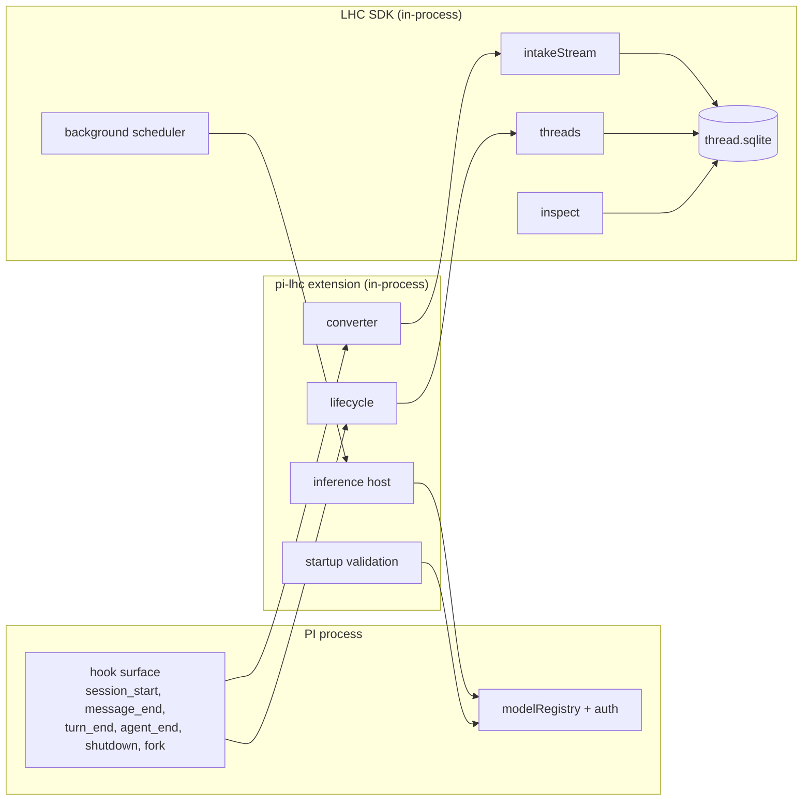
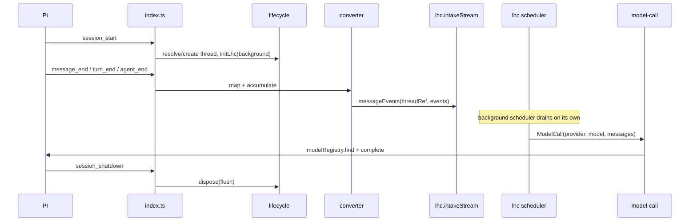
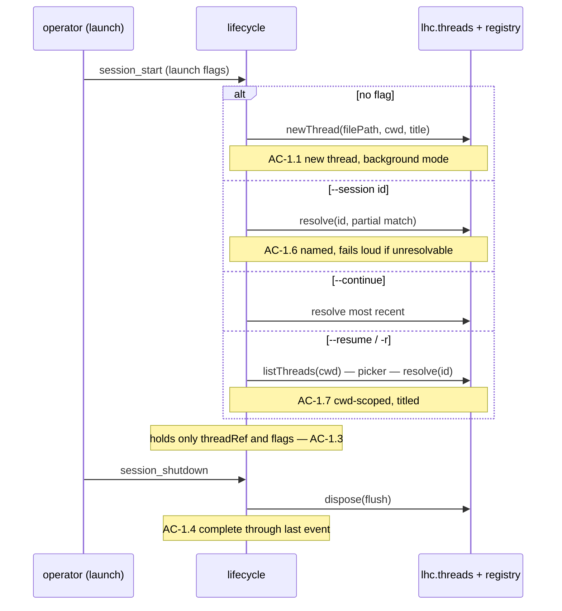
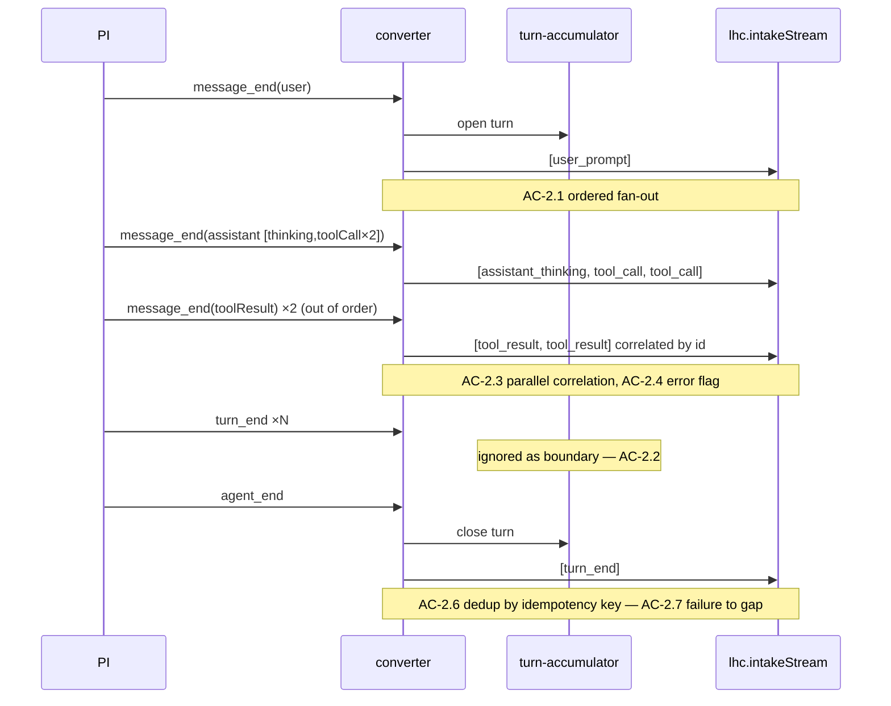
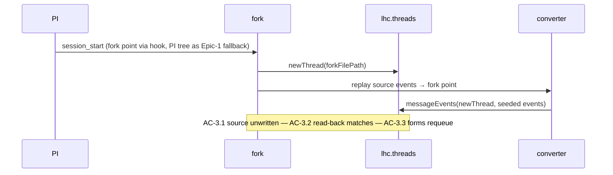
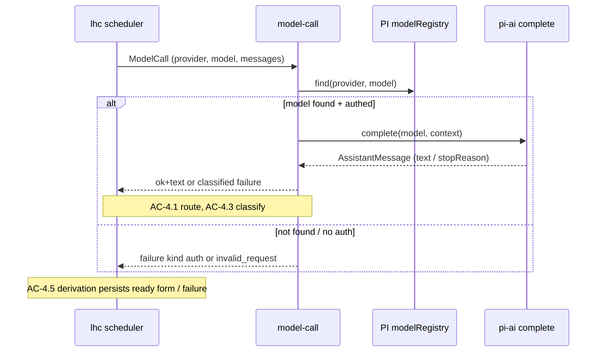

# Epic 1: Connector Core — Tech Design

**Status:** Draft for review
**Epic:** `epic.md`
**PRD:** `../00-prd.md` — Feature 1
**Tech Arch:** `../01-tech-arch.md`
**Wiring research:** `../notes/pi-ext-integration-research.md` (verified against PI v0.79.2)
**Test plan:** `test-plan.md`

---

## Spec Validation

The epic is implementable as written once its named M0 inputs land. Every AC maps to a module and a test; the data contracts match the real surfaces the design calls into (the LHC SDK at `packages/lhc`, the PI extension API at `@earendil-works/pi-coding-agent` v0.79.2, the completion API at `@earendil-works/pi-ai`). The tech-design questions are answered below, and the places where the design takes a position the epic left open are recorded as deviations with rationale.

The validation that mattered most: the epic's load-bearing claim is that an LHC turn is not a PI turn, and the converter must derive LHC turn boundaries from the agent-run bracket rather than from PI's per-step `turn_end`. The real PI event types confirm the shape the epic relies on — `turn_end` carries a per-agent-run `turnIndex` that resets to 0 each run, and `agent_end` brackets the whole run — so the contract is buildable against types that exist, not against an assumption.

### Issues Found

| # | Type | Issue | Resolution |
|---|------|-------|------------|
| I-1 | TDQ-1 (dissolved) | Mapping persistence shape (session file vs sidecar vs both). | **Dissolved — the thread is resolved at launch, not from a stored mapping.** The LHC thread is the system of record and the registry is the catalog; the thread for a run is named by the launch (new / `--session` / `--continue` / `--resume` picker), so there is no PI-session→thread mapping to persist, no early-crash window, and no recovery sidecar. The tech-lead's durability finding is moot: there is no pointer to lose. (PI's own session file still exists in this observe-only epic — PI runs its session normally; it just is not where LHC's thread identity lives.) See Flow 1. |
| I-2 | TDQ-2 | Fork derived-form reuse — provable-safe copy vs always-requeue. | **Resolved for v1: always requeue.** The new thread is seeded by event replay only; derived forms are not copied across the fork. Reuse is a later optimization gated on a provenance-identity check that does not exist yet. The epic's AC-3.3 permits this (reuse "may" happen; requeue is the correct fallback). Recorded as a deviation — the epic leaves the door open, the design closes it for v1. See Deferred Items. |
| I-3 | TDQ-3 | `thinkingSignature` / `thoughtSignature` handling. | **Resolved: capture, do not interpret.** Assistant thinking carries an opaque `thinkingSignature`; tool calls carry an opaque `thoughtSignature` (the POC mapper found both). Neither is part of the seven LHC intake payloads, which are text/structured-arg only. The converter records thinking text and tool-call arguments; the signatures are dropped in this epic because nothing in capture or derivation consumes them. Flagged as a deviation: re-injecting signatures is a serving concern (Epic 2), not capture. |
| I-4 | TDQ-4 (dissolved) | Thread resolution by external key. | **Dissolved.** Resolution is by the launch input (full/partial `threadId`, or a picker selection over `listThreads`), through `threads.resolve` / `threads.resolveThreadRef`. There is no external PI-session key to translate, because the operator names the thread at launch. |
| I-7 | API mismatch (tech-lead #1) | `appendEntry` is on `pi: ExtensionAPI`, not `ctx: ExtensionContext`. | **Moot for mapping, noted for capture.** The mapping no longer writes a session-file pointer, so the `appendEntry` mismatch in the old `session-mapping` is gone. Where the connector does need registration-time API (hook registration), it takes `pi: ExtensionAPI` at the factory, and per-hook handlers take `ctx`. Interface signatures take `pi` where an `ExtensionAPI` method is needed, `ctx` otherwise. |
| I-8 | API mismatch (tech-lead #3) | `registryPath` is not a field of `SdkConfig`. | **Resolved.** `registryPath` is removed from `initLhc`/`createSdk` construction. It is a per-operation argument on the `threads` calls (`newThread`, `resolve`, `listThreads`), which is where the real LHC API accepts it. `initLhc` is the rename of `createSdk` and takes `SdkConfig` unchanged. |
| I-9 | Wording (tech-lead #5) | "no `ctx.ui` surface" — `ExtensionContext.ui` always exists. | **Resolved.** Reporting guards on headless mode (`hasUI:false`), not on the absence of `ctx.ui`. Test and prose wording corrected. |
| I-10 | Gap fill | Runtime metadata: model/thinking changes, cwd, foreign-extension state. | **Resolved per epic A-8/A-9.** Model-select and thinking-level-select are captured as `runtime_note` events (AC-2.8, in-stream-only). cwd is stored on the registry row at thread creation and scopes the `--resume` picker. The full PI-runtime-state restoration inventory is an Epic 2 prerequisite (tech arch). Foreign-extension session persistence is out of scope v1 (epic A-9). |
| I-5 | TDQ-5 | Converter structure — how it consumes `message_end` and emits batched `MessageEventInput[]`. | **Resolved.** The converter is two pure stages plus one stateful accumulator: `mapMessage` (one PI `AgentMessage` → ordered `MessageEventInput[]`, no I/O) and `deriveTurnClose` (decides when to emit `turn_end`), driven by a per-session `TurnAccumulator` that tracks the open LHC turn across `message_end`/`agent_end`. Batches flush through `intakeStream.messageEvents(threadRef, events)`. See Flow 2 design. |
| I-6 | Deviation | Epic A-7 names image/file-reference handling an M0 decision. | **Design position pending M0, with a safe fallback specified.** The current LHC intake schema has no image/file payload kind beyond text/runtime-note material. Until M0 chooses placeholder vs. schema extension, unsupported content parts degrade to a `runtime_note` event recording the omission (never silent drop). If M0 extends the intake schema, the converter gains kinds; the degrade-to-`runtime_note` path remains the fallback for unsupported parts. This unblocks implementation planning without pre-empting the M0 call. |

---

## Context

This epic builds the first real consumer of the LHC SDK. Until now LHC has been exercised by its own test harness and a deterministic provider; here it gets wired to a live coding agent whose event stream it does not control. The whole epic is observe-only by deliberate construction — the extension records everything PI does and changes nothing the model sees — because that constraint is what lets capture correctness be proven before any context-serving risk is introduced. PI's native context handling stays in charge throughout. The reward for the discipline is that every test in this epic asserts on recorded thread state, never on what a model received.

The shape of the work is set by two systems that already exist and are not being changed. PI fires lifecycle hooks (`session_start`, `message_end`, `turn_end`, `agent_end`, `session_shutdown`, fork/switch) and an extension subscribes to them; this is a fixed, versioned contract verified against v0.79.2 by live recon. The LHC SDK is constructed once per session (`initLhc`, the agreed rename of the current `createSdk`), exposes operation surfaces (`intakeStream`, `threads`, `inspect`, the background work scheduler), and persists one SQLite file per thread. The connector is the tissue between them: it translates PI's events into LHC intake operations, and translates LHC's need for inference back into PI's authenticated model registry. It owns no context state of its own beyond a thread reference and a few told-the-user flags, because PI tears down and replaces its session objects on every new/resume/fork transition, and a cached reference to one of those objects is a latent crash.

Three forces shaped the central decisions. First, **PI's turn is not LHC's turn** — PI brackets each agent step with `turn_start`/`turn_end` and resets `turnIndex` to 0 per agent run, while an LHC turn spans a whole exchange. The converter must derive LHC turn boundaries from the agent-run bracket (`agent_end`), and the recon that established this is the reason the epic could be written without guessing. Second, **capture must never break the session** — malformed input on a writable thread degrades to a recorded, queryable gap; store-unavailable failures degrade to extension-level health diagnostics; neither throws back into a PI hook. Third, **derivations must close the loop on the user's own logins** — LHC asks for completions through a single host-supplied function that resolves provider/model through PI's registry, so there is no second credential store and no separate login.

One framing decision underlies the whole lifecycle: **the LHC thread is the system of record for the conversation, and the registry is the catalog.** The thread for a run is resolved at launch from the operator's choice (a new thread, the `--resume` picker, `--continue`, or a named `--session` id), the same way PI's own launch flags work. This dissolves what an earlier draft treated as a hard problem — keeping a PI-session→thread mapping durable across an early crash — because the launch choice *is* the thread identity, so there is nothing to recover. A scoping note that matters for the rest of this design: this epic is observe-only, so **PI still runs its own session** — it persists its session, serves its own context to the model, and tracks its own fork tree. LHC records alongside as the durable record. PI's session file becomes vestigial in Feature 2, when LHC's served context replaces PI's transcript; in Epic 1 the two coexist.

The connector also inherits a body of prior art. A POC extension (`src/context-steward/pi/`, ~3,900 lines across the mapper, the parallel-event intake, and the extension shell) already solved much of the hard mapping — idempotency-key construction, parallel-tool correlation, unsupported-part degradation — against an older LHC storage API. This epic productionizes that logic against the current, leaner SDK surface (plain-string `actor`/`harness`, per-event `idempotencyKey`, the seven-kind `MessageEventInput` union), so the converter is a rewrite informed by the POC, not a port of it. The POC's stale-context handling, by contrast, dies here: the tech arch's plain-data-only rule replaces it.

---

## System View

At the highest altitude the connector sits between two systems it does not own and one durable store it drives. PI is upstream — it produces the event stream and owns provider auth. The LHC SDK is the engine — it owns capture, projection, derivation scheduling, and persistence. The thread's SQLite file is the durable record that survives the process. The connector is the only component that speaks both PI's hook vocabulary and LHC's operation vocabulary, and it is the only place the PI-session-id ↔ LHC-thread-id translation lives.



The boundaries that matter for testing are the two edges the connector does not own: the **PI hook surface** (events arrive; the design feeds them from recorded corpora and synthetic builders) and the **`ModelCall` function** as it reaches PI's `modelRegistry` + `complete` (the design supplies a deterministic fake). Everything inside the LHC box runs real against a temp SQLite file, because persistence, reattach, replay, and fork are the product contract — mocking the store would prove nothing about the behaviors this epic exists to guarantee.

### External Contracts

**Incoming — PI hooks consumed** (shapes verified against `@earendil-works/pi-coding-agent` v0.79.2):

| Hook | Payload (relevant fields) | Connector use |
|------|---------------------------|---------------|
| `session_start` | `reason: "startup"\|"reload"\|"new"\|"resume"\|"fork"`, `previousSessionFile?` | Resolve or create the thread; reattach; trigger startup validation |
| `message_end` | `message: AgentMessage` (user / assistant / toolResult) | Map to `MessageEventInput[]`, batch into intake |
| `turn_end` | `turnIndex` (per-agent-run), `message`, `toolResults[]`, `stopReason` | Update accumulator; **never** a 1:1 LHC `turn_end` |
| `agent_end` | the agent run's messages | Close the open LHC turn — emit one LHC `turn_end` |
| `model_select` | `model`, `previousModel`, `source` | Capture as a `runtime_note` event (AC-2.8) |
| `thinking_level_select` | `level`, `previousLevel` | Capture as a `runtime_note` event (AC-2.8) |
| `session_before_fork` | `entryId`, `position` | Capture the fork point for replay-seeding |
| `session_before_switch` | switch intent (`new`/`resume`) | Flush + dispose before the swap |
| `session_shutdown` | `reason`, `targetSessionFile?` | Dispose the instance with flush |

**Outgoing — LHC SDK operations called** (shapes from `packages/lhc/src`):

| Surface | Operation | Used for |
|---------|-----------|----------|
| construction | `initLhc(config: SdkConfig)` — `{ inference, mode: "background", view, ... }`; `registryPath` is **not** a construction field | One instance per session |
| `threads` | `newThread({ filePath, title?, cwd?, registryPath? })`, `resolve({ threadId, registryPath? })`, `listThreads({ cwd?, registryPath? })`, `resolveThreadRef`, `info` | Launch resolution: create / pick / continue / named |
| `intakeStream` | `messageEvents(threadRef, MessageEventInput[])` → `BatchResult` | Record capture; dedup by idempotency key |
| scheduler | `mode: "background"` (auto-drain), `drainSettled(ref)` | Derivations run; awaited only in the closed-loop test |
| `inspect` | overview / health reads | Capture verification, gap/failure surfacing |

**Outgoing — inference, through PI:** the host-supplied `ModelCall` resolves `(provider, model)` via `ctx.modelRegistry.find(provider, model)` and completes via `complete(model, context, options)` from `@earendil-works/pi-ai`, returning `Promise<AssistantMessage>`.

**Error contract** (machine-readable, what callers program against):

| Source | Condition | Shape the connector produces |
|--------|-----------|------------------------------|
| Capture | malformed/unmappable event, thread writable | `OpResult` error recorded as a thread gap, surfaced in `inspect` health |
| Capture | thread store unavailable | extension diagnostic / health signal; no hook exception |
| ModelCall | auth / invalid request | `{ ok: false, kind: "auth" \| "invalid_request" }` (terminal) |
| ModelCall | rate limit / timeout / network | `{ ok: false, kind: "rate_limit" \| "timeout" \| "network" }` (retryable) |
| ModelCall | thrown exception | `{ ok: false, kind: "other" }` |
| ModelCall adapter (LHC) | resolved but no text | `kind: "empty_output"` — generated by LHC's adapter, never returned by the host function |

---

## Module Boundaries

### Top-Tier Surfaces

The tech arch names five top-tier surfaces for the whole `pi-lhc` extension. This epic touches three; the other two are out of scope and named so the boundary is explicit.

| Surface | This epic | What lands here |
|---------|-----------|-----------------|
| Session Lifecycle | **Yes** | Instance construction/disposal, launch-driven thread resolution, reload re-resolution, fork detection |
| Event Capture | **Yes** | The converter (message mapping, turn derivation, batching, dedup), capture-failure isolation, capture verification |
| Inference Host | **Yes** | The `ModelCall` implementation, assignment config, startup validation |
| Context Serving | No (Epic 2) | The `context` hook and thread-view serving are not registered in this epic |
| Surfaces (operator/agent) | No (Epic 3) | Commands and self-inspection tools beyond what verification reads |

All modules below nest within one of the three active surfaces. The package is a fresh scaffold (`packages/pi-lhc/` currently holds only `package.json`), so every module is NEW; the only EXISTS dependencies are the `lhc` workspace package and the PI/pi-ai packages.

### Module Architecture

```
packages/pi-lhc/
  src/
    index.ts                       NEW  extension entry — registers hooks, owns nothing else
    lifecycle/
      instance.ts                  NEW  initLhc construct/dispose; background mode
      thread-resolution.ts         NEW  launch flags → registry (new / --session / --continue / --resume); partial-id match
      picker.ts                    NEW  --resume cwd-scoped thread list + selection (thin pi-lhc UI)
      state.ts                     NEW  the plain-data-only holder { threadRef, flags, health } (no PI objects)
      fork.ts                      NEW  fork detection (session_before_fork hook; PI session tree as Epic-1 fallback) + replay seeding
    capture/
      converter.ts                 NEW  orchestrates map → accumulate → batch flush
      map-message.ts               NEW  pure: AgentMessage → MessageEventInput[]
      turn-accumulator.ts          NEW  open-turn state; deriveTurnClose
      idempotency.ts               NEW  pure: stable per-event key construction
    inference/
      model-call.ts                NEW  ModelCall over modelRegistry + complete; failure classification
      assignments.ts               NEW  config load + shape validation (the seven kinds)
      startup-validation.ts        NEW  registry existence + auth-availability probe; reporting (ctx.ui/headless)
    verify/
      replay.ts                    NEW  corpus → converter → thread; read-back compare (test-facing)
  test/
    fixtures/
      corpus.ts                    NEW  recorded-corpus loader (M0 fixtures)
      synthetic.ts                 NEW  synthetic AgentMessage / event builders
      model-call.ts                NEW  deterministic ModelCall fakes (text / each failure kind)
    ...                            NEW  per-chunk test files (see test-plan.md)
```

The two mock boundaries are explicit in the tree: `test/fixtures/corpus.ts` + `synthetic.ts` feed the PI hook edge, and `test/fixtures/model-call.ts` supplies the inference edge. No module under `src/` is mocked by another module under `src/` — the converter is tested through the capture entry point against a real temp thread, not in isolation with a mocked intake.

### Module Responsibility Matrix

This is the rosetta stone: every AC has a home, and every module names the ACs it carries. If an AC is not here, it has no owner.

| Module | Status | Responsibility | Depends on | ACs |
|--------|--------|----------------|-----------|-----|
| `index.ts` | NEW | Register hook handlers; route each hook to lifecycle/capture/inference; hold no state | all `src/` modules | (wiring) |
| `lifecycle/instance.ts` | NEW | `initLhc` in background mode on start; dispose with flush on shutdown; reconstruct on reload | `lhc` | AC-1.1, AC-1.4, AC-1.5 |
| `lifecycle/thread-resolution.ts` | NEW | Launch flags → registry resolution (new / `--session` full+partial / `--continue` most-recent); reload reconstructs from resolved id; unresolvable id fails loud | `lhc` threads | AC-1.2, AC-1.5, AC-1.6 |
| `lifecycle/picker.ts` | NEW | `--resume` cwd-scoped thread list (title + created) and selection | `lhc` threads (`listThreads`) | AC-1.7 |
| `lifecycle/state.ts` | NEW | Plain-data-only holder and extension diagnostics; never caches a PI context/session object across hooks | — | AC-1.3, AC-2.7 |
| `lifecycle/fork.ts` | NEW | Detect fork from `session_before_fork` hook (PI session tree as Epic-1 fallback); new thread; replay-seed to fork point; never write source | `lhc` threads, capture | AC-3.1, AC-3.2, AC-3.3 |
| `capture/converter.ts` | NEW | Orchestrate map→accumulate→batch; isolate capture failure to a gap/health signal | map-message, turn-accumulator, `lhc` intakeStream | AC-2.1, AC-2.7 |
| `capture/map-message.ts` | NEW | Pure map of one `AgentMessage` to ordered events; fan-out; parallel-tool correlation; error-result; abort; unsupported→runtime_note | idempotency | AC-2.1, AC-2.3, AC-2.4, AC-2.5 |
| `capture/turn-accumulator.ts` | NEW | Track the open LHC turn; emit exactly one `turn_end` at `agent_end`; ignore per-step PI `turn_end` | — | AC-2.2 |
| `capture/runtime-changes.ts` | NEW | Map `model_select` / `thinking_level_select` hooks to ordered `runtime_note` events (new + previous value) | `lhc` intakeStream | AC-2.8 |
| `capture/idempotency.ts` | NEW | Construct a stable key per event so re-delivery dedups | — | AC-2.6 |
| `inference/model-call.ts` | NEW | Resolve (provider,model) via registry; complete; classify failures; multi-lane | PI modelRegistry, pi-ai | AC-4.1, AC-4.2, AC-4.3, AC-4.4 |
| `inference/assignments.ts` | NEW | Load seven assignments from config; fail loud on missing/unknown/placeholder; override on next start | — | AC-5.4, AC-5.5 |
| `inference/startup-validation.ts` | NEW | Probe each assignment with `modelRegistry.find(provider, model)` for existence and `hasConfiguredAuth(model)` / `getAvailable()` membership for configured auth; report unknown and not-logged-in lanes through `ctx.ui`/headless diagnostics; leave capture running | PI modelRegistry | AC-5.1, AC-5.2, AC-5.3 |
| `verify/replay.ts` | NEW | Replay a corpus through the converter; compare read-back; deterministic | converter, `lhc` inspect | AC-6.1, AC-6.2 |
| (closed-loop, in `model-call` + scheduler) | NEW | Captured thread's queued derivation invokes the function and records an outcome | `lhc` scheduler, inspect | AC-4.5 |
| `inspect` reads (via `lhc`) | EXISTS | Surface counts, position, gaps, failures | `lhc` inspect | AC-6.3 |

### Component Interaction



---

## Flow-by-Flow Design

Each flow below opens with the context that makes its mechanics make sense, then a sequence diagram annotated with the ACs it satisfies, then a skeleton-requirements table and the TC approaches. The depth is uneven on purpose: turn derivation, idempotency, reattach, the inference adapter, and fork-replay carry the design's risk and get the most room; thread creation and config loading are mechanical and get less.

### Flow 1: Session Lifecycle and Launch-Driven Thread Resolution

A session starts and the connector must answer one question before anything else: which thread does this run record into? The answer comes from the launch, not from a recovered pointer — the LHC thread is the system of record and the registry resolves it from the operator's choice. No thread-selecting flag means a new thread (registered with its cwd). `--session <id>` resolves a named thread by full or partial id. `--continue`/`-c` resolves the most recently created thread. `--resume`/`-r` lists the cwd's threads and resolves the operator's pick. The connector then constructs the LHC instance in background scheduler mode against the resolved thread; derivations drain on their own and the connector never drives the queue.

Because the thread id is an input to the run, there is nothing to keep durable across an early crash and no two records that can disagree — the failure mode an earlier draft tried to insure against (a session-file pointer lost before flush) does not exist. An unresolvable `--session` id is an error, reported actionably; it never silently creates a new thread.

The plain-data-only rule is enforced structurally here. The connector's only retained state is a `{ threadRef, flags }` holder. It never stores a PI `ctx` or session-manager object between hooks, because PI replaces those objects on new/resume/fork and a stale reference is a crash waiting for the next transition. Each handler uses the fresh `ctx` PI passes it.



**Skeleton requirements:**

| What | Where | Stub signature | Stub semantics |
|------|-------|----------------|----------------|
| Construct/dispose | `lifecycle/instance.ts` | `initInstance(threadRef, config): Promise<Instance>` / `dispose(): Promise<void>` | structured result; throws nothing into hook |
| Resolve thread from launch | `lifecycle/thread-resolution.ts` | `resolveThread(launch: LaunchFlags, pi: ExtensionAPI): Promise<OpResult<ThreadRef>>` | registry resolve/create by mode; partial-id match; loud on unresolvable; structured `OpResult` |
| Resume picker | `lifecycle/picker.ts` | `pickThread(cwd: string): Promise<OpResult<ThreadRef \| null>>` | cwd-scoped `listThreads`; selection; `null` on empty |
| State holder | `lifecycle/state.ts` | `class SessionState { threadRef; flags }` | plain data; no PI refs |

TC approaches (TC-1.1…TC-1.5) live in `test-plan.md`; each asserts on observable thread/mapping state through a real temp thread, with the lifecycle entry point driven by synthetic `session_start`/`shutdown` events. The reattach test (TC-1.5) reconstructs from the durable record after discarding the in-memory holder — the architecture-risk test for restart survival.

### Flow 2: Event Capture and Turn Derivation

This is the densest flow and the one the epic was written to get right. Each finalized PI message becomes an ordered run of LHC intake events; the subtlety is entirely in turns. PI emits `turn_start`/`turn_end` per agent step and resets `turnIndex` to 0 at the start of each agent run, so an agent run that takes three steps emits three PI turns. An LHC turn is the whole exchange — the user prompt and every step the agent took until the next prompt. The converter therefore ignores PI's per-step `turn_end` as a boundary signal and closes the LHC turn at `agent_end`.

The converter is three pieces. `map-message.ts` is pure: it takes one `AgentMessage` and returns the ordered events for it — a user message becomes one `user_prompt`; an assistant message fans out to `assistant_thinking` (if present), then `assistant_text` (if present), then one `tool_call` per call, in that order; a tool result becomes one `tool_result` correlated to its call by `toolCallId`, carrying `isError` when the tool failed. `turn-accumulator.ts` holds the open-turn state and decides when to emit the single `turn_end`. `converter.ts` orchestrates, batches the events, and flushes them through `intakeStream.messageEvents`, isolating failures so writable-thread failures become recorded gaps and store-unavailable failures become extension diagnostics rather than thrown exceptions.

A worked example anchors the contract. The user asks one question that triggers two parallel tool calls, then gets a final answer:

```
PI emits:                              converter emits (one LHC turn):
  turn_start(0)                          user_prompt
  message_end(user [text])               assistant_thinking
  message_end(assistant                  tool_call (id=a)
    [thinking, toolCall a, toolCall b])  tool_call (id=b)
  message_end(toolResult b)              tool_result (id=b)
  message_end(toolResult a)              tool_result (id=a)
  turn_end(0)        <- ignored          assistant_text
  turn_start(1)                          turn_end          <- at agent_end
  message_end(assistant [text])
  turn_end(1)        <- ignored
  agent_end          <- closes turn
```

The two tool results arrive in the order `b` then `a`, and each correlates to its call by id, not by arrival order — the parallel-tool contract (AC-2.3). PI's `turn_end(0)` and `turn_end(1)` produce no LHC `turn_end`; the single LHC `turn_end` fires at `agent_end`. Session order derives from converter source-event order, never from `turnIndex`.



**Skeleton requirements:**

| What | Where | Stub signature | Stub semantics |
|------|-------|----------------|----------------|
| Map one message | `capture/map-message.ts` | `mapMessage(msg: AgentMessage, ctx: MapCtx): MessageEventInput[]` | pure; `NotImplementedError` until Green |
| Turn accumulation | `capture/turn-accumulator.ts` | `class TurnAccumulator { onMessage(); onAgentEnd(): MessageEventInput[] }` | pure state machine |
| Idempotency key | `capture/idempotency.ts` | `eventKey(parts): string` | pure; deterministic |
| Orchestrate + flush | `capture/converter.ts` | `capture(events, instance): Promise<OpResult<BatchResult>>` | structured result; isolates failure |

The idempotency key gets real depth because dedup correctness (AC-2.6) and crash-replay both depend on it. Construction precedence, carried from the POC and adapted to the SDK's per-event-key field: PI entry id when present (`pi:<session>:<entryId>:<block>:<kind>`), else provider `responseId` (assistant) or `toolCallId` (tool result), else a `role:timestamp:content-hash` fallback. The contract is that the key is identical across re-delivery of the same logical event and distinct across different events; the SDK's `messageEvents` returns `skipped` with `skipReason: duplicate_idempotency_key` for a re-delivered key, which is the dedup mechanism the test asserts against.

### Flow 3: Fork as New Thread

A fork produces a new LHC thread seeded by replay, and never writes the source. Detection does not depend on a `session_start` fork reason: recon found print-mode `--fork` reports `reason=startup`. The fork point comes from the `session_before_fork` hook (`entryId`, `position`) when present. In Epic 1, PI still runs its own session, so PI's session tree (the `parentId` chain) is available as additional fork evidence when the hook is absent. This is an Epic-1 convenience, not the permanent design: the long-term home for fork lineage is LHC thread metadata (Feature 2+, once PI's session file goes vestigial), so the design must not harden PI's session tree into a permanent dependency.

Seeding replays the source thread's recorded events up to the fork point into the new thread, through the same intake path normal capture uses, so the seeded read-back matches the source's read-back through that point. Derived forms are not copied (I-2): the new thread's derivations requeue and drain in the background. The source thread receives no writes — verified by logical read-back equality, not byte-equality, because SQLite page churn can change bytes without changing content.



**Skeleton requirements:**

| What | Where | Stub signature | Stub semantics |
|------|-------|----------------|----------------|
| Detect fork + point | `lifecycle/fork.ts` | `detectFork(ctx): ForkInfo \| null` | reads `session_before_fork` hook; PI session tree as Epic-1 fallback |
| Seed by replay | `lifecycle/fork.ts` | `seedFork(source, target, forkPoint): Promise<OpResult>` | structured result |

### Flow 4: Inference Host Routing

LHC needs completions for its derivations and must get them through the user's existing PI auth, with no second login. The connector supplies one function at construction; LHC calls it with a `(provider, model)` pair and a single-turn message list and treats both strings as opaque routing keys. The function resolves the pair with `ctx.modelRegistry.find(provider, model)` and completes with pi-ai's `complete(model, context)`, returning the assistant text or a classified failure. Different derivation kinds can carry different pairs in the same session; the function routes each by its keys without interpreting them.

Classification is the adapter-boundary contract and gets depth because it is where a runtime failure becomes a designed error code. A resolved completion with text returns `{ ok: true, text }`. Auth failure and invalid request are terminal (`"auth"`, `"invalid_request"`); rate-limit, timeout, and network are retryable (`"rate_limit"`, `"timeout"`, `"network"`); a thrown exception classifies as `"other"`. The host function never returns `"empty_output"` — that kind is generated by LHC's own adapter when a call resolves with no text — so the function returns text-or-transport-failure only, and the no-text case surfaces as the LHC-side `empty_output`.

AC-4.5 closes the loop end to end and is why this flow depends on captured content (Story 2), not just an instance. A captured thread's queued derivation work runs through the background scheduler, invokes the supplied function, and persists either a ready derived form or a classified failure, queryable through inspect/health. This is the PRD's M1 "confirm derivations land" gate — it proves capture → derivation → recorded outcome, not just the function in isolation. The test drives a captured thread, wires a deterministic function (one returning text, one returning a failure), awaits `drainSettled`, and asserts both a ready form and a classified failure exist in the thread.



**Skeleton requirements:**

| What | Where | Stub signature | Stub semantics |
|------|-------|----------------|----------------|
| The function | `inference/model-call.ts` | `createModelCall(ctx): ModelCall` | returns `{ok,text}`/`{ok:false,kind}` |
| Classify | `inference/model-call.ts` | `classifyFailure(err): ModelCallFailureKind` | pure mapping |

### Flow 5: Startup Validation and Assignment Config

Before any derivation runs, the connector checks that all seven assignments point at lanes PI can actually reach, so a misconfiguration surfaces up front rather than as a derivation failure later. Two layers do two different jobs, and conflating them would be wrong. The SDK already validates assignment *shape* at construction — all seven kinds present, non-empty provider/model, prompt-name registered — and throws if not; that is `assignments.ts`'s "fail loud" (AC-5.5), and it is enforced by LHC, not re-implemented here. The connector adds a *reachability* probe on top: for each assignment, first call `ctx.modelRegistry.find(provider, model)` to distinguish an unknown provider/model from a known lane, then check configured auth with `ctx.modelRegistry.hasConfiguredAuth(model)` or equivalent `getAvailable()` membership. Unknown lanes report a config/assignment fix; known-but-unauthed lanes report a login/auth fix. OAuth freshness is still verified at runtime by the model-call path and classified as a derivation failure if the token is stale.

Reporting must not assume a TUI. The report uses PI's UI surface (`ctx.ui.notify` when available) and always records the same structured diagnostic in `SessionState.health`; headless modes emit the diagnostic through the headless-appropriate log/output channel. A validation failure leaves capture running — the two concerns are independent — and the affected lane's derivations fail classified and queryable through health (AC-5.3). Assignments load from config; an override of any kind's provider, model, or prompt takes effect on the next session start with no code change.

**Skeleton requirements:**

| What | Where | Stub signature | Stub semantics |
|------|-------|----------------|----------------|
| Load + shape-validate | `inference/assignments.ts` | `loadAssignments(config): Record<FormKind, ModelAssignment>` | throws on missing/unknown/placeholder |
| Reachability probe | `inference/startup-validation.ts` | `validateReachable(assignments, ctx): ValidationReport` | structured report |
| Report | `inference/startup-validation.ts` | `report(r, ctx, state): void` | `ctx.ui` when available; structured state diagnostic always |

### Flow 6: Capture Verification

Because the epic is observe-only, capture correctness is proven without serving anything to a model. `verify/replay.ts` replays a recorded corpus through the converter into a temp thread and compares the resulting read-back — events, messages, turns — against the fixture's expectation. The same corpus replayed twice yields identical read-back, because the converter's mapping and the SDK's deterministic IDs make replay reproducible (AC-6.2). The corpora are the M0 fixtures (chatty, tool-heavy, parallel-tool, error-result, aborted-turn); until M0 delivers breadth, the machinery builds against whatever corpora exist and widens as they arrive. inspect's overview and health reads report event/message counts, last recorded position, and any capture gaps or failed derivations (AC-6.3).

**Skeleton requirements:**

| What | Where | Stub signature | Stub semantics |
|------|-------|----------------|----------------|
| Replay + compare | `verify/replay.ts` | `replayCorpus(corpus, threadRef): Promise<ReplayResult>` | structured compare result |

---

## Interface Definitions

These are copy-paste targets for the foundation chunk. Types reference the ACs they serve; signatures are complete (no `any`, no TODO). The LHC-side types (`MessageEventInput`, `ModelCall`, `ModelAssignment`, `FormKind`, `ThreadRef`, `OpResult`) are imported from the `lhc` package, not redefined — the connector consumes them.

```typescript
// lifecycle/state.ts — AC-1.3: plain data only, never a PI object
export interface SessionState {
  threadRef: ThreadRef;          // from lhc
  flags: {
    startupValidationReported: boolean;
    [k: string]: boolean;
  };
  health: {
    lastCaptureFailure?: CaptureFailureDiagnostic;
    startupValidation?: ValidationReport;
  };
}

export interface CaptureFailureDiagnostic {
  code: string;
  eventKey?: string;
  message: string;
  recordedGap: boolean;
}

// lifecycle/thread-resolution.ts — AC-1.2, 1.5, 1.6
// Launch flags name the thread; the registry resolves it. (PI's own session file
// still exists in this observe-only epic; it is just not where thread identity lives.)
export interface LaunchFlags {
  resume?: boolean;        // --resume / -r : cwd-scoped picker
  continue?: boolean;      // --continue / -c : most recent
  session?: string;        // --session <id> : full or partial id
  // none set → new thread
}
export function resolveThread(
  launch: LaunchFlags, pi: ExtensionAPI,
): Promise<OpResult<ThreadRef>>; // unresolvable --session id → error, never a silent new thread

// lifecycle/picker.ts — AC-1.7
export function pickThread(cwd: string): Promise<OpResult<ThreadRef | null>>; // null on empty list

// capture/map-message.ts — AC-2.1, 2.3, 2.4, 2.5
export interface MapCtx { piSessionId: string; entryId?: string; }
export function mapMessage(msg: AgentMessage, ctx: MapCtx): MessageEventInput[];

// capture/runtime-changes.ts — AC-2.8
// model_select / thinking_level_select hooks → runtime_note events, in order.
export function mapModelSelect(
  ev: { model: { provider: string; id: string }; previousModel?: { provider: string; id: string } },
  ctx: MapCtx,
): MessageEventInput; // one runtime_note recording new + previous model
export function mapThinkingLevelSelect(
  ev: { level: string; previousLevel: string }, ctx: MapCtx,
): MessageEventInput; // one runtime_note recording new + previous level

// capture/turn-accumulator.ts — AC-2.2
export class TurnAccumulator {
  onMessage(events: MessageEventInput[]): void;
  onAgentEnd(): MessageEventInput[]; // returns [turn_end] when a turn is open, else []
  hasOpenTurn(): boolean;
}

// capture/idempotency.ts — AC-2.6
export function eventKey(input: {
  piSessionId: string; entryId?: string; responseId?: string;
  toolCallId?: string; blockIndex: number; kind: MessageEventInput["eventKind"];
  role?: string; timestamp?: number; content?: string;
}): string;

// capture/converter.ts — AC-2.1, 2.7
export function capture(
  events: MessageEventInput[],
  instance: LhcInstance,
): Promise<OpResult<BatchResult>>;

// inference/model-call.ts — AC-4.1..4.4
export function createModelCall(ctx: ExtensionContext): ModelCall; // ModelCall from lhc
export function classifyFailure(err: unknown): ModelCallFailureKind;

// inference/assignments.ts — AC-5.4, 5.5
export function loadAssignments(
  config: unknown,
): Record<FormKind, ModelAssignment>; // throws on missing/unknown/placeholder

// inference/startup-validation.ts — AC-5.1, 5.2, 5.3
export interface ValidationReport {
  unreachable: {
    kind: FormKind;
    provider: string;
    model: string;
    reason: "unknown_model" | "auth_not_configured";
    fix: string;
  }[];
}
export function validateReachable(
  assignments: Record<FormKind, ModelAssignment>,
  ctx: ExtensionContext,
): ValidationReport;
export function report(
  r: ValidationReport,
  ctx: ExtensionContext,
  state: SessionState,
): void; // ctx.ui when available + structured state diagnostic

// lifecycle/fork.ts — AC-3.1, 3.2, 3.3
export interface ForkInfo { sourceFile: string; forkEntryId: string; }
export function detectFork(ctx: ExtensionContext): ForkInfo | null;
export function seedFork(
  source: ThreadRef, target: ThreadRef, forkPoint: string,
): Promise<OpResult<void>>;

// verify/replay.ts — AC-6.1, 6.2
export interface ReplayResult { matches: boolean; diff?: string; }
export function replayCorpus(corpus: Corpus, threadRef: ThreadRef): Promise<ReplayResult>;
```

---

## Architecture-Risk Tests

Beyond the TC→test mapping, the chosen architecture creates hazards the AC/TC mapping alone would miss. These are non-TC tests assigned to chunks.

| Risk | Test file | Test | Why AC/TC mapping alone would miss it |
|------|-----------|------|---------------------------------------|
| Persistence / Restart | `lifecycle/thread-resolution.test.ts` | Discard the in-memory holder, re-resolve the same thread by its id from the registry, capture continues on it | The AC says "resume on the resolved thread"; only a real reopen proves resolution works across process death without a retained object |
| Idempotency / Retry | `capture/idempotency.test.ts` | Replaying the same corpus twice produces no duplicate events; re-delivered keys come back `skipped` | TC checks dedup once; the hazard is re-delivery under reload/replay being safe |
| Adapter / Runtime Boundary | `inference/model-call.test.ts` | Each PI/pi-ai failure shape maps to the exact `ModelCallFailureKind` | TC may say "error classified"; the hazard is the precise runtime-error → code mapping |
| Atomicity / Isolation | `capture/converter.test.ts` | A mid-batch capture failure records a gap and continues; no exception reaches the hook; store-unavailable produces a health signal not a gap | The session continuing is observable; the no-exception-into-hook guarantee is not an AC |
| Source vs Derived Truth | `lifecycle/fork.test.ts` | After fork, source thread read-back is unchanged and forms requeue on the target | The epic sees a correct fork; the hazard is the source being silently mutated by seeding |
| Fixture Validity | `test/fixtures/corpus.test.ts` | Corpus loader yields valid `MessageEventInput` shapes and lifecycle-coherent sequences | Fixture correctness is test substrate, not product behavior, so no AC covers it |
| Concurrency / Lost Update | `inference/closed-loop.test.ts` | A stale background derivation result does not clobber newer thread state | LHC owns this, but the connector's background-mode wiring must not reintroduce it |

Migration/compatibility is N/A — POC threads are out of scope (epic Migration), and the package is greenfield. Threshold/budget is N/A — visibility budgets are Epic 2.

---

## Conditional Design Sections

### Fixture Contracts

The epic's verification flow and most capture tests run on fixtures, so fixture validity is a foundation invariant. Two fixture families:

- **Recorded corpora** (`test/fixtures/corpus.ts`) — the M0 captures, loaded and validated to produce well-formed `MessageEventInput` sequences. Each corpus is a named lifecycle (chatty, tool-heavy, parallel-tool, error-result, aborted-turn). Default loaders represent valid captures; an explicitly named `makeTruncatedCorpus()` produces a deliberately malformed sequence for the capture-failure test.
- **Synthetic builders** (`test/fixtures/synthetic.ts`) — `makeUserMessage`, `makeAssistantMessage({ thinking?, text?, toolCalls? })`, `makeToolResult({ id, isError? })`, and event-stream builders for `session_start`/`agent_end` etc. These drive the lifecycle and turn-derivation tests where a precise hand-built shape beats a recorded one.
- **Deterministic ModelCall fakes** (`test/fixtures/model-call.ts`) — `fakeModelCallText(text)`, `fakeModelCallFailure(kind)`, and a per-kind router for multi-lane tests.

Foundation tests (Chunk 0) verify these invariants before behavior chunks consume them.

### Derived-State Provenance

This epic produces derived forms only via the closed-loop proof and fork requeue; it does not own provenance design (LHC does). The one connector-side rule: the fork path must not copy derived forms (I-2), so a forked thread's forms are always freshly derived and carry the new thread's provenance, never the source's. No provenance fields are added by the connector.

### Mutation / Lease Semantics

The connector does not mutate persisted thread state directly — all writes go through `intakeStream.messageEvents`, which LHC serializes per thread file. There is one writer per thread (the session's instance), single-process. The connector adds no locks or leases; it relies on LHC's per-file transaction semantics. The only stale-write surface is the background scheduler, which LHC owns; the connector's responsibility is limited to constructing in background mode and never also driving `drain` (which would create a second writer).

### Deterministic Algorithm Boundaries

Two deterministic mechanics need golden cases:

- **Turn derivation** — exact inputs (a PI event sequence) to exact outputs (the ordered LHC events plus the single `turn_end`). The worked example in Flow 2 is the first golden case; others cover an aborted run (turn closes complete-but-aborted at `agent_end` with partial content) and a hard-kill (no `agent_end` → open turn left open, tolerated as a no-op on reattach).
- **Replay equality** — a corpus replayed twice yields byte-identical read-back. Golden cases pin the deterministic-ID property end to end through the converter.

Idempotency-key construction is deterministic but its golden cases live with the idempotency risk test rather than here.

---

## Testing Strategy

The test architecture follows directly from where this component's real boundaries are. The connector's own modules — converter, mapper, accumulator, model-call, validation — are never mocked against each other; they are exercised through their entry points (the hook handlers, the converter, the replay harness) so wiring bugs between them surface. Mocks live only at the two true external edges.

```
        /\
       /  \   Manual: load into real PI, run a session, inspect the thread
      /----\
     /      \  Entry-point tests: hook handlers / converter / replay
    /--------\  driven by synthetic events + corpora, real temp SQLite
   /          \ Module tests: map-message, turn-accumulator, idempotency,
  /------------\ classifyFailure — pure, no mocks
 /--------------\
```

**The critical mocking rule, applied:** mock at the external boundary, never at internal module boundaries. The external boundaries are the PI hook surface (fed by synthetic events and recorded corpora) and the `ModelCall`'s reach into PI's `modelRegistry` + pi-ai `complete` (supplied as a deterministic fake). Everything LHC runs real.

| Layer | Mock? | Why |
|-------|-------|-----|
| PI hook events | Fed, not mocked | Synthetic builders + recorded corpora are the input, not a mocked dependency |
| `modelRegistry` + pi-ai `complete` | Yes (the fake `ModelCall`) | External boundary — control completion text and failure shapes |
| LHC SDK (`intakeStream`, `threads`, scheduler, `inspect`) | **No** | The engine under test; runs real |
| SQLite thread file | **No — real temp file** | Persistence, reattach, replay, fork are the product contract |
| `ctx.ui` / config | Yes (injection) | No logic, just setup |
| Connector's own modules | **No** | That's what's being tested |

**Stateful local persistence:** reattach (TC-1.5), replay-equality (TC-6.2), and fork source-immutability (TC-3.1) all use real temp thread directories and prove behavior across a reopen or a second thread, because mocking the store would make these tests assert nothing.

The verification tiers are the `lhc` package's configured commands, which `pi-lhc` mirrors (pnpm workspace, vitest, tsc). What gets mocked appears again here intentionally; the same boundary is stated in External Contracts and in the matrix.

---

## Verification Scripts

These are the `pi-lhc` package's gates, matching the `lhc` package's configured composition (verified in `packages/lhc/package.json`). The `boundaries` step matters here because `check-boundaries.mjs` enforces the module-import rules that keep the connector's surfaces from leaking into each other.

| Tier | Composition | Purpose |
|------|-------------|---------|
| `red-verify` | `build && typecheck && lint && boundaries` | TDD Red exit — everything except behavior tests |
| `verify` | `red-verify && vitest run` | Standard development gate |
| `green-verify` | `verify && check-test-immutability` | TDD Green exit — tests pass + immutability guard |
| `verify-all` | `verify` (no separate integration/e2e suite yet) | Deep gate; labeled below |

There is no separate integration/e2e suite in this package yet. `verify-all` equals `verify` for now; the wide "load into real PI" pass is the Manual Verification step, not an automated suite. The test plan labels every suite `ran` / `absent` so `verify-all` does not imply coverage it lacks.

---

## Work Breakdown: Chunks and Phases

Chunks map to the epic's stories, with Chunk 0 carrying the shared foundation. Per-chunk Red/Green test tables and the full TC→test mapping live in `test-plan.md`; this section is the index.

### Chunk 0: Foundation (always first)

Archetypes: **Pure Type Foundation** (the interfaces above), **Fixture/Test Foundation** (corpus loader, synthetic builders, ModelCall fakes, temp-thread factory), **Orchestration/Command Foundation** (the extension entry point and hook-registration rail with structured-result stubs), and **Verification Gate Foundation** (package scripts/config for the gates named here).

| Deliverable | Path | Contains |
|-------------|------|----------|
| Types | `src/**/(*.ts type exports)` | All interfaces from Interface Definitions |
| Extension shell | `src/index.ts` | Hook registration; routes to stubbed handlers; holds no state |
| State holder | `src/lifecycle/state.ts` | Plain-data `SessionState` |
| Fixtures | `test/fixtures/{corpus,synthetic,model-call}.ts` | Valid-default builders + named invalid builders |
| Temp-thread factory | `test/fixtures/thread.ts` | Real temp SQLite thread per test |
| Package verification config | `package.json`, `tsconfig*.json`, test/lint scripts | `red-verify`, `verify`, `green-verify`, `verify-all`, boundary/lint wiring |

**Exit criteria:** package verification scripts exist and run; `red-verify` passes; fixture-invariant tests pass (corpus shapes valid, synthetic builders produce coherent sequences, temp-thread factory creates and reopens a thread); the extension loads and registers hooks (smoke).

### Chunk 1 — Session Lifecycle and Launch-Driven Thread Resolution (Story 1)

**Scope:** instance construct/dispose, launch-driven resolution (new / `--session` partial-id / `--continue` / `--resume` picker), reload re-resolution, plain-data rule. **ACs:** 1.1–1.7. **Relevant sections:** Flow 1, `lifecycle/*`, Persistence/Restart risk. **Architecture-risk tests:** re-resolve-after-discard. **Substrate maturity:** depends on the registry `cwd` column, partial-id `resolve`, and cwd-filtered `listThreads` (epic A-8) — **Epic 1 LHC-side scope, gated before AC-1.6/1.7, not optional**. These are built first in this chunk; AC-1.7's cwd-scoped picker does not pass by degrading to an unscoped or untitled list. **Risk shape:** launch state machine; registry is the catalog; unresolvable id fails loud; no second writer.

### Chunk 2 — Event Capture and Turn Derivation (Story 2)

**Scope:** the converter, fan-out, turn derivation, runtime metadata capture, parallel correlation, error/abort capture, dedup, failure isolation. **ACs:** 2.1–2.8. **Relevant sections:** Flow 2, `capture/*`, Idempotency + Atomicity risks, Deterministic Boundaries (turn derivation). **Architecture-risk tests:** idempotency double-replay, mid-batch failure isolation. **Risk shape:** the highest-risk chunk; turn derivation is the load-bearing mechanic; capture failure must isolate.

### Chunk 3 — Capture Verification (Story 3)

**Scope:** corpus replay, read-back compare, deterministic re-replay, inspect surfacing. **ACs:** 6.1–6.3. **Relevant sections:** Flow 6, `verify/replay.ts`, Fixture Validity risk. **Substrate maturity:** consumes Chunk 2's converter through the real intake path, not a seam; consumes M0 corpora as fixtures (widens as M0 delivers).

### Chunk 4 — Fork as New Thread (Story 4)

**Scope:** fork detection (hook + Epic-1 session-tree fallback), replay-seed, source immutability, requeue. **ACs:** 3.1–3.3. **Relevant sections:** Flow 3, `lifecycle/fork.ts`, Source-vs-Derived risk. **Architecture-risk tests:** source read-back unchanged after seeding. **Risk shape:** new-thread authority; source is read-only; forms requeue (no copy); fork lineage's permanent home is LHC metadata (Epic 2+), not PI's session tree.

### Chunk 5 — Inference Host Routing (Story 5)

**Scope:** the `ModelCall`, multi-lane routing, classification, and the closed-loop proof. **ACs:** 4.1–4.5. **Relevant sections:** Flow 4, `inference/model-call.ts`, Adapter-Boundary + Concurrency risks. **Substrate maturity:** AC-4.5 consumes Chunk 2's captured content through the real scheduler + `drainSettled`, not a fake derivation. **Architecture-risk tests:** failure-shape→kind mapping, stale-result no-clobber.

### Chunk 6 — Startup Validation and Assignment Config (Story 6)

**Scope:** shape validation (LHC-enforced), reachability probe using existence + configured-auth checks, `ctx.ui`/headless reporting, config override. **ACs:** 5.1–5.5. **Relevant sections:** Flow 5, `inference/{assignments,startup-validation}.ts`. **Risk shape:** validation independent of capture; reporting must not assume a TUI.

### Chunk Dependencies

```
Chunk 0 (Foundation)
   ├──> Chunk 1 (Lifecycle) ──> Chunk 2 (Capture) ──> Chunk 3 (Verification)
   │                                     └──────────> Chunk 4 (Fork)
   │                                     └──────────> Chunk 5 (Inference 4.5)
   └──> Chunk 5 (Inference 4.1–4.4) ──> Chunk 6 (Validation)
```

Chunk 5 splits across the diagram because the function and classification (4.1–4.4) depend only on the instance (Chunk 1 via 0), while the closed-loop proof (4.5) needs captured content (Chunk 2).

---

## Open Questions

| # | Question | Owner | Blocks | Resolution |
|---|----------|-------|--------|------------|
| Q1 | Does M0 extend the intake schema for images/file-refs, or is degrade-to-`runtime_note` the final v1 answer? | M0 / Lee | Chunk 2 (final form) | Pending; safe default (I-6) unblocks design |
| Q2 | Is the `initLhc` rename landed before implementation, or does Chunk 0 write against `createSdk` and rename later? | Lee | Chunk 0 import names | Pending; mechanical either way (A-4) |
| Q3 | Final breadth of M0 corpora for Chunk 3 fixtures | M0 / Lee | Chunk 3 coverage | Pending; machinery builds against available corpora |

---

## Deferred Items

| Item | Related AC | Reason deferred | Future work |
|------|-----------|-----------------|-------------|
| Fork derived-form reuse (copy instead of requeue) | AC-3.3 | Needs a provenance-identity safety check that does not exist; requeue is correct and cheap | Optimization once provenance identity is defined (Epic 2+) |
| `thinkingSignature` / `thoughtSignature` re-injection | TDQ-3 | Capture drops them; re-injection is a serving concern | Epic 2 (serving) decides if signatures must round-trip |
| Image/file-reference intake payload kinds | A-7 | M0 decision; degrade-to-`runtime_note` is the interim contract | Converter gains kinds if M0 extends the schema |

---

## Related Documentation

- Epic: `epic.md`
- Test plan: `test-plan.md`
- Tech architecture: `../01-tech-arch.md`
- Wiring research: `../notes/pi-ext-integration-research.md`
