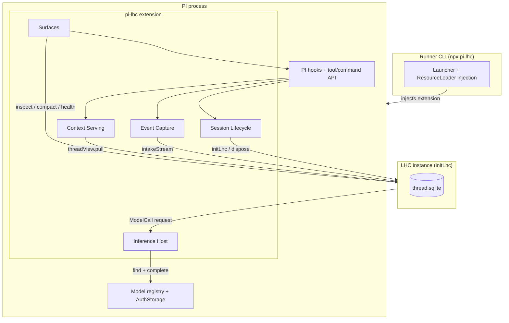
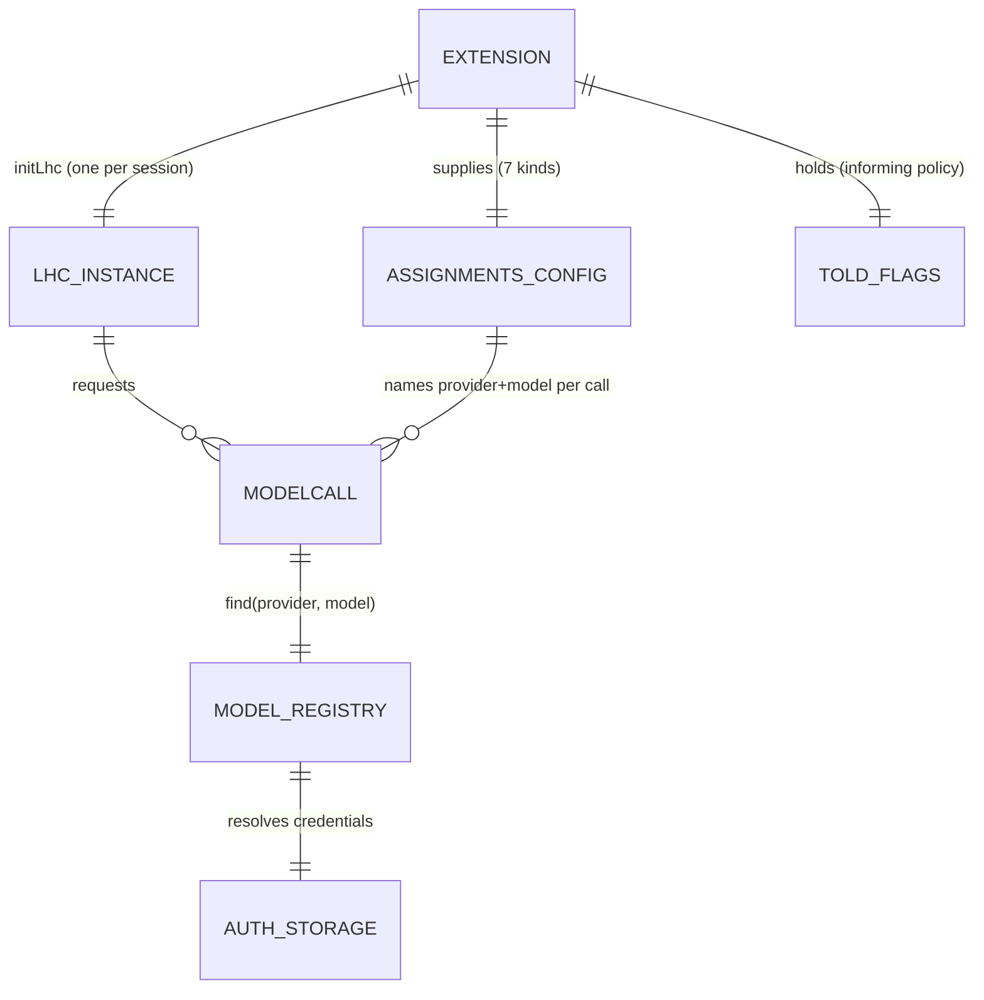
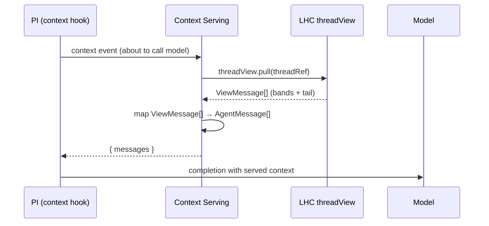

# pi-lhc: Technical Architecture

## Status

Draft — pending review. Companion to `00-prd.md`. Settles the technical world the four `pi-lhc` epics inherit: stack, package shape, the extension's top-tier surfaces, the auth and inference model, the test strategy against PI, and the boundaries between the extension, the LHC SDK, and PI.

Inputs: `00-prd.md`, `notes/pi-ext-integration-research.md` (wiring verified against PI v0.79.2), `notes/pi-ext-prd-notes.md`, the LHC v1 spec line (`../01-lhc-sdk/`).

---

## Architecture Thesis

`pi-lhc` is a standard PI extension package and a thin runner CLI that wrap it. It runs in-process inside PI: PI fires lifecycle hooks, the extension maps them onto one LHC instance per session, and LHC owns all context behavior and persistence (one SQLite thread file). The extension holds no context state of its own beyond a thread reference and a small set of told-the-user flags; it is connective tissue between PI's event/hook surface and LHC's operation surface. Inference flows one direction: LHC asks for a model call, the extension routes it through PI's existing provider auth. There is no daemon, no server, and no second credential store. The package ships two ways — installed into an existing PI (`pi install npm:pi-lhc`) or launched standalone (`npx pi-lhc`) — both sharing the user's PI auth.

## Core Stack

`pi-lhc` inherits the LHC SDK's stack because it consumes the SDK in-process, and it inherits PI's package contract because it runs inside PI. The choices below are constrained by those two facts, not made fresh.

| Component | Choice | Version | Rationale | Checked | Compatibility Notes |
|-----------|--------|---------|-----------|---------|---------------------|
| Runtime | Node | ≥24 | LHC SDK requires `node:sqlite` (`DatabaseSync`), available in Node 24; PI floor is ≥22.19, so 24 satisfies both | 2026-06-12 | Verified: `node:sqlite` available in Node 24.14; API is still release-candidate stability, so DB usage stays behind the LHC storage boundary |
| Language | TypeScript | 5.9 | Matches LHC SDK and PI; ESM throughout | 2026-06-12 | `"type": "module"`, same `tsconfig` base as LHC |
| Host harness | `@earendil-works/pi-coding-agent` (+ `pi-ai`, `pi-agent-core`) | ^0.79 | The harness being extended; provides the extension API, model registry, auth storage, `createAgentSession` | 2026-06-12 | Current published 0.79.2; bin `pi`; same major already used by this repo |
| LHC SDK | `lhc` (`initLhc`) | workspace | The context engine; consumed in-process | 2026-06-12 | Workspace dependency; rename `createSdk`→`initLhc` pending (see Cross-Cutting) |
| Persistence | `node:sqlite` (via LHC) | Node built-in | LHC owns all storage; the extension never opens a DB directly | 2026-06-12 | One file per thread; LHC's single-writer discipline |
| Test runner | Vitest | ^4.1 | Matches LHC and the v1 spec line; recorded-corpus replay fits vitest fixtures | 2026-06-12 | Same runner the SDK suites use |
| Tokenizer | `js-tiktoken` (via LHC) | ^1.0 | Inherited; the extension does no token counting | 2026-06-12 | LHC-internal |

### Rejected alternatives

| Considered | Why Rejected |
|-----------|-------------|
| `better-sqlite3` for any extension-side storage | The extension has no storage of its own — all durable state is LHC's (thread file + registry). Adding a second SQLite binding would create a parallel persistence path the architecture forbids. |
| Forking/rebranding PI (`piConfig`) to ship as one binary | Requires publishing a PI build; conflicts with the standard-extensions principle. The package + runner approach reaches the same "just run it" outcome without owning a fork. |
| A separate install-path LHC config/auth store | Recreates the two-auth/two-config problem the one-login model exists to avoid. Install-path config rides PI's settings; runner-path config uses one own-file because the runner is the launched app. Neither path creates a second credential store. |

## System Shape

`pi-lhc` has two runtime artifacts — the **extension** (loaded inside a PI process) and the **runner CLI** (a launcher that starts PI with the extension injected) — and five top-tier surfaces inside the extension. The surfaces are responsibility zones, not files: each owns one part of the PI↔LHC connection and is the seam its epic decomposes within.

| Surface | Owns | Depends On | Downstream Inherits |
|---------|------|------------|---------------------|
| Session Lifecycle | `initLhc`/dispose per session; launch-driven thread resolution through the registry (new / `--session` / `--continue` / `--resume` picker); reload/fork resolution; mid-turn-kill tolerance | PI session events, LHC threads + registry surface | Epic 1. All thread-resolution logic lives here. No other surface opens or resolves a thread. |
| Event Capture | PI message/turn events → LHC intake batches (the converter, productionized); ordering, idempotency, dedup | PI `message_end`/`turn_end`, LHC intakeStream | Epic 1. The one mapper. No other surface writes intake events. |
| Context Serving | The `context` hook: `threadView.pull` → PI message array; PI compaction interception; materialize fallback | PI `context`/`session_before_compact` hooks, LHC threadView | Epic 2. All "what the model sees" logic. No other surface returns context. |
| Inference Host | The injected `ModelCall`; model-assignment config; startup validation/probe | PI model registry + AuthStorage, LHC inference seam | Epic 1 builds it; Epic 3 surfaces its failures. The only path from LHC inference to PI credentials. |
| Surfaces | Operator commands; agent self-inspection tools; the informing policy (notices, footer, receipts) | PI command/tool/UI API, LHC inspect/threadView | Epic 3. All user- and agent-facing read/command surfaces. Mutation is operator-initiated. |

The two artifacts share one codebase: the runner is a launcher that hands PI a `ResourceLoader` injecting the same extension module the install path discovers. Everything PI-facing lives in the extension; the runner owns only process launch and auth/config resolution. This keeps the install path and the runner path behaviorally identical — the runner adds a way to start PI, not a second implementation.

## Cross-Cutting Decisions

### The `createSdk` → `initLhc` rename

**Choice:** The LHC SDK's construction export is renamed `createSdk` → `initLhc` before Epic 1 implementation; this spec line uses `initLhc`.
**Rationale:** `createSdk` names the artifact category, not the thing. The rename was agreed during PRD work. Doing it now — Epic 5 closed, no production host yet — costs one export plus internal references; doing it after a published package depends on it costs a migration.
**Consequence:** Epic 1 begins against `initLhc`. The rename rides the first LHC change batch when extension work starts. Until then, code reads `createSdk` and this is a known, tracked gap, not a contradiction.

### Inference: one injected ModelCall, LHC owns the rest

**Choice:** The extension injects one `ModelCall` function at `initLhc`. It resolves the (provider, model) pair LHC names through PI's model registry and `AuthStorage`, calls PI's `complete`, and maps errors to LHC's failure classification. LHC owns prompts, the seven model assignments, and classification; PI owns credentials and transport.
**Rationale:** Per-kind injection would move LHC's derivation catalog into the host and make an eighth kind a breaking host change. One routing function keeps derivation knowledge in LHC and satisfies multi-lane setups (different providers per kind) because each call names its lane.
**Consequence:** No epic gives the extension knowledge of what a derivation is. The Inference Host surface is a router, not a policy layer. Adding or retargeting a derivation kind is an LHC config change, invisible to the extension.

### Auth and config root

**Choice:** The install path uses PI's normal global agent auth/model resolution. The runner reuses that same global resolution by default. Neither establishes a project-local PI auth root unless the user opts in. LHC config (model assignments, profiles, budgets) rides PI's settings section on the install path and a single own-file on the runner path.
**Rationale:** The one-login model is the product's core auth stance; a second credential store or a surprise project-local root recreates the two-auth problem. PI resolves its config dir through an overridable mechanism, so the architecture commits to "PI's normal resolution," not a hardcoded path.
**Consequence:** No epic implements auth. Inference reaches whatever PI is logged into. Config location is settled; only its schema is a tech-design concern.

### Extension state discipline

**Choice:** The extension holds only plain, serializable data as module state — thread id, thread file path, and told-the-user flags. Every handler uses the fresh `ctx` it receives. No PI context object, session manager, or UI handle is captured across events.
**Rationale:** PI session replacement (new/resume/fork/reload) tears down and rebuilds context objects; a captured reference goes stale and throws. This was the POC's largest source of defensive code.
**Consequence:** Every epic's handlers are written against per-call `ctx`. State that must survive reload is reconstructed from the resolved thread id and LHC, never held in closures and never from a PI session file.

### Thread resolution and the conversation record

**Choice:** The LHC thread is the system of record for the conversation, and the registry is the catalog of threads. The thread for a run is resolved at launch through the registry catalog — a new thread by default, `--resume`/`-r` (cwd-scoped picker), `--continue`/`-c` (most recent), or `--session <id>` (full/partial id) — mirroring PI's own launch flags. This is the load-bearing reframe: an earlier draft stored a PI-session→thread mapping in PI's session file and tried to recover it across crashes; resolving by launch input removes both the second record and the recovery problem. **PI still keeps its own session file** — this is not "PI has no session file." In the observe-only epic PI runs its session normally; the file simply is not where LHC's thread identity lives. It goes vestigial in Feature 2, when LHC's served context replaces PI's transcript.
**Rationale:** LHC already does the session-file's job (full history, turns, derived forms). A second record (PI's session file) plus a pointer between them is the source of the "mapping persistence / early-crash recovery" problem that an earlier draft chased. Resolving by launch input removes both records-can-drift and nothing-to-recover: the operator's launch choice *is* the thread identity.
**Consequence:** No epic keeps a PI-session→thread mapping or a recovery sidecar. The registry is the catalog; resolution is an input to the run. The registry additions this needs — a `cwd` column, partial-id resolve, a cwd-filtered list, title population — are LHC-side changes that are **Epic 1 implementation scope** (the launch-mode ACs depend on them), not optional polish (epic A-8).

### Metadata ownership

**Choice:** Three owners. **Conversation + runtime history** (messages, turns, tool activity, model/thinking-level changes) → the LHC thread. **Catalog of threads** (id, title, cwd, created) → the LHC registry. **Current-process PI runtime state** (the live model, thinking level, cwd a running PI process holds) → PI-owned, and in Epic 1 PI persists and restores it through its own still-live session. The distinction that matters: **durable restore state must come from LHC/registry surfaces, not from assuming PI's session file is there** — because in Feature 2 it goes vestigial. Epic 2 decides exactly what PI runtime state must be restored from LHC once serving replaces the transcript.
**Rationale:** In Epic 1, observe-only, PI's session file is alive and PI restores its own runtime state from it — so nothing forces an LHC restore path yet. The capture half is needed now because the in-stream-only pieces (model/thinking changes) are lost if not grabbed when they fire; they land as runtime-notes in the thread. The restore half — handing that state back to a PI runtime that can no longer rely on its own session file — is load-bearing only in Feature 2, and the inventory of *what* must be restored is the named Epic 2 prerequisite below.
**Consequence:** Epic 1 captures model/thinking changes (runtime-notes) and stores cwd in the registry. The full **PI-runtime-state restoration inventory** (cwd, branch, session name, and which PI metadata must be handed back vs. restored natively) is a named **Epic 2 prerequisite**, not Epic 1 scope.

### Foreign extension session persistence

**Choice:** Out of scope for v1. Third-party PI extensions that persist state via session custom entries are not supported under pi-lhc; pi-lhc threads own pi-lhc and conversation state only.
**Rationale:** Other extensions `appendCustomEntry` into PI's session file and re-read on reload. With LHC replacing the session file, that store is gone. Supporting it means a passthrough lane that captures foreign custom entries into the thread and replays them on resume — a real chunk of work no Epic 1 behavior needs.
**Consequence:** If foreign-extension persistence is wanted later, it becomes its own capture/restore split. Named here so it is a decision, not a surprise.

### One LHC instance, background mode

**Choice:** One `initLhc` per session lifecycle, in background scheduler mode. The extension never calls drain; the SDK auto-drains on its own post-commit pokes.
**Rationale:** LHC owns drain scheduling. A second driver creates the double-writer problem the SDK's single-writer discipline forbids.
**Consequence:** Derivation timing is LHC's. Surfaces read state; they never pump work. The instance is built in Session Lifecycle and disposed on shutdown.

### Informing policy

**Choice:** Surfacing is actionable, once-per-condition, transition-based. Channels in escalation order: startup validation report → timed-fade footer notice → compact/sweep receipts → on-demand detail (commands + agent tools). Steady state lives in a quiet footer slot.
**Rationale:** The POC reported errors as status spew that scrolled away and left nothing queryable. The policy is designed against that.
**Consequence:** Transition detection (told-the-user flags, cleared on recovery, surviving reload) is extension state — the one place the Surfaces and Lifecycle surfaces share a small data structure. Error UX in every epic names the user action or stays out of attention.

The cross-cutting decisions interact across the inference and auth path:

## Boundaries and Flows

Three boundaries carry the integration: PI→capture (intake), LHC→serving (the context hook), and LHC→inference (the ModelCall). The serving path is the hot path and the one with cache-economic stakes.

### Context serving (hot path)

1. PI fires the `context` hook before each model call with the messages it intends to send.
2. Context Serving pulls the active thread-view from LHC — bands in gradient order, then the tail with visibility-boundary rules already applied.
3. The view is mapped to PI's `AgentMessage[]` shape and returned as the replacement.
4. No model call, no derivation, no compaction happens in this path. The pull is a read of already-built state; byte-stability between LHC change points is what keeps PI's provider cache warm. How the mapping renders each message kind is a tech-design decision (Epic 2); that the served payload is byte-stable is settled here.

### Capture (per message/turn)

- **Transport:** PI `message_end` and `turn_end` events → Event Capture maps each to one or more LHC `MessageEventInput`s → `intakeStream.messageEvents(ref, batch)`.
- **Shape:** one PI message fans out to ordered events (assistant message → thinking, text, tool-call ×N); `turn_end` closes the LHC turn and lets the SDK's background scheduler advance derivations and the visibility boundary.
- **Failure:** a capture failure is recorded and surfaced in health; it never breaks the PI session.

### Inference (on derivation demand)

- **Transport:** LHC calls the injected `ModelCall({ provider, model, messages })` → Inference Host resolves through PI's registry/auth → `complete` → `{ ok, text }` or a classified failure.
- **Contract sketch:** single-turn, text-in/text-out, no tools, no streaming. Provider errors map to LHC's retryable/terminal classes.

## Test Strategy

LHC's v1 strategy fakes the provider and runs everything else real. `pi-lhc` inverts the boundary: **PI is the faked edge, the extension and LHC run real.** The substrate is recorded PI hook traffic (the M0 corpora) replayed through the extension against a real LHC instance on a temp thread file.

| Layer | Real | Faked/Substrate |
|-------|------|-----------------|
| LHC instance | Real `initLhc`, real SQLite thread file | — |
| Extension surfaces | Real handlers | — |
| PI hooks | — | Recorded corpus replayed as hook deliveries |
| PI model registry/auth | — | Test `ModelCall` (deterministic for CI; OpenRouter-backed opt-in, the LHC pattern) |
| PI UI (notify/footer) | — | Captured calls asserted; `ctx.hasUI=false` path also exercised |

This makes capture and serving verifiable without a live PI: a corpus replays into intake, the resulting thread is asserted via LHC inspect, and the served view is asserted by mapping a known thread-view. The corpus is the contract — every mapping decision is pinned by a recorded fixture. Mock strategy detail and per-TC mapping belong to each epic's tech design; that PI is faked at the hook boundary while LHC runs real is settled here.

## Constraints That Shape Epics

- **In-process only.** No daemon, no server, no cross-process driving of LHC. Epics cannot assume background work runs without a live PI process touching the thread.
- **Single writer per thread.** One LHC instance per PI process per thread. Epics cannot open a second path to a thread file another process holds.
- **No hot-path inference or derivation.** The context hook and capture handlers do no model calls and no compaction. Anything slow is background work the SDK schedules.
- **Standard PI extension API only.** No forking, no private imports. A needed capability the API lacks is an upstream request, and a constraint on what an epic can promise (e.g., timed notifications — PI has no native auto-expiring notice; the footer-flash compose is the available mechanism).
- **PI compaction control is assumed, not proven (A7).** Feature 2 depends on starving PI's auto-trigger and intercepting manual compact. M0 verifies this against current PI before Epic 2 specs freeze. If PI lacks sufficient control, Epic 2 scope changes.

## Open Questions for Tech Design

- **Message-kind rendering in the served view** — whether tool calls/results serve as flattened text or native PI content parts. Affects model tool-use behavior; resolved by M0 dial-in evidence, settled in Epic 2 tech design.
- **Fork derived-form reuse** — whether provenance identity can be proven safe enough to copy derived forms across a fork, or whether forks always requeue. Epic 1 tech design, informed by LHC's deterministic-ID properties.
- **Title derivation** — what populates a thread's registry title for the `--resume` picker (first prompt, derived summary, or operator-set) and how a mid-session rename updates it. Epic 1 tech design. (The former "mapping persistence shape" question is dissolved: the thread is resolved at launch through the registry; there is no session-file mapping.)
- **Config schema** — the shape of the LHC assignments/settings block within PI settings and the runner's own-file. Location is settled; schema is Epic 1/4 tech design.
- **Images/file-refs in prompts** — LHC's intake payloads are text-only today; whether to placeholder or extend the payload schema. M0 surfaces the frequency; the call is Epic 1 tech design (and may be an LHC change).

## Assumptions

| ID | Assumption | Status | Notes |
|----|------------|--------|-------|
| TA1 | PI's extension API (hooks, registerTool/Command, package install, ResourceLoader injection) is stable across the 0.79 line we target | Validated | Verified against v0.79.2 source + docs, 2026-06-12 |
| TA2 | `createAgentSession({ resourceLoader })` is sufficient to inject the extension for the runner path without PI internals | Validated | Confirmed in PI SDK docs; same layer interactive mode uses |
| TA3 | Node 24 satisfies both LHC (`node:sqlite`) and PI (≥22.19) in one process | Validated | Both checked 2026-06-12 |
| TA4 | The `createSdk`→`initLhc` rename is mechanical (one export + references), landable before Epic 1 | Unvalidated | Low risk; confirm when the Epic 5 worktree settles |
| TA5 | Recorded corpora replayed as hook deliveries faithfully represent live PI hook behavior | Unvalidated | M0's purpose; mirrors PRD A3/A5 |
| TA6 | PI exposes enough compaction control to disable native compaction safely | Unvalidated | PRD A7; M0 proof target; load-bearing for Epic 2 |

## Downstream Handoff

### Relationship to Downstream

- **What this document settles:** the two-artifact shape and five top-tier surfaces; the stack (inherited and version-checked); the inference/auth/state cross-cutting decisions; the faked-PI test strategy; the constraints epics scope within.
- **What ls-epic settles:** functional requirements, line-level ACs/TCs, data contracts at the PI and LHC boundaries, story breakdown.
- **What ls-tech-design decides:** module decomposition within each surface, interface definitions, the message-kind mapping, mock construction and per-TC mapping, config schema, implementation sequences.

### Living Document

The M0 working phase will surface facts — PI hook behavior, mapping realities, compaction control — that may revise decisions here (A7 especially). When it does, proceed with the better approach, document the deviation, and backfill this document. The tech arch is the starting position, not a decree.
