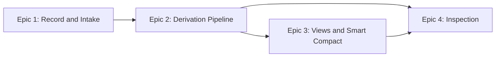

# Long Horizon Context (LHC) — Product Requirements

## User Profile

Three consumers use LHC, through two surfaces.

**Agentic harnesses** integrate the SDK in-process. A harness sends LHC the events its conversation produces and pulls assembled context views back when it calls its model. PI is the first harness; the SDK surface is designed so other harnesses can wire in the same way.

**Agents** work inside those harnesses and use the CLI directly: inspecting threads, searching history, checking derivation health, pulling reports during their own work.

**Operators** are the people running long-horizon agentic work. They configure compaction, audit what an agent's context contains, curate the record when something needs fixing, and diagnose threads that misbehave.

## Problem Statement

Agentic threads outlive context windows. A coding thread can span weeks and millions of tokens; a model can work well inside roughly 100k. Harness-native compaction closes that gap by destroying history: summaries replace the record, the original is unrecoverable, and the agent re-onboards from a thinner version of its own past after every compact. Long threads also churn provider prompt caches, multiplying cost.

LHC separates the record from the working view. The full history of a thread is kept as a durable record that nothing destroys. From that record, LHC builds summarized views at controlled size, with recent history at high fidelity and older history rolling down through progressively cheaper forms. The agent keeps perspective back to the start of the thread while its working context stays within budget.

## Product Summary

LHC is a TypeScript SDK with a thin CLI over it. Every operation is stateless: each call takes a thread id or file path, operates on durable storage, and returns. Six domains organize the operations — `threads`, `intake-stream`, `messages`, `turns`, `thread-view`, and `inspect` — with shared tech utils (a durable work queue, token counting) beneath them. The domain model and its vocabulary are defined in `../01-onboard/01-core-concepts.md` and `../01-onboard/02-domain-design.md`; this PRD scopes that model into buildable features.

Each thread lives in its own SQLite file. A harness streams events in; synchronous intake records them, projects messages, and settles turn membership on the spot. Slow derivation runs through a durable work queue along three ownership paths: message-level forms (prompt smoothing, tool-call and tool-result summaries) queue when the message lands and belong to `messages`; turn and chunk derivations queue at close and belong to `turns`; view assembly consumes both and belongs to `thread-view`, which derives nothing itself. Thread views assemble locked summary bands plus a live full-fidelity tail, and render as an in-memory message array or a provider-format file. Missing derivations degrade a view, marked and reported; only damage to the source record blocks.

## Feature 1: Thread Record and Intake

The synchronous path: creating threads, taking in harness events, and keeping the record coherent in the hot path.

### Scope

In: thread creation against a new file, the thread registry and id-to-file resolution, ordered event intake with idempotency, message and block projection, synchronous turn open/close with membership stamping, token estimates at projection time, queuing of derivation work at turn close.

Out: running queued work and mutating the record (Feature 2), assembling views (Feature 3), inspecting the record (Feature 4).

### Scenarios

**Scenario 1: A harness opens a thread and streams a conversation.** The harness creates a thread, then sends batches of events as the conversation runs: user prompts, assistant text and thinking, tool calls and results, runtime notes, turn ends. Each batch lands in order, projects into readable messages, and updates turn state before the call returns.

- AC-1.1: Creating a thread against a path that already exists fails; creation never reuses or overwrites an existing file
- AC-1.2: A created thread stores its id once as file metadata and appears in the registry with its file path
- AC-1.3: An event batch is recorded in stream order; each message-producing event yields a message with its blocks and a token estimate
- AC-1.4: A `user_prompt` opens a turn when none is open, and closes the open turn before opening a new one; a `turn_end` closes the open turn and is disregarded when none is open
- AC-1.5: Messages are stamped with their turn membership at intake; membership never changes after the turn closes
- AC-1.6: More than one open turn is detected as corruption and fails the operation loudly
- AC-1.7: A message whose kind carries message-level derivations (prompt smoothing, tool-result summaries) queues that work durably when the message lands
- AC-1.8: Closing a turn queues that turn's derivation work durably before the intake call returns

**Scenario 2: A harness resends after a failure.** A crash or timeout leaves the harness unsure what landed. It resends the same batch. Idempotency keys make the resend safe: already-recorded events are skipped, the rest land normally.

- AC-1.9: Resending a batch with already-recorded idempotency keys records nothing twice and reports what was skipped

**Scenario 3: A harness sends an incoherent batch.** An event is malformed, carries server-generated fields, or violates turn-state rules. The whole batch is rejected and the thread is untouched, so the harness debugs against a binary outcome rather than a partially landed state.

- AC-1.10: A batch containing an invalid event records no events from that batch and reports which event failed and why
- AC-1.11: Callers reach a thread by id through registry resolution or directly by file path; both paths operate on the same thread identically

## Feature 2: Derivation Pipeline

The asynchronous half plus the record's sanctioned mutations: queued work runs, derived artifacts land with explicit state, the derived layer stays repairable, and users can edit or delete what the record got wrong.

### Scope

In: a worker that drains each thread's work queue in order; message-level derivations owned by `messages` (prompt smoothing, tool-result summaries, tool-call summaries), queued when the message lands; turn-level derivations owned by `turns` (smoothed turn composition from message-level forms, lower-band projection), queued at turn close; chunk formation and close with detailed and brief chunk summaries; derivation state tracking; repair operations on each owning domain's surface; the public mutation operations — message edit, message delete, turn delete — each driving clear-and-regenerate across dependent derivations.

Out: view assembly that consumes these artifacts (Feature 3); read, search, and inspect reporting (Feature 4).

### Scenarios

**Scenario 1: A conversation's derivations land behind it.** Message-level work queued as messages land runs first: prompts get smoothed forms, tool calls and results get summarized abbreviations. When a turn closes, its work runs: the turn's smoothed rendering is composed from those message-level forms, its lower-band projection is built, it joins the open chunk. When a chunk closes, its detailed and brief summaries are generated.

- AC-2.1: A thread's queued work runs one item at a time, in queue order, and survives process restart without loss
- AC-2.2: Each derived artifact carries a semantic state (expected, usable, terminally failed, blocked on damaged source), and the owning domain's report joins queue detail so a caller can also distinguish failed-but-being-retried — five distinctions, one artifact state plus queue mechanics, never two state systems drifting
- AC-2.3: Messages with derivable forms have them: smoothed prompts and summarized tool-call and tool-result abbreviations, derived without turn-level context; a tool-call summary's outcome joins the paired result by call id
- AC-2.4: Closed turns have smoothed renderings composed from message-level forms, and lower-band projections; closed chunks have detailed and brief summaries
- AC-2.5: Every summarized form of tool activity — message-level or composed — carries an explicit outcome (succeeded, failed, or unknown); state-changing activity never loses its outcome as it moves to lower-fidelity forms

**Scenario 2: Inference fails mid-derivation.** The summarization provider errors or is unavailable. The artifact records a retryable failure; nothing downstream blocks on it. Retry succeeds later, or exhausts into a terminal failure that repair can re-queue.

- AC-2.6: A failed derivation is visible as failed with a reason, and a consumer needing it gets a usable degraded answer rather than an error
- AC-2.7: Each domain's surface exposes operations to report its derivation states and re-queue missing or failed work

**Scenario 3: A message is edited.** An operator or agent edits a message in a closed turn through the messages surface. The deterministic parts update synchronously — content, blocks, token estimate — and every derivation built from the old content clears and re-queues: the message's own forms, its turn's composed rendering and projection, and the containing chunk's summaries. Ordering guarantees that re-queued work lands after any in-flight work on the old content.

- AC-2.8: After an edit, derived state is either current or absent-and-queued; no derivation built from pre-edit content remains marked usable
- AC-2.9: An in-flight derivation against pre-edit content cannot overwrite a rebuilt post-edit artifact

**Scenario 4: A message or turn is deleted.** A noisy message, or a whole dead-end exchange, is removed from the readable record. Delete is a projection-level operation: the message and its blocks drop from the readable view and from turn membership, while the source event log retains the original. Deleting a turn removes the exchange unit and everything in it. Dependent derivations clear and re-queue exactly as an edit's do; chunk boundaries stay where they were — a chunk shrinks, it is never re-cut.

- AC-2.10: A deleted message no longer appears in reads or turn membership, and its source events remain in the event log
- AC-2.11: Deleting a message that initiates a turn is refused with an error naming the turn; deleting the turn through the turns surface is the sanctioned path
- AC-2.12: A deleted turn drops from the record with its messages, its chunk re-derives its summaries from the remaining turns, and no other chunk's membership or derivations change
- AC-2.13: Mutations target closed turns only; an edit or delete against the open turn is refused

## Feature 3: Thread Views and Smart Compact

The assembled working context: what a harness actually loads, sized to budget, stable between compacts.

### Scope

In: view assembly from band materials (brief, detailed, smooth, full), smart compact producing a new view at a configured size with a configured band mix, locked bands with a live full-fidelity tail between compacts, tool-result visibility cycling (full to abbreviated) in eligible/activate batches, rendering as an in-memory message array and as a materialized provider-format file, the readiness sweep that checks and drives repair of the derivations the next view needs.

Out: the derivation work itself (Feature 2), harness-side wiring that calls these operations (future PI extension work).

### Scenarios

**Scenario 1: A harness pulls the active view every model call.** The pull assembles locked bands plus the live tail from stored state and returns a message array. No inference runs; the call is hot-path fast.

- AC-3.1: Pulling the active view performs reads and deterministic assembly only, and reflects all intake recorded before the pull
- AC-3.2: Between compacts, previously assembled band content is byte-stable; new content appends to the live tail

**Scenario 2: The thread crosses its size threshold and compacts.** Smart compact assembles a new view at the configured lower bound with the configured band percentages, drawing each band's material from stored artifacts. The previous view's content remains derivable from the record; nothing canonical is destroyed.

- AC-3.3: A compacted view lands within its configured size bound with bands proportioned per configuration, using stored artifacts without regenerating them
- AC-3.4: Compacting with missing band material produces a view that degrades those entries and reports the gaps; it does not fail the compact

**Scenario 3: Old tool results age out of full visibility.** As the recent tail grows, older tool results become eligible for abbreviation, then activate in batches on budget pressure, so the prompt prefix changes in planned steps rather than every turn.

- AC-3.5: Tool results become eligible by threshold but change visible form only at batch activation; activation brings the recent tail back under its target
- AC-3.6: An activated tool result renders its summarized abbreviation, or deterministic truncation when the summary is not usable

**Scenario 4: A closed harness needs a file.** The same assembled view materializes as a provider-format session file. The file is a rendering, not a second source of truth.

- AC-3.7: The materialized file and the message-array render of the same view carry the same content in the target format

**Scenario 5: The readiness sweep keeps the next compact buildable.** Triggered from the hot path but running off it, the sweep walks the derivations the next view needs, lists gaps, and asks each owning domain to repair its own.

- AC-3.8: The sweep reports missing or failed view-relevant derivations and drives their repair through domain surfaces; thread-view derives nothing itself

## Feature 4: Inspection

Seeing the record: read operations across the history and reports across the thread.

### Scope

In: listing, viewing, and searching messages; inspect reports — thread size and composition, turn and chunk counts, derivation health, current view contents and load cost.

Out: write paths (mutations are Feature 2's edit and delete operations), repair execution (owned by Feature 2's domain surfaces, reported on here).

### Scenarios

**Scenario 1: An operator audits what the agent saw.** They view the current thread-view contents and cost, then drill from a band entry to the underlying chunks, turns, and messages.

- AC-4.1: Inspect reports the active view's band composition, entry sources, and token cost
- AC-4.2: Messages are listable and viewable in order with blocks, token estimates, turn membership, and derivation states

**Scenario 2: An agent searches its own history.** Mid-task, the agent searches old messages by text from the CLI and reads what it finds.

- AC-4.3: Message search returns matches across a thread's history with enough context to locate each in its turn

**Scenario 3: An operator watches a repair land.** A message was edited or deleted (Feature 2's operations); inspect shows the rebuild's progress — which derivations cleared, what is queued, what has landed.

- AC-4.4: Inspect reflects mutation-driven rebuilds in progress: cleared derivations show as pending with their queued work visible
- AC-4.5: Inspect reports derivation health across a thread: counts by state, failures with reasons, and what repair would re-queue

## Cross-Cutting Decisions

**The record is never destroyed.** Views, summaries, and abbreviations are derived; the full event and message record they derive from persists. The only mutations of the record are the explicit edit and delete operations — and delete is projection-level: it removes a message or turn from the readable view while the source event log retains the original. Rationale: recoverability is the product. Any feature that trades record fidelity for convenience breaks the premise.

**Degrade, don't block.** A missing or failed derivation is a reported gap that consumers work around; only damage to the record itself stops a thread. A degraded view marks its gaps and never silently omits a span of history. Rationale: the prior MVP's worst failures came from freshness checks blocking progress.

**All-or-nothing intake batches.** A rejected event rejects its whole batch. Rationale: binary outcomes for harness debugging; idempotency keys make resend-after-fix safe.

**SDK-first.** The SDK is the product surface; the CLI wraps it; a future app server wraps the same operations. Nothing is CLI-only.

**Stateless operations.** Every call carries what it needs. No daemon, no session state between calls.

## Non-Functional Requirements

- **Hot-path latency:** intake and view pulls run between a user's action and a model call. Local reads, short transactions, deterministic assembly — no inference, no network.
- **Cache stability:** the prompt prefix a harness sends is byte-stable between compacts except planned batch changes. Visible-context churn is a cost defect, not cosmetic.
- **Durability:** intake is transactional; a crash mid-batch loses the batch, never the thread's coherence. Deferred work survives restart.
- **Concurrency:** one writing process per thread file; a thread's work is serialized. Cross-thread parallelism is unconstrained.

## Milestones

- **M1 — Record (Feature 1):** a real PI session's events can be captured into a thread and read back coherently. Feedback gate: replay a real session transcript through intake.
- **M2 — Derivation (Feature 2):** derivations land asynchronously and survive failure and restart; repair works. Feedback gate: kill and resume the worker mid-thread; edit a message and watch the rebuild.
- **M3 — Views (Feature 3):** a thread compacts and serves PI-shaped context at budget. Feedback gate: drive a long recorded thread through compact cycles and review view quality.
- **M4 — Inspection and hardening (Feature 4):** inspection complete; SDK exercised end-to-end at its integration points. Feedback gate: run the full SDK surface the way the PI extension will.

## Future Directions

Not v1 scope; they shape architecture:

- PI extension wiring: intake on harness events, context hook serving views, commands (next PRD)
- Model-specific token weights over the base estimate
- Retrieval keys on chunks and a pull-chunk tool for agent-driven recall
- Offline consolidation/distillation and a retrieval surfacer layered beside the core
- Aging very old full-fidelity material out of the thread file to archive storage
- Additional harness adapters (Codex and others)

## Recommended Epic Sequencing

Epic 1 has no dependencies and proves the hot path. Epic 2 consumes Epic 1's queued work and owns the record's mutations (edit and delete ride the same clear-and-regenerate machinery as derivation). Epic 3 consumes Epic 2's artifacts. Epic 4 reads everything and lands last, though its message read/search portion could start after Epic 1. Likely split if an epic runs large: Epic 3 into assembly/compact versus rendering/readiness.

## Relationship to Downstream Specs

Each feature section maps to one epic (with the noted splits). This PRD defines what and why. The epics define exactly what, with line-level ACs, TCs, and data contracts. The tech designs define how. The companion technical architecture (`01-tech-arch.md`) defines the technical world all of them inherit. The domain onboarding docs (`../01-onboard/`) remain the authority on domain vocabulary and ownership.

## Validation Checklist

- [x] User Profile grounds every feature
- [x] Problem Statement justifies the product
- [x] Each feature has Feature Overview, Scope, and Scenarios with numbered ACs
- [x] Scenarios describe user situations with enough detail to decompose into epic flows
- [x] Rolled-up ACs are decomposable without the epic writer inventing behavior
- [x] No line-level ACs, TCs, or data contracts
- [x] Out-of-scope items point to where they're handled if planned
- [x] Milestones define feedback-gated phases
- [x] NFRs surfaced
- [x] Architecture summary establishes technical world (via companion tech arch)
- [x] Cross-cutting decisions documented
- [x] Epic sequencing has rationale
- [ ] Consumer test: pending review — each feature section expandable into a full epic without foundational questions
